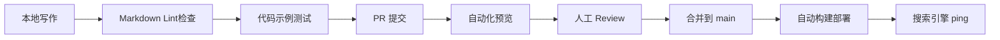

我来为你输出一份完整的 **AI Guide 产品 PRD**，基于 VitePress 技术栈，涵盖你需要的所有产品细节。
基于 VitePress 技术栈，为你输出一份完整的 **AI Guide 产品 PRD**。

---

# AI Guide 产品需求文档 (PRD)

**版本**：v1.0  
**日期**：2026-03-22  
**技术栈**：VitePress + Vue3 + Vite + GitHub Pages  
**目标用户**：AI 学习者、Agent 开发者、全栈工程师

---

## 1. 产品定位与目标

### 1.1 核心价值
构建中文领域最系统、最实战的 **AI 全栈知识体系**，覆盖从底层算法到 Agent 系统架构的完整链路，填补 Java Guide 在 AI 领域的空白。

### 1.2 差异化定位
| 维度 | Java Guide | AI Guide (本产品) |
|------|-----------|------------------|
| 核心内容 | Java 后端技术栈 | AI 算法 + Agent 系统 + 工程架构 |
| 技术深度 | 面试导向 | 实战导向（可运行代码 + 架构设计） |
| 更新频率 | 月度 | 周度（AI 领域迭代快） |
| 交互特性 | 静态文档 | 代码演示 + 在线编辑 + 评论互动 |

### 1.3 成功指标
- **内容规模**：首年发布 100+ 篇高质量文章
- **用户增长**：月 PV 10万+，GitHub Star 5k+
- **社区活跃**：PR 贡献者 50+，Issue 响应时间 < 24h

---

## 2. 技术架构设计

### 2.1 技术选型决策
基于 VitePress 官方文档  和社区实践 ，选择以下技术栈：

| 层级 | 技术方案 | 选型理由 |
|------|---------|---------|
| **SSG 框架** | VitePress v1.x | 基于 Vite，构建速度极快；Vue3 + TypeScript 生态；默认主题专为文档优化  |
| **前端框架** | Vue 3.4+ | 组合式 API，更好的 TypeScript 支持 |
| **样式方案** | UnoCSS + 自定义 CSS | 原子化 CSS，主题定制灵活 |
| **搜索方案** | Algolia DocSearch | 业界标准，支持中文分词 |
| **评论系统** | Giscus | 基于 GitHub Discussions，零成本 |
| **部署托管** | GitHub Pages + Cloudflare | 免费 CDN，全球加速 |
| **分析统计** | Umami / 百度统计 | 隐私友好，支持自定义事件 |

### 2.2 项目目录结构
```
ai-guide/
├── docs/                          # 内容源目录 (srcDir)
│   ├── .vitepress/                # 配置与主题
│   │   ├── config.ts              # 站点主配置 
│   │   ├── theme/                 # 自定义主题
│   │   │   ├── index.ts           # 主题入口
│   │   │   ├── Layout.vue         # 覆盖默认布局
│   │   │   ├── styles/            # 自定义样式
│   │   │   │   ├── vars.css       # CSS 变量
│   │   │   │   └── custom.css     # 覆盖样式
│   │   │   └── components/        # 自定义组件
│   │   │       ├── CodeDemo.vue   # 代码演示组件
│   │   │       ├── AgentFlow.vue  # Agent 流程可视化
│   │   │       └── Quiz.vue       # 互动测验组件
│   │   └── utils/                 # 工具函数
│   ├── guide/                     # 核心内容：基础层
│   ├── models/                    # 核心内容：模型层
│   ├── engineering/               # 核心内容：工程层
│   ├── agent/                     # 核心内容：Agent 层 ⭐
│   ├── application/               # 核心内容：应用层
│   ├── resources/                 # 资源层
│   ├── public/                    # 静态资源 
│   │   ├── images/                # 文章配图
│   │   ├── icons/                 # 站点图标
│   │   └── fonts/                 # 自定义字体
│   └── index.md                   # 首页配置
├── scripts/                       # 构建脚本
│   ├── generate-sidebar.ts        # 自动生成侧边栏
│   ├── sitemap.ts                 # 生成 sitemap.xml 
│   └── rss.ts                     # 生成 RSS 订阅 
├── .github/
│   └── workflows/
│       ├── deploy.yml             # 自动部署
│       └── sync.yml               # 同步到 Gitee
├── package.json
├── tsconfig.json
└── README.md
```

---

## 3. 核心功能模块

### 3.1 内容组织系统

#### 3.1.1 导航栏配置 (Nav)
```typescript
// .vitepress/config.ts
themeConfig: {
  nav: [
    { text: '基础', link: '/guide/' },
    { text: '模型', link: '/models/' },
    { 
      text: '工程',
      items: [
        { text: '推理优化', link: '/engineering/inference/' },
        { text: '服务架构', link: '/engineering/architecture/' },
        { text: '可观测性', link: '/engineering/observability/' }
      ]
    },
    { 
      text: 'Agent ⭐',
      items: [
        { text: '架构设计', link: '/agent/architecture/' },
        { text: '开发框架', link: '/agent/frameworks/' },
        { text: '工程实践', link: '/agent/engineering/' },
        { text: '垂直案例', link: '/agent/cases/' }
      ]
    },
    { text: '应用', link: '/application/' },
    { text: '资源', link: '/resources/' },
    { 
      text: 'v1.0',
      items: [
        { text: '更新日志', link: '/changelog' },
        { text: '贡献指南', link: '/contributing' },
        { text: '关于我们', link: '/about' }
      ]
    }
  ]
}
```

#### 3.1.2 侧边栏自动生成策略
- **手动配置**：核心章节固定结构，确保学习路径清晰
- **自动扫描**：资源层文章通过脚本自动生成侧边栏 
- **多侧边栏**：不同章节使用不同侧边栏配置

### 3.2 内容增强功能

#### 3.2.1 Markdown 扩展能力
基于 VitePress 内置 Markdown-it + 自定义插件 ：

| 功能 | 实现方案 | 用途 |
|------|---------|------|
| 代码高亮 | Shiki | 支持 100+ 语言，主题与 VS Code 一致 |
| 代码分组 | `:::code-group` | 多语言示例切换（Python/TypeScript） |
| 代码导入 | `<!--@include: path-->` | 引用外部代码文件，保持可运行  |
| 提示容器 | `:::tip/warning/danger` | 重点知识警示 |
| 可运行演示 | 自定义 `:::demo` | 嵌入 CodeSandbox/StackBlitz |
| 数学公式 | KaTeX | 算法公式渲染 |

#### 3.2.2 自定义 Vue 组件
```vue
<!-- 组件：Agent 架构流程图 -->
<AgentFlow 
  :steps="[
    { name: '感知', desc: '多模态输入处理' },
    { name: '推理', desc: 'LLM 决策生成' },
    { name: '行动', desc: '工具调用执行' },
    { name: '记忆', desc: '状态更新存储' }
  ]"
/>

<!-- 组件：互动代码测验 -->
<Quiz 
  question="RAG 中 Embedding 的主要作用是？"
  :options="['压缩文本', '语义检索', '生成答案', '过滤噪声']"
  correct="语义检索"
  explanation="Embedding 将文本映射到向量空间，实现语义相似度检索..."
/>
```

### 3.3 SEO 与流量系统

#### 3.3.1 技术 SEO 配置 
```typescript
// .vitepress/config.ts
export default defineConfig({
  // 基础元数据
  lang: 'zh-CN',
  title: 'AI Guide - 人工智能全栈知识体系',
  description: '从算法到 Agent，系统学习 AI 工程架构。涵盖大模型原理、RAG、Agent 设计、MLOps 等实战内容。',
  
  // 站点地图 (Sitemap)
  sitemap: {
    hostname: 'https://aiguide.dev',
    lastmodDateOnly: true,
    transformItems(items) {
      return items.map(item => {
        // 为重要页面设置优先级
        if (item.url.includes('/agent/')) {
          item.priority = 0.9
        }
        return item
      })
    }
  },
  
  // 生成 RSS 订阅 
  buildEnd: async (siteConfig) => {
    await generateRSS(siteConfig)
    await generateSitemap(siteConfig)
  },
  
  // Head 标签优化
  head: [
    ['link', { rel: 'icon', href: '/favicon.ico' }],
    ['meta', { name: 'theme-color', content: '#3c873a' }],
    // Open Graph
    ['meta', { property: 'og:type', content: 'website' }],
    ['meta', { property: 'og:locale', content: 'zh_CN' }],
    // 百度/谷歌验证
    ['meta', { name: 'baidu-site-verification', content: 'code-xxxx' }],
    // 结构化数据
    ['script', { type: 'application/ld+json' }, JSON.stringify({
      "@context": "https://schema.org",
      "@type": "WebSite",
      "name": "AI Guide",
      "url": "https://aiguide.dev"
    })]
  ]
})
```

#### 3.3.2 内容 SEO 规范
- **URL 结构**：`https://aiguide.dev/{category}/{slug}/`，启用 `cleanUrls: true` 
- **Frontmatter 模板**：
  ```yaml
  ---
  title: '构建生产级 LLM Agent：架构设计与工程实践'
  description: '详解 Agent 的核心组件设计，包括工具调用、记忆管理、多 Agent 协作等关键模式，附带可运行的 LangGraph 代码示例。'
  author: 'xxx'
  date: 2026-03-22
  category: agent
  tags: ['Agent', 'LangGraph', 'LLM', '架构设计']
  image: /images/agent-architecture-cover.png
  prev: /agent/intro/
  next: /agent/frameworks/
  ---
  ```
- **内链策略**：每篇文章至少包含 3-5 个站内相关链接
- **图片优化**：WebP 格式，懒加载，alt 文本必填

### 3.4 交互与社区功能

| 功能 | 实现方案 | 配置要点 |
|------|---------|---------|
| **全文搜索** | Algolia DocSearch | 申请 DocSearch 计划，配置 `appId`, `apiKey`, `indexName` |
| **评论系统** | Giscus | 关联 GitHub Discussions，支持 Markdown 和表情 |
| **编辑链接** | `themeConfig.editLink` | 每页底部显示"编辑此页"，降低贡献门槛 |
| **最后更新** | `lastUpdated: true` | 基于 Git 历史自动显示  |
| **社交分享** | 自定义组件 | 微信/推特分享按钮，生成分享卡片 |
| **PWA 支持** | vite-plugin-pwa | 离线阅读，添加到桌面 |
| **暗黑模式** | `appearance: true` | 跟随系统/手动切换，过渡动画  |

---

## 4. 内容生产工作流

### 4.1 写作规范
- **模板化**：每篇文章遵循统一模板（概述→原理→实践→总结→延伸阅读）
- **代码可运行**：所有代码示例附带 GitHub 仓库链接，CI 验证通过
- **配图标准**：架构图使用 Excalidraw 风格，统一配色方案
- **术语对照**：首次出现英文术语附中文解释，建立术语表

### 4.2 发布流程


### 4.3 自动化脚本
```typescript
// scripts/generate-sidebar.ts
// 自动扫描目录生成侧边栏配置，支持按日期/权重排序

// scripts/validate-code.ts
// 提取所有代码块，执行语法检查和单元测试

// scripts/update-index.ts
// 更新资源索引页，自动拉取最新论文/项目信息
```

---

## 5. 性能与体验指标

### 5.1 性能目标
| 指标 | 目标值 | 检测工具 |
|------|--------|---------|
| Lighthouse Performance | ≥ 95 | PageSpeed Insights |
| 首字节时间 (TTFB) | < 200ms | WebPageTest |
| 可交互时间 (TTI) | < 3s | Lighthouse |
| 构建时间 | < 60s (100篇文章) | CI 日志 |
| 包体积 | < 200KB (首屏 JS) | Rollup 分析 |

### 5.2 体验优化
- **骨架屏**：首屏加载显示内容骨架
- **预加载**：智能预读下一篇文章
- **图片优化**：响应式图片，WebP/AVIF 格式
- **字体优化**：系统字体栈，关键字体预加载

---

## 6. 运营与增长策略

### 6.1 内容运营
- **发布节奏**：每周 2 篇深度文章 + 1 篇快讯（Arxiv 速递）
- **系列专题**：Agent 从入门到精通（10 篇连载）、LLM 推理优化实战
- **互动内容**：每月 1 次代码挑战，优秀解答收录

### 6.2 流量获取
- **SEO**：长尾关键词覆盖（"LangGraph 教程"、"RAG 优化实践"）
- **社交媒体**：公众号/知乎/掘金同步，引流到主站
- **社区合作**：与 Hugging Face、LangChain 中文社区联动
- **开源联动**：配套代码仓库独立运营，互相引流

### 6.3 变现路径（长期）
- 企业培训/咨询服务
- 付费专栏（高阶架构设计）
- 招聘板块（AI 工程师岗位）

---

## 7. 里程碑规划

| 阶段 | 时间 | 目标 | 关键交付 |
|------|------|------|---------|
| **MVP** | 第 1-2 周 | 验证技术栈 | 首页 + 3 篇文章 + 自动部署 |
| **内容基建** | 第 1-2 月 | 建立信任感 | 20 篇核心文章，覆盖基础+Agent 入门 |
| **功能完善** | 第 3-4 月 | 提升体验 | 搜索、评论、PWA、暗黑模式 |
| **社区运营** | 第 5-6 月 | 建立生态 | 贡献者指南、内容多语言、线下活动 |
| **规模化** | 第 7-12 月 | 行业影响力 | 100+ 文章，月 PV 10万，商业化探索 |

---

## 8. 风险与应对

| 风险 | 应对策略 |
|------|---------|
| AI 领域更新快，内容过时 | 建立文章版本机制，定期 review 更新，标注最后验证日期 |
| 内容生产耗时长 | 优先产出"常青树"内容（基础原理），快讯类用自动化聚合 |
| 竞品涌现（如 LangChain 官方中文站） | 差异化定位：更贴近国内工程实践，更多中文案例 |
| SEO 流量增长慢 | 早期重社交媒体运营，SEO 作为长期资产建设 |

---

## 9. 附录：关键配置文件

### 9.1 完整 vitepress/config.ts
```typescript
import { defineConfig } from 'vitepress'
import { generateSidebar } from './utils/sidebar'
import { generateRSS } from './utils/rss'

export default defineConfig({
  // 站点基础配置
  lang: 'zh-CN',
  title: 'AI Guide',
  titleTemplate: ':title | AI 全栈知识体系',
  description: '从算法到 Agent，系统掌握人工智能工程架构',
  
  // 目录配置
  srcDir: './docs',
  outDir: './dist',
  cacheDir: './.vitepress/cache',
  cleanUrls: true,
  lastUpdated: true,
  
  // Markdown 配置
  markdown: {
    lineNumbers: true,
    config: (md) => {
      // 自定义插件
      md.use(require('markdown-it-mathjax3'))
    }
  },
  
  // 主题配置
  themeConfig: {
    logo: '/logo.svg',
    siteTitle: 'AI Guide',
    
    // 导航
    nav: [
      { text: '基础', link: '/guide/' },
      { text: '模型', link: '/models/' },
      { 
        text: '工程',
        items: [
          { text: '推理优化', link: '/engineering/inference/' },
          { text: '服务架构', link: '/engineering/architecture/' },
          { text: '可观测性', link: '/engineering/observability/' }
        ]
      },
      { 
        text: 'Agent',
        activeMatch: '/agent/',
        items: [
          { text: '架构设计', link: '/agent/architecture/' },
          { text: '开发框架', link: '/agent/frameworks/' },
          { text: '工程实践', link: '/agent/engineering/' },
          { text: '垂直案例', link: '/agent/cases/' }
        ]
      },
      { text: '应用', link: '/application/' },
      { text: '资源', link: '/resources/' }
    ],
    
    // 侧边栏
    sidebar: {
      '/guide/': generateSidebar('guide'),
      '/models/': generateSidebar('models'),
      '/engineering/': generateSidebar('engineering'),
      '/agent/': generateSidebar('agent'), // Agent 章节详细展开
      '/application/': generateSidebar('application'),
      '/resources/': generateSidebar('resources')
    },
    
    // 社交链接
    socialLinks: [
      { icon: 'github', link: 'https://github.com/yourname/ai-guide' },
      { icon: 'twitter', link: 'https://twitter.com/aiguide' },
      { icon: 'discord', link: 'https://discord.gg/aiguide' }
    ],
    
    // 搜索
    algolia: {
      appId: 'YOUR_APP_ID',
      apiKey: 'YOUR_SEARCH_API_KEY',
      indexName: 'aiguide'
    },
    
    // 编辑链接
    editLink: {
      pattern: 'https://github.com/yourname/ai-guide/edit/main/docs/:path',
      text: '在 GitHub 上编辑此页'
    },
    
    // 页脚
    footer: {
      message: '基于 MIT 协议开源',
      copyright: 'Copyright © 2026 AI Guide Contributors'
    },
    
    // 广告（可选）
    // carbonAds: {
    //   code: 'your-code',
    //   placement: 'your-placement'
    // }
  },
  
  // Vite 配置
  vite: {
    plugins: [
      // PWA 插件
      // VitePWA({ ... })
    ],
    resolve: {
      alias: {
        '@': './docs/.vitepress'
      }
    }
  },
  
  // 构建钩子
  async buildEnd(siteConfig) {
    await generateRSS(siteConfig)
    console.log('✅ RSS 生成完成')
  },
  
  // 转换 Head（用于 canonical URL 等）
  transformPageData(pageData) {
    const canonicalUrl = `https://aiguide.dev/${pageData.relativePath}`
      .replace(/index\.md$/, '')
      .replace(/\.md$/, '')
    
    pageData.frontmatter.head ??= []
    pageData.frontmatter.head.push([
      'link',
      { rel: 'canonical', href: canonicalUrl }
    ])
  }
})
```

---

这份 PRD 涵盖了从产品定位到技术实现的完整方案。需要我展开 **Agent 章节的具体内容大纲**，或者提供 **第一篇样章的完整 Markdown 模板** 吗？