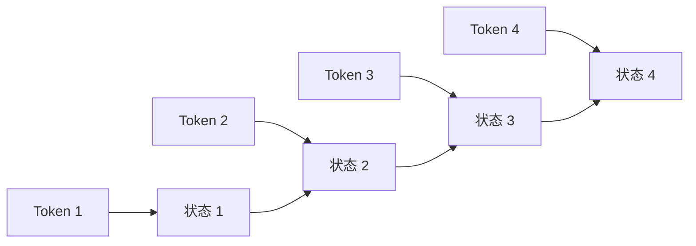
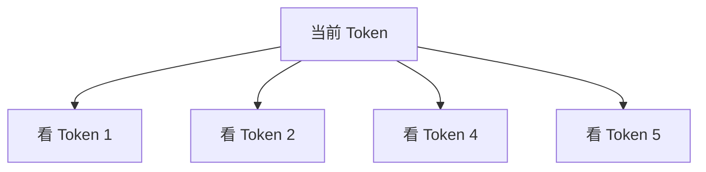
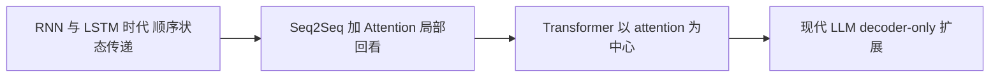
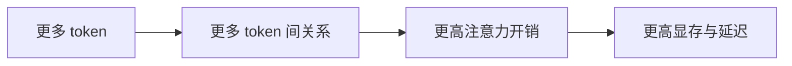

<KnowledgeMap current-module="llm" current-article="第1章 为什么是 Transformer" />

# 第 1 章 为什么是 Transformer

<ArticleHeader
  module="语言模型基础"
  :tags="['原理', 'Transformer']"
  reading-time="18 分钟"
  prerequisite="已理解 LLM 是概率建模系统"
  summary="这一章先不急着讲 QKV，而是先回答一个更底层的问题：为什么语言模型架构会从 RNN、LSTM 走向 Transformer。只有先理解旧方案的约束，后面 attention 的价值才会真正清楚。"
/>

## 这一章要解决什么问题

很多人在学 Transformer 时，直接从公式开始。

这样当然能学到计算步骤，但很容易漏掉一个更重要的问题：

`为什么这个架构会赢？`

如果不知道它解决了前一代方法的什么问题，你就很难判断：

- 为什么它特别适合大规模并行训练
- 为什么长上下文会带来巨大成本
- 为什么后面的 QKV、multi-head、KV cache 都是自然推论

## 1.1 Transformer 之前，主流序列模型怎么工作

在 Transformer 成为主流之前，序列建模大多依赖：

- RNN
- LSTM / GRU
- CNN + attention 的混合结构

这些方法的共同点是：`按顺序处理序列`。

比如一句话有 10 个 token，模型通常要先处理第 1 个，再处理第 2 个，最后处理第 10 个。即使中间做了改良，本质上仍然带着强烈的“时间步”思维。



这种结构有一个直觉优势：

- 顺序天然存在
- 每一步都带着前面的状态往后走

但它也埋下了后来的主要瓶颈。

## 1.2 旧方案为什么会越来越吃力

### 长距离依赖难学

看下面这句话：

> The trophy does not fit in the suitcase because it is too large.

这里的 `it` 指的是 `trophy` 还是 `suitcase`，需要模型跨过中间很多 token 去建立关系。

RNN 虽然理论上可以把早期信息一直传下去，但实际训练时，信息会在一层层状态更新里被稀释。

### 并行能力弱

RNN 最大的问题不是“不能做”，而是“做得慢”。

因为第 `t` 步依赖第 `t-1` 步，所以训练时很难把整条序列完全并行化。序列越长，吞吐越受限。

### 信息压缩路径太长

如果序列头部的信息要影响末尾 token，往往要穿过很多中间状态。

你可以把它理解成：

- 想引用远处信息
- 但必须经过一条很长的传话链
- 链路越长，信号越容易失真

## 1.3 注意力机制到底带来了什么变化

注意力机制最早不是凭空出现的，它先在 encoder-decoder 机器翻译里被用来缓解“固定长度向量压缩全部源句信息”的问题。

它最重要的思想是：

`当前步骤不必只依赖一个压缩状态，而是可以直接回看更相关的位置。`

这件事一旦被进一步推进，就变成了 self-attention：

`序列中的每个 token，都可以直接和其他 token 建立关系。`



这意味着信息不再只能沿着一条固定链路往后传，而是可以“按相关性直接跳转”。

## 1.4 Transformer 真正改变了什么

2017 年的 *Attention Is All You Need* 做了一件极激进的事：

`把 recurrence 和 convolution 都拿掉，只保留 attention 作为核心序列交互机制。`

这件事带来的不是“小优化”，而是范式切换。



它解决的核心不是“模型更聪明”，而是三件更基础的事：

1. 让远距离 token 的交互路径更短
2. 让整段序列训练更容易并行
3. 让规模化训练更可行

## 1.5 为什么 self-attention 特别适合大规模训练

在 self-attention 中，一层里所有 token 的表示都可以一起计算。

换句话说：

- 你不需要等 token 1 处理完，才能处理 token 2
- 你可以把一整段序列放进矩阵运算里一起跑
- 这和 GPU / TPU 特别匹配

这就是为什么 Transformer 一旦出现，就和大规模训练天然形成正反馈。

### 一个粗略对比

| 维度 | RNN/LSTM | Transformer |
| --- | --- | --- |
| 序列处理方式 | 强顺序 | 层内并行 |
| 远距离依赖路径 | 长 | 短 |
| 对硬件友好度 | 一般 | 高 |
| 扩展到超大模型 | 更困难 | 更自然 |

## 1.6 代价是什么

任何架构优势都不是白来的。

Transformer 的核心代价也非常明确：

`当每个 token 都要和其他 token 建立关系时，序列越长，计算与显存压力就越大。`

这也是后面长上下文、KV cache、GQA、FlashAttention 这些工程优化会出现的根源。



所以 Transformer 的故事从来不是“它没有缺点”，而是：

`它用更高的注意力代价，换来了更强的并行训练能力和更好的全局关系建模能力。`

## 1.7 为什么现代 LLM 大多是 Transformer 后裔

因为一旦你的目标变成：

- 更大的数据
- 更大的模型
- 更长的训练周期
- 更强的迁移能力

那你就会越来越看重：

- 可扩展的并行训练
- 统一的表示学习框架
- 足够通用的序列交互机制

而 Transformer 恰好在这三点上都非常强。

后来的 BERT、GPT、T5、PaLM、Llama，本质上都是在 Transformer 这条主干上继续演化。

## 1.8 一个最小代码对比

下面这段代码不是为了训练模型，而是为了帮你建立“顺序扫描”和“全局两两关系”这两种思维的区别。

```python
tokens = ["小王", "重启", "服务器", "之后", "它", "恢复了"]

def rnn_style(tokens):
    state = []
    for token in tokens:
        state.append(f"把 {token} 融入当前状态")
    return state

def attention_style(tokens):
    relations = []
    for i, token in enumerate(tokens):
        visible = [other for other in tokens if other != token]
        relations.append((token, visible))
    return relations

print("顺序状态更新:", rnn_style(tokens))
print("全局关系读取:", attention_style(tokens))
```

虽然这是极简伪代码，但它已经表达了架构差异：

- RNN 更像“一边走一边记”
- attention 更像“当前点位可以回看整张表”

## 1.9 工程判断：什么时候该回到底层架构思维

后面做 Agent 或推理系统时，如果你遇到下面这些问题，就应该回到这一章：

- 为什么长上下文吞吐掉得这么厉害
- 为什么模型能看见材料却没稳定用上
- 为什么推理时 KV cache 这么关键
- 为什么很多优化都围绕 attention 而不是围绕 embedding

这些都不是“框架细节”，而是底层架构的直接后果。

## 本章小结

- Transformer 的胜利，不只是因为论文更漂亮，而是因为它在并行训练和长距离关系建模上更适合规模化
- 它替代 RNN 的核心，不是顺序信息更强，而是信息交互路径更短、硬件友好度更高
- attention 带来了全局读取能力，但也带来了长序列成本
- 后面所有关于 QKV、multi-head、KV cache 的讨论，都是这一章逻辑的自然延伸

## 下一章

继续阅读 [第2章 Token、Embedding 与位置编码](./chapter-02-token-embedding-position)，先把输入是怎样进入 Transformer 的讲清楚。

## 参考来源

- Vaswani et al. (2017), *Attention Is All You Need*  
  https://arxiv.org/abs/1706.03762
- transformers.run，Transformer 系列中文教程首页  
  https://transformers.run/
- Hugging Face Transformers 文档，LLM / text generation 相关教程  
  https://huggingface.co/docs/transformers/main/en/llm_tutorial
