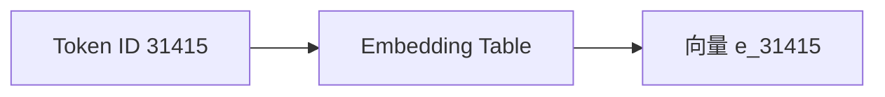
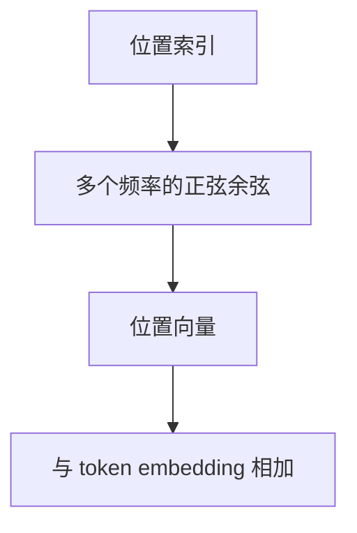

---
title: 第2章 Token、Embedding 与位置编码
description: 从文本切分、向量表示到位置编码，理解序列是如何进入 Transformer 的
module: llm
tags:
  - 原理
  - 输入表示
---

<KnowledgeMap current-module="llm" current-article="第2章 Token、Embedding 与位置编码" />

# 第 2 章 Token、Embedding 与位置编码

<ArticleHeader
  module="语言模型基础"
  :tags="['原理', '输入表示']"
  reading-time="20 分钟"
  prerequisite="已读第 1 章"
  summary="Transformer 不是直接理解文字，而是先把文本切成 token，再映射成向量，并通过位置编码把顺序信息带进 attention。输入表示这一步看起来像预处理，实际上决定了模型如何看到语言。"
/>

## 这一章要解决什么问题

你把一句文本喂给模型，模型看到的并不是“自然语言本身”，而是一串离散 ID 和后续得到的连续向量。

因此要真正理解 Transformer，必须先理解三件事：

1. 文本为什么要先变成 token
2. token 为什么还要变成 embedding
3. attention 本身为什么不懂顺序，必须额外加入位置表示

## 2.1 文本为什么不能直接进模型

神经网络擅长处理的是数值张量，不是字符串。

所以第一步必须把：

```text
"机器学习正在改变软件工程"
```

变成某种离散可计算的表示。

最常见的过程是：


## 2.2 Tokenization 不是“简单切词”

很多初学者会把 tokenization 理解成分词，但现代 LLM 通常使用的是：

- BPE
- WordPiece
- SentencePiece

它们往往是“子词”或“字节级片段”方案，而不是传统意义上的整词切分。

### 为什么不直接按词切

如果只按完整单词切：

- 词表会变得非常大
- 罕见词会频繁变成未知词
- 新词、拼写变化、代码标识符会很难处理

子词方案的核心收益是：

- 词表更可控
- 组合能力更强
- 对长尾词和代码更友好

### 一个直观例子

```python
text = "Transformerization"

word_level = ["Transformerization"]
subword_level = ["Transform", "er", "ization"]

print(word_level)
print(subword_level)
```

子词方案不一定切成这几个片段，但核心思想是一样的：

`把罕见整体拆成高频片段组合。`

## 2.3 Token ID 只是索引，不是语义

tokenizer 输出的 token ID 看起来像这样：

```python
token_ids = [101, 2023, 2003, 1037, 7953, 102]
```

这些数字本身没有几何意义。

- `101` 不比 `102` 更“接近语义”
- `2003` 和 `7953` 的数值差，也不代表含义差距

它们首先只是查表索引。

真正让模型开始拥有“分布式语义表示”的，是 embedding。

## 2.4 Embedding 到底是什么

embedding 可以先粗略理解为：

`把离散 token 映射到连续向量空间。`

比如 token `cat` 可能被映射为一个 4096 维向量，`dog` 也会映射成另一个 4096 维向量。

模型不是直接操作单词，而是在操作这些向量。



### 为什么 embedding 很重要

因为向量空间让模型可以学习：

- 语义相近的词在某些方向上更接近
- 不同上下文里的 token 经过后续层能形成不同表示
- 语言规律可以通过线性代数和非线性变换逐层建模

## 2.5 Token Embedding 不是最终语义

这是一个非常重要的区别。

embedding table 给出的只是“初始表示”，不是最终理解。

同一个 token 在不同句子里，最后的上下文表示会不同。例如：

- “苹果很好吃”里的“苹果”
- “苹果发布了新芯片”里的“苹果”

初始 token embedding 可能一样，但经过多层 attention 之后，表示会被上下文重写。

所以不要把 embedding 误解成“词典式固定语义”。

## 2.6 Transformer 为什么天然不懂顺序

attention 的本质是集合上的相互比较。

如果你只给它一组 embedding，它并不知道：

- 谁在前
- 谁在后
- 第 3 个词和第 5 个词谁更早出现

这意味着纯 self-attention 对顺序是“置换等变”的。

### 一个直观例子

如果没有位置信息：

- “狗咬人”
- “人咬狗”

在集合意义上包含的 token 很接近，但语义完全不同。

所以位置编码不是锦上添花，而是必需品。

## 2.7 最早的方案：Sinusoidal Positional Encoding

原始 Transformer 使用的是正弦余弦位置编码。

它的目标不是“把位置当作一个普通 ID”，而是用一个可泛化的连续函数，把每个位置映射成不同向量。

```text
PE(pos, 2i)   = sin(pos / 10000^(2i / d_model))
PE(pos, 2i+1) = cos(pos / 10000^(2i / d_model))
```

如果你不想记公式，可以只抓两个直觉：

1. 每个位置会得到唯一的模式
2. 不同维度用不同频率编码位置



### 为什么它有吸引力

- 不需要学习额外参数
- 对没见过的更长位置有一定外推能力
- 数学形式简单

但现代 LLM 已经不常直接使用最原始的 sinusoidal 方案了。

## 2.8 Learned Position Embedding、RoPE、ALiBi 有什么区别

### Learned Position Embedding

最直接的思路是：

- 位置 1 有一个向量
- 位置 2 有一个向量
- 位置 3 有一个向量

它简单有效，但对训练长度外的泛化通常不够理想。

### RoPE

RoPE 的核心不是“再加一个位置向量”，而是：

`把位置信息直接编码进 Q/K 的旋转关系里。`

这让相对位置关系更自然地影响 attention 分数，所以现代 LLM 很常使用它。

### ALiBi

ALiBi 不把位置加进 embedding，而是在注意力分数上直接加一个与距离相关的线性偏置。

它的优点是：

- 简洁
- 对长序列外推友好
- 训练和显存成本更省一些

### 一个工程化对比

| 方法 | 注入位置的位置 | 直觉特点 |
| --- | --- | --- |
| Sinusoidal | 输入表示层 | 简单、经典 |
| Learned Position | 输入表示层 | 易学，但外推一般 |
| RoPE | Q/K 交互层 | 更适合现代 LLM |
| ALiBi | attention 分数层 | 简洁、长序列友好 |

## 2.9 为什么 RoPE 在现代 LLM 里这么常见

因为现代 LLM 非常在意两件事：

- 长上下文性能
- 推理阶段的稳定性与效率

RoPE 把位置直接写进 Q/K 的相对关系，和 attention 的主计算链路结合得更紧。

你可以先把它理解成：

`不是给每个 token 贴一个位置标签，而是让“匹配关系本身”带着位置信息。`

这也是为什么它在讲长上下文、KV cache、外推能力时会被频繁提到。

## 2.10 一个最小代码示例

下面这段代码演示“token -> id -> embedding -> 叠加位置”的最小过程：

```python
import numpy as np

vocab = {"我": 0, "爱": 1, "AI": 2}
embedding_table = np.array([
    [0.2, 0.1, 0.0],
    [0.0, 0.3, 0.1],
    [0.5, 0.4, 0.2],
])

position_table = np.array([
    [0.0, 0.0, 0.0],
    [0.1, 0.0, 0.0],
    [0.2, 0.0, 0.0],
])

tokens = ["我", "爱", "AI"]
token_ids = [vocab[t] for t in tokens]
token_embeddings = embedding_table[token_ids]
input_embeddings = token_embeddings + position_table[: len(tokens)]

print("token ids:\\n", token_ids)
print("token embeddings:\\n", token_embeddings)
print("with position:\\n", input_embeddings)
```

这个例子虽然极简，但已经表达了 Transformer 输入层的核心：

- 文本先变成 token id
- token id 再查 embedding table
- 然后叠加或注入位置信息

## 2.11 这一层会如何影响后面的工程问题

理解输入表示后，很多工程问题会更容易想清楚：

- tokenizer 不同，token 数会不同，成本也会不同
- 长上下文成本不只是字符多，而是 token 多
- position 方案会影响长序列外推能力
- 模型“看到相同文本却表现不同”，有时和 tokenization 也有关

这也是为什么 prompt 工程不只是写提示词，还包括对输入长度和结构的管理。

## 本章小结

- 文本不能直接进入模型，必须先经过 tokenization 和 embedding
- token ID 只是索引，embedding 才让模型进入连续表示空间
- attention 自身不懂顺序，所以必须引入位置表示
- 从 sinusoidal 到 RoPE、ALiBi，位置编码的演化直接关系到现代 LLM 的长上下文能力

## 下一章

继续阅读 [第3章 Self-Attention 与 QKV](./chapter-03-self-attention-qkv)，真正进入 Transformer 的核心计算机制。

## 参考来源

- Vaswani et al. (2017), *Attention Is All You Need*  
  https://arxiv.org/abs/1706.03762
- Su et al. (2021), *RoFormer: Enhanced Transformer with Rotary Position Embedding*  
  https://arxiv.org/abs/2104.09864
- Press et al. (2021), *Train Short, Test Long: Attention with Linear Biases Enables Input Length Extrapolation*  
  https://arxiv.org/abs/2108.12409
- Hugging Face Blog, *You could have designed state of the art positional encoding*  
  https://github.com/huggingface/blog/blob/main/designing-positional-encoding.md
- transformers.run，Transformer 系列中文教程首页  
  https://transformers.run/


