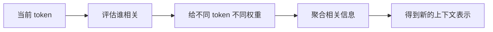
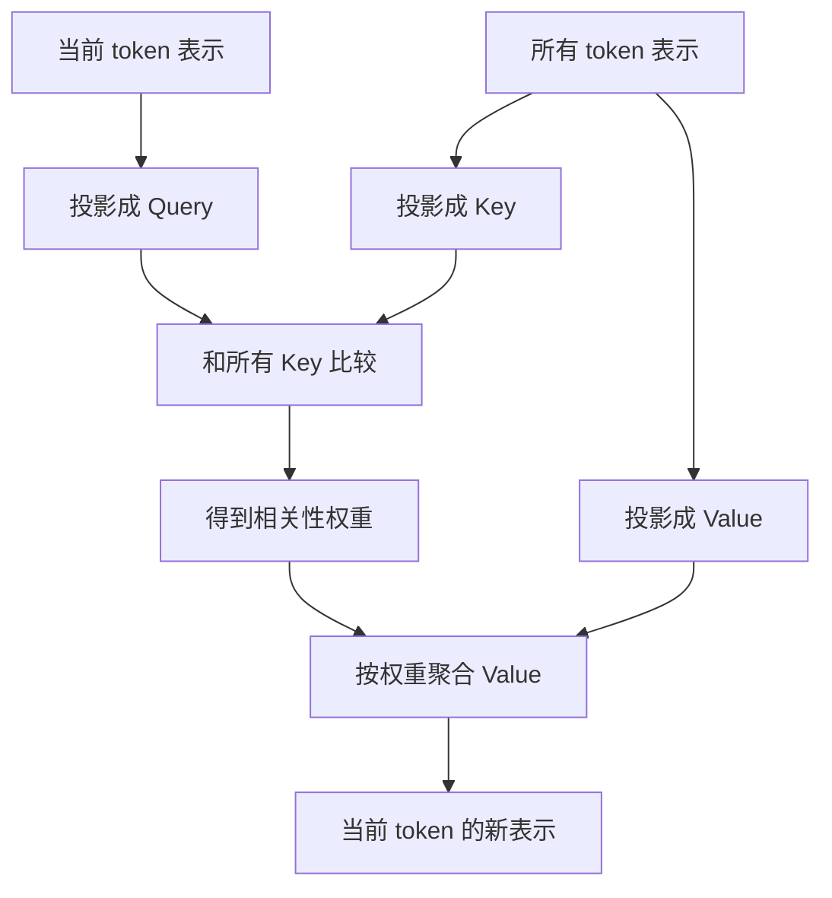
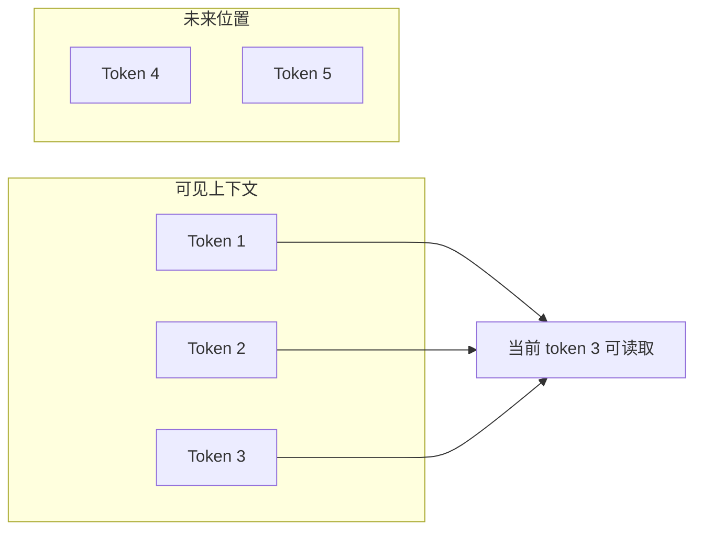

<KnowledgeMap current-module="llm" current-article="第3章 Self-Attention 与 QKV" />

# 第 3 章 Self-Attention 与 QKV

<ArticleHeader
  module="语言模型基础"
  :tags="['原理', 'Attention']"
  reading-time="22 分钟"
  prerequisite="已读第 2 章"
  summary="这一章正式进入 Transformer 最核心的计算：self-attention。我们会从“当前 token 为什么要读别的 token”出发，逐步讲清 Q、K、V 的职责分离、缩放点积注意力、mask 的作用，以及 attention 输出到底是什么。"
/>

## 这一章最重要的一句话

`attention 不是在找答案，而是在按相关性读取上下文。`

这句话一旦理解透，QKV 就不会再显得神秘。

## 3.1 Self-Attention 到底在解决什么问题

进入某一层 Transformer 时，每个 token 已经有一个当前表示。

但这个表示还不够，因为：

- 当前 token 需要看其他 token
- 不同 token 对它的重要性不同
- 同一个 token 在不同上下文里，应当形成不同的新表示

所以 self-attention 要做的是：

`让每个 token 根据当前语境，按需读取其他 token 的信息。`



## 3.2 为什么要叫 self-attention

因为读取对象来自同一条序列。

比如一句话里有 8 个 token，那么第 5 个 token 的表示更新时，读取对象也是这 8 个 token。

- `self`：读自己这条序列
- `attention`：不是平均看，而是有重点地看

它和后面 encoder-decoder 的 cross-attention 不同，后者是去读另一条序列。

## 3.3 一个具体例子：代词指代

看这句话：

> 小王重启服务器后，它终于恢复了。

当模型处理“它”时，并不是平均看所有前文，而是更应该关注：

- “服务器”
- “重启”
- “恢复”

而不太应该关注标点或弱相关成分。

这就是 attention 的本质：`动态分配注意力预算。`

## 3.4 Q、K、V 分别在干什么

这是 Transformer 教程里最容易被讲玄乎的地方。

一个更工程化的理解是：

- `Q`：我现在在找什么
- `K`：我这里能提供什么线索
- `V`：如果你决定看我，真正带走什么内容



## 3.5 为什么不能只用一个向量

如果每个 token 只有一个统一向量，它既要负责：

- 表达自己在找什么
- 表达自己能被如何匹配
- 表达自己真正携带什么信息

这三种职责就会混在一起。

而 QKV 的设计，本质上是角色拆分：

- 用 `Q` 做查询视角
- 用 `K` 做匹配视角
- 用 `V` 做内容视角

这不是为了让公式好看，而是为了让模型有更清晰的表达自由度。

## 3.6 QKV 从哪里来

Q、K、V 不是人工标出来的，而是从当前 token 表示 `X` 线性投影得到：

```text
Q = XWq
K = XWk
V = XWv
```

这里：

- `X` 是当前层输入表示
- `Wq`、`Wk`、`Wv` 是可学习参数

所以同一个 token 在不同层、不同 head 中，都会得到不同的 Q/K/V。

## 3.7 Scaled Dot-Product Attention 分 4 步看

经典公式是：

```text
Attention(Q, K, V) = softmax(QK^T / sqrt(d_k)) V
```

可以拆成下面 4 步：

### 第一步：算相关性分数

`QK^T`

当前 query 与所有 key 做点积，得到“我和谁更相关”。

### 第二步：做缩放

`/ sqrt(d_k)`

防止维度变大后点积数值过于极端，导致 softmax 饱和。

### 第三步：变成权重分布

`softmax`

把相关性分数变成一组归一化权重。

### 第四步：聚合内容

`乘 V`

用权重对 value 做加权求和，得到新的上下文表示。

## 3.8 一张完整计算图

```mermaid
flowchart LR
    A[输入表示 X] --> B1[Wq]
    A --> B2[Wk]
    A --> B3[Wv]
    B1 --> C1[Q]
    B2 --> C2[K]
    B3 --> C3[V]
    C1 --> D[QK^T]
    C2 --> D
    D --> E[/ sqrt(d_k)]
    E --> F[softmax]
    F --> G[attention weights]
    G --> H[weights x V]
    C3 --> H
    H --> I[输出表示]
```

## 3.9 为什么要除以 `sqrt(d_k)`

如果不缩放，随着维度变大，点积值会越来越大。

这会导致 softmax 非常尖锐：

- 一个位置接近 1
- 其他位置接近 0

训练时就容易出现梯度问题，学习也会更不稳定。

所以这一步的本质是：`控制分数尺度，让匹配分布处在更可学的区间。`

## 3.10 attention 输出的到底是什么

很多人第一次学的时候，会误以为 attention 输出的是“当前 token 的答案”。

其实不是。

它输出的是：

`当前 token 在读取了上下文之后得到的新表示。`

这点非常关键，因为 Transformer 层不是在“直接出答案”，而是在逐层重写表示。

所以你可以把一层 attention 理解成：

- 先根据相关性从上下文取材料
- 再把材料揉进当前 token 的表示里

## 3.11 一个最小数值示例

下面这段代码展示最小的注意力过程：

```python
import math
import numpy as np

X = np.array([
    [1.0, 0.0, 1.0],
    [0.0, 1.0, 1.0],
    [1.0, 1.0, 0.0],
])

Wq = np.eye(3)
Wk = np.eye(3)
Wv = np.eye(3)

Q = X @ Wq
K = X @ Wk
V = X @ Wv

scores = Q @ K.T / math.sqrt(K.shape[-1])
weights = np.exp(scores) / np.exp(scores).sum(axis=-1, keepdims=True)
output = weights @ V

print("scores:\\n", scores)
print("weights:\\n", weights)
print("output:\\n", output)
```

这段代码表达的就是完整主线：

- 先得到 Q/K/V
- 再算匹配分数
- 再算权重
- 最后加权聚合 V

## 3.12 Mask 为什么重要

attention 不是总能“随便看”。

不同任务会有不同 mask 规则。

### Padding Mask

防止模型去关注补齐用的 pad token。

### Causal Mask

在 decoder-only 生成中，当前 token 不能看未来 token，否则就是偷看答案。



这也是为什么生成模型里的 attention 不是“全互通”，而是“只看过去”。

## 3.13 attention 权重能不能当解释

很多人会把热力图当成模型解释的最终依据。

这需要谨慎。

attention weight 确实提供了“模型在这一层此时更关注谁”的线索，但它并不等于完整因果解释。

原因包括：

- 多层后信息会继续重写
- 多头之间会分工
- FFN、残差、归一化也在参与最终表示形成

所以 attention 可视化是有帮助的，但不能被神化。

## 3.14 工程上为什么这章很重要

后面很多系统问题，本质都回到这一章：

- 为什么长文本会贵：因为 attention 两两交互多
- 为什么 prompt 顺序重要：因为相关性分布会变
- 为什么检索注入要结构清晰：因为 attention 需要更容易命中正确信号
- 为什么 KV cache 有效：因为历史 K/V 可以复用

换句话说，attention 不是一节数学课，而是后面整个 LLM 工程的底层共因。

## 本章小结

- self-attention 的本质是按相关性读取上下文
- Q、K、V 分别承担查询、匹配、内容聚合三种职责
- 缩放点积注意力的关键不是公式，而是“匹配 -> 权重 -> 聚合”
- mask 决定模型此刻允许看哪些位置
- attention 输出不是答案，而是被上下文更新后的 token 表示

## 下一章

继续阅读 [第4章 Multi-Head Attention 与 Transformer Block](./chapter-04-multi-head-and-block)，把“一个 attention 头”推进到“一个完整的 Transformer 层”。

## 参考来源

- Vaswani et al. (2017), *Attention Is All You Need*  
  https://arxiv.org/abs/1706.03762
- Hugging Face Transformers 文档，Caching  
  https://huggingface.co/docs/transformers/v4.55.4/en/cache_explanation
- transformers.run，Transformer 系列中文教程首页  
  https://transformers.run/
