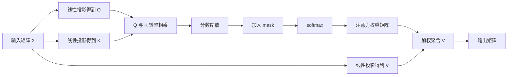
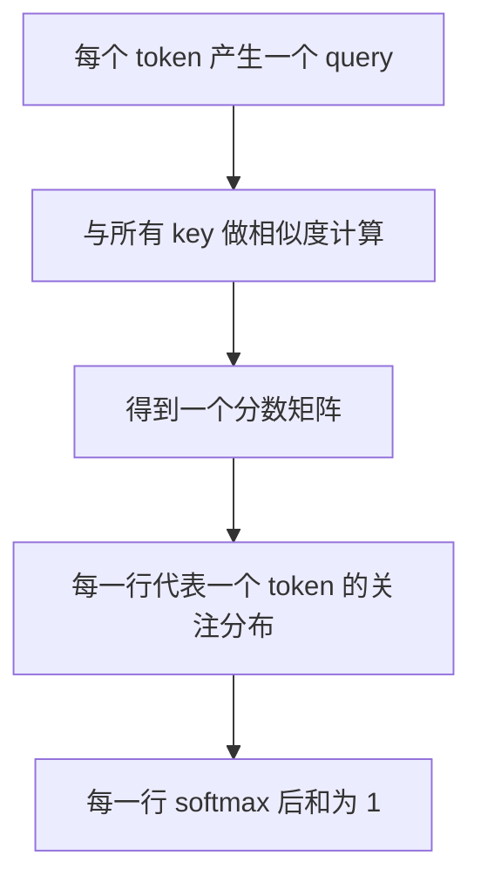
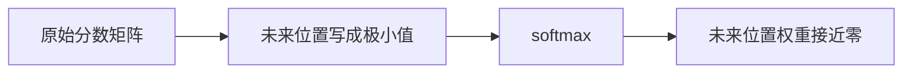
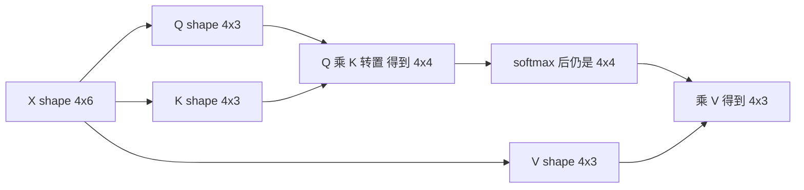

<KnowledgeMap current-module="llm" current-article="第4章 Attention 的矩阵视角与代码推演" />

<ArticleHeader
  module="语言模型基础"
  :tags="['原理', '核心', '代码']"
  reading-time="12 分钟"
  prerequisite="建议先读第3章 Self-Attention 与 QKV"
  summary="这一章专门解决一个常见痛点：很多人知道 attention 公式，却不知道矩阵到底怎么乘、shape 怎么变、为什么要缩放、mask 怎么进来。这一页会把它真正算清楚。"
/>

# 第4章 Attention 的矩阵视角与代码推演

前一章已经把 Q、K、V 的角色讲清了。  
但很多人在真正写代码时还是会卡住：

- `QK^T` 到底是在算什么
- 为什么会得到一个 `seq_len x seq_len` 的矩阵
- `softmax` 是对哪一维做
- `mask` 是在 softmax 前还是后
- 为什么最后还能再乘回 `V`

如果这些问题不彻底看懂，attention 就始终只是一条公式，而不是你真正理解的机制。

## 这一章的目标

这一章不再停留在“概念解释”，而是直接解决下面三件事：

1. attention 在矩阵层面到底怎么计算
2. 每一步的 shape 为什么会变成那样
3. 最小代码实现里，哪些地方最容易写错

## 从一句话开始：attention 本质上在干什么

对序列中的每个 token，模型都会问一个问题：

> 我现在要更新这个位置的表示，应该参考序列中哪些位置，以及各参考多少？

这件事拆成计算步骤就是：

1. 当前 token 产生一个 `query`
2. 所有 token 都提供自己的 `key`
3. 用 query 和所有 key 做匹配，得到相关性分数
4. 把这些分数归一化成权重
5. 用这些权重去加权聚合所有 `value`

## 一张矩阵层面的总图



## 先固定一个最小例子

为了把 shape 看清楚，我们先设定一个最小例子：

- 序列长度 `seq_len = 4`
- 模型维度 `d_model = 6`
- 单头 attention 的头维度 `d_k = d_v = 3`

那么：

- 输入 `X` 的 shape 是 `(4, 6)`
- 投影矩阵 `W_Q`、`W_K`、`W_V` 的 shape 是 `(6, 3)`
- 所以得到：
  - `Q` shape 是 `(4, 3)`
  - `K` shape 是 `(4, 3)`
  - `V` shape 是 `(4, 3)`

## 为什么 `QK^T` 会变成相关性矩阵

`Q` 是 `(4, 3)`，`K^T` 是 `(3, 4)`，所以：

```text
Q @ K^T -> (4, 4)
```

这个 `(4, 4)` 的矩阵非常关键。它不是中间噪声，而是：

`每个 query 对所有 key 的匹配分数表`

### 怎么读这个矩阵

- 第 `i` 行：第 `i` 个 token 正在看别人
- 第 `j` 列：它看的是第 `j` 个 token
- `(i, j)` 这个元素：第 `i` 个 token 对第 `j` 个 token 的关注分数

所以 attention 的第一阶段，本质上是在算：

`一个 token 应该看序列里哪些位置`

## 一张更直观的图



## 为什么要除以根号 d_k

如果不做缩放，`Q` 和 `K` 的维度越大，点积通常越大。  
点积过大，会带来两个直接问题：

- `softmax` 容易过度尖锐
- 梯度会变差，训练更不稳定

所以原论文里用：

```text
scores = QK^T / sqrt(d_k)
```

这一步不是数学装饰，而是为了把分数控制在更健康的范围里。

## 一个直觉例子

假设某一行原始分数是：

```text
[12.0, 10.0, 1.5, 0.8]
```

做 softmax 后，前两个位置会几乎吃掉全部概率。  
如果先缩放，可能变成：

```text
[2.1, 1.8, 0.3, 0.1]
```

这时 softmax 仍然能区分强弱，但不会那么极端。

## mask 为什么一定在 softmax 前

很多人第一次写 attention 时，容易把 mask 放错地方。  
正确顺序通常是：

1. 先算分数
2. 再把不允许看的位置改成一个极小值
3. 再做 softmax

原因很简单：

- softmax 会把整行变成概率分布
- 如果先 softmax，再 mask，就需要重新归一化
- 更自然的做法是直接让被 mask 的位置在 softmax 后变成接近 `0`

## causal mask 在生成模型里的意义

对 decoder-only 模型来说，位置 `t` 不能偷看未来位置。  
所以 attention 分数矩阵里，右上角那一块要被挡住。



这就是为什么 GPT 一类模型生成时能够保持“只能看过去”。

## 为什么 softmax 后还能再乘 V

这一点是 attention 最容易“懂一半”的地方。

softmax 后得到的是：

`每个 token 对其他 token 的关注权重`

但模型真正想得到的，不是权重本身，而是：

`根据这些权重，把别的位置携带的信息聚合回来`

而这个“被聚合的信息”就是 `V`。

所以最后一步：

```text
output = attention_weights @ V
```

意思是：

`按当前 token 的关注分布，对全序列 value 做加权求和`

## 一个完整的 shape 追踪

设：

- `Q`: `(4, 3)`
- `K`: `(4, 3)`
- `V`: `(4, 3)`

那么：

1. `K^T`: `(3, 4)`
2. `Q @ K^T`: `(4, 4)`
3. `softmax(scores)`: `(4, 4)`
4. `weights @ V`: `(4, 3)`

最后输出 shape 又回到了：

```text
(seq_len, d_v)
```

这就说明：

- attention 不改变 token 数量
- 它改变的是每个 token 的表示内容

## 一张 shape 流转图



## 最小 PyTorch 实现

下面这段代码非常值得你手敲一遍。

```python
import math
import torch
import torch.nn.functional as F


def scaled_dot_product_attention(Q, K, V, mask=None):
    # Q: [seq_len, d_k]
    # K: [seq_len, d_k]
    # V: [seq_len, d_v]
    d_k = Q.size(-1)

    scores = Q @ K.transpose(-2, -1)
    scores = scores / math.sqrt(d_k)

    if mask is not None:
        scores = scores.masked_fill(mask == 0, float("-inf"))

    weights = F.softmax(scores, dim=-1)
    output = weights @ V
    return output, weights
```

## 一个可以直接跑的最小例子

```python
torch.manual_seed(7)

Q = torch.randn(4, 3)
K = torch.randn(4, 3)
V = torch.randn(4, 3)

output, weights = scaled_dot_product_attention(Q, K, V)

print("weights shape:", weights.shape)  # [4, 4]
print("output shape:", output.shape)    # [4, 3]
print("row sums:", weights.sum(dim=-1)) # 每行接近 1
```

这个例子能帮助你确认三件事：

- 注意力权重矩阵一定是 `seq_len x seq_len`
- 输出一定回到 `seq_len x d_v`
- 每一行权重加起来等于 `1`

## batched attention 又多了哪几个维度

真实训练里，attention 不会只有一条序列。  
通常还会多一个 batch 维度。

如果是单头 batched attention，常见 shape 是：

- `Q`: `(batch, seq_len, d_k)`
- `K`: `(batch, seq_len, d_k)`
- `V`: `(batch, seq_len, d_v)`

结果：

- `scores`: `(batch, seq_len, seq_len)`
- `weights`: `(batch, seq_len, seq_len)`
- `output`: `(batch, seq_len, d_v)`

如果再进入多头注意力，还会多一个 `num_heads` 维度。

## 初学者最容易写错的 5 个点

### 1. softmax 维度写错

通常应该对最后一维做 softmax，也就是：

```python
F.softmax(scores, dim=-1)
```

因为最后一维对应“当前 token 要看哪些 key”。

### 2. 忘记转置 K

`Q @ K` 维度通常对不上。  
真正要的是：

```python
Q @ K.transpose(-2, -1)
```

### 3. mask 放在 softmax 后

这会让概率分布不干净，经常带来隐藏 bug。

### 4. 把 Q、K、V 看成三份完全不同的输入

在 self-attention 里，它们通常来自同一个 `X` 的三次线性投影，而不是三段独立文本。

### 5. 以为 weights 就是最终输出

weights 只是“看哪里”，真正的输出还要再乘 `V`。

## 这和工程有什么关系

attention 的矩阵视角，不只是为了考试或公式推导。  
它直接影响你后面理解这些问题：

- 为什么长上下文成本高
- 为什么 KV Cache 能提速
- 为什么 causal mask 决定生成边界
- 为什么不同 head 会学到不同关系
- 为什么 retrieval、memory、tool use 常常是在补模型内部 attention 的局限

如果这一层不清楚，你后面学 Agent 时，很多工程决策都会显得像“经验主义”。

## 本节总结

- `QK^T` 产生的是 token 与 token 的相关性矩阵
- 缩放是为了防止 softmax 过尖、训练不稳
- mask 必须在 softmax 前进入
- `weights @ V` 才是真正的信息聚合
- attention 不改变 token 数量，而是重写每个 token 的表示

## 下一步

- 返回 [第3章 Self-Attention 与 QKV](./chapter-03-self-attention-qkv)，把概念视角和矩阵视角连起来
- 继续阅读 [第5章 Multi-Head Attention 与 Transformer Block](./chapter-04-multi-head-and-block)，理解单头 attention 如何变成完整一层

## 参考来源

- Vaswani et al. (2017), *Attention Is All You Need*  
  https://arxiv.org/abs/1706.03762
- The Annotated Transformer  
  https://nlp.seas.harvard.edu/annotated-transformer/
- Understanding Transformer Attention  
  https://dlab-berkeley.github.io/demos/transformers.html
- transformers.run，Transformer 系列中文教程首页  
  https://transformers.run/
