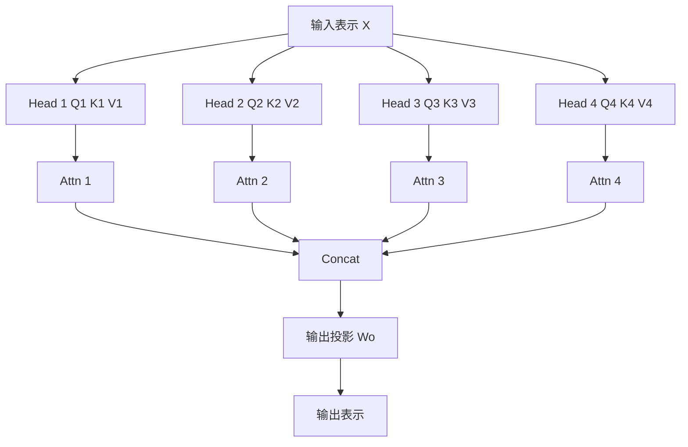
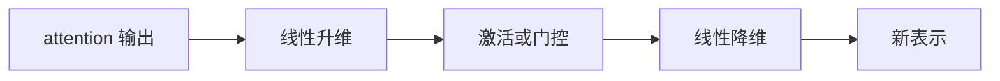
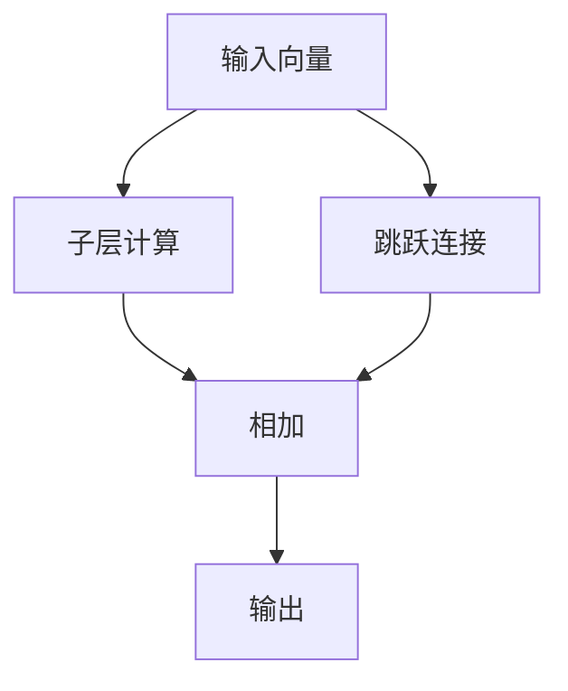
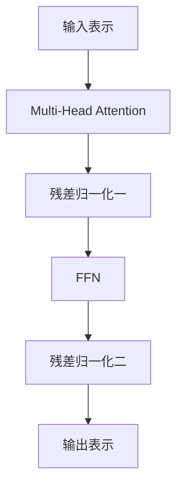

---
title: 第4章 Multi-Head Attention 与 Transformer Block
description: 从单头注意力走到完整 Transformer 层，理解多头、残差、归一化与 FFN 的分工
module: llm
tags:
  - 原理
  - Transformer Block
---

<KnowledgeMap current-module="llm" current-article="第4章 Multi-Head Attention 与 Transformer Block" />

# 第 4 章 Multi-Head Attention 与 Transformer Block

<ArticleHeader
  module="语言模型基础"
  :tags="['原理', 'Transformer Block']"
  reading-time="20 分钟"
  prerequisite="已读第 3 章"
  summary="单头 attention 解释了相关性匹配，但还不足以解释现代 LLM 的一层到底如何工作。这一章会把多头注意力、输出投影、残差连接、LayerNorm 和前馈网络拼成一个完整 Transformer block。"
/>

## 这一章的核心问题

前一章我们只回答了：

`一个 token 怎么按相关性去读别的 token。`

但现代模型真正的基本单元不是“一个 attention 头”，而是一个完整的 Transformer block。

所以这一章要把下面几件事连起来：

- 为什么一个头不够
- 多头怎么协作
- attention 后面为什么还要接 FFN
- 残差和归一化为什么是训练稳定器

## 4.1 为什么单头 attention 不够

如果一层里只有一个 attention head，那么这层在同一时刻只能形成一种关系视角。

但自然语言里的关系是多种并存的：

- 语法依赖
- 指代关系
- 主题关联
- 时间关系
- 格式结构
- 代码中的缩进和作用域关系

一个头很难同时把这些关系都表达好。

所以 multi-head attention 的动机不是“堆参数”，而是：

`让模型能并行地从多个子空间观察同一段上下文。`

## 4.2 Multi-Head Attention 的基本思路

多头注意力会把输入投影成多组 Q/K/V：

- Head 1 看一种关系
- Head 2 看另一种关系
- Head 3 再看另一种关系

然后把多个 head 的结果拼接起来，再做一次输出投影。



## 4.3 多头到底是“多个模型”吗

不完全是。

它们共享同一层的输入，但每个 head 有不同投影矩阵，因此会学到不同的观察方式。

更准确地说：

- 不是完全独立的模型
- 而是同一层中的多个关系读取通道

你可以把它理解成：

`同一批材料，由几个不同专业背景的分析员同时阅读，然后把结论合并。`

## 4.4 多头之后为什么还要输出投影

多个 head 得到的结果会被拼接起来。

但拼接后的表示维度、信息组织方式不一定直接适合下一层，所以通常还要经过一个线性输出投影 `Wo`。

它的作用可以理解成：

- 把多个 head 的结果重新混合
- 让不同 head 之间的信息发生组合
- 对齐回模型需要的隐藏维度

## 4.5 只有 attention 就够了吗

不够。

如果只有 attention，那么模型只是在“跨 token 交换信息”，但还缺一个关键步骤：

`对每个 token 自己的表示做非线性重写。`

这就是 FFN 的角色。

## 4.6 FFN 在 Transformer 里到底做什么

FFN 是 position-wise feed-forward network，意思是：

- 对每个 token 位置分别应用
- 不直接让不同 token 交互
- 但会对单个 token 表示做更强的非线性加工

直观上可以把它理解成分工：

- attention：负责“和别人交流”
- FFN：负责“把交流结果消化成自己的新理解”



## 4.7 为什么 FFN 不只是附属配角

很多初学者会把 Transformer 理解成“attention 一统天下”，这是不完整的。

真实情况是：

- attention 负责 token 间路由
- FFN 负责 token 内加工

如果少了 FFN，模型对单个位置的非线性变换能力会明显变弱。

所以一个更准确的说法是：

`Transformer block = 跨位置的信息路由 + 单位置的非线性重写`

## 4.8 残差连接为什么关键

Transformer 很深，如果每一层都完全覆盖上一层表示，会导致：

- 训练不稳定
- 旧信息容易被洗掉
- 梯度传播困难

残差连接的作用就是给网络留一条“直接通道”。



直觉上可以理解成：

- 子层提供“增量修改”
- 原始表示保留为基线

这让深层堆叠更可训练。

## 4.9 LayerNorm 为什么常和残差一起出现

LayerNorm 的目标是让表示分布更稳定。

没有归一化时，随着层数增加，数值分布可能不断漂移，训练会更难。

所以在 Transformer 中，常见模式是：

- 子层计算
- 残差相加
- LayerNorm 稳定表示

现代实现里还有 pre-norm / post-norm 的区别，但你先抓住一个总原则就够了：

`LayerNorm 负责让深层网络更稳定地优化。`

## 4.10 一层完整 Transformer block 长什么样



如果是现代 pre-norm 变体，顺序可能略有调整，但核心模块仍然是：

- multi-head attention
- residual
- layer normalization
- FFN

## 4.11 一个最小 PyTorch 风格伪代码

```python
def transformer_block(x, mha, norm1, ffn, norm2):
    attn_out = mha(x)
    x = norm1(x + attn_out)

    ffn_out = ffn(x)
    x = norm2(x + ffn_out)
    return x
```

如果你以后读模型源码，看到各种复杂封装，不要慌。

大多数 block 拆开以后，本质都离不开这个骨架。

## 4.12 为什么现代 LLM 还会继续改 block

因为一旦模型变大、上下文变长，Transformer block 就会成为训练和推理的核心成本中心。

所以后来的改动经常集中在：

- attention 头设计
- FFN 激活函数
- normalization 位置
- KV cache 结构
- attention 的显存和带宽优化

例如：

- RoPE 改位置表示
- MQA / GQA 改 KV 头数
- SwiGLU 改 FFN 结构

这些都不是完全推翻 Transformer，而是在 block 内部继续优化。

## 4.13 一个工程视角的心智模型

当你把一层 Transformer block 看懂后，可以把它总结成一句话：

`先决定该和谁交换信息，再把交换结果写回自己的表示。`

更细一点就是：

1. 用 multi-head attention 在 token 之间做动态路由
2. 用 residual 和 norm 保证深层稳定
3. 用 FFN 对每个 token 进一步重写

这套模式堆很多层后，模型就逐步形成更高层次的上下文表示能力。

## 本章小结

- multi-head attention 的目的，是让模型并行学习多种关系视角
- FFN 不是配角，而是 token 内部非线性加工的核心
- residual 和 LayerNorm 是深层 Transformer 可训练的关键保障
- 一个完整 block 的本质，是“跨 token 路由 + 单 token 重写”

## 下一章

继续阅读 [第5章 Encoder、Decoder 与现代 LLM](./chapter-05-encoder-decoder-and-modern-llm)，把 block 继续拼成 BERT、GPT 这类模型家族。

## 参考来源

- Vaswani et al. (2017), *Attention Is All You Need*  
  https://arxiv.org/abs/1706.03762
- Shazeer (2020), *GLU Variants Improve Transformer*  
  https://arxiv.org/abs/2002.05202
- transformers.run，Transformer 系列中文教程首页  
  https://transformers.run/


