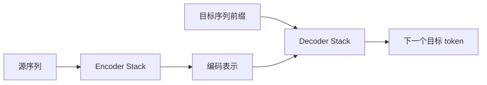
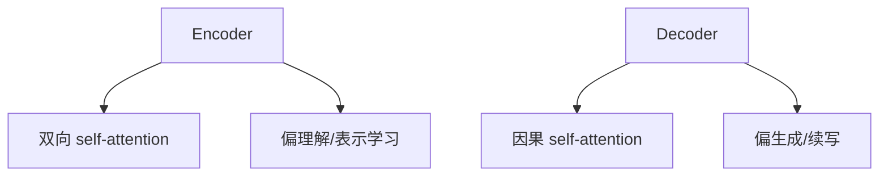
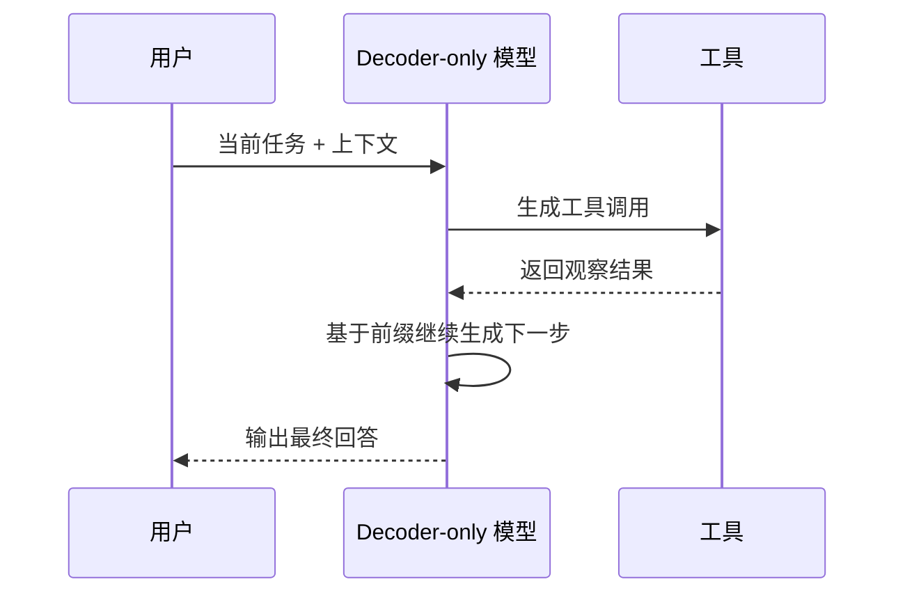

<KnowledgeMap current-module="llm" current-article="第5章 Encoder、Decoder 与现代 LLM" />

# 第 5 章 Encoder、Decoder 与现代 LLM

<ArticleHeader
  module="语言模型基础"
  :tags="['原理', '模型家族']"
  reading-time="22 分钟"
  prerequisite="已读第 4 章"
  summary="理解单个 Transformer block 之后，还要继续回答另一个重要问题：为什么有的模型像 BERT，只擅长编码理解；有的模型像 GPT，特别擅长生成。答案就在 encoder、decoder 以及训练目标的不同组合中。"
/>

## 这一章要回答什么

到了这里，你已经知道一层 Transformer 是怎么工作的。

但现代模型不是只有一层，它们还会在更高层面做结构选择：

- 只用 encoder
- 只用 decoder
- encoder + decoder 一起用

这些选择会直接影响：

- 模型擅长理解还是擅长生成
- 训练目标怎么设
- 推理接口是什么样

## 5.1 原始 Transformer 是 encoder-decoder 结构

最初的 Transformer 不是今天常见的聊天模型形态，而是典型的 seq2seq 架构：

- encoder 负责编码输入序列
- decoder 负责编码已生成前缀，并结合 encoder 输出继续生成目标序列



这种结构非常适合：

- 机器翻译
- 摘要
- 结构化输入到结构化输出的转换

因为“输入”和“输出”天然是两条不同序列。

## 5.2 Encoder 和 Decoder 的关键差异

### Encoder

encoder 的 self-attention 往往是双向的。

也就是一个 token 在编码时，可以看左右文。

这使它很适合做：

- 句子理解
- 分类
- 检索表示
- token 级标注

### Decoder

decoder 的 self-attention 通常带 causal mask。

也就是：

- 当前位置只能看前面的 token
- 不能看未来 token

这让它天然适合做自回归生成。

### 一张结构对比图



## 5.3 为什么 BERT 是 encoder-only

BERT 选择只保留 encoder stack，并使用 masked language modeling 进行训练。

它的核心目标不是一路生成文本，而是：

`在双向上下文中学出高质量表示。`

这让它非常适合：

- 分类
- 信息抽取
- 检索和 rerank
- embedding 生成

但不太适合自然流畅地逐 token 生成长文本。

### BERT 的直觉理解

你可以把 BERT 看成：

`一个擅长把整段文本编码成高质量上下文表示的理解器。`

## 5.4 为什么 GPT 是 decoder-only

GPT 系列走的是另一条路：

- 只保留 decoder stack
- 使用 next-token prediction 训练
- 依赖 causal attention

这样做的最大好处是：

`训练目标与生成目标高度一致。`

训练时做的是“根据前文预测下一个 token”，推理时做的也是这件事。

所以 GPT 风格模型特别适合：

- 续写
- 对话
- 代码生成
- 工具调用中的逐步规划和行动

## 5.5 为什么今天的大模型大多是 decoder-only

因为现代大模型最火的任务大都偏向：

- 通用文本生成
- 指令跟随
- 多轮对话
- 代码补全
- Agent 里的计划和动作输出

这些任务都和自回归生成高度匹配。

再加上 decoder-only 有几个工程优势：

- 架构更统一
- 训练目标简单直接
- 推理接口自然对应聊天和生成
- 扩展到超大规模后效果很好

所以虽然 encoder-only 仍然非常重要，但“通用大模型主角”逐渐变成了 decoder-only。

## 5.6 Encoder-only、Decoder-only、Encoder-Decoder 怎么选

| 架构 | 更擅长什么 | 常见代表 |
| --- | --- | --- |
| Encoder-only | 理解、表示、检索、分类 | BERT |
| Decoder-only | 生成、续写、对话、代码 | GPT、Llama、Claude 风格模型 |
| Encoder-Decoder | 输入输出转换、翻译、摘要 | 原始 Transformer、T5 |

## 5.7 一个“训练目标决定能力倾向”的视角

很多人会把模型能力只归因于架构，其实训练目标同样关键。

### BERT 的 MLM

随机遮住一部分 token，让模型根据左右文恢复。

它擅长：

- 融合理解左右上下文
- 学高质量中间表示

### GPT 的 next-token prediction

根据前缀预测下一个 token。

它擅长：

- 连续生成
- 长文本续写
- 把“思考过程”也串成文本

所以架构和目标要一起看，不能只盯着“用了 Transformer”这件事。

## 5.8 一个最小生成循环

decoder-only 模型生成时，本质就是不断重复下面这件事：

```python
tokens = ["用户", "问", "：", "什么是", "Transformer"]

for _ in range(5):
    next_token = "..."  # 模型根据当前前缀预测下一个 token
    tokens.append(next_token)

print(tokens)
```

真实系统当然更复杂，但核心流程就是：

- 输入前缀
- 预测下一个 token
- 把新 token 拼回前缀
- 再继续预测

## 5.9 为什么聊天模型看起来“像会思考”

因为 decoder-only 模型把一切都写成 token 序列继续生成。

包括：

- 中间解释
- 分步推理
- 工具调用参数
- 代码补全

这也是为什么它特别适合 Agent：

计划、行动、观察、总结，都可以统一进入“文本前缀 -> 下一个 token”的框架。

## 5.10 但 encoder 并没有过时

很多真正高价值的生产系统，背后依然广泛使用 encoder-only 模型：

- embedding 检索
- reranking
- 分类
- 语义匹配
- 内容安全

所以更准确的说法不是“decoder-only 取代了一切”，而是：

`在通用生成接口上，decoder-only 成了主干；在高质量表示学习任务上，encoder-only 依然非常重要。`

## 5.11 为什么 Agent 世界更偏爱 decoder-only

因为 Agent 的关键动作往往是：

- 生成计划
- 生成工具调用
- 生成代码修改
- 生成总结

这些都天然是“下一 token 生成问题”。

同时，Agent 的观察信息又能不断拼回上下文，形成：



这就是 decoder-only 模型和 Agent 框架天然契合的原因。

## 本章小结

- 原始 Transformer 是 encoder-decoder 架构，适合 seq2seq 任务
- BERT 是 encoder-only，擅长理解与表示学习
- GPT 风格是 decoder-only，擅长自回归生成
- 今天的通用聊天大模型大多走 decoder-only，不是偶然，而是因为它和生成接口高度一致

## 下一章

继续阅读 [第6章 训练、推理与现代 Transformer 演化](./chapter-06-training-inference-and-evolution)，把训练目标、KV Cache、RoPE、GQA、SwiGLU、MoE 等现代演化一起串起来。

## 参考来源

- Vaswani et al. (2017), *Attention Is All You Need*  
  https://arxiv.org/abs/1706.03762
- Devlin et al. (2018), *BERT: Pre-training of Deep Bidirectional Transformers for Language Understanding*  
  https://arxiv.org/abs/1810.04805
- Brown et al. (2020), *Language Models are Few-Shot Learners*  
  https://arxiv.org/abs/2005.14165
- Hugging Face Transformers 文档，BERT  
  https://huggingface.co/docs/transformers/v4.27.0/model_doc/bert
- transformers.run，Transformer 系列中文教程首页  
  https://transformers.run/
