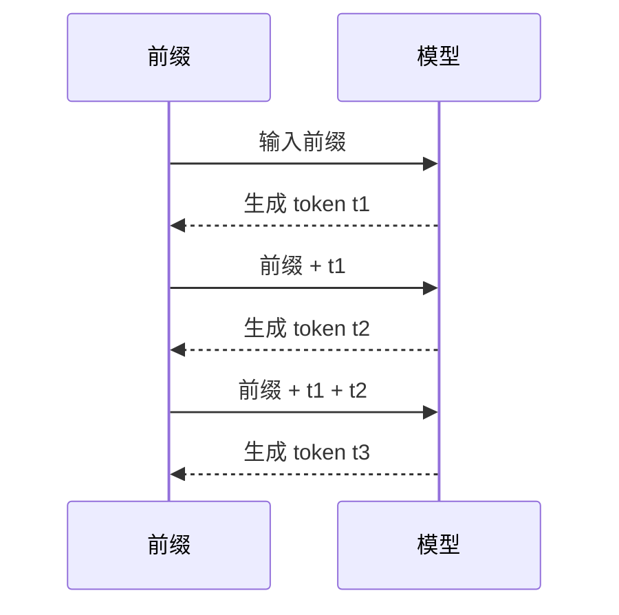
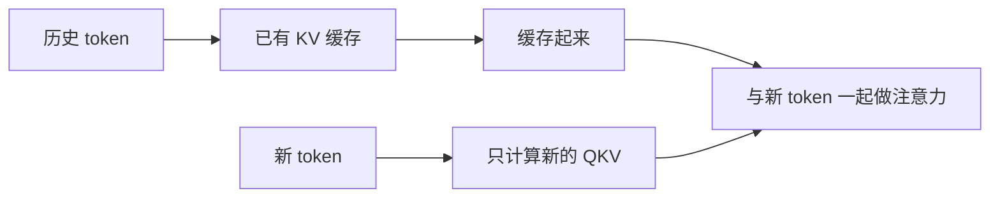
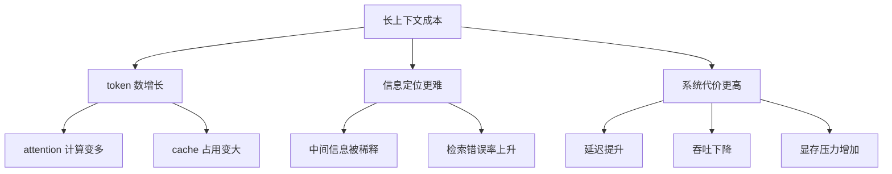
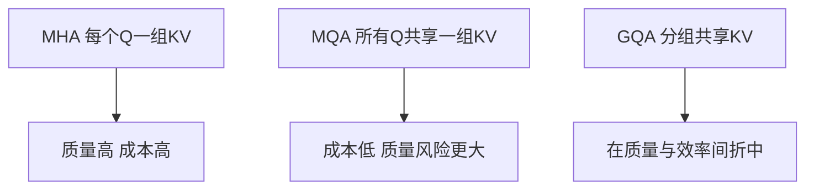
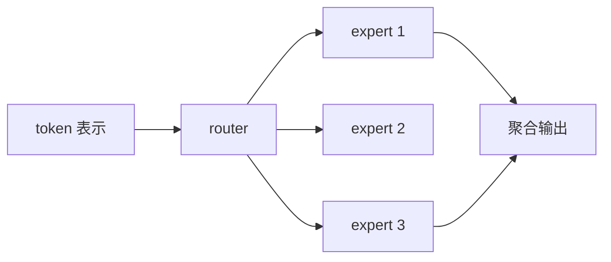

---
title: 第7章 训练、推理与现代 Transformer 演化
description: 把 next-token 训练、KV Cache、RoPE、ALiBi、GQA、SwiGLU 与 MoE 放回同一条工程主线
module: llm
tags:
  - 原理
  - 工程
---

<KnowledgeMap current-module="llm" current-article="第7章 训练、推理与现代 Transformer 演化" />

# 第 7 章 训练、推理与现代 Transformer 演化

<ArticleHeader
  module="语言模型基础"
  :tags="['原理', '工程']"
  reading-time="24 分钟"
  prerequisite="已读第 6 章"
  summary="这一章把 Transformer 从“论文中的模块”推进到“现实里的大模型系统”。我们会讲训练目标、推理为何昂贵、KV Cache 为什么关键，以及 RoPE、ALiBi、MQA/GQA、SwiGLU、MoE 这些现代演化到底各自在解决什么问题。"
/>

## 这一章为什么重要

如果前几章讲的是“模型为何成立”，这一章讲的就是“模型为何昂贵，以及后来的人如何把它做得更能用”。

因为现代 LLM 的很多真实体验都来自这里：

- 为什么生成一个字一个字地慢
- 为什么长上下文贵
- 为什么几乎所有优化都围绕 attention 和 FFN
- 为什么 RoPE、KV cache、GQA 会频繁出现

## 6.1 next-token prediction 为什么这么强

decoder-only LLM 的训练目标看起来很简单：

`给定前缀，预测下一个 token。`

但这个目标之所以强，是因为语言本身包含了：

- 语法
- 语义
- 事实模式
- 任务格式
- 推理表达

所以当模型被迫持续做好“下一个 token 预测”时，它会逐步学到一整套压缩后的语言世界结构。

### 最小训练视角

```python
sequence = ["今天", "天气", "很好"]

training_pairs = [
    (["今天"], "天气"),
    (["今天", "天气"], "很好"),
]

print(training_pairs)
```

真实训练当然是大规模矩阵计算，但逻辑就是不断构造这种“前缀 -> 下一个 token”的监督。

## 6.2 为什么训练能并行，推理却更慢

这是很多工程同学第一次接触 LLM 时的困惑。

### 训练

训练时，你已经知道完整序列，所以可以在 teacher forcing 下并行计算很多位置的 loss。

### 推理

推理时，下一个 token 还没生成出来，所以只能：

1. 先生成第 1 个新 token
2. 再把它拼回前缀
3. 再生成第 2 个新 token
4. 不断重复



所以生成天然是顺序过程，这就是推理延迟的根源之一。

## 6.3 为什么 KV Cache 如此关键

如果模型每生成一个新 token，都把前面全部历史重新算一遍，那代价会非常高。

但在 causal attention 里，过去 token 的 K/V 一旦算好，面对未来 token 时通常不需要重算。

所以推理系统会缓存每层历史 token 的：

- Key
- Value

这就是 KV Cache。



### 直觉收益

- 历史 K/V 不重复算
- 每一步只新增当前 token 的 K/V
- 逐 token 生成成本大幅下降

### 但代价也存在

KV Cache 会占显存，而且上下文越长，缓存越大。

所以它不是“白送加速”，而是：

`用更多内存换更少重复计算。`

## 6.4 长上下文为什么贵

长上下文不是“字符多一点”这么简单。

真正贵的是：

- token 更多
- attention 关系更多
- KV Cache 更大
- 显存和带宽压力更高

这也是为什么“支持 1M context”从来不是只改一个配置就行。



## 6.5 RoPE 与 ALiBi：为什么都围绕长上下文

位置编码方案在现代 LLM 里非常关键，因为它直接决定：

- 模型如何表达距离关系
- 长序列外推会不会失真
- attention 在远距离上还能否稳定工作

### RoPE

RoPE 把位置信息编码进 Q/K 的旋转关系里。

它的优势是：

- 与 attention 主计算深度耦合
- 在现代 LLM 中实践广泛
- 对相对位置关系表达更自然

### ALiBi

ALiBi 则是在 attention 分数上直接加与距离相关的线性偏置。

它的优势是：

- 实现简单
- 长序列外推直观
- 训练和内存开销较友好

### 工程直觉

RoPE 更像“把位置写进匹配机制本身”，  
ALiBi 更像“在匹配分数上施加距离偏好”。

## 6.6 为什么现代模型会从 MHA 走向 MQA / GQA

随着模型越来越大，推理中的一个瓶颈变成了：

`KV Cache 太大，带宽与显存压力太重。`

### MHA

每个 query head 都对应自己的 K/V head，质量好，但缓存大。

### MQA

多个 query 共享同一组 K/V，速度和缓存都更友好，但质量可能受影响。

### GQA

GQA 在两者之间折中：

- 不是每个 query 都独享 K/V
- 也不是全都共用一组 K/V
- 而是分组共享



这类改动说明一个事实：

`现代 Transformer 的演化，很多不是为了“更会做题”，而是为了“更能部署、更能长上下文”。`

## 6.7 FFN 也在演化：为什么会出现 SwiGLU

attention 不是唯一演化点，FFN 也在持续升级。

SwiGLU 的核心思路是：

- 用带门控的结构替代传统简单激活
- 让 FFN 的信息流控制更灵活

它不是把 FFN 从无到有重做，而是对“单 token 内部非线性重写”这一步做更强表达。

你可以先把它理解成：

`让 FFN 不只是扩维 + 激活，而是带条件门控地选择信息通过。`

## 6.8 为什么又会出现 MoE

当模型继续变大时，另一个问题出现了：

`是不是每个 token 都必须经过全部参数？`

MoE 的思路是：

- 准备多个 expert
- 让 router 为当前 token 选择其中少数几个 expert
- 只激活一部分参数

这样就能在不让每个 token 都跑完整个大网络的前提下，提升总参数容量。



### 直觉收益

- 总容量更大
- 单 token 激活成本相对可控

### 直觉代价

- 路由训练更复杂
- 负载均衡是问题
- 系统实现和部署更难

## 6.9 一个统一的演化视角

把这几年的 Transformer 演化放在一起看，会更清楚：

| 演化点 | 主要解决什么 |
| --- | --- |
| RoPE / ALiBi | 更好的位置表达与长上下文外推 |
| KV Cache | 降低自回归推理中的重复计算 |
| MQA / GQA | 降低 KV cache 与推理带宽压力 |
| SwiGLU | 提升 FFN 表达能力 |
| MoE | 扩大模型容量但控制单 token 激活成本 |

这张表背后的共同主题是：

`现代 LLM 的演化，本质上是在质量、吞吐、显存、上下文长度之间持续做系统级权衡。`

## 6.10 为什么这些底层机制会直接影响 Agent 系统

这不是“模型课”和“Agent 课”互不相关。

恰恰相反，Agent 的很多设计正是在补偿 Transformer 的底层约束：

- 因为上下文贵，所以要做记忆分层和摘要
- 因为模型不是数据库，所以要做 RAG
- 因为长任务会拖垮上下文，所以要做 harness 和 skill
- 因为逐 token 生成慢，所以要重视工具调用次数与轨迹长度

也就是说，后面站内几乎所有工程模块，都建立在这一章的约束之上。

## 6.11 一个最小推理伪代码

```python
def generate(prefix_tokens, model, max_new_tokens):
    kv_cache = {}
    tokens = list(prefix_tokens)

    for _ in range(max_new_tokens):
        next_token, kv_cache = model.step(tokens[-1:], kv_cache=kv_cache)
        tokens.append(next_token)
        if next_token == "<eos>":
            break

    return tokens
```

这段代码抓住了推理的两个关键现实：

- 逐 token 生成
- 带着 KV Cache 往前滚

## 本章小结

- next-token prediction 是现代 decoder-only LLM 的核心训练目标
- 推理之所以慢，是因为生成天然是顺序的
- KV Cache 是降低重复计算的关键工程机制
- RoPE、ALiBi、GQA、SwiGLU、MoE 等演化，本质上都在平衡能力与成本
- 理解这些机制后，你会更清楚后续 Agent、RAG、Memory 为什么必须存在

## 学完本章后去哪里

- 回到 [上下文窗口](./context-window)，重新看长上下文问题会更透
- 进入 [Agent 核心机制](../02-agent-core/)，把模型原理和系统设计真正接起来

## 参考来源

- Brown et al. (2020), *Language Models are Few-Shot Learners*  
  https://arxiv.org/abs/2005.14165
- Hugging Face Transformers 文档，Caching  
  https://huggingface.co/docs/transformers/v4.55.4/en/cache_explanation
- Hugging Face Transformers 文档，Text generation  
  https://huggingface.co/docs/transformers/main/en/llm_tutorial
- Su et al. (2021), *RoFormer: Enhanced Transformer with Rotary Position Embedding*  
  https://arxiv.org/abs/2104.09864
- Press et al. (2021), *Train Short, Test Long: Attention with Linear Biases Enables Input Length Extrapolation*  
  https://arxiv.org/abs/2108.12409
- Ainslie et al. (2023), *GQA: Training Generalized Multi-Query Transformer Models from Multi-Head Checkpoints*  
  https://arxiv.org/abs/2305.13245
- Shazeer (2020), *GLU Variants Improve Transformer*  
  https://arxiv.org/abs/2002.05202
- transformers.run，Transformer 系列中文教程首页  
  https://transformers.run/

