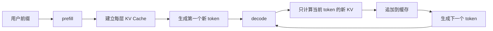
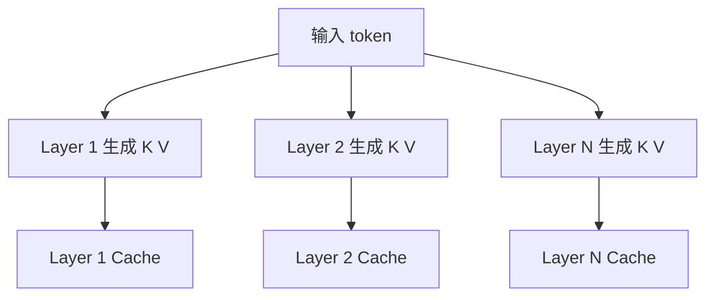
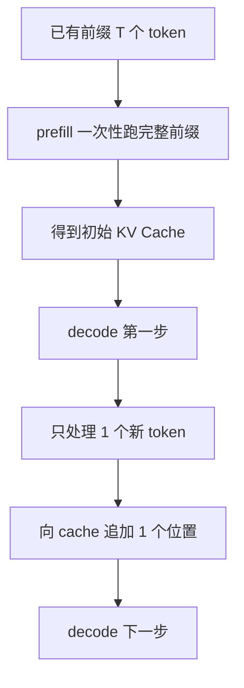
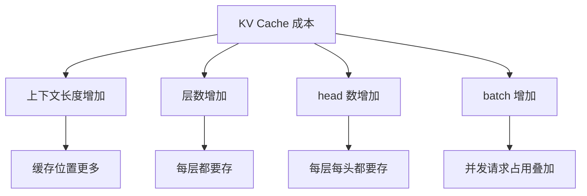

<KnowledgeMap current-module="llm" current-article="第8章 KV Cache 与自回归推理实战" />

<ArticleHeader
  module="语言模型基础"
  :tags="['工程', '核心', '推理']"
  reading-time="14 分钟"
  prerequisite="建议先读第7章 训练、推理与现代 Transformer 演化"
  summary="这一章专门解决推理阶段最容易一知半解的部分：什么是 prefill，什么是 decode，KV Cache 到底缓存了什么，为什么它能显著降低重复计算，以及它为什么又会让长上下文越来越贵。"
/>

# 第8章 KV Cache 与自回归推理实战

很多人知道 `KV Cache` 很重要，但一旦问得更具体，就会开始模糊：

- 到底缓存的是哪一层的什么张量
- 为什么只缓存 `K` 和 `V`，而不是把整段 attention 都缓存
- `prefill` 和 `decode` 到底差在哪
- 为什么生成会一 token 一 token 地慢
- 为什么上下文一长，显存和延迟又会重新上来

如果这些问题不彻底讲清楚，你对推理系统的理解就会停留在一句口号：

`KV Cache 可以加速生成`

但真正的工程判断需要更细。

## 这一章要解决什么

这一章专门讲清楚四件事：

1. 自回归推理的真实执行过程
2. `prefill` 和 `decode` 的职责分工
3. KV Cache 在每一层到底怎么增长
4. 为什么它既是性能关键点，也是长上下文成本来源

## 先把推理过程拆成两段

生成并不是从头到尾都做同一种计算。  
更稳定的理解方式是把它拆成两段：

1. `prefill`
2. `decode`

### prefill 是什么

`prefill` 指的是：

`把已有前缀一次性送进模型，建立第一份完整上下文表示和初始 KV Cache`

例如用户已经输入了 500 个 token，那么第一步不是一个一个回放，而是先把这 500 个 token 跑一遍。

### decode 是什么

`decode` 指的是：

`在已有缓存的基础上，每次只处理一个新 token，并继续向后生成`

这才是我们平时感受到的“一字一字吐字”的过程。

## 一张总览图



## 为什么训练可以并行而生成必须顺序

训练时你已经知道整条序列，所以所有位置的 supervision 都在。  
生成时不是这样。

假设当前上下文是：

```text
今天天气
```

模型要先预测下一个 token，可能是：

```text
很好
```

只有它真的生成出 `很好` 之后，新的上下文才会变成：

```text
今天天气很好
```

然后才能继续预测再下一个 token。

这就是自回归的核心：

`后一个位置依赖前一个位置刚刚生成出来的结果`

## 为什么不能每步都把全历史重新算一遍

从数学上当然可以。  
但工程上非常浪费。

因为在 decoder-only attention 里，历史 token 的 `K` 和 `V` 一旦在当前上下文下算出来，面对未来 token 时通常不需要重算。

真正每一步变化的，主要是：

- 当前新 token 的 `Q`
- 当前新 token 新产生的 `K`
- 当前新 token 新产生的 `V`

所以如果每一步都把几百、几千个历史 token 全重新过一遍投影和 attention，代价会急剧膨胀。

## KV Cache 到底缓存了什么

对每一层 self-attention 来说，模型都会拿到当前层的隐藏状态，然后投影出：

- `Q`
- `K`
- `V`

在推理时，系统通常会把历史位置的：

- `K`
- `V`

存起来，作为这一层的 cache。

注意，是：

`每一层都有自己的 KV Cache`

而不是整模型只有一份统一缓存。

## 一张层级视角图



这张图对应一个很关键的现实：

`上下文越长，层数越多，KV Cache 总体占用就越大`

## 为什么只缓存 K 和 V，不缓存 Q

这是一个特别常见的问题。

原因是：

- `Q` 表示当前查询位置要看谁
- 当新 token 到来时，它的查询目标变了
- 所以当前步的 `Q` 必须重新算

而历史 token 的 `K` 和 `V` 代表的是“可被看的索引”和“可被聚合的信息”，对未来查询来说仍然有效。

因此缓存策略自然变成：

- `Q` 每步现算
- 历史 `K` 和 `V` 保留

## prefill 阶段到底发生了什么

假设输入前缀长度是 `T`。

在 `prefill` 阶段，你会一次性完成：

1. 把 `T` 个 token 送入所有层
2. 每层为这 `T` 个位置都计算出 `K` 和 `V`
3. 把每层的历史 `K` 和 `V` 存入 cache
4. 取最后位置的 logits，采样出第一个新 token

所以 `prefill` 的特点是：

- 计算量大
- 并行度高
- 首 token 延迟通常由它主导

## decode 阶段到底发生了什么

在 `decode` 阶段，系统每步通常只处理一个新 token。

对于当前 token：

1. 在每一层算出新的 `Q`、`K`、`V`
2. 把新的 `K`、`V` 追加到该层 cache
3. 用当前 `Q` 去和历史全部 `K` 做注意力
4. 再用权重聚合历史全部 `V`
5. 得到下一 token 的 logits

所以 `decode` 的特点是：

- 每步计算量小于 prefill
- 但必须顺序执行
- 总体验更像稳定的逐 token 延迟

## 一张 prefill 和 decode 的对比图



## 一个最小 shape 心智模型

先假设：

- `num_layers = 2`
- `num_heads = 4`
- `head_dim = 64`
- 当前历史长度 `seq_len = 128`
- batch 大小 `batch = 1`

那某一层的 KV Cache 常见 shape 可以理解成：

```text
K cache: [1, 4, 128, 64]
V cache: [1, 4, 128, 64]
```

如果又生成了一个 token，那么更新后变成：

```text
K cache: [1, 4, 129, 64]
V cache: [1, 4, 129, 64]
```

这说明 KV Cache 的增长模式非常直接：

`每生成一个新 token，每一层每个 head 都要多存一格`

## 为什么长上下文会让 cache 变贵

因为 KV Cache 的成本和这些量直接相关：

- batch 大小
- 层数
- head 数
- head 维度
- 当前上下文长度

如果这些量一起上升，cache 就会快速变重。

所以长上下文推理的难点并不只是算力，还包括：

- 显存占用
- 显存带宽
- cache 搬运成本

## 一张成本来源图



## 为什么它能提速，但不能让生成完全不慢

KV Cache 解决的是：

`不要重复算历史 token 的 K 和 V`

但它没有解决两件根本问题：

1. 生成仍然是顺序过程
2. 当前 token 仍然要看全历史

也就是说，KV Cache 把“重复工作”省掉了，但没有把“逐步依赖”消掉。

所以你仍然会看到：

- 长上下文下单步 decode 变慢
- 生成长度越长，总时间越长
- token 吞吐和首 token 延迟是两种不同问题

## 一个最小伪代码

```python
def generate(prefix_tokens, model, max_new_tokens):
    kv_cache = None

    # prefill: 一次性处理已有前缀
    logits, kv_cache = model.forward(prefix_tokens, kv_cache=None)
    next_token = sample(logits[-1])

    generated = list(prefix_tokens) + [next_token]

    # decode: 每次只处理一个新 token
    for _ in range(max_new_tokens - 1):
        logits, kv_cache = model.forward([generated[-1]], kv_cache=kv_cache)
        next_token = sample(logits[-1])
        generated.append(next_token)

        if next_token == "<eos>":
            break

    return generated
```

这段代码虽然极简，但已经抓住了推理系统的结构差异：

- 第一次是 `prefill`
- 后面进入 `decode`
- `kv_cache` 会一路向后传

## 更接近真实框架的最小示意

```python
class TinyDecoder:
    def forward(self, input_tokens, kv_cache=None):
        if kv_cache is None:
            kv_cache = self.init_empty_cache()

        new_cache = []

        hidden = self.embed(input_tokens)

        for layer_id, layer in enumerate(self.layers):
            past_k, past_v = kv_cache[layer_id]
            q, k, v = layer.project_qkv(hidden)

            all_k = self.concat_cache(past_k, k)
            all_v = self.concat_cache(past_v, v)

            hidden = layer.attend(q, all_k, all_v)
            new_cache.append((all_k, all_v))

        logits = self.lm_head(hidden)
        return logits, new_cache
```

这个示意最值得注意的地方有三处：

1. cache 是按层组织的
2. 新 token 的 `k` 和 `v` 会被拼到历史后面
3. 当前 `q` 会和完整历史 `all_k`、`all_v` 交互

## 初学者最容易误解的 6 个点

### 1. 以为 KV Cache 缓存了整个 attention 输出

通常不是。  
缓存的是每层历史位置的 `K` 和 `V`。

### 2. 以为有了 cache 就不再看历史

错。  
还是要看历史，只是不用重算历史的 `K`、`V`。

### 3. 以为 decode 每步只看当前 token

当前步只新增一个 token，但这个 token 仍会对全历史做 attention。

### 4. 以为 prefill 不重要

首 token 延迟往往主要取决于 prefill，所以很多服务优化首先盯的就是这段。

### 5. 以为 cache 只和 token 数有关

它还和层数、head 数、head 维度、batch 大小强相关。

### 6. 以为 KV Cache 只是模型内部小细节

其实它直接影响：

- 服务成本
- 吞吐
- 并发能力
- 长上下文上限

## 这和 Agent 系统有什么关系

Agent 系统经常会：

- 多轮调用模型
- 拼接很长上下文
- 保留大量工具结果
- 通过记忆和检索把上下文继续拉长

这时你就会发现，底层推理机制不是远处知识，而是直接决定上层架构的成本边界：

- 为什么需要摘要和记忆分层
- 为什么要谨慎保留中间轨迹
- 为什么工具调用次数会影响整体时延
- 为什么长任务系统必须考虑上下文回收

## 本节总结

- `prefill` 负责建立初始上下文和第一份 KV Cache
- `decode` 负责逐 token 向后生成
- KV Cache 缓存的是每层历史位置的 `K` 和 `V`
- 它显著减少重复计算，但不会消除顺序生成的本质
- 长上下文越长，cache 占用和带宽压力越大

## 下一步

- 回到 [第7章 训练、推理与现代 Transformer 演化](./chapter-06-training-inference-and-evolution)，把这一页作为推理部分的展开理解
- 继续进入 [Agent 核心机制](../02-agent-core/)，你会更清楚为什么上下文与轨迹管理会直接影响系统成本

## 参考来源

- Hugging Face Transformers 文档，Caching  
  https://huggingface.co/docs/transformers/v4.55.4/en/cache_explanation
- Hugging Face Transformers 文档，Text generation  
  https://huggingface.co/docs/transformers/main/en/llm_tutorial
- vLLM 官方文档，Paged Attention 与推理优化相关资料  
  https://docs.vllm.ai/
- Kipply, Transformers Key Value Caching Explained  
  https://kipp.ly/transformer-inference-arithmetic/
- Vaswani et al. (2017), *Attention Is All You Need*  
  https://arxiv.org/abs/1706.03762
