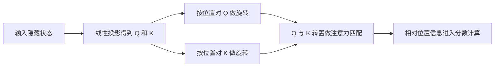
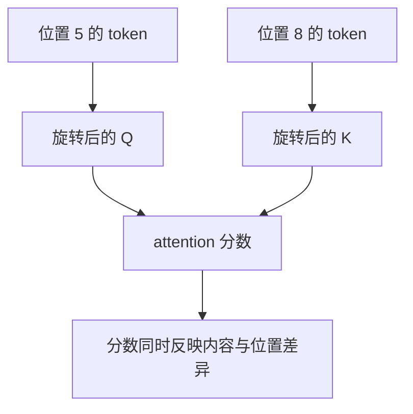
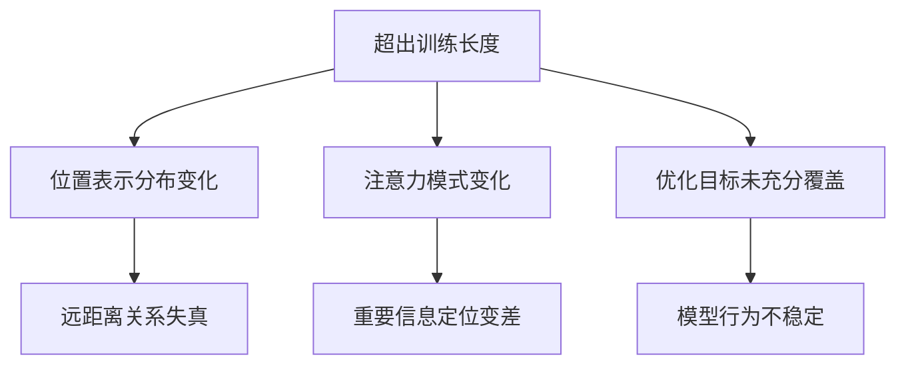

<KnowledgeMap current-module="llm" current-article="第9章 RoPE 与长上下文外推实战" />

<ArticleHeader
  module="语言模型基础"
  :tags="['原理', '工程', '长上下文']"
  reading-time="14 分钟"
  prerequisite="建议先读第7章 与 第8章 KV Cache 与自回归推理实战"
  summary="这一章专门解决一个高频误解：很多人知道 RoPE 很流行，却不知道它到底在 attention 里改了什么、为什么有助于长上下文，以及为什么只靠 RoPE 仍然无法自动获得无限长度外推能力。"
/>

# 第9章 RoPE 与长上下文外推实战

在现代 LLM 里，`RoPE` 几乎已经成了一个绕不开的词。

你会在各种模型说明里看到：

- 使用 RoPE
- 扩展 context length
- RoPE scaling
- long context extrapolation

但如果继续追问，很多解释会立刻变模糊：

- RoPE 到底加在模型的哪一步
- 它和普通绝对位置编码有什么根本区别
- 为什么它更适合现代 decoder-only LLM
- 为什么有了 RoPE 仍然会出现长上下文失真
- 外推和真正“学会长上下文”到底是不是一回事

这一章就是把这些问题一口气拆清楚。

## 这一章要解决什么

我们聚焦四件事：

1. RoPE 在 attention 里到底做了什么
2. 它为什么更利于表达相对位置关系
3. 它和长上下文外推的真实关系
4. 为什么工程上还要配合 cache、检索、摘要和训练策略

## 先回到位置编码的根本问题

attention 自己只会做一件事：

`比较 token 之间的相似度并聚合信息`

如果你只给模型词向量，而不告诉它顺序，那么：

- “猫追狗”和“狗追猫”会非常接近
- “第一个词”和“最后一个词”的差别不明显
- 模型难以表达距离、顺序和方向

所以位置编码的任务不是装饰，而是：

`让 attention 知道谁在前，谁在后，彼此相隔多远`

## 从绝对位置到相对位置

早期 Transformer 更常见的做法是把位置向量直接加到 embedding 上。  
这种做法能告诉模型：

- 当前位置是第几个

但现代 LLM 更关心的常常是：

- 当前 token 与另一个 token 相隔多远
- 这个关系在不同长度下是否还能稳定

这也是为什么后来大家越来越偏向能更自然表达相对位置关系的方案。

## RoPE 的一句话直觉

RoPE 可以先用一句话理解为：

`不直接给 token 贴一个位置标签，而是让 Q 和 K 随位置发生可计算的旋转，从而把位置信息写进 attention 匹配过程本身`

这和“把位置编码加在输入上”很不一样。

## 一张机制总览图



这张图最关键的点是：

`RoPE 不是在 attention 之外单独贴标签，而是直接改变了 attention 的匹配几何结构`

## 为什么叫 Rotary

因为它把向量的部分维度两两分组，看成二维平面里的坐标，然后按位置相关的角度进行旋转。

你不用先记复杂公式，先抓住这个直觉：

- 位置越往后，旋转角度越不同
- 不同位置的 Q、K 在比较时，会自然体现出相对位置信息

所以它的重点不是“记住某个位置编号”，而是：

`让不同位置之间的关系在点积里可见`

## 一个二维直觉例子

假设某个子向量是：

```text
[x1, x2]
```

RoPE 会把它看成二维平面里的一个点，然后按照当前位置 `p` 的角度做旋转：

```text
[x1', x2'] = rotate([x1, x2], theta_p)
```

不同位置对应不同旋转角。  
这样两个位置的向量在做点积时，得到的不只是内容相似度，还带上了位置关系影响。

## 为什么这件事对 attention 很重要

attention 的核心是：

```text
score = QK^T
```

RoPE 做的事情，本质上是把位置因素提前写进 `Q` 和 `K`。  
于是 score 不再只是“内容匹配”，而是更接近：

`内容匹配 + 相对位置关系`

这使得模型更容易学到：

- 临近 token 往往更相关
- 某些模式在固定偏移量上重复出现
- 相同结构在不同绝对位置也能共享规律

## 一张相对位置心智图



## 为什么现代 LLM 普遍偏爱 RoPE

不是因为它“听起来更高级”，而是因为它在工程上比较平衡：

- 容易和 self-attention 主计算结合
- 对 decoder-only 模型很自然
- 能较好表达相对位置关系
- 在长序列上通常比早期绝对位置方案更稳

这让它成为很多现代模型的默认选择。

## 但 RoPE 不等于无限上下文

这里是最容易被误解的地方。

很多人看到某个模型支持：

- 128K
- 256K
- 1M context

就会以为：

`因为用了 RoPE，所以模型天然学会了超长上下文`

这并不准确。

RoPE 带来的更多是：

- 更好的位置表示方式
- 更自然的相对位置关系建模
- 一定程度上更有利于长度外推

但要真正做到长上下文可用，还受很多因素共同影响。

## 长上下文外推到底是什么意思

外推不是“训练过 4K，什么都不改就自动精通 1M”。

更准确地说，长上下文外推是：

`模型在训练长度之外，仍然尽量保持可接受的位置关系表达和行为稳定性`

注意这里的关键词是：

- 尽量
- 可接受
- 行为稳定性

它不是数学上的完美等价。

## 为什么训练长度之外会出问题

因为模型训练时真正见过的长度是有限的。  
一旦推理长度远超训练区间，就可能出现：

- 远距离位置关系失真
- 注意力分布异常
- 中间信息被忽略
- 尾部 token 质量下降
- 检索能力和引用能力明显变差

所以长上下文能力不是一句“支持更长长度”就够的。

## 一张失真来源图



## 为什么很多人会提到 RoPE Scaling

因为原始 RoPE 在非常长的上下文上，位置角度变化模式未必仍然理想。  
工程里常见做法是对 RoPE 的位置映射做一些缩放或重参数化，目标通常是：

- 让训练长度内表现尽量不受影响
- 让更长长度下的旋转分布更平滑
- 改善推理时的超长上下文稳定性

但这依然不是“免费升级”。

通常你只能说：

`它让外推更可用，而不是保证所有长上下文任务都同样可靠`

## 一个概念化示意

```python
def rope_position(position, base_theta, scale=1.0):
    adjusted_position = position / scale
    return adjusted_position * base_theta
```

这段代码不是精确实现，只是帮助你抓住工程直觉：

- 位置映射可以被重标定
- 这种重标定会改变旋转频率分布
- 从而影响长序列时的位置表示

## 为什么“支持长上下文”和“真正利用长上下文”不是一回事

这是另一个非常关键的区分。

一个模型即使技术上能接收 128K token，也不代表它就一定能稳定做到：

- 在 100K 位置找到关键证据
- 跨长距离做精确引用
- 抵抗中间信息淹没
- 保持推理质量不明显退化

所以真正的问题不是：

`能不能塞进去`

而是：

`塞进去之后还能不能有效用起来`

## 一张能力边界图


## 这和 KV Cache 有什么关系

RoPE 解决的是：

- 位置信息如何进入 attention
- 长序列位置关系如何表达

KV Cache 解决的是：

- 自回归推理时不要重复算历史 K/V

它们解决的不是同一层问题，但在长上下文里会同时出现：

- RoPE 影响“能否较稳地表达长距离位置关系”
- KV Cache 影响“长上下文推理是否算得动”

这就是为什么现代长上下文模型讨论里，这两个词经常挨在一起。

## 它和 ALiBi 的差别怎么抓

如果先不深入公式，可以先记这个判断：

- `RoPE` 是把位置关系写进 Q/K 几何结构
- `ALiBi` 是在 attention 分数上施加距离偏置

所以二者的风格不同：

- RoPE 更像“内嵌进匹配机制”
- ALiBi 更像“给匹配结果加规则性偏好”

## 一个最小伪代码示意

```python
def attention_with_rope(x, w_q, w_k, w_v, position_ids):
    q = x @ w_q
    k = x @ w_k
    v = x @ w_v

    q = apply_rope(q, position_ids)
    k = apply_rope(k, position_ids)

    scores = q @ k.transpose(-2, -1)
    weights = softmax(scores, dim=-1)
    return weights @ v
```

这段代码最值得注意的是：

- `V` 通常不做 RoPE
- RoPE 主要作用在 `Q` 和 `K`
- 位置信息直接影响后续 attention score

## 初学者最容易混淆的 6 个点

### 1. 以为 RoPE 就是另一种 embedding

不准确。  
它更直接地作用在 attention 的 `Q/K` 计算路径上。

### 2. 以为 RoPE 解决了全部长上下文问题

它只是长上下文能力的一部分基础，不是全部答案。

### 3. 以为支持更长 context 等于模型一定会用

能接收长度和能有效利用长度是两回事。

### 4. 以为外推完全不需要额外训练或调参

很多模型仍然需要配合 scaling、长序列训练或其他策略。

### 5. 以为长上下文问题只和位置编码有关

其实还和数据、优化目标、注意力模式、KV Cache、显存带宽、检索策略都有关。

### 6. 以为 RoPE 只影响学术指标

它会直接影响：

- 长文档问答
- 大型代码仓库理解
- 多轮长任务上下文稳定性
- Agent 长轨迹处理能力

## 这和 Agent 系统有什么直接关系

当 Agent 开始处理：

- 很长的工具轨迹
- 很长的多轮对话
- 大仓库上下文
- 大型检索拼接结果

你就会发现长上下文不是抽象能力，而是上层系统的真实成本和真实限制。

RoPE 相关知识会帮助你理解：

- 为什么不是所有上下文都应该原样保留
- 为什么摘要和记忆分层仍然必要
- 为什么 RAG 不是“模型弱才需要”，而是长上下文治理手段
- 为什么长任务系统必须控制轨迹增长

## 本节总结

- RoPE 通过旋转 `Q/K` 把位置关系写进 attention 匹配过程
- 它更自然地表达相对位置关系，因此很适合现代 LLM
- 它有利于长上下文外推，但不等于自动获得无限上下文能力
- 真正的长上下文可用性，还取决于训练、缩放策略、cache、检索和系统设计
- 理解 RoPE 的边界，有助于更理性地设计 Agent 上下文治理

## 下一步

- 先回到 [第7章 训练、推理与现代 Transformer 演化](./chapter-06-training-inference-and-evolution)，把这页作为位置编码与长上下文部分的展开理解
- 再读 [第8章 KV Cache 与自回归推理实战](./chapter-06b-kv-cache-and-autoregressive-decoding)，把“位置表示”和“推理成本”两个维度连起来

## 参考来源

- Su et al. (2021), *RoFormer: Enhanced Transformer with Rotary Position Embedding*  
  https://arxiv.org/abs/2104.09864
- Press et al. (2021), *Train Short, Test Long: Attention with Linear Biases Enables Input Length Extrapolation*  
  https://arxiv.org/abs/2108.12409
- Hugging Face 博文，When AI finally learns where it is  
  https://huggingface.co/blog/RDTvlokip/when-ai-finally-learns-where-it-is
- transformers.run，Transformer 系列中文教程首页  
  https://transformers.run/
- LearnOpenCV，Inside RoPE Rotary Magic into Position Embeddings  
  https://learnopencv.com/rope-position-embeddings/
