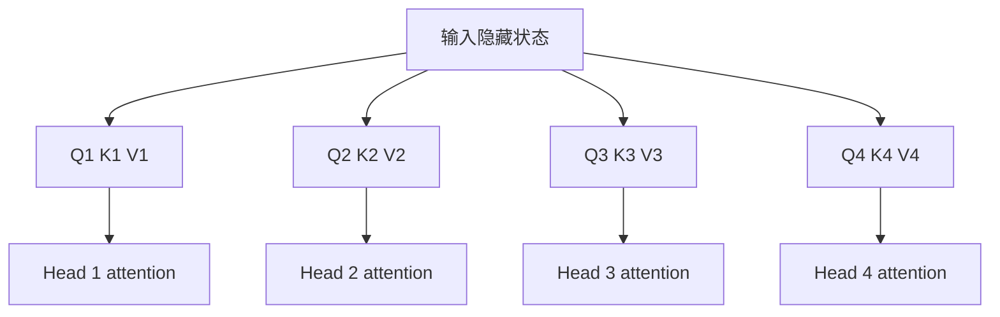
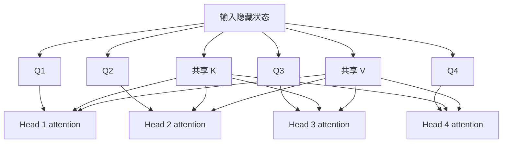
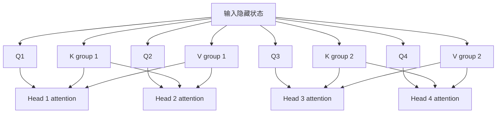
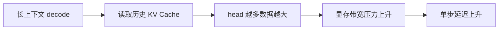

<KnowledgeMap current-module="llm" current-article="第6.7章 GQA MQA 与推理带宽权衡实战" />

<ArticleHeader
  module="语言模型基础"
  :tags="['工程', '推理', '核心']"
  reading-time="14 分钟"
  prerequisite="建议先读第6章、第6.5章 KV Cache 与自回归推理实战"
  summary="这一章专门解决推理优化里的一个高频问题：为什么模型会从传统多头注意力走向 MQA 和 GQA，它们到底节省了什么，牺牲了什么，以及这些变化为什么会直接影响长上下文推理成本。"
/>

# 第6.7章 GQA MQA 与推理带宽权衡实战

当大家第一次学 `Multi-Head Attention` 时，通常会形成一个印象：

`每个 head 都有自己独立的 Q、K、V，这样表达能力最强`

这个理解没有错。  
但一旦模型进入真实推理场景，另一个问题会突然变得非常现实：

- head 越多，KV Cache 越大
- cache 越大，显存和带宽压力越重
- 上下文越长，这个问题越严重

于是现代模型开始出现一条很重要的工程演化线：

- `MHA`
- `MQA`
- `GQA`

这一章就是把这条线真正讲透。

## 这一章解决什么

我们聚焦四件事：

1. MHA、MQA、GQA 在结构上到底差在哪里
2. 它们对 KV Cache 和带宽的影响是什么
3. 为什么这不是单纯的“更快”问题，而是质量与成本权衡
4. 为什么它们和长上下文、Agent 系统也直接相关

## 先回到 MHA

传统 `Multi-Head Attention` 的直觉是：

- 每个 query head 都有自己对应的 key head
- 每个 query head 都有自己对应的 value head

这意味着不同 head 可以学到不同的注意力模式：

- 有的关注局部语法
- 有的关注长距离依赖
- 有的关注实体关系

所以从表达能力视角看，MHA 很自然也很强。

## 但推理阶段的问题在哪

问题不在训练时“能不能学会”，而在推理时“能不能扛得住”。

因为每生成一个 token，都要把每层每个 head 的 `K` 和 `V` 存进 cache。  
如果 head 数很多，cache 就会膨胀得很快。

这带来的不是一个抽象问题，而是非常具体的系统压力：

- 显存占用增大
- 读写 cache 的带宽压力增大
- 长上下文下单步 decode 变慢

## 一张 MHA 的直觉图



这张图背后的隐含事实是：

`每个 head 都保留自己的一整套 KV`

## MQA 在改什么

MQA 的核心变化可以一句话概括：

`多个 query head 共享同一组 K 和 V`

注意不是所有东西都共享，而是：

- `Q` 仍然可以是多头
- `K` 和 `V` 变成共享

这样做的工程价值非常直接：

- cache 大小明显下降
- 读写带宽更友好
- 长上下文推理更容易做大

## 一张 MQA 的结构图



这里最值得抓住的一点是：

`query 仍然是多视角的，但被查询的索引和内容载体变少了`

## MQA 为什么会让系统更轻

因为 KV Cache 的增长，和 `K/V head` 数量强相关。  
一旦从“每个 Q head 都有一套 K/V”变成“所有 Q head 共用一套 K/V”，缓存和带宽压力都会明显下降。

这对推理服务来说意义极大，特别是在：

- batch 变大时
- context 很长时
- 模型层数较深时

## 但为什么不是所有模型都直接全用 MQA

因为它也有代价。

从表达能力角度看，多个 query head 如果只共用一组 K/V，那么“不同 head 能看到的索引空间”就变得更相似。

这可能带来：

- 表达自由度下降
- 某些复杂模式建模能力变弱
- 质量上有潜在损失

所以 MQA 并不是一个没有代价的优化，而是典型的工程 trade-off。

## GQA 在解决什么

GQA 可以理解成 MHA 和 MQA 之间的折中方案。

它的核心思路是：

`不是所有 Q head 都共用一组 K/V，而是按组共享`

比如：

- 8 个 Q head
- 分成 2 组或 4 组
- 每组共享一套 K/V

这样做的好处是：

- 比 MHA 更省 cache
- 比 MQA 更保留 head 差异

所以 GQA 很像一个“中间地带”。

## 一张 GQA 的结构图



这张图最直观地说明了 GQA 的折中：

- 不是每个 head 都独立
- 也不是所有 head 都完全共享

## 三者怎么一眼区分

可以先用一个简单表格抓住：

| 方案 | Q head | K/V head | 直觉特点 |
| --- | --- | --- | --- |
| MHA | 多头 | 多头 | 表达强，cache 大 |
| MQA | 多头 | 单组共享 | cache 最省，质量风险更大 |
| GQA | 多头 | 分组共享 | 在质量与效率间折中 |

## 为什么这个问题和“带宽”强相关

很多人第一次听这个话题，会只盯着“显存占用”。  
但在真实推理系统里，另一个同样重要的问题是：

`每一步 decode 都要从 cache 里读大量历史 K/V`

这不只是“存得下”问题，还包括：

- 读出来要花时间
- 在不同层之间搬运要花时间
- 读写显存本身就可能成为瓶颈

所以 MQA 和 GQA 的价值，不只是“少占一点”，而是：

`减少每一步推理时需要处理和搬运的 KV 数据量`

## 一张带宽压力图



## 一个最小 shape 例子

假设：

- batch = 1
- seq_len = 4096
- num_query_heads = 32
- head_dim = 128

如果是 MHA，那么某层的 KV cache 近似要按 32 组 head 存。

如果是 MQA，那么某层的 KV cache 只需要 1 组 K/V。

如果是 GQA，假设分成 8 组，那么只需要存 8 组。

你不必现在去背精确字节数，也能立刻看出增长趋势：

`KV 组数从 32 变成 8 甚至 1，cache 和带宽压力都会明显下降`

## 一个概念化伪代码

```python
def kv_group_count(mode, num_query_heads, num_kv_groups=None):
    if mode == "mha":
        return num_query_heads
    if mode == "mqa":
        return 1
    if mode == "gqa":
        return num_kv_groups
    raise ValueError("unknown mode")
```

这段代码虽然简单，但它把核心权衡直接暴露出来了：

- KV 组数越多，表达自由度越高
- KV 组数越少，cache 和带宽越省

## 为什么现代大模型越来越喜欢 GQA

因为它提供了一个比较现实的平衡点。

如果完全坚持 MHA：

- 长上下文推理成本很重
- 服务化部署压力更大

如果直接全部压成 MQA：

- 某些模型质量可能下降太明显

GQA 则允许你在两边之间调节：

- 保留一部分 head 差异
- 同时显著降低 KV 组数

这就是为什么很多现代模型会采用 GQA，而不是只在 MHA 和 MQA 之间二选一。

## 它和 KV Cache 的关系怎么理解

KV Cache 解决的是：

`历史 K/V 不要重复算`

MQA / GQA 解决的是：

`就算要缓存历史 K/V，也尽量让缓存结构更轻`

所以两者不是替代关系，而是叠加关系：

- 先用 cache 避免重复计算
- 再通过 MQA 或 GQA 控制 cache 的规模和带宽开销

## 它和长上下文的关系为什么直接

因为上下文一长，历史 token 数量就会迅速上升。  
此时每层每步要处理的 KV 数据会越来越多。

于是：

- RoPE 关系到长位置能否表达
- KV Cache 关系到长上下文是否算得动
- MQA / GQA 关系到长上下文是否还能保持合理吞吐

这三件事加在一起，才是现代长上下文推理真正的工程底层。

## 这和 Agent 系统又有什么关系

Agent 系统经常会：

- 拼长轨迹
- 保留多轮工具结果
- 处理大仓库或长文档
- 在同一会话里生成很多 token

这会让推理成本问题很快从“模型内部细节”变成“产品级问题”。

理解 MQA / GQA 之后，你会更容易明白：

- 为什么长任务系统很在意上下文控制
- 为什么不是所有信息都该直接塞进模型
- 为什么高质量系统往往同时依赖摘要、记忆、RAG 和上下文治理

## 初学者最容易误解的 5 个点

### 1. 以为 MQA / GQA 只是训练技巧

它们更直接影响的是推理阶段的 cache 和带宽成本。

### 2. 以为 MQA 一定更好

它通常更省，但不代表所有质量指标都更好。

### 3. 以为 GQA 只是名字不同

GQA 的关键是“分组共享”，它是真正的结构折中。

### 4. 以为长上下文问题只靠位置编码就能解决

位置编码只是一部分，KV 结构和带宽也同样关键。

### 5. 以为这些底层机制和上层 Agent 无关

恰恰相反，它们决定了长任务系统的真实成本边界。

## 本节总结

- MHA 表达能力强，但 KV Cache 和带宽压力也最大
- MQA 让所有 query head 共享一组 K/V，最省 cache，但质量风险更高
- GQA 通过分组共享在质量与效率之间折中
- 现代模型采用这些结构，不只是为了学术优雅，而是为了让长上下文推理更可部署
- 理解这条演化线，有助于你更理性地看待长上下文和 Agent 系统成本

## 下一步

- 回到 [第6章 训练、推理与现代 Transformer 演化](./chapter-06-training-inference-and-evolution)，把这一页作为 GQA 和推理优化部分的展开理解
- 继续阅读 [第6.5章 KV Cache 与自回归推理实战](./chapter-06b-kv-cache-and-autoregressive-decoding)，把 cache 机制和 KV 组数控制一起连起来

## 参考来源

- Ainslie et al. (2023), *GQA: Training Generalized Multi-Query Transformer Models from Multi-Head Checkpoints*  
  https://arxiv.org/abs/2305.13245
- Shazeer (2019), *Fast Transformer Decoding: One Write-Head is All You Need*  
  https://arxiv.org/abs/1911.02150
- Hugging Face Transformers 文档，Caching  
  https://huggingface.co/docs/transformers/v4.55.4/en/cache_explanation
- transformers.run，Transformer 系列中文教程首页  
  https://transformers.run/
