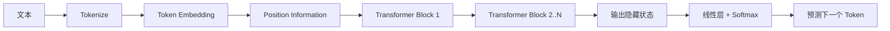
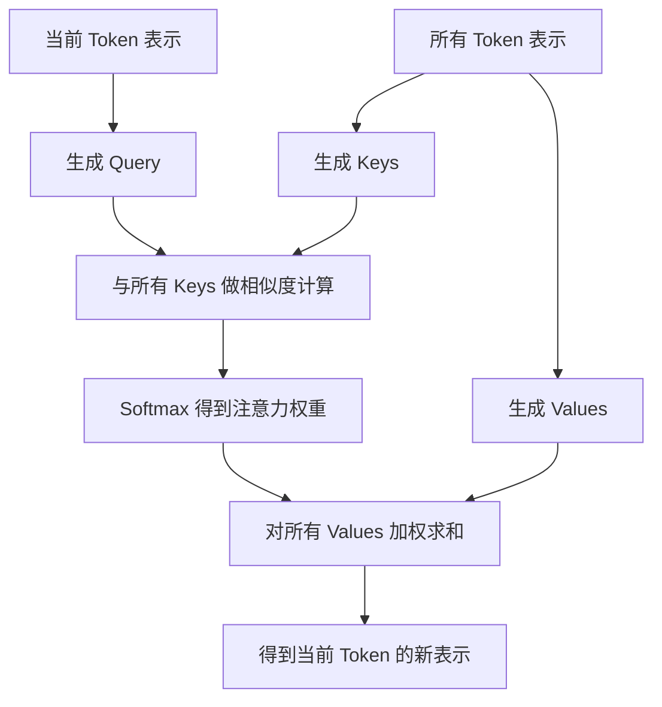
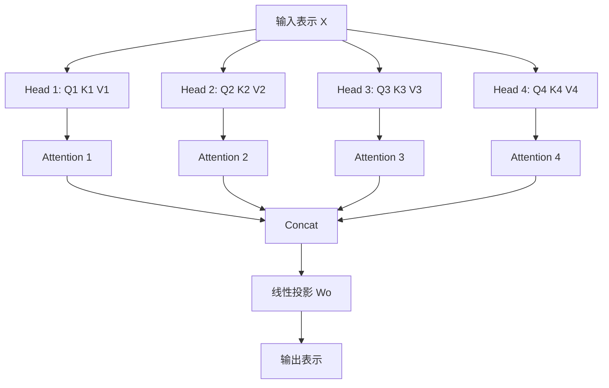
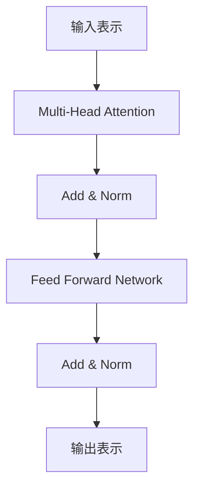
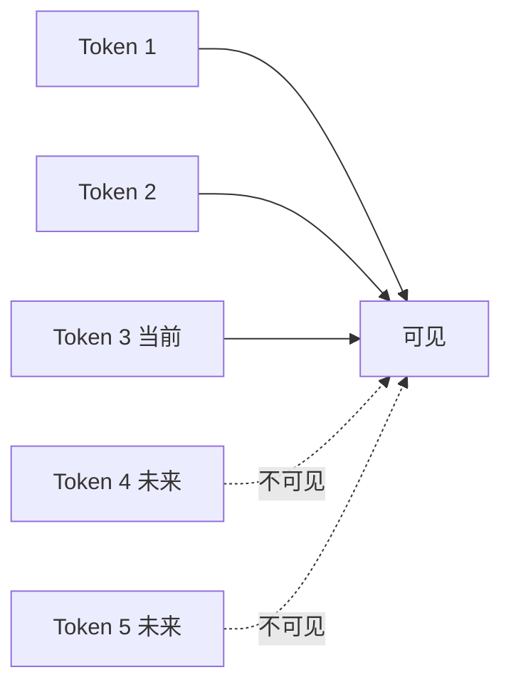

<KnowledgeMap current-module="llm" current-article="Transformer、Attention 与 QKV" />

# Transformer、Attention 与 QKV：现代 LLM 为什么这样工作

<ArticleHeader
  module="语言模型基础"
  :tags="['原理']"
  reading-time="18 分钟"
  prerequisite="已理解 LLM 的概率建模视角与上下文窗口"
  summary="Transformer 之所以成为现代 LLM 的基础，不只是因为它更大，而是因为它用 self-attention 让每个 token 在当前上下文里动态读取其他 token。理解 Q、K、V、注意力权重、多头注意力和残差结构，才能真正理解模型内部发生了什么。"
/>

## 为什么要补这一层原理

前两篇已经讲清了两件事：

- LLM 本质上是下一个 token 预测系统
- 上下文窗口决定了模型在一次调用里能看到什么

但如果继续往下追问，就会来到一个关键问题：

`模型到底是怎样利用上下文的？`

答案的核心，就在 Transformer 和 attention。

这不是一篇研究论文导读，而是一篇面向工程读者的“底层机制课”。  
你不需要记住所有公式，但最好真正理解：

- 为什么 token 之间需要相互“看”
- 为什么要拆成 Q、K、V
- 为什么要有多头注意力
- 为什么长上下文会变贵

<div class="key-insight">
  <div class="key-insight-label">核心洞察</div>
  <p class="key-insight-text">
    Transformer 最关键的创新，不是让模型“记住更多知识”，而是让每个 token 都能在当前上下文里动态决定应该参考哪些其他 token，以及参考多少。
  </p>
</div>

## 先看整体流水线



你可以把它粗略理解成：

1. 先把文本切成 token
2. 把 token 变成向量
3. 给向量加入位置信息
4. 反复经过多层 Transformer block
5. 最终输出下一 token 的概率分布

其中真正决定“当前 token 如何读取其他 token”的，就是 attention。

## 先解决一个直觉问题：为什么要有 Attention

如果模型只是把一句话中的 token 一个接一个地顺序处理，会遇到几个问题：

- 长距离依赖难处理
- 很难并行计算
- 某个词要理解自己时，可能需要参考很远处的信息

例如这句话：

> 小王把服务器重启后，它终于恢复了。

要理解“它”指的是什么，模型往往要回头看前面多个词。  
attention 做的事情，就是让当前 token 在理解自己时，能去“看”上下文中哪些 token 更相关。

## Self-Attention 到底在做什么

一个直观定义是：

`Self-Attention = 序列中的每个 token，都根据当前任务语境，对其他 token 进行一次相关性加权读取。`

重点有两层：

- `self`：说明读取的对象来自同一个序列
- `attention`：说明不是平均读取，而是有轻重权重

也就是说，模型不会把上下文中所有 token 一视同仁，而是会动态判断：

- 谁更重要
- 谁更相关
- 谁此刻应该被重点参考

## 一张图看懂单层 Self-Attention



这张图里最重要的一句可以记成：

`用 Query 找相关 Key，再把对应 Value 按权重取回来。`

## Q、K、V 到底是什么

这是最常见、也最容易被讲得过于玄学的地方。

一个实用理解是：

- `Query`：当前 token 正在寻找什么信息
- `Key`：每个 token 能提供什么线索
- `Value`：每个 token 真正要被取走的信息内容

很多教程会说：

- Query 像搜索词
- Key 像标签
- Value 像正文内容

这个比喻并不完美，但足够帮助入门。

## 为什么不能只用一个向量，非要拆成 Q、K、V

这是理解 attention 的关键。

如果每个 token 只有一个统一向量，那么它既要负责：

- 表示“我在找什么”
- 表示“我能提供什么”
- 表示“真正要被传递什么内容”

这三种职责会混在一起。

而 Transformer 的做法是：  
先把 token embedding 经过三组不同线性投影，分别变成 Q、K、V。

这样一来，一个 token 就能同时有三种“角色”：

- 作为查询者时看 Query
- 作为被匹配对象时看 Key
- 作为被聚合内容时看 Value

这就是为什么 QKV 不是“多此一举的数学技巧”，而是职责分离。

## QKV 从哪里来

它们并不是人工写死的，而是从输入向量通过可学习矩阵投影出来的：

```text
Q = X * Wq
K = X * Wk
V = X * Wv
```

这里：

- `X` 是 token 的当前表示
- `Wq`、`Wk`、`Wv` 是训练中学出来的参数矩阵

也就是说，同一个 token 在不同层里，会产生不同的 Q、K、V 表示。

## 核心计算公式其实在做什么

经典 scaled dot-product attention 常写成：

```text
Attention(Q, K, V) = softmax(QK^T / sqrt(d_k)) V
```

不要被公式吓到，可以按 4 步理解：

1. `QK^T`
   - 计算当前 query 和各个 key 的相关性分数
2. `/ sqrt(d_k)`
   - 防止数值过大，避免 softmax 过早饱和
3. `softmax`
   - 把分数变成权重分布
4. `乘 V`
   - 用这些权重对 values 做加权求和

这 4 步连起来，本质就是：

`找到相关位置 -> 决定关注多少 -> 取回相关信息`

## 一张 QKV 计算示意图

```mermaid
flowchart LR
    A[输入表示 X] --> B[线性投影 Wq]
    A --> C[线性投影 Wk]
    A --> D[线性投影 Wv]
    B --> E[Q]
    C --> F[K]
    D --> G[V]
    E --> H[QK^T]
    F --> H
    H --> I[除以 sqrt(d_k)]
    I --> J[Softmax]
    J --> K[注意力权重]
    K --> L[加权聚合 V]
    G --> L
    L --> M[新的上下文表示]
```

## 为什么要除以 `sqrt(d_k)`

这一步很多人会背公式，但不明白目的。

直觉上看，如果向量维度很大，Q 和 K 的点积值就容易越来越大。  
而 softmax 一旦输入差距过大，就会非常尖锐：

- 某个位置接近 1
- 其他位置接近 0

这会让训练不稳定，也会让梯度不好传。  
所以要用 `sqrt(d_k)` 做缩放，让分数落在更合理的范围里。

## Self-Attention 输出的到底是什么

很多人以为 attention 输出的是“某个 token 的答案”，其实不是。

它输出的是：

`当前 token 在读取了其他 token 后，得到的新表示`

也就是说，attention 更像是在持续重写 token 的表示。  
经过多层之后，token 的向量会越来越带有上下文信息。

这就是为什么同一个词在不同上下文里，会有不同的内部表示。

## 多头注意力又是干什么的

如果只有一个 attention 头，那么模型在每一层里只能形成一种关系视角。  
但现实语言里的关系远不止一种，例如：

- 语法依赖
- 指代关系
- 时间关系
- 主题关联
- 格式结构

多头注意力的思路是：

- 把表示空间切成多个子空间
- 每个 head 各自学习一套 Q/K/V 投影
- 不同 head 关注不同关系模式
- 最后把多个 head 的结果拼接起来

## 一张多头注意力图



可以把它理解成：

`不是让一个人看完整个句子，而是让多个观察者分别从不同角度看，再把观察结果合起来。`

## Transformer Block 不只有 Attention

一层完整的 Transformer block 通常不只包括 attention，还包括：

- attention 子层
- 残差连接
- layer normalization
- 前馈网络 FFN
- 再一次残差和归一化

可以简化成下面这样：



## FFN 在做什么

很多人只关注 attention，忽略 FFN。

FFN 可以理解成：

- 对每个位置单独做非线性变换
- 让表示在更高维空间里被重新加工

attention 负责“在 token 之间交换信息”，  
FFN 更像负责“对单个 token 的表示做局部加工”。

两者缺一不可。

## 残差和 LayerNorm 为什么重要

如果没有残差连接和归一化，深层网络很难稳定训练。  
它们的作用可以粗略理解为：

- 残差：保留原始信息，避免每层都把旧信息洗掉
- LayerNorm：让数值分布更稳定，帮助训练收敛

很多工程读者第一次理解 Transformer 时，只记住了 attention，忽略了这些“训练稳定器”。  
但在真实模型里，它们同样关键。

## 位置问题：Attention 自己其实不懂顺序

这是另一个关键点。

self-attention 本身只是在处理一组向量关系，它并不会天然知道：

- 哪个 token 在前
- 哪个 token 在后

所以模型还必须加入位置信息。  
早期 Transformer 用 positional encoding，现代 LLM 则常见：

- learned position embedding
- RoPE
- ALiBi 等变体

工程上你只需要抓住一个结论：

`如果没有位置信息，Transformer 无法可靠区分顺序。`

## Decoder-only LLM 和这里的关系

现代聊天模型大多是 decoder-only Transformer。

这意味着它在生成时通常使用 `causal attention`，也就是：

- 当前 token 只能看自己和前面的 token
- 不能看未来 token

否则它就相当于提前偷看答案了。

## 一张因果注意力示意图



所以在生成任务里，attention 不是“无限互看”，而是“带掩码地看过去”。

## 这和上下文窗口、长文本成本有什么关系

attention 最大的工程代价之一是：

`序列越长，token 两两之间的关系计算越贵。`

粗略理解，长度为 `n` 的序列，attention 相关计算常常带有接近 `n^2` 的关系规模。

这直接带来几个工程后果：

- 长上下文更贵
- 推理延迟更高
- 显存开销更大
- 超长上下文需要专门优化

这就是为什么上下文窗口不是“白送的配置项”，而是成本与能力的平衡。

## 再补一个工程概念：KV Cache

在自回归生成里，每产生一个新 token，都需要让当前 token 去看前面的上下文。  
如果每次都把所有旧 token 的 K 和 V 重新算一遍，成本会非常高。

所以推理系统通常会缓存历史 token 的 K/V，这就是 `KV Cache`。

它的作用非常实用：

- 历史 K/V 不重复计算
- 新 token 只算自己的 Q/K/V
- 明显降低逐 token 生成的重复开销

工程上很多“长上下文变慢”的体验，都和 attention 计算与 KV cache 直接相关。

## 一个最小代码示例

下面这段代码不是工业实现，只是帮助你理解 attention 的最小流程：

```python
import math
import numpy as np

X = np.array([
    [1.0, 0.0, 1.0],
    [0.0, 1.0, 0.0],
    [1.0, 1.0, 0.0],
])

Wq = np.eye(3)
Wk = np.eye(3)
Wv = np.eye(3)

Q = X @ Wq
K = X @ Wk
V = X @ Wv

scores = Q @ K.T / math.sqrt(K.shape[-1])
weights = np.exp(scores) / np.exp(scores).sum(axis=-1, keepdims=True)
output = weights @ V

print(output)
```

这段代码对应的正是：

- 先投影出 Q/K/V
- 再算相似度
- 再做 softmax
- 再加权取回 V

## 常见误解

### 误解一：QKV 是数据库检索

不是。  
它更像当前层里的可学习相似度匹配机制，而不是外部知识库检索。

### 误解二：attention 权重就是“模型解释性真相”

attention heatmap 有启发意义，但不能简单等同为完整因果解释。

### 误解三：Transformer 只靠 attention

不对。  
attention 很关键，但 FFN、残差、归一化、位置编码同样不可缺。

### 误解四：窗口大只是存更多 token

窗口变大不仅是“能塞更多文本”，还意味着 attention 成本、KV cache、系统吞吐都会变化。

## 一个实用判断框架

当你以后再遇到模型工程问题时，可以先问：

1. 这是上下文没给够，还是 attention 无法高效利用
2. 这是长上下文成本问题，还是提示结构问题
3. 这是模型表示能力问题，还是 KV cache / 推理效率问题
4. 这是框架问题，还是底层 Transformer 约束导致的后果

这类判断会让你不再把所有问题都归结为“模型不够聪明”。

## 本节总结

- Transformer 的核心是用 self-attention 让 token 在上下文中动态读取其他 token
- Q、K、V 不是装饰性符号，而是把“找什么、提供什么、传递什么”三种职责拆开
- 多头注意力让模型能同时学习多种关系模式
- 完整 Transformer block 还依赖 FFN、残差、LayerNorm 和位置信息
- 长上下文成本、causal mask、KV cache 都和 attention 机制直接相关

## 下一步

- 继续阅读 [Tool Use 完整机制](../02-agent-core/tool-use)，从模型内部走到系统外部
- 或回到 [上下文窗口](./context-window)，重新理解为什么窗口设计会直接影响模型表现
