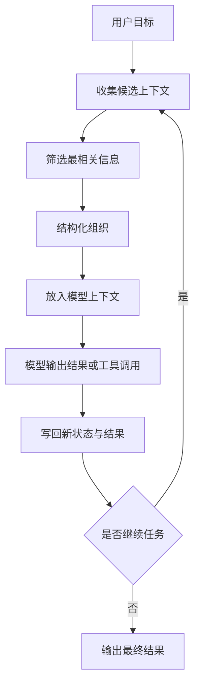
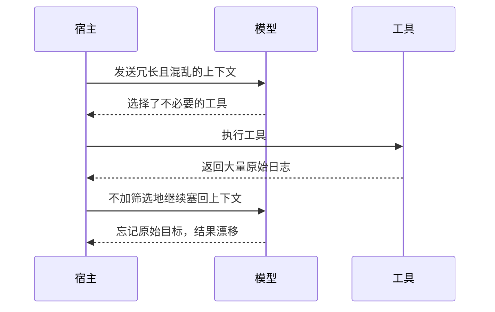

<KnowledgeMap current-module="agent" current-article="Context Engineering" />

# Context Engineering：比 Prompt 工程更深的一层

<ArticleHeader
  module="Agent 核心机制"
  :tags="['核心']"
  reading-time="18 分钟"
  prerequisite="理解上下文窗口和 Tool Use"
  summary="Prompt 只是上下文中的一部分。真正影响系统表现的，是整个上下文空间的设计：什么信息进入、以什么结构进入、放在什么位置、如何被压缩和更新。"
/>

## 为什么只谈 Prompt 不够

现实中的 Agent 系统几乎从不只有一句 prompt。

模型实际看到的是 system prompt、历史对话、工具调用结果、检索内容和任务状态的组合体。

所以，真正影响系统表现的，往往不是最后那一句“请帮我完成”，而是整段上下文空间被如何组织。

过去大家更熟悉 `Prompt Engineering`，因为在单轮问答时代，优化一段提示词常常就能带来明显变化。  
但一旦系统进入多轮推理、工具调用、检索和状态更新阶段，问题就不再只是“这句话怎么写更好”，而是：

- 哪些信息应该进来
- 哪些信息应该出去
- 哪些信息应该被压缩
- 哪些信息必须保留原文

这时你面对的就已经是上下文工程，而不是单点提示词打磨。

## Context Engineering 关心什么

- 什么应该进入上下文
- 信息如何组织和结构化
- 信息应该放在什么位置
- 当窗口有限时，什么应该被保留或舍弃

这四个问题听起来简单，但几乎覆盖了 Agent 系统中最关键的工程判断。

## 先看一张流程图



这张图说明了一件很重要的事：

`上下文不是一次性拼好就结束，而是每一轮都在被重新构造。`

## Prompt Engineering 和 Context Engineering 的差别

你可以把两者粗略理解成不同层级的工作：

- `Prompt Engineering`：优化一段提示词本身
- `Context Engineering`：设计模型在某一时刻看到的全部现实

Prompt 仍然重要，但它只是 Context 的一部分。

如果上下文本身就混乱，单独雕一段 prompt 往往救不了系统。

## 一个更实用的心智模型

你可以把模型想象成被放进一个“临时工作台”的执行者。  
Context Engineering 的工作，就是不断决定这个工作台上应该摆什么。

这个工作台上的典型元素包括：

- 任务目标
- 角色和规则
- 历史对话
- 当前阶段状态
- 工具返回结果
- 检索到的外部材料
- 已验证的事实

如果工作台上摆满无关内容，模型就会像人在杂乱桌面上工作一样，效率下降、注意力漂移、容易犯错。

## 为什么它更像真正的工程问题

因为这不只是文案优化，而是系统设计。

你要同时考虑：

- 哪些信息应该进入窗口
- 哪些信息必须结构化
- 哪些历史应该被压缩
- 哪些工具结果应该保留
- 哪些内容会形成噪声

这些决定直接影响成本、质量和稳定性。

Anthropic 在 2025 年关于 context engineering 的工程文章里，特别强调了 context 是有限资源，长对话里需要通过压缩、分工和子任务拆解来控制“注意力预算”；这和我们这里讲的“最小充分上下文”是同一个方向。[Effective context engineering for AI agents](https://www.anthropic.com/engineering/effective-context-engineering-for-ai-agents)

## 一个简单对比

下面这两个上下文，信息量看起来差不多，但可用性差别很大。

```python
bad_context = """
用户之前问过很多问题。
这里有一段旧日志。
还有一些不确定的想法。
现在请帮我继续处理。
"""

good_context = """
<task>分析服务启动失败原因</task>
<constraints>只基于已给出的日志，不要猜测</constraints>
<evidence>
- 端口 8080 已被占用
- 进程重试 3 次失败
</evidence>
"""

print(bad_context)
print(good_context)
```

重点不是 XML 语法本身，而是结构化表达带来的可读性和可推理性。

## 一个坏上下文通常怎么把系统拖垮

下面这个时序图很适合解释为什么很多系统“模型不差，但结果总不稳”：



这类问题很多时候不是单次 prompt 写错，而是系统没有管理好每一轮上下文增量。

## Context Engineering 最常见的几个动作

### 1. 选择

决定什么信息应该进入上下文。

### 2. 结构化

用清晰格式区分任务、约束、背景、证据和工具结果。

### 3. 压缩

对历史内容做摘要，而不是无差别累积。

### 4. 排序

让最关键的信息在更容易被模型注意的位置出现。

### 5. 更新

随着任务推进，动态替换、移除或注入新的上下文内容。

## 五个动作分别在解决什么

如果进一步展开，这五个动作其实对应着五种很具体的工程工作。

### 选择：避免“什么都想给模型看”

选择的目标不是完整，而是相关。  
在一个代码 Agent 场景里，你通常不需要把整个仓库一次性塞进去，而是应该优先放：

- 当前任务目标
- 相关报错
- 关键文件片段
- 上一轮验证结果

### 结构化：让模型区分不同信息角色

结构化的价值在于减少语义混杂。  
例如把内容分成：

- `task`
- `constraints`
- `evidence`
- `tool_results`
- `next_step`

模型会更容易知道每块内容在推理里扮演什么角色。

### 压缩：保留信息密度，而不是保留原文长度

上下文压缩不是“删字”，而是把已完成的历史变成高密度状态。  
一个常见方式是把十几轮历史对话压成：

- 已确认事实
- 已尝试动作
- 当前待解决问题
- 不再需要重复读取的背景

### 排序：把真正重要的信号放到前面

同样的信息，放置位置也会影响模型关注度。  
通常越该优先约束模型的内容，越应该更靠前，例如：

- 核心任务目标
- 明确禁止项
- 当前必须基于的证据

### 更新：让上下文随着任务阶段切换

任务推进后，旧上下文不一定还适合继续保留。  
比如：

- 已解决的子问题可以摘要
- 失败路径可以只保留结论
- 新的工具结果应该进入当前证据区

## 一个更完整的脑图

```mermaid
flowchart TD
    A[Context Engineering]
    A --> B[输入选择]
    A --> C[结构组织]
    A --> D[窗口管理]
    A --> E[动态更新]
    A --> F[评估指标]
    B --> B1[用户目标]
    B --> B2[历史消息]
    B --> B3[检索内容]
    B --> B4[工具结果]
    B --> B5[运行状态]
    C --> C1[任务]
    C --> C2[约束]
    C --> C3[证据]
    C --> C4[阶段状态]
    C --> C5[输出格式]
    D --> D1[压缩历史]
    D --> D2[删除噪声]
    D --> D3[保留关键事实]
    D --> D4[控制长度]
    E --> E1[注入新结果]
    E --> E2[替换旧状态]
    E --> E3[记录已完成步骤]
    E --> E4[推进下一阶段]
    F --> F1[任务成功率]
    F --> F2[工具重复率]
    F --> F3[成本与延迟]
    F --> F4[结果稳定性]

## 为什么这和后续模块强相关

一旦你理解 Context Engineering，后面很多主题就会自然串起来：

- `Memory`：解决窗口外的信息保留与召回
- `RAG`：解决外部知识如何注入窗口
- `Tool Use`：解决环境信息如何进入推理过程
- `Eval`：判断上下文策略是否真的提升了系统表现

OpenAI 在 2025 年面向 agent 工作流和 eval 的资料里，也反复强调任务定义、输出结构、trace grading 和 prompt optimization 要放在一起做，而不是把上下文问题当成只调 system prompt 的小修小补。[Introducing AgentKit](https://openai.com/index/introducing-agentkit/) [Agents SDK](https://www.openai.com/agent-platform/)

## 常见误区

### 误区一：上下文越完整越好

完整不等于有效。

很多时候你需要的是“与当前任务最相关的最小充分信息”。

### 误区二：上下文是静态的

在真实 Agent 中，上下文应该随着任务推进而变化。

### 误区三：Prompt 写得好，就不需要上下文设计

这通常只适用于非常短、非常简单的任务。

### 误区四：所有信息都应该保留原文

不是。很多历史信息更适合保留成摘要、结论或结构化状态。  
保留原文只有在这些情况下更重要：

- 原始措辞本身会影响判断
- 日志细节可能决定根因
- 你需要模型直接引用原句

## 一个更接近实战的判断标准

如果一个系统频繁出现下面这些问题，往往不是模型不够强，而是上下文工程出了问题：

- 忘记任务边界
- 重复调用工具
- 输出格式漂移
- 中途丢失关键事实
- 被无关信息带偏

## 一个实战例子：排查构建失败

假设用户要求：

> 帮我定位为什么站点构建失败，并修复后验证。

一个糟糕的上下文策略可能是：

- 把全部历史对话、全部日志、多个无关文件一起塞给模型
- 每轮工具输出都原样保留
- 不区分“事实”“猜测”“已完成步骤”

而一个更好的上下文策略通常会长这样：

```text
task:
定位并修复当前构建失败

constraints:
- 不修改无关页面
- 修改后必须重新构建验证

evidence:
- npm run build 在 markdown 渲染阶段报错
- 最近新增了 Mermaid 配置

relevant_files:
- docs/.vitepress/config.mjs
- package.json

completed_steps:
- 已确认依赖安装成功
- 已排除 Node 版本问题
```

这时模型面对的不是“海量材料”，而是“可行动的现场”。

## 怎么判断你的上下文策略是不是变好了

你不必一开始就拥有复杂平台，也可以用一些非常实用的信号来判断：

- 同类任务的成功率是否上升
- 不必要工具调用是否减少
- 模型是否更少忘记约束
- 长任务里是否更少中途漂移
- 每轮平均 token 和延迟是否可控

如果这些指标没有改善，往往说明上下文策略还只是“看上去更整齐”，并没有真正帮助模型。

## 本节总结

- Context Engineering 关心的不是一句 prompt，而是模型在某一轮真正看到的全部现场
- 核心动作通常是选择、结构化、压缩、排序和动态更新
- 上下文越长不一定越好，关键是最小充分、角色清晰、阶段匹配
- 很多所谓“模型不稳定”问题，实质上是上下文策略没有设计好

## 下一步建议

继续进入 [Memory 的四种形态](/03-memory/four-memory-types/)。

因为一旦上下文窗口有限，系统就必须回答另一个问题：窗口外的信息应该如何被保存和召回。

<div class="key-insight">
  <div class="key-insight-label">核心洞察</div>
  <p class="key-insight-text">
    Prompt 是你说的一句话，Context 是模型置身其中的整个现场；工程价值更高的，通常是对现场的设计能力。
  </p>
</div>
