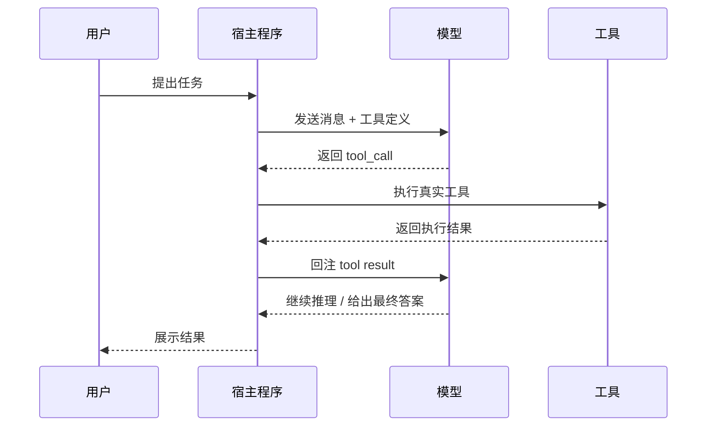
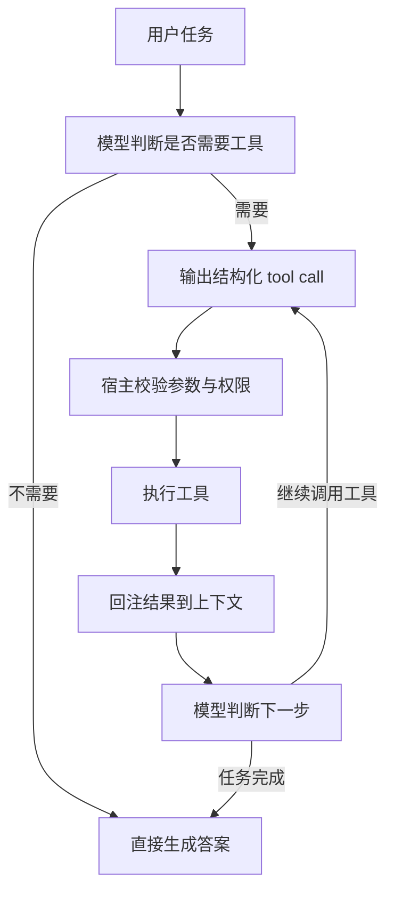
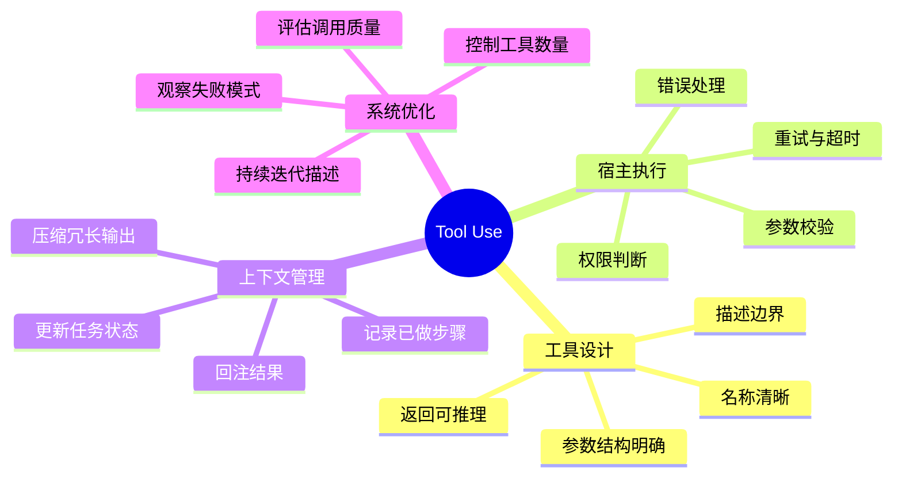

<KnowledgeMap current-module="agent" current-article="Tool Use 完整机制" />

# Tool Use：让模型从会说到会做

<ArticleHeader
  module="Agent 核心机制"
  :tags="['核心']"
  reading-time="18 分钟"
  prerequisite="理解 Agent 的最小闭环"
  summary="模型并不会直接执行函数。真正的 Tool Use 是一条完整链路：模型生成结构化调用意图，宿主程序执行动作，再把结果回注到上下文中。"
/>

## 模型不会真的调用函数

模型只能输出文本或结构化数据。

真正执行函数、发请求、读文件、写文件、访问浏览器的是宿主程序。

这是理解 Tool Use 的第一步：模型负责提出“行动意图”，宿主负责把这个意图变成真实操作。

很多初学者第一次看到 function calling，会误以为模型像程序一样“直接运行函数”。  
这会导致后续一连串误解，比如：

- 以为工具调用成功主要取决于模型智力
- 以为把函数 schema 丢给模型就够了
- 以为工具返回什么格式都无所谓
- 以为工具效果差时，只要继续改 prompt

实际上，Tool Use 的稳定性往往更取决于宿主侧的接口设计、状态回写和错误处理。

## 完整链路

1. 模型判断需要外部行动
2. 模型输出结构化调用请求
3. 宿主程序解析并执行
4. 执行结果重新进入上下文

如果缺少后两步，模型只是“建议你调用某个函数”，还没有真正行动。

## 先看一个完整时序图

下面这个时序图，比“函数调用”这个名字更能说明 Tool Use 的本质。



这个过程里真正“有手有脚”的是宿主，不是模型。

## 为什么 Tool Use 这么关键

因为一旦模型能稳定借助外部工具，它的能力边界会明显扩展。

它不再只是解释、总结和续写，还可以：

- 查询外部数据
- 读取项目文件
- 调用 API
- 运行代码
- 修改环境中的对象

这也是为什么 Tool Use 往往是 Agent 从“能回答”到“能做事”的分水岭。

可以把系统能力粗略理解成两层：

- `语言层能力`：解释、总结、规划、改写
- `行动层能力`：查询、读取、修改、执行、验证

LLM 原生擅长前者，Tool Use 才让它碰到后者。

## Tool Use 的真实职责分工

### 模型负责什么

- 判断是否需要调用工具
- 选择合适工具
- 组织参数
- 根据返回结果决定下一步

### 宿主程序负责什么

- 暴露工具定义
- 校验参数
- 执行真实动作
- 处理错误与权限
- 将结果回注到上下文

把这两个角色分清楚之后，很多系统问题就更容易定位了。

## Tool Use 的闭环到底长什么样

从工程角度看，Tool Use 不只是“一次调用”，而是一个可迭代循环：



真正拉开系统差距的，不是让这条链路“能跑”，而是让它“在复杂任务里仍然稳定收敛”。

## 一个最小示例

下面这个例子用最简单的方式展示“模型请求 -> 宿主执行 -> 返回结果”的结构。

```python
tool_call = {
    "name": "read_file",
    "arguments": {
        "path": "README.md"
    }
}

def run_tool(call: dict) -> str:
    if call["name"] == "read_file":
        path = call["arguments"]["path"]
        return f"已读取文件: {path}"
    raise ValueError("unknown tool")

tool_result = run_tool(tool_call)
print(tool_result)
```

真实 Agent 当然会复杂得多，但链路本质没有变化：

- 模型输出调用请求
- 宿主执行
- 返回结果
- 模型继续判断

## 什么样的任务最适合 Tool Use

不是所有任务都应该调用工具。  
一个非常实用的判断标准是：

- 如果缺的是`外部动作`，优先考虑 Tool Use
- 如果缺的是`外部知识`，优先考虑 RAG
- 如果缺的是`长程状态管理`，优先考虑 Memory
- 如果缺的是`多角色协作`，优先考虑多 Agent

举几个典型例子：

| 任务 | 更像什么问题 | 更合适的能力 |
| --- | --- | --- |
| 读取仓库中的配置文件 | 需要真实访问环境 | Tool Use |
| 回答公司制度问题 | 需要外部知识召回 | RAG |
| 记住用户长期偏好 | 需要跨轮持久化 | Memory |
| 拆解并并行处理复杂任务 | 需要角色分工 | 多 Agent |

这也是为什么“Agent 能不能调用工具”不是一个炫技点，而是一种系统分工能力。

## 为什么工具设计会直接影响效果

Tool Use 的问题往往不在“模不会不会调”，而在工具本身是否容易被正确理解和调用。

常见问题包括：

- 工具职责太大，一次做太多事
- 参数命名模糊
- 错误信息不可读
- 工具有副作用，但没有清晰边界

这些问题都会让模型在推理时更容易误用工具。

## 一个好工具通常长什么样

如果从“给人设计 API”切换到“给模型设计工具”，你会发现评价标准要更强调可推理性。

### 好工具的几个特征

- 名称直接体现动作，例如 `read_file`、`search_docs`
- 输入参数少而明确，避免一个工具承担太多职责
- 描述清楚何时该用、何时不该用
- 返回结构对下一步推理有帮助，而不是只有一堆原始日志
- 错误信息具体到可恢复，而不是只有 `failed`

### 不太好的工具长什么样

- 名称抽象，例如 `process_data`、`handle_task`
- 一个工具同时负责搜索、过滤、写入、汇总
- 参数既多又含糊，字段语义不稳定
- 返回结果冗长混乱，模型很难抓住重点
- 副作用很强，但没有权限边界

很多团队误以为“模型不够聪明”，其实只是工具对模型来说太不友好。

## 工具描述为什么比你想的更重要

工具描述其实承担了三个作用：

1. 告诉模型这个工具解决什么问题
2. 告诉模型什么时候应该调用
3. 告诉模型参数应该怎么组织

例如，下面两种描述的可用性差别会非常大：

```json
{
  "name": "search_docs",
  "description": "搜索文档"
}
```

```json
{
  "name": "search_docs",
  "description": "在当前项目文档中检索与问题最相关的段落。适用于回答项目约定、部署流程、模块说明等问题。不适用于修改文件或执行命令。",
  "parameters": {
    "query": "检索问题，应该是适合搜索的短句",
    "top_k": "返回的文档片段数量，通常取 3 到 5"
  }
}
```

第二种并没有更“华丽”，只是更接近模型做判断时真正需要的信息。

## 常见失败模式

### 模型反复调用同一个工具

通常说明结果没有真正改变它的判断，或者上下文没有清楚记录“已经做过什么”。

### 参数组织错误

通常说明工具描述不够清晰，或者字段设计不适合模型推理。

### 调用成功但系统仍然失败

这往往说明问题不在工具执行，而在结果回注和后续状态更新。

### 工具本身正确，但返回不适合模型继续用

这是实战里非常常见的一类问题。  
例如工具返回一大段未结构化日志，虽然“没有错”，但模型很难从中准确提取下一步所需信号。

### 工具太多，模型不知道选哪个

当你一次性暴露几十个类似工具时，系统会出现：

- 工具选择噪声增加
- 不必要调用变多
- 推理成本上升

很多时候，减少暴露工具数量，比继续补 prompt 更有效。

## 一个更接近真实工程的例子

假设你在做一个代码 Agent，用户说：

> 帮我找出为什么构建失败，并修复后验证。

这时一个更合理的 Tool Use 轨迹通常是：

1. 读取构建日志
2. 搜索相关文件
3. 打开关键代码片段
4. 修改文件
5. 运行构建验证

注意，这里最关键的不是“能调用多少工具”，而是：

- 是否先读取证据，再做修改
- 是否在修改后执行验证
- 是否把每轮结果清楚写回上下文

这也是为什么 Tool Use 的本质更像“行动闭环设计”，而不是“给模型更多按钮”。

## 工程启示

真正稳定的 Tool Use，不是“接上 function calling 接口”就结束了。

你还需要设计：

- 工具粒度
- 参数结构
- 错误处理
- 重试策略
- 权限控制
- 执行结果的记录方式

所以 Tool Use 本质上不是提示词技巧，而是一类接口设计问题。

## 一个脑图：Tool Use 需要同时管什么



## 本节总结

- Tool Use 不是模型直接调用函数，而是模型、宿主和外部环境之间的协作链路
- 影响效果的关键不只在模型，还在工具设计、回注方式和错误恢复
- 好工具要让模型容易判断“什么时候用、怎么用、用完后怎么看结果”
- 在复杂任务里，Tool Use 的核心价值是形成稳定的行动闭环

## 下一步建议

继续阅读 [Context Engineering](./context-engineering)。

因为工具返回结果最终还是要进入上下文，才能真正影响下一轮推理。

<div class="key-insight">
  <div class="key-insight-label">核心洞察</div>
  <p class="key-insight-text">
    Tool Use 的价值不在于模型会调用函数，而在于模型、宿主程序和执行结果之间形成了一个可迭代的行动闭环。
  </p>
</div>
