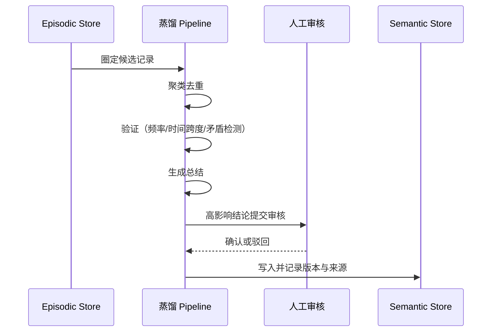

<KnowledgeMap current-module="memory" current-article="从 Episodic 到 Semantic 的蒸馏流程实战" />

# 从一次次经历，到一条稳定规则：记忆蒸馏实战

<ArticleHeader
  module="Memory 体系"
  :tags="['实战']"
  reading-time="15 分钟"
  prerequisite="已读 Memory 的四种形态、记忆的写入时机与遗忘策略"
  summary="four-memory-types.md 提到 Episodic 记忆会被'蒸馏'成 Semantic 记忆，但没有展开具体怎么做。这篇文章给出一条可落地的蒸馏 pipeline：收集、聚类去重、验证、总结、写回，以及配套的版本管理机制。"
/>

<div class="key-insight">
  <div class="key-insight-label">核心洞察</div>
  <p class="key-insight-text">
    蒸馏的本质不是"总结几条经验"，而是把一次性的、可能有偶然性的过程记录，提升为经过反复验证、可以被信任的稳定知识。验证环节比总结环节更容易被忽视，但恰恰是最关键的一步。
  </p>
</div>

## 为什么需要蒸馏

`four-memory-types.md` 举过一个例子：如果一个用户偏好在多次任务里反复出现，就值得从 Episodic 记忆提升为 Semantic 记忆。

但这个过程如果只是"看到重复就直接写成规则"，会有明显风险：

- 少量样本下的"重复"可能只是巧合
- 原始的过程记录里往往混杂了噪声和无关细节，直接总结容易把噪声也一起固化下来
- 没有验证环节，错误的结论一旦被写成 Semantic 记忆，后续会被反复信任，纠错成本远高于当初多验证一次的成本

所以蒸馏不应该是"总结"这一个步骤，而应该是一条完整的流程。

## 蒸馏 Pipeline 的五个环节


### 环节一：收集

从 Episodic 记忆库里，按主题或场景圈定一批候选记录。收集阶段的关键不是"收集所有历史记录"，而是圈定一个有意义的范围——比如"过去一个月里所有和部署失败相关的记录"，而不是不加区分地把整个记忆库都拿来处理。

### 环节二：聚类去重

同一类经历往往会以不同的表述方式出现多次。这一步需要把语义相近的记录聚合到一起，去掉纯粹的重复表述，只保留有代表性的样本。

```python
def cluster_episodes(episodes, threshold=0.8):
    clusters = []
    for ep in episodes:
        matched = find_similar_cluster(ep, clusters, threshold)
        if matched:
            matched.append(ep)
        else:
            clusters.append([ep])
    return clusters
```

这一步的输出，是若干组"讲的是同一件事"的记录簇，而不是一条条孤立的原始记录。

### 环节三：验证

这是整条 pipeline 里最容易被跳过、但最不该被跳过的一步。验证需要回答：

- 这一簇记录的出现频率，是否达到了值得被信任的阈值
- 这些记录之间是否存在矛盾（比如一部分记录支持结论 A，另一部分支持相反的结论）
- 是否有足够的时间跨度，排除"短期内的偶然巧合"

```python
def is_verified(cluster, min_occurrence=3, min_time_span_days=7):
    if len(cluster) < min_occurrence:
        return False
    if time_span(cluster) < min_time_span_days:
        return False
    if has_contradiction(cluster):
        return False
    return True
```

只有通过验证的记录簇，才能进入下一步的总结生成。没有通过验证的，应该继续留在 Episodic 层，而不是被强行提升。

### 环节四：总结生成

对通过验证的记录簇，生成一条抽象化的结论，去掉具体的时间、场景等一次性细节，只保留可以被复用的稳定信息。

例如：

- 原始 Episodic 记录：`"上周三修复部署失败，发现是 base 路径配置遗漏"`、`"这周构建又因为 base 路径问题失败"`、`"上上周同事也遇到过 base 路径遗漏的问题"`
- 蒸馏后的 Semantic 结论：`"该项目部署时必须显式配置 base 路径，这是反复出现的高频故障点"`

总结生成这一步，应该只保留"结论"，原始的时间线和具体过程细节可以作为溯源引用保留在附加信息里，而不是丢弃——这样后续如果需要追溯这条规则的来源，仍然可以找到原始依据。

### 环节五：写回与版本管理

生成的 Semantic 结论写入长期记忆库时，需要注意：

- 如果这条结论和已有的 Semantic 记忆冲突，按照《记忆的写入时机与遗忘策略》里提到的冲突处理原则，触发核实而不是直接覆盖
- 每条 Semantic 记忆都应该带有版本信息和来源引用，方便后续审计这条规则是从哪些原始记录蒸馏出来的
- 对于影响范围较大的结论（比如会影响后续系统行为的规则），建议保留人工审核环节，而不是完全自动化写入

```python
semantic_entry = {
    "content": "该项目部署时必须显式配置 base 路径",
    "version": 1,
    "source_episodes": ["ep_1023", "ep_1045", "ep_1090"],
    "verified_at": "2026-06-01",
    "reviewed_by": "human" ,
}
```

## 一个完整的流程时序



## 常见的坑

- **验证阈值设置过低**：导致偶然出现两三次的偶发情况被误判为稳定规律，写入的 Semantic 记忆反而成为新的噪声来源。
- **总结生成时丢失来源引用**：一旦结论出错，无法追溯是哪些原始记录导致的错误蒸馏，纠错困难。
- **蒸馏是一次性任务，而不是持续过程**：真实系统里，新的 Episodic 记录会持续产生，蒸馏应该是一个周期性运行的流程，而不是只做一次就结束——已经写入的 Semantic 结论，也需要随着新证据的出现被重新验证或修正。

## 本节总结

- 蒸馏是一条包含收集、聚类去重、验证、总结生成、写回五个环节的完整流程，而不是简单的"总结几条经验"
- 验证环节是整条流程里最关键、也最容易被忽视的一步，核心是排除偶然性和矛盾
- 写回时应保留版本信息和原始来源引用，高影响结论建议保留人工审核
- 蒸馏应该是周期性运行的持续过程，而不是一次性任务

## 下一步

至此，Memory 体系的三篇补充内容已经形成闭环：写入与遗忘决定了什么信息值得进入记忆系统，向量库与图存储的选型决定了记忆存放在什么结构里，这篇蒸馏流程则解决了记忆如何从具体经历提升为稳定知识。接下来可以进入 [多 Agent 系统](../04-multi-agent/)，看这些记忆能力如何在多角色协作中被共享和复用。
