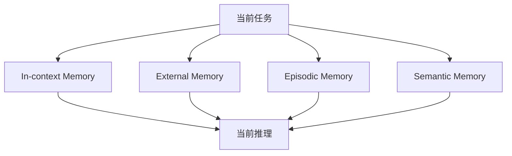
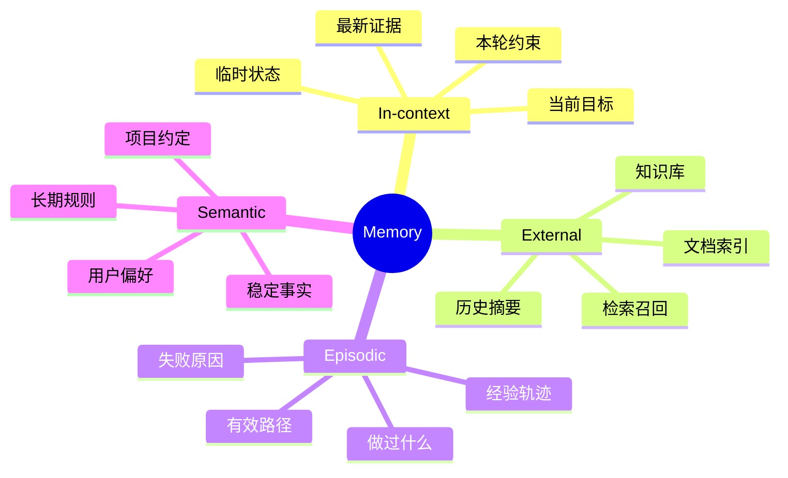
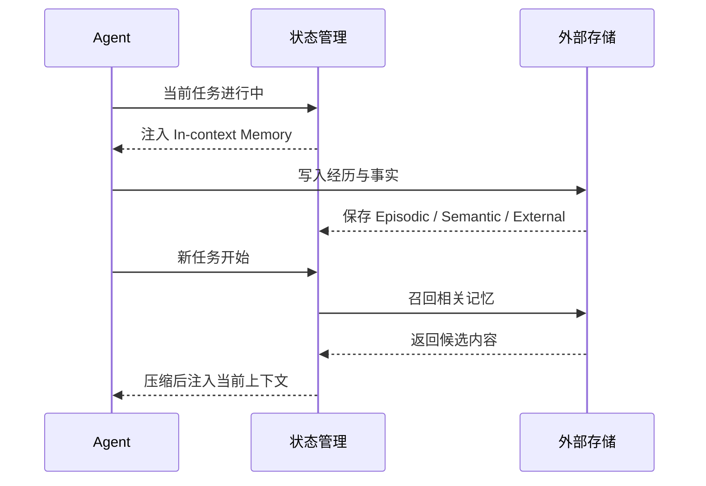

<KnowledgeMap current-module="memory" current-article="Memory 的四种形态" />

# Agent 为什么会失忆：Memory 的四种形态

<ArticleHeader
  module="Memory 体系"
  :tags="['原理']"
  reading-time="17 分钟"
  prerequisite="理解上下文窗口"
  summary="Agent 的记忆不是一块统一的大缓存，而是不同层次的系统设计：工作记忆管当前、外部记忆管可召回信息、情节记忆管经验过程、语义记忆管稳定知识。"
/>

## 四种记忆形态

- In-context Memory：直接放在窗口里的信息
- External Memory：存在模型外部、按需召回的信息
- Episodic Memory：关于做过什么、结果如何的过程记录
- Semantic Memory：相对稳定的事实与规则沉淀

这四种记忆不是学术分类游戏，而是 Agent 架构里非常实用的职责划分。

一旦你不区分它们，就容易把所有信息都丢进一个大池子里，最后得到一个“什么都记了，但什么都记不好”的系统。

## 先看一张总图



这张图的重点不是“有四个框”，而是说明：

`Agent 的记忆不是一个地方，而是多层来源共同影响当前推理。`

## 为什么 Agent 会失忆

因为模型本身天然是无状态的。

每次调用开始时，它能看到什么，取决于你这次给了它什么。

如果没有额外的记忆设计，它并不会天然记住：

- 上一轮做过什么
- 哪一步已经失败过
- 用户的长期偏好
- 哪些事实是稳定成立的

也就是说，模型并不是“记性不好”，而是它本来就没有默认的长期记忆机制。  
所谓 Memory，本质上是宿主系统为了让它在多轮、多任务和跨会话里保持连续性，而补上的一套外部结构。

## In-context Memory：最快，但最贵

这类记忆直接放在当前上下文里。

它的优点是：

- 零额外检索成本
- 与当前任务强绑定
- 最容易立即影响推理

它的缺点也很明显：

- 占用窗口
- 成本高
- 难以跨会话持久化

所以它更像“工作记忆”，适合放当前阶段最关键的少量信息。

典型内容包括：

- 当前任务目标
- 本轮必须遵守的约束
- 刚刚得到的关键工具结果
- 当前阶段的待办状态

这类信息的特点是：对下一轮推理立刻有用，但未必值得长期保存。

## External Memory：能存下来，但不代表能找回来

很多系统把 External Memory 简化成“接个向量库”。

这当然是其中一种形式，但核心问题从来不只是存，而是：

- 存什么
- 怎么切分
- 什么时候写入
- 如何召回
- 如何让结果重新进入上下文

所以 External Memory 真正解决的是“能否把窗口外信息带回来”，而不是简单的“有没有数据库”。

这里最容易被低估的一点是：

`存储能力 != 召回能力`

你可以把几百万条信息都存下来，但如果：

- 切分不合理
- 元数据缺失
- 查询改写很差
- 召回后排序混乱

那么系统仍然会表现得像“记不住”。

## Episodic Memory：记录做过什么

这类记忆更像经验日志。

它关心的不是稳定知识，而是过程本身：

- 在什么任务里
- 做了哪些动作
- 遇到了什么问题
- 最后结果如何

对于 Coding Agent 或自动化系统来说，这类记忆很重要，因为它能帮助系统避免重复试错。

例如在代码场景里，一条高价值的 episodic 记忆可能是：

- “昨天修改部署配置失败，原因是漏掉了基础路径”
- “这个项目里已经验证过 `npm run build` 是最终检查手段”

它们不是一般知识，而是来自系统真实经历的经验。

## Semantic Memory：沉淀稳定知识

这类记忆更接近规则、事实和长期知识。

例如：

- 项目约定
- 稳定的领域事实
- 用户长期偏好
- 被反复验证过的经验总结

和 Episodic Memory 相比，Semantic Memory 更强调“抽象后的结论”，而不是某一次具体过程。

这也是为什么很多系统最终会把一部分 episodic 记忆“蒸馏”成 semantic 记忆。  
例如：

- 一次次任务里都发现用户偏好中文回复
- 多次构建后确认项目部署基础路径固定
- 多轮协作后确认 README 需要在任务完成后同步更新

这些都更适合作为长期稳定规则，而不是只留在某次会话记录里。

## 一张脑图：四类记忆分别在管什么



## 一个简单的结构示例

```python
memory = {
    "in_context": ["当前任务目标", "本轮必须遵守的约束"],
    "external": ["知识库文档", "历史会话摘要"],
    "episodic": ["昨天修改配置失败，因为环境变量缺失"],
    "semantic": ["当前项目默认使用 Python 3.11"]
}

print(memory)
```

这段代码当然不能直接代表真实系统，但它已经揭示了一个关键点：

不同类型的信息，天然就应该放在不同层次的记忆结构里。

## 四种记忆最容易混淆在哪里

### Episodic 和 Semantic 很像，区别到底是什么

这是最容易混淆的一组。

- `Episodic` 更像一次经历
- `Semantic` 更像从多次经历中提炼出来的结论

举个例子：

- Episodic: “上周修复部署问题时，发现是 `base` 配置不对”
- Semantic: “这个项目线上部署必须带 `/ai-guide/` 基础路径”

前者是一次事件，后者是稳定知识。

### In-context 和 External 也容易混

- `In-context` 是已经放到当前窗口里的内容
- `External` 是还在窗口外，需要被召回的内容

所以“同一份文档”有可能同时以两种形态存在：

- 平时存在外部知识库里，是 External
- 被检索后放进当前轮 prompt 里，就变成了 In-context

## 为什么这四类必须分开看

因为它们服务的问题不同：

- `In-context`：解决当前任务正在想什么
- `External`：解决窗口外能否召回相关内容
- `Episodic`：解决系统是否能从经历中学习
- `Semantic`：解决稳定知识如何沉淀和复用

一旦把这些职责混在一起，系统通常会出现两类问题：

- 该短期保留的信息被长期堆积
- 该长期沉淀的知识却没有被结构化保存

## 一个更接近真实系统的写入与召回流程



这个流程里，真正关键的是中间那层状态管理与召回策略，而不是“有没有存储系统”。

## 工程上的真实挑战

真正困难的地方并不是“理解四种名称”，而是做决策：

- 什么内容该写进哪一类记忆
- 什么时机触发写入
- 什么时机触发召回
- 怎样控制噪声和过期信息

这也是为什么 Memory 设计本质上是系统架构问题，而不是简单的“加个检索功能”。

LangChain 在长期记忆相关资料里也强调，设计 memory 之前最好先问三件事：系统要学什么、哪些知识应该长期保留、什么条件下应该触发召回。这和这里的分类思路是高度一致的。[LangMem SDK for agent long-term memory](https://blog.langchain.com/langmem-sdk-launch/)

## 一些很实用的设计判断

### 什么适合写成 Episodic

- 一次任务里的关键尝试
- 明显失败或成功的路径
- 对后续类似任务有借鉴价值的过程

### 什么适合写成 Semantic

- 稳定成立的项目规则
- 用户长期偏好
- 被多次验证的领域事实

### 什么不该轻易写入长期记忆

- 一次性噪声
- 未验证的猜测
- 很快会过期的临时状态
- 与后续任务几乎无关的细节

如果长期记忆里噪声过多，系统并不会变聪明，只会更容易被旧信息带偏。

## 本节总结

- Memory 的四种形态不是概念游戏，而是对不同信息职责的工程划分
- In-context 管当前，External 管窗口外召回，Episodic 管经历，Semantic 管稳定知识
- 同一个信息会随着阶段变化在不同形态之间流动
- 真正困难的不是“存下来”，而是决定写什么、怎么召回、何时清理
## 和后续模块的关系

这一篇解决的是“记忆应该怎样分类”。


接下来 `RAG` 会继续回答另一个更具体的问题：当我们决定把信息放在窗口外之后，如何在需要时把它准确召回。

## 下一步建议

继续阅读 [RAG 原理](./rag-fundamentals)。

<div class="key-insight">
  <div class="key-insight-label">核心洞察</div>
  <p class="key-insight-text">
    Agent 的记忆设计不是存更多信息，而是把不同类型的信息放进不同层次的记忆系统，再在恰当的时候调回来。
  </p>
</div>
