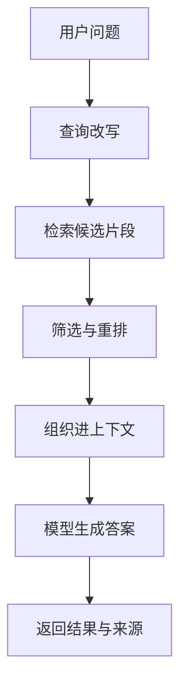
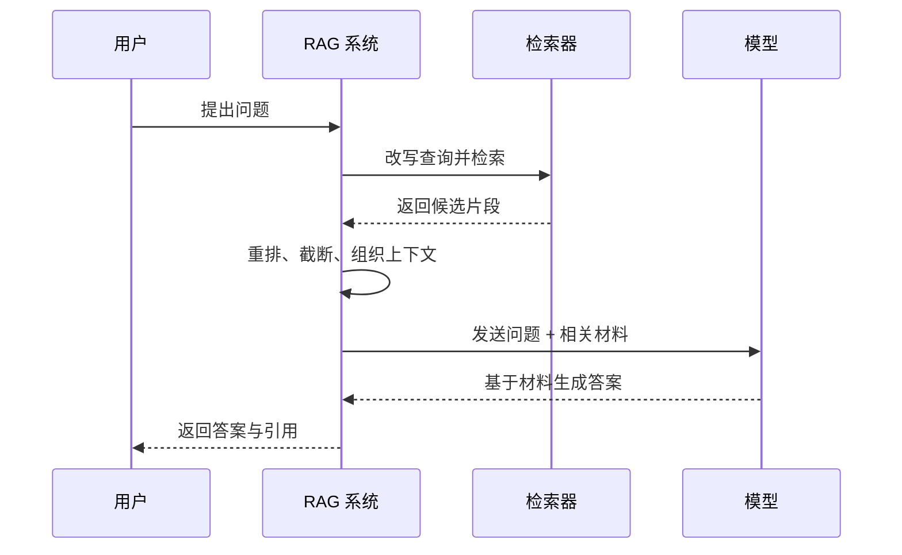
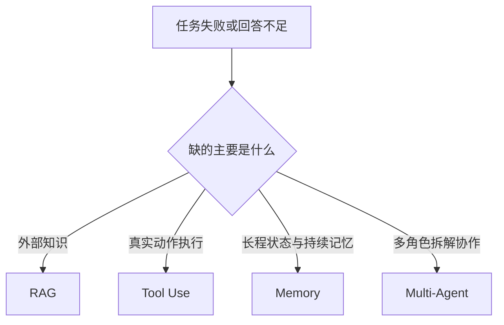

---
title: RAG 原理
description: RAG 的价值不在于接上向量库，而在于让模型得到与当前任务相关的外部信息
module: memory
tags:
  - 原理
---

<KnowledgeMap current-module="memory" current-article="RAG 原理" />

# RAG 不是搜索：它是在为当前任务补充上下文

<ArticleHeader
  module="Memory 体系"
  :tags="['原理']"
  reading-time="18 分钟"
  prerequisite="理解上下文窗口和记忆系统"
  summary="RAG 的核心不是查到更多内容，而是让模型在有限窗口内看到和当前问题最相关、最可靠、最可用的外部信息。"
/>

## 为什么需要 RAG

模型本身的知识有时间边界，也不一定覆盖你的私有数据、项目文档和业务规则。RAG 解决的是如何在调用时把外部信息带进来。

很多人第一次接触 RAG 时，会把它理解成三种东西之一：

- 一个更智能的搜索框
- 一个“让模型联网”的开关
- 一个接上向量数据库就自动变强的插件

这些理解都不够准确。RAG 的真正价值，不在于“多查一点内容”，而在于让模型在生成当前答案之前，先拿到和当前任务最相关的外部信息。

很多团队在做第一个 RAG demo 时，都会经历一个类似过程：

1. 把文档切片
2. 接上向量库
3. 做一次相似度检索
4. 把结果拼进 prompt

这样能很快跑起来，但它只证明了“系统能检索”，还不代表“系统能稳定回答”。

## 真正影响结果的因素

- 查到的内容是否相关
- 内容粒度是否合适
- 注入后的结构是否清晰
- 是否和当前任务形成有效约束

<div class="key-insight">
  <div class="key-insight-label">核心洞察</div>
  <p class="key-insight-text">
    RAG 的本质不是让模型联网，而是在有限上下文里，为当前任务精准补充最需要的外部信息。
  </p>
</div>

## 一张图先看懂 RAG 的最小闭环



这张图里，最容易被低估的不是“检索”本身，而是中间两件事：

- `筛选/重排`
- `组织进上下文`

## 常见误解

### 误解一：RAG 等于搜索

搜索的目标是帮人找到内容，RAG 的目标是帮模型完成任务。两者的差别在于，RAG 不只关心“找到”，还关心：

- 找到的信息是否能直接用于当前推理
- 这些信息进入上下文后是否会干扰模型判断
- 多段信息之间是否彼此一致

### 误解二：只要召回更多内容，效果就更好

召回过多内容会产生三个问题：

- 浪费上下文窗口
- 稀释真正重要的信息
- 让模型更难判断哪些内容应该优先使用

很多时候，`召回 3 段高相关内容` 比 `召回 20 段泛相关内容` 更有效。

### 误解三：用了向量库，就等于做好了 RAG

向量检索只是 RAG 流程里的一个环节。一个真正可用的 RAG 系统，至少还需要考虑：

- 文档怎么切分
- 查询怎么改写
- 召回后怎么重排
- 最终怎样把内容放进 prompt
- 输出时要不要强制引用来源

### 误解四：检索准了，答案就一定对

不一定。  
即使检索命中了正确内容，后续仍然可能失败：

- 模型没有真正使用召回片段
- 片段之间有冲突
- 提示没有把回答约束到材料内
- 上下文里其他噪声把模型带偏

## RAG 的最小链路

从系统角度看，一个最小 RAG 流程通常包含下面 5 步：

1. 用户提出问题
2. 系统把问题改写成更适合检索的查询
3. 检索模块从外部知识源中召回候选内容
4. 系统筛选和组织最相关的内容片段
5. 模型基于这些内容生成答案

可以把它简化理解成：

```text
问题 -> 查询 -> 检索 -> 组织上下文 -> 生成答案
```

真正拉开效果差距的，通常不是“有没有检索”，而是中间这两步：

- 检索出来的内容质量如何
- 组织进上下文的方式是否合理

## 一个更完整的时序图



这条链路说明，RAG 真正是一套“检索前 + 检索后”的系统，而不只是检索器本身。

## 为什么切分策略这么重要

RAG 里的知识通常不是天然适合检索的。文档在进入索引前，往往要先切分成片段。

切得太大，会出现：

- 一次召回带进太多噪声
- 不同主题被混在同一个片段里

切得太小，会出现：

- 信息上下文丢失
- 关键概念被拆散
- 检索到单句但无法支持完整回答

所以切分策略本质上是在做一个平衡：

- 足够小，便于精准召回
- 又足够完整，能支撑当前任务

## 切分、检索、生成三者的关系

很多人会把 RAG 问题都归因到 embedding 或向量库，但实际上三层都可能出问题：

| 层次 | 典型问题 | 结果表现 |
| --- | --- | --- |
| 切分层 | 片段太碎或太大 | 找不到 / 找到但不够用 |
| 检索层 | 查询改写差、排序差 | 命中率低、相关性差 |
| 生成层 | prompt 约束弱、上下文混乱 | 明明召回正确仍答偏 |

所以排查 RAG 效果时，不能只盯着“向量相似度”。

## RAG 真正解决的是什么问题

RAG 最适合解决下面几类问题：

- 知识有时效性，模型参数里没有最新信息
- 数据是私有的，不能靠预训练直接获得
- 答案必须贴合你的项目、文档或业务规则
- 输出需要引用依据，不能只靠模型“自己说得像对”

它不擅长解决的问题也要看清：

- 需要复杂多步规划的任务
- 需要真实外部执行能力的任务
- 本质上不是知识缺失，而是系统动作缺失的问题

如果用户的问题需要的是“去执行某个动作”，那你需要的是 Tool Use；如果缺的是“当前任务相关的信息”，才更接近 RAG。

## 一个实用判断图：什么时候该用 RAG



这张图非常适合避免把所有问题都往 RAG 上硬套。

## 一个简单示例

假设你在做一个公司内部知识助手，用户问：

> 我们报销差旅费时，高铁票和酒店发票分别需要什么材料？

如果只靠模型本身，它可能给出一个“普遍看起来合理”的回答，但不一定符合你公司的制度。

而 RAG 的做法是：

1. 去制度文档中检索“差旅报销”“高铁票”“酒店发票”等相关段落
2. 找到最相关的制度条款
3. 把这些条款作为上下文提供给模型
4. 要求模型基于给定材料生成答案，并尽量引用来源

这时模型的价值，不再是“记住了制度”，而是“读取了制度后，帮你组织成更易用的答案”。

## 一个更贴近工程实践的 RAG 管线

你可以把一个更可靠的 RAG 系统理解成下面 6 个模块：

1. 文档接入与清洗
2. 切分与索引
3. 查询改写
4. 召回与重排
5. 上下文拼装
6. 生成与引用输出

其中最容易在 demo 阶段被忽略的是：

- 文档接入时的清洗质量
- 召回后的重排
- 生成时的来源约束

## 工程上最容易出问题的地方

### 检索正确，但答案仍然不对

这通常不是检索完全失败，而是下面某一层出了问题：

- 召回内容没有被模型真正使用
- 上下文组织顺序不合理
- 提示没有要求模型基于材料回答
- 召回内容之间相互矛盾

### 内容很多，但命中率很低

这通常说明知识库不是“太少”，而是“组织方式不适合当前问题”。常见原因包括：

- 切分方式不对
- 元数据缺失
- 查询改写没有做好
- 检索策略和实际问题类型不匹配

### 用户问的是复合问题

很多业务问题不是一次检索就能解决。例如：

> 先判断这个订单是否超预算，再告诉我需要哪个审批流程。

这种问题已经接近“检索 + 规则判断 + 多步推理”，单纯 RAG 往往不够，需要和 Agent 的规划、工具调用结合。

### 数据更新了，但系统还在答旧内容

这通常说明不是模型“记错了”，而是知识库侧出了问题：

- 新文档没有重新索引
- 元数据版本没有更新
- 老片段仍然在排序上占优

RAG 看似是在线获取外部知识，但如果索引层不更新，它依然会“知识过期”。

## 怎么判断你的问题该不该用 RAG

可以用一个很实用的判断标准：

- 如果答案主要缺的是“外部知识”，优先考虑 RAG
- 如果答案主要缺的是“动作能力”，优先考虑工具调用
- 如果任务主要缺的是“多步协作和状态管理”，优先考虑 Agent 系统设计

换句话说，RAG 主要解决的是：

`模型不知道，但外部资料知道`

它解决的不是：

`模型知道怎么做，但系统不会做`

## 一个很有用的工程判断

如果你已经有答案来源，而且用户的关键诉求是：

- “请基于项目文档回答”
- “请按公司制度回答”
- “请引用你依据的材料”

那 RAG 往往是非常自然的选择。

如果用户的诉求是：

- “去把这个配置改掉”
- “帮我执行并验证”
- “自己拆解并持续推进”

那 RAG 最多只是辅助能力，不应该是主角。

## 一个最小结构示例

下面是一个高度简化的 RAG 处理流程：

```python
def answer_with_rag(question, retriever, llm):
    query = rewrite_query(question)
    chunks = retriever.search(query, top_k=3)
    context = "\n\n".join(chunk["text"] for chunk in chunks)

    prompt = f"""
你只能基于给定材料回答问题。

材料：
{context}

问题：
{question}
"""
    return llm.generate(prompt)
```

这个示例故意很简单，但已经能看出 RAG 的骨架：

- 查询和原问题不一定一样
- 检索结果需要被组织进上下文
- 模型的回答要受到外部材料约束

## RAG 不只是“检索前增强”，还是“生成前约束”

这一点很关键。  
真正成熟的 RAG 系统，除了补材料，还会补约束：

- 只能基于给定材料回答
- 材料不足时要明确说不知道
- 尽量给出引用来源
- 不要把常识臆测混进材料结论

OpenAI 和 Anthropic 在近年的 agent / eval / tool 公开资料里都反复强调一个共识：系统质量不只取决于模型，而取决于输入材料、结构化约束和评估闭环。RAG 正是这条链路在“外部知识注入”问题上的具体体现。[Introducing AgentKit](https://openai.com/index/introducing-agentkit/) [Writing effective tools for agents](https://www.anthropic.com/engineering/writing-tools-for-agents)

## 你应该把 RAG 放在系统里的什么位置

更好的理解方式是：RAG 不是一个独立产品名词，而是一种 Memory 能力。

它通常和下面这些能力一起工作：

- 上下文工程：决定材料如何注入 prompt
- 工具调用：在必要时触发外部检索或数据库访问
- 长期记忆：记录用户历史偏好、项目上下文和累计知识

当你从“系统能力”而不是“单个组件”去理解 RAG 时，就更容易把它设计对。

## 本节总结

- RAG 的核心不是搜索，而是为当前任务补充高相关外部信息
- 召回质量、片段粒度、重排和上下文组织共同决定最终效果
- RAG 更适合解决知识缺失，不适合替代动作执行和复杂规划
- 一个真正可用的 RAG 系统，重点不在向量库名字，而在整条检索到生成的链路设计

## 下一步

如果你已经理解了 RAG 是如何扩展单个 Agent 的记忆能力，下一步建议进入 [Orchestrator-Subagent](../04-multi-agent/orchestrator-subagent)，看看当任务复杂到单个 Agent 不够时，系统会如何继续扩展。


