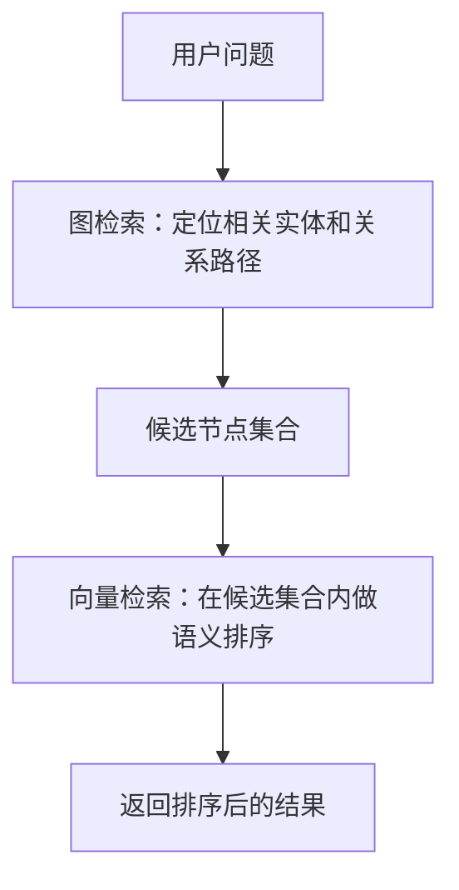
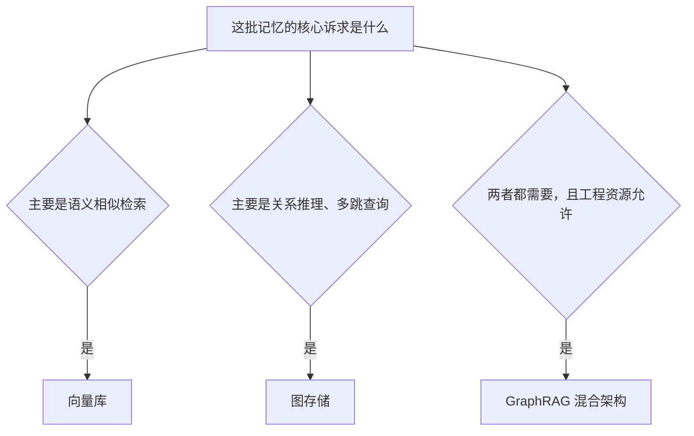

<KnowledgeMap current-module="memory" current-article="向量库与图存储的选型对比" />

# 记忆该存在哪：向量库与图存储的选型对比

<ArticleHeader
  module="Memory 体系"
  :tags="['工程']"
  reading-time="13 分钟"
  prerequisite="已读 RAG 原理"
  summary="External Memory 常被简化为'接个向量库'，但向量库只解决了语义相似检索这一类问题。这篇文章把向量库和图存储放在一起对比，理解什么信息适合放进哪一种结构。"
/>

  
核心洞察

  

    向量库回答的是"哪些内容和这个问题相似"，图存储回答的是"这些实体之间是什么关系"。大多数真实系统需要的不是二选一，而是知道什么时候该用哪一种。
  

## 两种存储解决的是不同的问题

`rag-fundamentals.md` 里讨论的检索增强，默认的存储载体通常是向量库。但"能否把窗口外的信息带回来"这个问题，本质上有两种不同的解法：

- **相似度检索**：给定一段文本，找出语义上最接近的其他内容——这是向量库擅长的
- **关系推理**：给定一个实体，找出它和哪些其他实体存在什么关系，以及这种关系能推导出什么——这是图存储擅长的

这两类问题不能互相替代。一个关于"这个项目里所有和部署相关的历史讨论"的检索，向量相似度可以很好地完成；但一个关于"这次故障的根因，追溯到最初是哪个决策导致的"的问题，本质上是在问一条因果链路，向量检索很难直接给出结构化的答案，图存储的路径查询能力更适合。

## 向量库：语义相似，弱结构

向量库把信息编码成高维向量，通过相似度计算找出语义相近的内容。

**优势**：

- 擅长处理非结构化的自然语言内容
- 不需要提前定义严格的模式（schema），写入门槛低
- 对"意思相近但表述不同"的内容有很强的召回能力

**局限**：

- 只能表达"相似"，无法表达"因为""导致""属于"这类明确的关系
- 检索结果是一组独立的片段，片段之间的逻辑关联需要额外拼接
- 对于需要多跳推理的问题（A 导致 B，B 又导致 C），向量检索天然乏力

## 图存储：关系推理，强结构

图数据库把信息组织成实体（节点）和关系（边），擅长回答"这些事物之间是什么关系"以及"沿着这些关系能推导出什么"。

**优势**：

- 天然适合表达因果、从属、依赖这类结构化关系
- 支持多跳查询，比如"找出所有间接依赖于这个配置项的服务"
- 关系本身可以携带权重、时间戳等元数据，方便做进一步推理

**局限**：

- 需要提前设计好实体和关系的模式，写入成本更高
- 对非结构化的自然语言内容不友好，通常需要先做实体和关系抽取，这一步本身就有误差风险
- 不擅长处理"意思相近但没有明确关系"的模糊语义匹配

## 一张对比表

| 维度 | 向量库 | 图存储 |
|---|---|---|
| 擅长的问题 | 语义相似检索 | 关系推理、多跳查询 |
| 写入门槛 | 低，不需要预定义 schema | 较高，需要设计实体和关系模型 |
| 典型场景 | 相似文档召回、语义搜索 | 因果溯源、依赖分析、知识图谱查询 |
| 典型代表 | Milvus、Weaviate、Pinecone | Neo4j、NebulaGraph |
| 局限 | 无法表达明确关系 | 对非结构化文本不友好 |

## 混合架构：GraphRAG

近两年一个比较明确的趋势是把两者结合：先用图结构组织实体和关系，再对图中的节点内容做向量化，检索时先通过图关系缩小范围，再用向量相似度在这个范围内做精细匹配。

这种结构比单纯的向量库多了一层"先圈定范围再精细匹配"的能力，尤其适合那些既需要语义模糊匹配、又需要结构化关系推理的场景——比如需要同时理解"这两段文字讲的是不是同一件事"和"这件事和另一件事是什么因果关系"。

代价是工程复杂度明显更高：需要维护两套存储、两套索引，以及一套把自然语言转化为图结构的抽取流程。

## 一个简化的选型决策路径

## 落地时的几个实际考量

- **数据规模**：向量库在超大规模语料下的召回效率已经比较成熟；图存储在实体和关系数量极大时，查询性能的调优难度会明显上升。
- **团队能力**：图数据库的建模和查询语言（如 Cypher）本身有一定学习曲线，如果团队缺乏相关经验，贸然引入图存储可能会让系统复杂度超出团队的维护能力。
- **数据来源的结构化程度**：如果原始信息本身就是结构化的（比如系统日志、配置依赖关系），图存储的收益会比较直接；如果原始信息主要是自然语言对话，向量库通常是更低成本的起点，图结构可以作为后续演进方向。

## 本节总结

- 向量库解决语义相似检索问题，图存储解决关系推理和多跳查询问题，两者不能互相替代
- 向量库写入门槛低，但无法表达明确关系；图存储擅长关系推理，但对非结构化文本不友好
- GraphRAG 是把两者结合的混合架构，能力更强，但工程复杂度也明显更高
- 选型应该从"这批记忆的核心诉求"出发，而不是从"哪个更流行"出发

## 下一步

理解了存储载体的选型之后，建议继续阅读《从 Episodic 到 Semantic 的蒸馏流程实战》，看具体记忆是如何从原始的过程记录，逐步提炼成这些存储结构里的稳定知识的。
