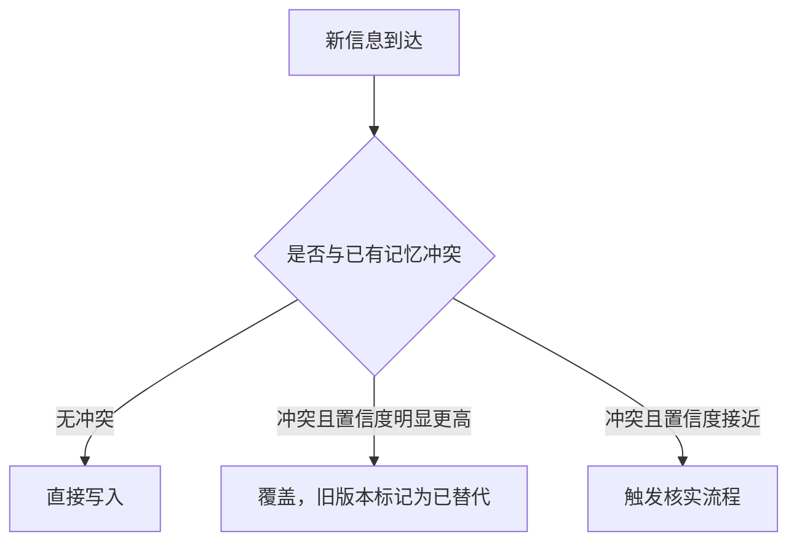
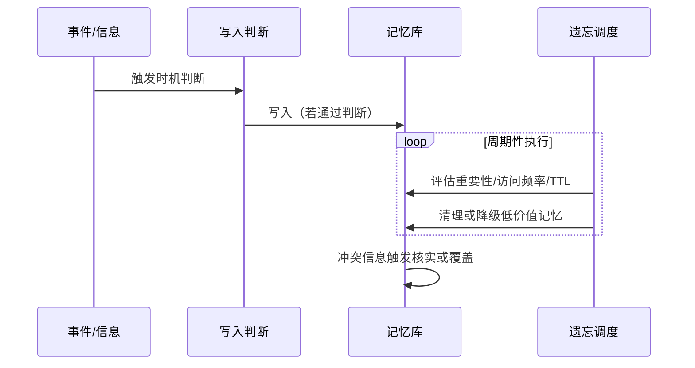

<KnowledgeMap current-module="memory" current-article="记忆的写入时机与遗忘策略" />

# 记忆的写入时机与遗忘策略

<ArticleHeader
  module="Memory 体系"
  :tags="['工程', '实战']"
  reading-time="14 分钟"
  prerequisite="已读 Memory 的四种形态"
  summary="Memory 的四种形态解决了信息应该分类存放的问题，但没有回答两个更工程化的问题：什么时机应该触发写入，以及噪声和过期信息应该如何被清理。这篇文章专门展开这两点。"
/>

<div class="key-insight">
  <div class="key-insight-label">核心洞察</div>
  <p class="key-insight-text">
    一个记忆系统是否好用，很少取决于存储容量，而取决于写入和遗忘两端的判断质量——写太多会让系统被噪声带偏，写太少会让系统看起来"记性差"。
  </p>
</div>

## 为什么写入时机是个真问题

`four-memory-types.md` 里提到"什么内容该写进哪一类记忆"，但在真实系统里，更早出现的问题是：**这一刻，是否应该触发写入？**

如果每一轮对话、每一次工具调用结果都无条件写入长期记忆，系统很快会积累大量低价值信息——一次性的临时状态、还未验证的猜测、和后续任务几乎无关的细节。这些内容不仅浪费存储，还会在后续检索时增加噪声，稀释真正有价值的记忆。

反过来，如果写入门槛设得太高，系统又会错过真正值得记住的信息，表现得像是"记性差"。

## 三类常见的写入触发时机

### 时机一：任务边界触发

在一个任务、一次会话或一个阶段性目标完成时，回顾这段过程，提炼出值得保留的信息再写入。

这种方式的好处是能拿到相对完整的上下文，判断质量更高；缺点是写入是批量、延迟的，无法捕捉过程中转瞬即逝的关键细节。

### 时机二：显式信号触发

用户或系统明确表达了"这条信息应该被记住"的意图，比如用户直接说"记住我偏好用中文回复"，或者系统检测到一次明确的决策确认（比如"就用这个方案"）。

这是最可靠的一类触发——因为写入的必要性不需要系统自己判断，是被外部显式确认的。

### 时机三：重要性阈值触发

系统在过程中持续评估当前信息的重要性，一旦超过某个阈值就触发写入。例如：

- 一个失败原因如果只出现一次，可能只是偶然
- 但如果同一类失败原因反复出现，就应该被提升为值得记住的经验

```python
def should_write(event, history):
    occurrence = count_similar(event, history)
    if event.is_explicit_signal:
        return True
    if occurrence >= IMPORTANCE_THRESHOLD:
        return True
    return False
```

这种方式能捕捉过程中的动态信号，但需要设计合理的重要性评估逻辑，否则容易出现两种极端：阈值太低导致噪声堆积，阈值太高导致关键信息被漏掉。

## 遗忘策略：比写入更容易被忽视

很多 Memory 系统的设计重点都放在"如何写入"和"如何检索"，遗忘往往是最后才被想起来的一环——但如果没有遗忘机制，记忆库只会持续膨胀，检索质量也会随着噪声增多而下降。

### 策略一：TTL（存活时间）

给每条记忆设置一个有效期，过期后自动归档或删除。适合那些天然具有时效性的信息，比如"当前项目使用的临时配置"。

### 策略二：重要性衰减

记忆的重要性分数随时间递减，除非被重新访问或再次验证，否则会逐渐降到可以被清理的水平。这比固定 TTL 更灵活，因为它允许"依然常被用到的旧信息"继续保留。

### 策略三：访问频率（类 LRU）

长期不被检索到的记忆，视为低价值信息，优先被清理或压缩。这类似于缓存系统里的最近最少使用策略，逻辑简单，但需要注意：有些低频但关键的信息（比如一年一次的重要规则）不应该被这种策略误伤。

### 策略四：总结后删除

把一批具体的、细节性的记忆先总结成更抽象的结论，再删除原始细节，只保留总结。这既释放了存储和检索压力，又不会完全丢失信息——只是丢失了细节层级。这个过程和《从 Episodic 到 Semantic 的蒸馏流程实战》里讲的机制是同一件事的两个角度。

### 策略五：人工审核删除

对于高风险或高敏感度的信息，遗忘决策不应该完全交给自动化规则，而应该有人工审核环节介入确认。

## 冲突处理：新旧信息矛盾时怎么办

写入和遗忘之外，还有一类常被忽视的场景：新写入的信息和已有记忆冲突。

一个相对稳妥的处理原则：

- 默认让更新、更可信的信息覆盖旧信息
- 但不要立即删除旧版本，而是保留一份历史记录，标注"已被替代"，而不是彻底抹去
- 如果新旧信息的冲突程度较高（比如同一件事出现完全相反的两个结论），应该触发一次显式的核实流程，而不是简单地"信新的"



## 一个完整的写入-遗忘生命周期



## 本节总结

- 写入时机可以分为任务边界触发、显式信号触发、重要性阈值触发三类，各自适合不同场景
- 遗忘策略至少包括 TTL、重要性衰减、访问频率、总结后删除、人工审核五种手段，通常需要组合使用而不是单一依赖
- 新旧信息冲突时，优先保留历史而不是直接覆盖，冲突程度高时应触发核实流程而不是简单信任新信息
- 一个成熟的记忆系统，遗忘机制的设计成熟度往往和写入机制同样重要

## 下一步

理解了写入和遗忘的判断逻辑之后，建议继续阅读《向量库与图存储的选型对比》，看这些记忆具体应该存放在什么样的存储结构里。
