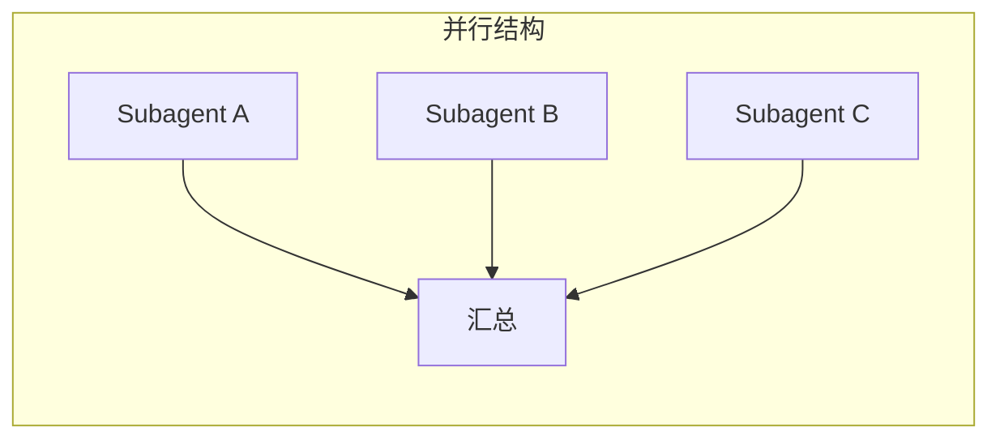
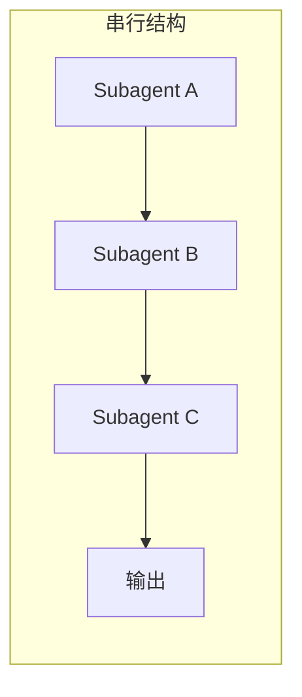

<KnowledgeMap current-module="multi-agent" current-article="多 Agent 的成本与延迟权衡" />

# 多几个 Agent，到底贵多少：成本与延迟权衡

<ArticleHeader
  module="多 Agent 系统"
  :tags="['工程', '实战']"
  reading-time="12 分钟"
  prerequisite="已读 Orchestrator-Subagent"
  summary="多 Agent 系统听起来是能力升级，但每多一个角色，就多一次上下文构建、多一次模型调用、多一层结果传递。这篇文章从 token 消耗和延迟两个维度，给出一个可以真正拿来做决策的成本模型。"
/>

<div class="key-insight">
  <div class="key-insight-label">核心洞察</div>
  <p class="key-insight-text">
    多 Agent 的价值在于把复杂任务拆得更清晰，但这个清晰是用 token 和延迟换来的。只有当拆分带来的准确率提升，超过它的成本代价时，多 Agent 才是净收益。
  </p>
</div>

## 为什么多 Agent 的成本不是线性增长

一个直觉上的误解是："3 个 Agent 的成本大概是 1 个 Agent 的 3 倍"。

实际情况通常更糟，因为每个 Subagent 在开始工作前，往往需要重新构建自己的上下文——包括任务背景、角色设定、必要的历史信息。这部分"上下文构建成本"在单 Agent 里只需要承担一次，在多 Agent 里每个角色都要重新承担一遍。

一个粗略的成本模型：

```text
总成本 ≈ Orchestrator 调度成本
       + Σ(每个 Subagent 的上下文构建成本 + 执行成本)
       + 结果汇总与二次判断成本
```

如果 Subagent 之间还存在结果传递（比如 A 的输出要完整地喂给 B），这部分传递内容也会计入下一个角色的输入 token，成本会进一步叠加。

## 延迟：并行能省，但不是所有场景都能并行

延迟的情况和成本不完全一致。如果多个 Subagent 之间没有依赖关系，可以并行执行，总延迟取决于最慢的那一个，而不是所有环节延迟的总和。

但现实中很多多 Agent 任务是有依赖链路的——A 的输出是 B 的输入，B 的输出是 C 的输入。这种情况下，延迟是**串行叠加**的：





判断一个多 Agent 设计是否合理，很重要的一步是先画出真实的依赖图，看它更接近哪一种结构——如果本质是串行依赖，却被设计成"看起来是多 Agent"的形式，通常只是徒增延迟，没有换来并行收益。

## 什么时候多 Agent 是净损耗

以下几种情况，多 Agent 拆分大概率是在做负收益的事：

- **任务本身不复杂，单 Agent 一次调用就能稳定完成**：这时候引入 Orchestrator 和多个角色，只是多花 token 走了一个更长的链路，准确率不会有实质提升。
- **Subagent 之间高度串行依赖，且每一步都要重新构建大量上下文**：延迟和成本同时上升，而"角色清晰"带来的收益不足以覆盖。
- **任务对响应时间敏感，但被拆成了多轮串行调用**：比如一个用户期望秒级响应的交互场景，被拆成"理解意图 Agent → 检索 Agent → 生成 Agent"三级串行调用，累加延迟可能让体验明显变差。
- **子任务过于细碎**：这和 `orchestrator-subagent.md` 提到的"拆得太细"是同一个问题在成本维度上的体现——每多拆一层，就多一份上下文构建和调度开销。

## 几个能实际降低成本的工程手段

### 手段一：共享上下文而不是重复传递

如果多个 Subagent 需要访问同一份背景信息，优先考虑放入共享状态（比如 LangGraph 的图状态设计），而不是让 Orchestrator 每次调度时都把完整背景重新拼进 prompt。

### 手段二：按需路由，而不是全员参与

不是每个任务都需要激活全部 Subagent。Orchestrator 的路由逻辑应该先判断"这次任务真正需要哪些角色"，避免默认让所有角色都跑一遍。

### 手段三：结果摘要而不是完整传递

A 的输出传给 B 时，如果 A 的产出很长，但 B 只需要其中的结论性信息，应该在传递前做一次摘要压缩，而不是把完整原文都塞进下一个角色的上下文。

### 手段四：小模型做路由，大模型做执行

调度判断（该交给哪个 Subagent）通常不需要最强的模型能力，可以用更轻量的模型完成路由决策，把高成本的模型调用留给真正需要复杂推理的执行环节。

## 一个简单的决策清单

在决定是否要用多 Agent 拆分之前，建议先问：

- 单 Agent 是否已经在某个具体维度上明显吃力（上下文过长、角色混杂、准确率下降）
- 拆分后的角色之间，依赖关系是否真的允许并行
- 每个角色的上下文构建成本，是否会因为拆分而重复放大
- 拆分带来的准确率或可维护性提升，能否覆盖增加的 token 和延迟成本

如果这几条都没有清晰的正面答案，往往意味着当前任务还不需要多 Agent。

## 本节总结

- 多 Agent 的成本不是角色数量的线性倍增，主要放大项是重复的上下文构建
- 延迟是否能被并行抵消，取决于角色之间是否存在真实的依赖链路
- 任务简单、串行依赖重、响应时间敏感、拆分过细，是多 Agent 净损耗的四种典型场景
- 共享上下文、按需路由、结果摘要、小模型路由，是四个能直接降低成本的工程手段

## 下一步

理解了成本约束之后，建议继续阅读《Blackboard / Debate 等非层级协作拓扑》，看看除了 Orchestrator-Subagent 之外，还有哪些协作结构，以及它们各自的成本特征有什么不同。
