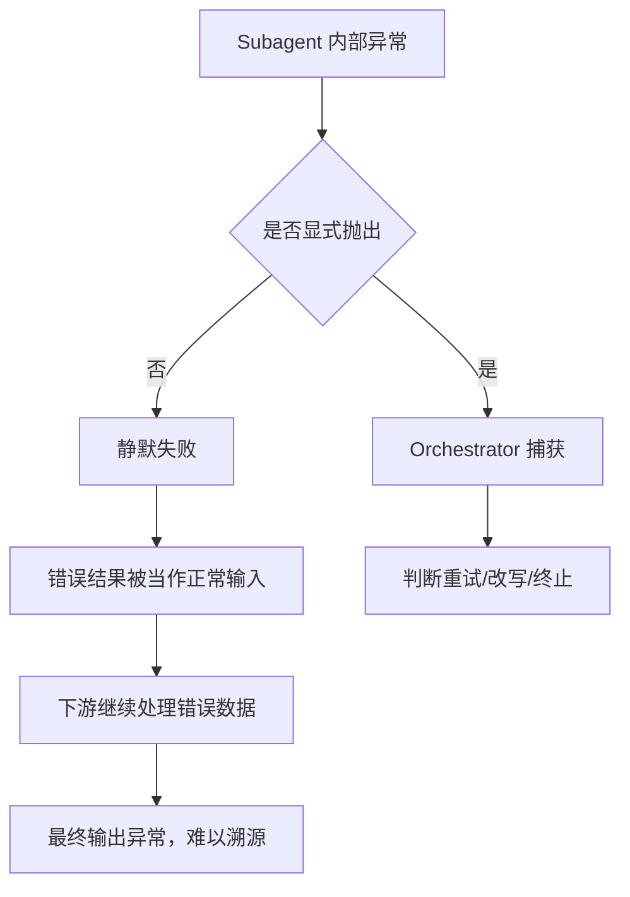
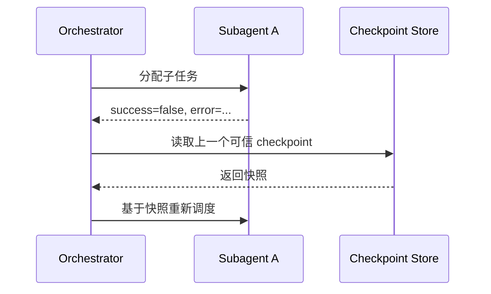

<KnowledgeMap current-module="multi-agent" current-article="多 Agent 的失败模式与恢复策略" />

# 多 Agent 是怎么崩溃的：失败模式与恢复策略

<ArticleHeader
  module="多 Agent 系统"
  :tags="['工程']"
  reading-time="14 分钟"
  prerequisite="已读 Orchestrator-Subagent"
  summary="多 Agent 系统不会像单 Agent 那样干脆地报错退出，它更容易陷入循环调用、死锁、静默失败这类难以察觉的中间状态。这篇文章把这些失败模式拆开来看，并给出对应的恢复设计。"
/>

<div class="key-insight">
  <div class="key-insight-label">核心洞察</div>
  <p class="key-insight-text">
    单 Agent 失败通常是"这一步报错了"，多 Agent 失败更多是"系统看起来还在运行，但已经偏离了正确路径"。恢复机制要解决的不是报错，而是及时发现偏离。
  </p>
</div>

## 为什么多 Agent 的失败更难被发现

单 Agent 系统的失败链路很直接：一次调用失败，异常抛出，流程终止。

多 Agent 系统不一样。任务被拆给多个角色之后，失败可能发生在：

- 某个 Subagent 内部
- Orchestrator 的调度判断里
- 角色之间传递结果的环节
- 共享状态被并发修改的瞬间

更麻烦的是，很多失败不会以"报错"的形式出现，而是以"看起来完成了，但结果是错的"这种形式出现。这也是 `orchestrator-subagent.md` 里提到的三类失败（拆得太细、Orchestrator 变瓶颈、Subagent 输入输出不清晰）之外，还需要单独展开的部分：**故障的表现形式本身，比故障的原因更值得先弄清楚。**

## 五种常见失败模式

### 模式一：循环调用

Orchestrator 把任务分给 Subagent A，A 的输出又被判断为"需要 B 处理"，B 处理完又被判断为"需要回到 A"，如此往复。

这通常发生在：

- 判断"任务是否完成"的逻辑本身有歧义
- 结果格式不稳定，导致路由逻辑反复误判

一个简化的循环调用轨迹：

```text
Orchestrator -> Subagent A -> 判断未完成 -> Subagent B -> 判断未完成 -> Subagent A -> ...
```

### 模式二：死锁

两个角色互相等待对方的结果才能继续，谁都无法先动。

在同步阻塞式的协作结构里，这种情况比想象中更容易出现——尤其是当 Subagent 之间存在"必须先拿到对方产出才能继续"的隐式依赖，而这个依赖关系又没有被显式建模时。

### 模式三：静默失败传播

Subagent 内部出错，但没有把错误状态清晰地传递给 Orchestrator，而是返回了一个"看起来正常"的结果。

这是最危险的一类失败，因为：

- 系统不会报错，也不会重试
- 错误结果会被当作正确输入，继续流入下一个环节
- 等到最终输出被发现有问题时，已经很难定位是哪个环节出的错

### 模式四：共享状态污染

多个角色并发读写同一份共享状态时，如果没有明确的写入边界，容易出现：

- 后写覆盖先写，丢失中间结果
- 某个角色读到了尚未完整写入的中间状态

### 模式五：级联重试风暴

一个子任务失败后触发重试，重试又触发了下游的重新调度，最终演变成大范围的重复执行，token 消耗和延迟同时失控。

## 一张失败传播图



## 恢复机制的四个基本手段

### 手段一：显式状态协议，杜绝静默失败

每个 Subagent 的返回结构里，必须包含明确的状态字段，而不是只有内容本身：

```python
def subagent_result(success, content, error=None):
    return {
        "success": success,
        "content": content,
        "error": error,
    }
```

Orchestrator 的调度逻辑应该始终先检查 `success` 字段，而不是依赖对 `content` 内容的猜测性判断。这一条看起来简单，却是杜绝"模式三"最有效的一步。

### 手段二：超时与看门狗

任何一次子任务调用都应该有明确的超时上限。超时后的默认动作应该是"标记失败并上报"，而不是无限等待——这是防止死锁演变成系统级挂起的最基本手段。

### 手段三：断路器模式

如果某个 Subagent 在短时间内连续失败超过阈值，应该暂时停止继续调用它，转而触发人工介入或降级方案，而不是让 Orchestrator 一直重试同一个大概率会失败的路径。这可以避免"模式五"里描述的重试风暴。

### 手段四：Checkpoint 与可回滚状态

在关键节点保存状态快照，当发现某个环节的结果不可信时，可以直接回滚到上一个可信的 checkpoint，而不是从头重跑整个任务链路——这对长任务尤其重要，重跑成本往往比恢复成本高得多。



## 一个容易被忽视的设计原则

恢复机制不应该只在"出错之后"才启动，而应该在设计阶段就明确：**每个环节允许失败到什么程度，超过这个程度应该交给谁处理。**

如果所有失败最终都只能靠 Orchestrator 兜底，Orchestrator 本身就会变成新的单点故障——这一点和 `orchestrator-subagent.md` 里提到的"Orchestrator 变瓶颈"是同一个问题的两个角度：一个是职责设计上的瓶颈，一个是故障处理上的瓶颈。

## 本节总结

- 多 Agent 的失败往往不是报错，而是看起来正常但已经偏离正确路径
- 五种常见模式：循环调用、死锁、静默失败传播、共享状态污染、级联重试风暴
- 恢复机制的核心不是"重试"，而是显式状态协议、超时看门狗、断路器、可回滚 checkpoint 这四类基本手段
- 失败处理的责任边界应该在设计阶段就明确，避免 Orchestrator 变成新的单点瓶颈

## 下一步

如果你想了解多 Agent 系统在成本层面的另一个真实约束，建议继续阅读《多 Agent 的成本与延迟权衡》。如果你想先看不同协作拓扑之间的对比，也可以直接跳到《Blackboard / Debate 等非层级协作拓扑》。
