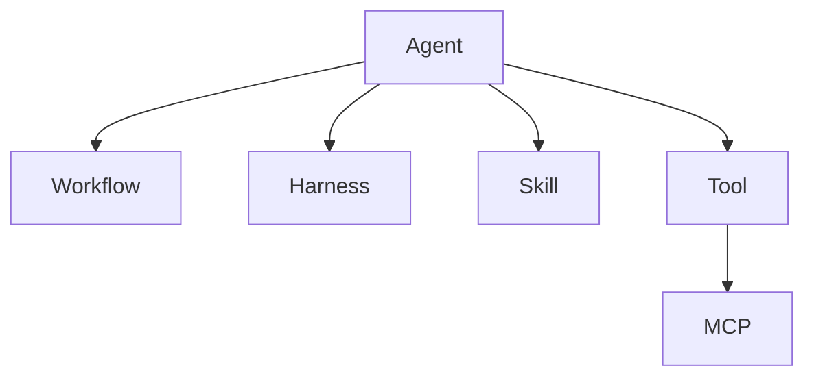
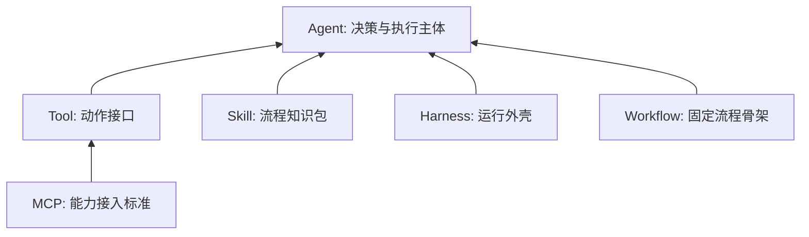

<KnowledgeMap current-module="multi-agent" current-article="系统概念关系图" />

# Tool、MCP、Skill、Harness、Workflow、Agent 的关系

<ArticleHeader
  module="多 Agent 系统"
  :tags="['工程']"
  reading-time="14 分钟"
  prerequisite="已读 Tool Use、MCP、Harness 与 Agent Skills"
  summary="Tool、MCP、Skill、Harness、Workflow、Agent 常常在同一张架构图里同时出现，但它们分别处在动作接口、接入标准、流程知识、运行外壳、固定流程和自主系统这几个不同层次。"
/>

## 为什么这几个词总让人混

因为在真实系统里，它们经常一起出现。

比如你在做一个长任务 Agent，系统可能同时有：

- 一组 tools
- 通过 MCP 暴露的能力
- 若干 skills
- 一个 harness
- 几段固定 workflow
- 一个或多个 agent

结果就是很多人会自然混淆：

- skill 和 tool 有什么区别
- harness 和 workflow 是不是一回事
- MCP 和 tool calling 到底谁包含谁
- agent 和整个系统边界在哪里

这篇文章的目标，就是把这些关系一次讲清。

<div class="key-insight">
  <div class="key-insight-label">核心洞察</div>
  <p class="key-insight-text">
    这些概念之所以容易混，不是因为它们重复，而是因为它们分别解决“做什么、怎么接、怎么做、怎么持续做、按什么固定顺序做、谁来决策”这几个不同问题。
  </p>
</div>

## 先看总关系图



这张图不是严格的软件依赖图，而是一张“理解路径图”：

- Agent 是执行与决策主体
- Workflow 是固定流程骨架
- Harness 是运行外壳
- Skill 是流程知识包
- Tool 是动作接口
- MCP 是能力接入标准

## 一句话先记住每个概念

如果你只想快速记忆，可以先记住下面这组定义：

- `Agent`：会基于目标做决策和行动的系统角色
- `Workflow`：预先定义好的固定流程
- `Harness`：保证 Agent 长期稳定运行的外壳
- `Skill`：可复用的流程知识包
- `Tool`：Agent 可以调用的动作接口
- `MCP`：把外部能力标准化暴露出来的接入层

## 先讲 Tool：动作能力本身

Tool 最容易理解，它解决的是：

`系统到底能做什么动作`

例如：

- 读文件
- 执行命令
- 调接口
- 搜索文档

Tool 的本质是：

`动作接口`

它不是流程，也不是知识，更不是运行纪律。

## 再讲 MCP：把 Tool 和其他能力标准化接进来

MCP 解决的是：

`这些能力如何被统一接入和发现`

它不只可以暴露 tools，还可以暴露：

- resources
- prompts
- capability metadata

所以 MCP 更像是：

`能力接入协议`

而不是某一个具体工具本身。

## Skill：把“怎么做”打包成知识资产

Skill 解决的是：

`遇到这类任务时，通常应该怎么做`

它更适合承载：

- 操作步骤
- 组织规范
- 输出模板
- 附属脚本和参考资料

所以 skill 不是在解决“有没有动作能力”，而是在解决“做这类任务时怎样更稳定、更一致”。

## Harness：把 Agent 放进可持续工作的运行环境

Harness 解决的是：

`系统如何跨多个回合、多个窗口、多个阶段继续推进`

它更关心：

- 初始化
- 会话交接
- 干净状态
- 失败恢复
- 验证纪律

所以 harness 和 skill 最大的差别是：

- skill 关注流程知识
- harness 关注运行纪律

## Workflow：固定流程骨架

Workflow 解决的是：

`这件事应该按什么固定顺序走`

例如：

```text
先读配置 -> 再调用接口 -> 最后发通知
```

这种固定路径更像 workflow。

如果系统需要动态判断：

- 该不该检索
- 该不该调用某个 skill
- 是否换一个子 agent

那就已经超出单纯 workflow 了。

## Agent：真正做决策的主体

Agent 解决的是：

`面对目标和环境，谁来判断下一步做什么`

这也是为什么 Agent 和 workflow 的本质不同：

- workflow 更偏预定义
- agent 更偏在运行中做判断

一个系统可以：

- 只有 workflow，没有强 agent 自主性
- 有 agent，但工作在某个 workflow 骨架里
- 有 agent，再加 harness、skills、tools、MCP 形成完整系统

## 一张分层图：它们各自在哪一层



这张图有助于看清：

- MCP 和 Tool 更靠近能力接入层
- Skill 更靠近知识层
- Harness 更靠近运行时层
- Workflow 更靠近流程层
- Agent 更靠近决策主体层

## 一个例子：代码 Agent 系统里它们分别扮演什么

假设你要做一个“修复文档站并验证”的系统。

### Tool

提供：

- 读文件
- 改文件
- 执行构建
- 查看诊断

### MCP

负责把文件系统、浏览器、搜索等能力按统一协议暴露出来。

### Skill

提供：

- README 更新规范
- 文档补写模板
- 构建失败排查清单

### Harness

要求：

- 每轮写清进展
- 每轮结束保持干净状态
- 下一轮先读交接信息

### Workflow

可能规定：

1. 先诊断
2. 再修改
3. 再构建
4. 最后总结

### Agent

在运行时判断：

- 先读哪个文件
- 是否调用 skill
- 是否需要再跑一次构建
- 当前是否已经可以结束

这样一来，每个概念的边界就会清楚很多。

## 最容易混淆的几组关系

### Tool vs Skill

- Tool 负责“做动作”
- Skill 负责“讲做法”

### Tool vs MCP

- Tool 是能力本身
- MCP 是暴露和接入能力的标准

### Skill vs Harness

- Skill 是可复用流程知识
- Harness 是让系统持续工作的外壳

### Workflow vs Agent

- Workflow 是固定骨架
- Agent 是动态决策主体

## 一个判断表

| 你现在想解决的问题 | 更接近哪个概念 |
| --- | --- |
| 让系统能读文件、跑命令 | Tool |
| 让外部能力能被统一接入 | MCP |
| 把团队做事方法打包复用 | Skill |
| 让长任务跨回合继续推进 | Harness |
| 把执行顺序写死成固定流程 | Workflow |
| 让系统根据目标自主决定下一步 | Agent |

这个表非常适合做概念定位。

## 一个常见误区：把所有东西都叫 Agent

这是最常见但也最危险的误区。

如果你把：

- skill 叫 agent
- tool 叫 agent
- workflow 叫 agent
- harness 也叫 agent

最后你会完全失去系统分层能力。

更好的做法是：

- 先看它在解决什么问题
- 再决定它属于哪一层

## 另一个常见误区：以为有了更多层就一定更高级

也不是。

并不是所有项目都必须同时具备：

- MCP
- Skills
- Harness
- 多 Agent

一个很短的小项目，可能：

- 只有几个 tools
- 一个简单 workflow
- 一个最小 agent loop

就够了。

这些概念的价值，不在于“全都上”，而在于：

`当系统复杂到需要它们时，你知道该补哪一层。`

## 本节总结

- Tool、MCP、Skill、Harness、Workflow、Agent 解决的是不同层次的问题
- 它们之所以常一起出现，是因为真实系统往往同时需要动作、接入、知识、运行纪律、流程和决策
- 最关键的不是记住名词，而是分清每个概念各自负责什么
- 当系统出问题时，先定位是能力问题、接入问题、知识问题、运行问题、流程问题还是决策问题

## 下一步

- 回到 [Harness 设计](../05-tools-frameworks/harness-design)
- 或进入 [Harness 与 Skill 的评估体系](../06-eval-evolution/harness-skill-evaluation)
