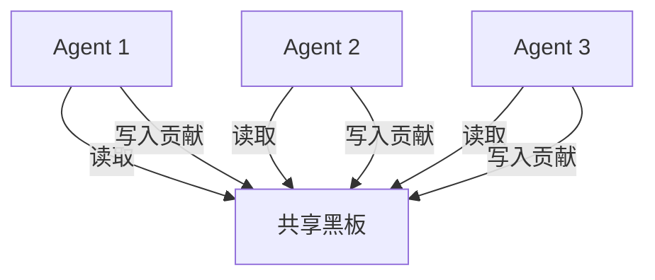
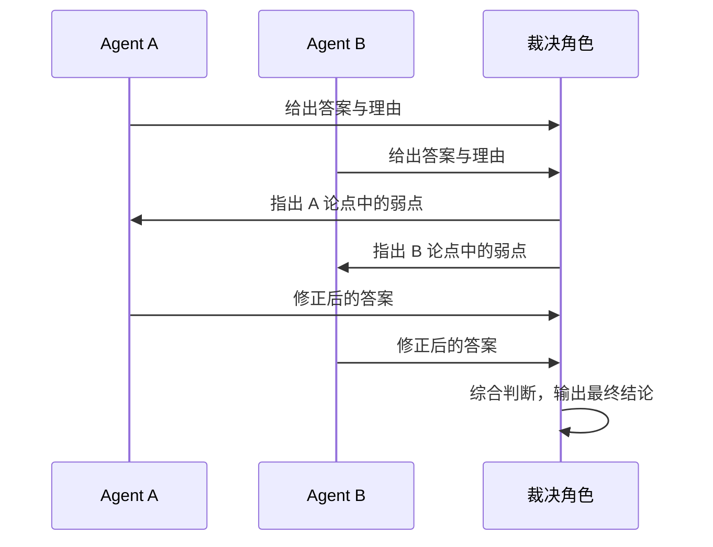
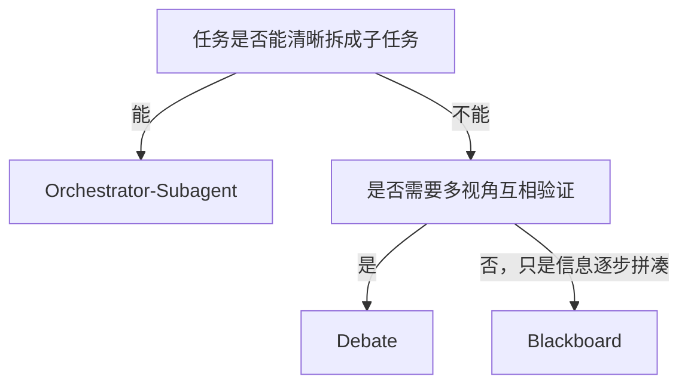

<KnowledgeMap current-module="multi-agent" current-article="Blackboard / Debate 等非层级协作拓扑" />

# 不是所有多 Agent 系统都需要一个指挥官

<ArticleHeader
  module="多 Agent 系统"
  :tags="['核心']"
  reading-time="13 分钟"
  prerequisite="已读 Orchestrator-Subagent"
  summary="Orchestrator-Subagent 是最常见的多 Agent 拓扑，但不是唯一的。当任务不适合被清晰拆解成层级化的子任务时，Blackboard、Debate 这类非层级结构往往更合适。这篇文章把几种常见拓扑放在一起对比。"
/>

  
核心洞察

  

    拓扑选择的关键不是"哪种模式更先进"，而是任务本身的结构：有没有清晰的全局协调者、角色之间是否需要互相质疑、结果是否需要多方独立验证。
  

## 为什么需要非层级拓扑

`orchestrator-subagent.md` 里讲的结构有一个隐含前提：存在一个角色，能够清楚地把任务拆解、分配、并汇总结果。

但不是所有任务都满足这个前提。有些场景里：

- 没有天然的"总指挥"角色，各个参与者的信息是逐步暴露出来的，谁都无法一开始就规划全局
- 任务需要多个独立视角互相验证、互相挑战，而不是简单的分工执行
- 参与者数量和角色边界是动态变化的，不适合预先定义死板的层级关系

这几类场景，分别对应 Blackboard 模式、Debate 模式，以及更松散的 Peer-to-peer 协作结构。

## Blackboard 模式：共享黑板，没有中心调度

Blackboard 模式的核心思想是：所有参与者共享一块"黑板"（一个共享的状态空间），每个 Agent 可以读取黑板上的当前信息，判断自己能否贡献点什么，如果能，就把结果写回黑板。

这种模式没有固定的执行顺序，也没有角色预先分配好的任务——谁在当前黑板状态下"有话可说"，谁就介入。

**适合的场景**：

- 问题的解决路径无法提前规划，需要逐步拼凑出答案（比如复杂诊断类任务，不同专长的角色各自贡献线索）
- 参与角色的数量和类型可能会动态变化

**典型问题**：

- 缺乏中心协调，容易出现多个角色同时尝试写入黑板导致的状态冲突（这也是 03-memory 里"共享状态"设计需要重点处理的问题）
- 何时终止不像层级结构那样明确——需要额外设计"黑板已经足够完整"的判断逻辑

## Debate 模式：让多个角色互相挑战

Debate 模式让多个 Agent 针对同一个问题分别给出答案，然后互相评审、反驳、修正，最后再收敛出一个结果。

Debate 的价值不在于"多个模型一起算"，而在于：单一角色容易对自己的错误缺乏觉察，而互相挑战的结构能够暴露出单独推理时不容易发现的漏洞。

**适合的场景**：

- 需要高置信度的判断类任务（比如代码评审、方案可行性论证）
- 单一模型给出的答案容易带有系统性偏差，需要引入对抗视角

**典型问题**：

- 成本明显更高——本质上是让同一个问题被处理多次，再加上裁决环节，这一点需要结合《多 Agent 的成本与延迟权衡》里的判断标准来评估是否值得
- 如果参与辩论的角色能力差距过大，弱的一方可能无法提出有效挑战，辩论退化成"陪衬"

## 拓扑对比

| 拓扑 | 是否有中心协调者 | 适合场景 | 主要代价 |
|---|---|---|---|
| Orchestrator-Subagent | 有 | 任务可清晰拆解为子任务 | Orchestrator 容易变瓶颈 |
| Blackboard | 无 | 解决路径需要逐步拼凑，参与者动态变化 | 状态冲突、终止条件不明确 |
| Debate | 有裁决角色，但角色之间平等 | 需要高置信度、容易有偏差的判断类任务 | 成本高，弱角色可能无效 |

## 如何选择

一个简单的判断路径：

这三种拓扑并不互斥。实际系统里，Orchestrator-Subagent 内部的某个 Subagent，完全可以在自己的职责范围内再嵌套一层 Debate 结构——比如"代码评审 Subagent"内部让两个角色互相挑战，最后把收敛结果作为这个 Subagent 的最终输出，交还给上层 Orchestrator。

## 本节总结

- Orchestrator-Subagent 不是唯一的多 Agent 拓扑，适用前提是任务能被清晰拆解
- Blackboard 模式适合没有中心协调者、需要逐步拼凑答案的场景，代价是状态冲突和终止判断困难
- Debate 模式适合需要高置信度判断的场景，代价是成本更高，且依赖参与角色有相近的能力水平
- 三种拓扑可以嵌套组合，而不是只能二选一

## 下一步

如果你还没看过《多 Agent 的失败模式与恢复策略》和《多 Agent 的成本与延迟权衡》，建议结合这三篇一起看——拓扑选择、失败处理和成本权衡是同一个系统设计决策的三个角度。之后可以进入 [工具与框架](../05-tools-frameworks/) 模块，看这些拓扑在 LangGraph 里具体怎么落地。
