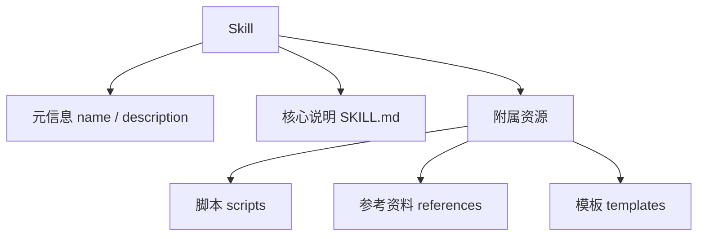
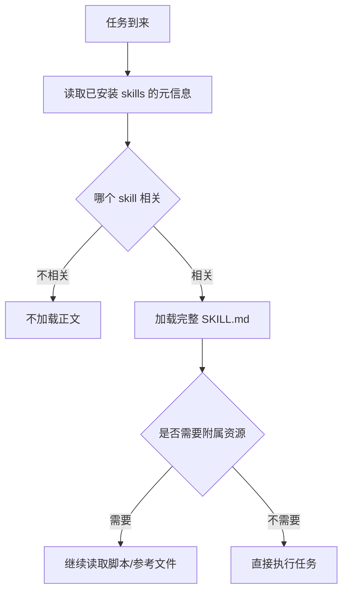
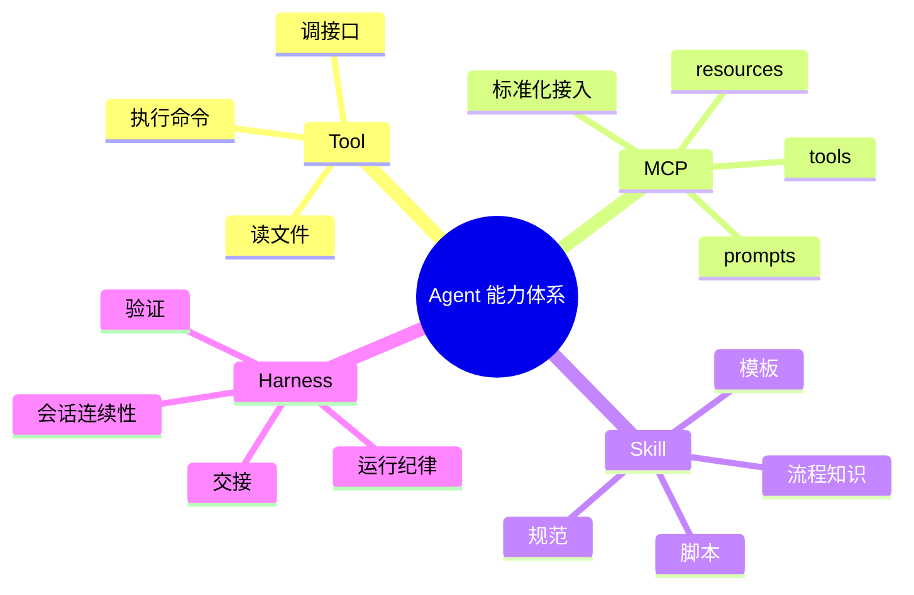

<KnowledgeMap current-module="tools" current-article="Agent Skills" />

# Agent Skills：把经验从一次对话变成可复用能力

<ArticleHeader
  module="工具与框架"
  :tags="['工程']"
  reading-time="16 分钟"
  prerequisite="理解 Tool Use、Context Engineering 与 MCP 的基本概念"
  summary="Agent Skill 的核心价值，是把流程知识、组织规范、脚本和参考资料打包成可发现、可按需加载、可组合复用的能力单元，让通用 Agent 获得更稳定的专业化行为。"
/>

## 为什么 Skill 会成为新知识点

很多团队在真实使用 Agent 时都会碰到一个问题：

- 某个流程明明已经总结过很多次
- 某类任务明明已经有固定做法
- 某些组织规范明明应该被稳定复用

但每次新任务开始时，还是要重新解释一遍。

这就暴露出一个典型缺口：

`模型知道很多通用知识，但它并不会天然继承你的流程知识。`

Skill 要解决的，正是把这些流程知识、操作规范和辅助资源，从“一次性的上下文说明”变成“可复用的能力包”。

<div class="key-insight">
  <div class="key-insight-label">核心洞察</div>
  <p class="key-insight-text">
    Skill 的价值，不是把 prompt 写得更长，而是把经验、规范、脚本和参考资料打包成可发现、可组合、可按需加载的程序化知识单元。
  </p>
</div>

## Skill 到底是什么

一个实用定义是：

`Skill = 面向 Agent 的可复用任务知识包`

它通常包含：

- 一段高层描述，说明它适合解决什么问题
- 一份核心说明文档，解释怎么做
- 若干附属资源，例如参考文档、模板、脚本、规范文件

所以它既不像普通 prompt，也不像单个工具函数。

Skill 更接近：

`把一个领域里的“做事方法”写成 Agent 能加载和执行的 onboarding package`

## 先看一张结构图



这张图最关键的点是：

Skill 不是单文件 prompt，而是一个目录化、分层化的能力单元。

## 为什么 Skill 不等于 Prompt 模板

很多人第一次听到 Skill，会误以为它只是：

- 一段更长的 system prompt
- 一个提示词模板库
- 一份 SOP 文档

这些理解都不够完整。

Skill 和普通 prompt 模板最大的差别在于：

- 它有明确边界
- 它能被发现
- 它能按需加载
- 它可以包含脚本和附属资源
- 它能与其他 skill 组合

所以 Skill 不是“把话术写下来”，而是“把可复用流程知识结构化打包”。

## Progressive Disclosure：为什么 Skill 不会把上下文压爆

Skill 体系里一个非常关键的设计思想，是渐进式加载。

第一层通常只暴露少量元信息，例如：

- 这个 skill 叫什么
- 它适合处理什么任务

只有当 Agent 判断当前任务确实相关时，才继续读取 skill 的完整说明。

如果完整说明里还引用了其他文档、模板或脚本，再进一步按需读取。

## 一张图看懂渐进式加载



这就是为什么 skill 体系比“一股脑把所有规范全塞进 prompt”更可扩展。

## Skill 最适合承载什么

Skill 最适合承载的，通常是“流程知识”和“领域经验”。

例如：

- 如何进行代码审查
- 如何整理用户访谈纪要
- 如何按照公司规范更新 README
- 如何生成某类报告
- 如何执行特定调试流程

这些内容的共同特点是：

- 不是一次性任务
- 会在多个任务中反复复用
- 既有规则，也有步骤
- 往往还伴随模板、脚本和参考资料

## Skill 和 Tool、MCP、Harness 的区别

这是最容易混淆的一组关系。

| 概念 | 核心职责 | 更像什么 |
| --- | --- | --- |
| Tool | 执行动作 | 一把工具 |
| MCP | 标准化接入能力 | 接口层 |
| Skill | 打包流程知识 | onboarding 包 |
| Harness | 保证多轮连续工作 | 运行纪律 |

更直白一点：

- Tool 告诉 Agent `能做什么动作`
- MCP 告诉系统 `这些能力怎么统一接入`
- Skill 告诉 Agent `这类任务通常该怎么做`
- Harness 告诉 Agent `长任务怎么持续推进`

## 一张关系脑图



## 一个 Skill 的典型 anatomy

一个实用的 skill 目录通常至少包含：

1. `SKILL.md`
2. 必要的元信息
3. 参考文件
4. 可执行脚本或模板

一个概念化示例如下：

```text
release-note-skill/
  SKILL.md
  checklist.md
  templates/
    release-note-template.md
  scripts/
    collect-changes.py
```

这里的核心不是文件名，而是分层：

- `SKILL.md` 负责讲主流程
- `checklist.md` 负责补充具体规则
- `template` 负责输出结构
- `script` 负责确定性操作

## Skill 为什么特别适合组织经验沉淀

很多流程知识都有一个特点：

- 只靠模型常识不够稳定
- 每次重写说明太浪费上下文
- 只靠外部 wiki 又不够贴近 Agent 执行

Skill 刚好处在中间：

- 比 prompt 更结构化
- 比纯文档更可执行
- 比硬编码 Agent 更灵活

这就是为什么 skill 非常适合承接“团队经验沉淀”。

## 一个具体例子：README 更新 Skill

假设你希望 Agent 每次完成任务后都同步更新 README。  
如果只靠每次临时提醒，会有几个问题：

- 容易忘
- 容易表述不一致
- 很难稳定复用模板

而如果把它做成一个 skill，就可以包含：

- 什么时候必须更新 README
- README 更新的固定栏目
- 变更摘要怎么写
- 哪些信息不能乱写
- 必要时调用什么脚本辅助收集改动

这时你就不是在重复提醒，而是在复用一套稳定流程知识。

## Skill 什么时候最有价值

下面这些情况，通常特别适合做成 skill：

- 某类任务反复出现
- 团队已经有明确做法
- 做法包含多个步骤和边界条件
- 需要模板、脚本、参考资料协同
- 你希望不同 Agent / 不同任务都能复用

如果一个知识点只是一次性备注，就不一定值得单独做成 skill。

## Skill 设计的几个关键原则

### 原则一：单个 Skill 尽量聚焦

不要把所有东西都塞进一个 super skill。  
更好的做法通常是一个 skill 解决一类明确问题。

### 原则二：描述要强调适用边界

Skill 不只要说明“怎么做”，还要说明：

- 什么情况下该用
- 什么情况下不该用

### 原则三：把高频步骤写成稳定结构

越是反复出现的步骤，越应该写成：

- checklist
- template
- script
- reference

### 原则四：把确定性操作交给代码

如果一个步骤完全可以用脚本稳定完成，就不要强迫模型每次自己发挥。

## 常见失败模式

### 失败一：Skill 太大，加载成本太高

如果 skill 过度膨胀，它就会失去“按需加载”的优势。

### 失败二：Skill 写成纯概念文章

如果 skill 只有泛泛解释，没有步骤、边界、模板和资源，它更像博客，不像能力包。

### 失败三：Skill 和 Tool 职责不清

如果一个 skill 里塞满了本该由工具承担的确定性动作，系统就会变得混乱。

### 失败四：Skill 没有维护机制

过期 skill 会比没有 skill 更危险，因为它会把旧流程稳定地带给 Agent。

## Skill 该怎么评估

Skill 不是写完就结束，它同样应该被评估。

一个很实用的评估方向包括：

- 触发是否准确
- 加载后是否显著提升任务完成质量
- 是否降低重复解释成本
- 是否减少流程偏航
- 是否带来过高上下文开销

也就是说，skill 的目标不是“存在感更强”，而是“任务表现更稳”。

## Skill 和 Eval 的关系

如果一个系统越来越依赖 skill，你最终就需要评估：

- 哪些 skill 真有增益
- 哪些 skill 经常误触发
- 哪些 skill 已经过期
- 多个 skill 组合后是否会冲突

这也是为什么 skill 不是纯内容问题，而是系统能力问题。

## 本节总结

- Skill 是面向 Agent 的可复用流程知识包，不是普通 prompt 模板
- 它适合承载反复出现的流程、规范、模板和脚本
- Skill 和 Tool、MCP、Harness 分别解决不同层次的问题
- 好的 skill 要聚焦、可发现、可按需加载，并能带来可测量的任务增益

## 下一步

- 继续阅读 [Harness 设计](./harness-design)
- 或回到 [MCP 协议](../04-multi-agent/mcp-protocol) 对照理解“知识包”和“能力接入层”的差别
