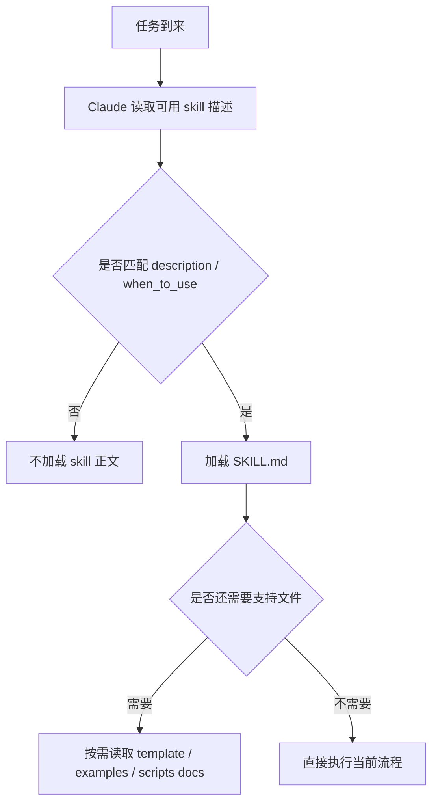
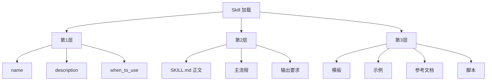

<KnowledgeMap current-module="tools" current-article="Agent Skills" />

# Agent Skills：把可复用流程变成 Claude 能自动调用的能力目录

<ArticleHeader
  module="工具与框架"
  :tags="['工程']"
  reading-time="18 分钟"
  prerequisite="理解 Tool Use、MCP、Harness 与项目规则文件的作用"
  summary="在 Claude Code 语境里，skill 不是抽象意义上的知识包，而是一个以 `SKILL.md` 为入口、带 frontmatter、支持自动发现、按需加载、直接调用和附属文件的能力目录。它解决的是：如何把经常重复的流程、检查清单、模板和脚本，变成 Claude 可以稳定复用的本地能力。"
/>

## 为什么要重讲 Skills

我前一版把 skill 讲成了比较泛化的“流程知识包”，这个方向不算错，但还不够贴近 Claude Code 的真实用法。

在 Claude Code 里，skills 更具体：

- 它们有明确目录结构
- 有 `SKILL.md` 入口文件
- 有 YAML frontmatter
- 能被自动发现
- 可以自动触发，也可以通过 `/skill-name` 直接调用
- 可以带模板、脚本、示例和参考资料

所以它不只是“一个好思路”，而是一个明确可落地的能力组织标准。

<div class="key-insight">
  <div class="key-insight-label">核心洞察</div>
  <p class="key-insight-text">
    Claude Code 里的 skill，不是“更长的 prompt”，而是一个以 `SKILL.md` 为入口、带描述、触发规则、支持文件和调用控制的能力目录。它让重复流程从临时对话指令，变成可自动发现、按需加载、可持续维护的局部能力。
  </p>
</div>

## Skills 解决的是什么问题

当你不断把同一类内容粘贴进聊天窗口时，例如：

- 一套代码审查清单
- 一套发布流程
- 一套 README 更新规范
- 一套特定项目的调试手册

其实就在暴露一个问题：

`这已经不是临时指令，而是可复用程序。`

如果继续把这些内容写在对话里，会有几个问题：

- 每次都要重新粘贴
- 对话一结束就丢
- 长文档会占上下文预算
- 很难带上模板、示例和脚本

skills 正是为这类问题设计的。

## Claude Code 语境里 Skill 到底是什么

一个更准确的定义是：

`Skill = 一个以 SKILL.md 为入口、可被 Claude 自动发现和按需加载的能力目录`

它通常包含：

- 一个 `SKILL.md`
- frontmatter
- 正文说明
- 可选支持文件

最小结构通常像这样：

```text
my-skill/
├── SKILL.md
├── reference.md
├── examples.md
└── scripts/
   └── helper.sh
```

这里最关键的是：

- `SKILL.md` 是入口
- 其他文件是按需加载的支持资源

## Skill 的入口文件为什么是 `SKILL.md`

因为 Claude 需要一个统一入口来知道：

- 这个 skill 叫什么
- 什么时候该用
- 被调用后要遵循什么说明

这也是为什么 `SKILL.md` 是唯一必需文件，而其他内容都是可选增强。

## `SKILL.md` 不是普通 Markdown

它一般分成两部分：

1. YAML frontmatter
2. Markdown 主体

示意如下：

```md
---
name: explain-code
description: Explains code with diagrams and analogies
---

When explaining code:
1. Start with an analogy
2. Draw a diagram
3. Walk through step by step
```

其中最关键的往往不是正文，而是前面的元信息。

## 为什么 frontmatter 这么关键

在 Claude Code 里，skill 的 `description` 不只是给人看的说明，它直接关系到：

- Claude 是否知道这个 skill 存在
- Claude 何时自动触发它
- `/` 菜单里如何展示它

所以一个 skill 写得好不好，往往先输赢在 frontmatter。

## 官方文档里最关键的几个字段

最常见也最值得先理解的字段包括：

- `name`
- `description`
- `when_to_use`
- `disable-model-invocation`
- `user-invocable`
- `allowed-tools`
- `context`
- `paths`

这些字段不是“锦上添花”，而是 skill 行为的控制面。

## 先看一张 Skills 触发图



这张图说明了一件特别重要的事：

`skill 的自动触发，先靠描述被看见，再靠正文被加载。`

## 为什么它和 Prompt 不是一回事

这也是最容易混淆的点。

### Prompt 更像

- 当前这轮临时指令
- 反应式说明
- 会随着对话结束而消散

### Skill 更像

- 可长期存在的本地能力目录
- 可以自动发现
- 可以直接 `/name` 调用
- 可以只在相关时才把正文读入上下文

所以：

`Prompt 是对话里的临时指挥，Skill 是可复用能力的本地安装包。`

## 它为什么比 `CLAUDE.md` 更适合流程程序

官方文档里有一句很重要的意思：

当 `CLAUDE.md` 里的某部分已经演变成“程序”而不是“事实”时，就应该考虑做成 skill。

这背后其实是在区分两种内容：

### `CLAUDE.md` 更适合

- 长期规则
- 项目事实
- 常设约束

### Skill 更适合

- 某类流程
- 某类操作步骤
- 某类检查清单
- 某类需要模板或脚本支持的任务

也就是说：

- `CLAUDE.md` 更像长期宪法
- skill 更像按需调用的 SOP

## Progressive Disclosure 为什么是 Skills 的核心设计

你给的参考文章里讲得很对，这里的关键就是 `progressive disclosure`，也就是渐进式披露。

在 skills 体系里，它体现为三层：

1. 先只暴露简短描述
2. 真相关时再加载完整 `SKILL.md`
3. 真需要时才继续读附属文件

这能解决两个大问题：

- 不让长文档一上来就占满上下文
- 让 skill 可以带很多资源，却不至于每次都全量加载

## 一张渐进式披露脑图



这也是为什么 skill 可以很强，但又不会像“把整个手册塞进 system prompt”那样粗暴。

## Skills 的目录位置为什么也很重要

Claude Code 里，skill 放在哪儿，会决定它的作用范围。

常见范围包括：

- 个人级
- 项目级
- 企业级
- 插件级

这意味着 skill 不只是“一个文件夹”，而是带有作用域的能力单元。

例如：

- 个人技能适合你的通用工作习惯
- 项目技能适合某个仓库的特定流程
- 企业技能适合团队共享规范

## 自动发现意味着什么

自动发现是 Claude Code skill 非常强的一点。

它不要求你每次都手工注册所有内容。  
只要目录结构和位置符合规则，Claude 就能发现这些 skill。

这带来的变化非常大：

- 能力变成本地安装资产
- 不再依赖某次聊天中临时提到
- 项目目录本身就可以携带自己的 skill

对于 monorepo 或复杂工程，这一点尤其有价值。

## 什么时候自动触发，什么时候手动触发

Skill 有两种主要使用方式：

### 自动触发

Claude 根据 `description` 和 `when_to_use` 判断当前任务是否相关，然后自动加载。

### 手动触发

你直接用 `/skill-name` 调用。

这两种方式适合不同内容。

## 什么样的 skill 适合自动触发

更适合自动触发的通常是：

- 背景知识
- 风格规范
- 某类高频任务指导
- 与某类文件或路径强相关的辅助规则

## 什么样的 skill 适合手动触发

更适合手动触发的通常是：

- 有明显副作用的工作流
- 部署、提交、发布这类敏感动作
- 你希望自己明确决定何时执行的流程

这就是为什么 `disable-model-invocation: true` 很关键。  
它不是附加参数，而是在告诉系统：

`这个 skill 只能由人主动拉闸。`

## 调用控制是 Claude Code skills 的关键增强点

这一点和“泛泛而谈的 skill 概念”最大的区别就在这里。

在 Claude Code 里，你不仅能定义 skill 做什么，还能控制：

- 谁可以调用它
- Claude 能不能自动调用
- 用户能不能在 `/` 菜单直接看到
- skill 活动时是否预批准某些工具

这让 skill 不只是内容组织方式，更是局部治理机制。

## `allowed-tools` 为什么非常重要

假设你有一个 `/commit` skill。  
它的核心流程很明确，但如果每一步 git 命令都重新审批，体验会很差。

这时 `allowed-tools` 的作用就是：

- 在 skill 激活期间预授权部分工具
- 让该 skill 对应的局部流程更顺畅

这说明 skills 不只是说明文档，还能影响运行权限体验。

## Skill 内容生命周期也很关键

很多人会误以为：

- Claude 每轮都会重新去读 skill 文件

其实不是这么简单。

官方文档里一个很重要的点是：

- skill 被调用后，其渲染内容会进入当前对话
- 后续会继续留在会话中
- 自动压缩后，系统会尝试重新附加最近调用的 skills

这意味着 skill 的效果并不只是一瞬间。

但也意味着：

- skill 太多会互相竞争上下文
- 过大的 skill 会在 compact 后丢失更多内容

所以 skill 的大小和结构，真的会影响长期表现。

## 支持文件不是摆设

Claude Code skill 的另一大特点是支持目录化支持文件，例如：

- 模板
- 示例
- 参考文档
- 可执行脚本

这非常关键，因为它让 skill 从“说明”变成“能力组合”。

一个很实用的结构通常像：

```text
readme-update/
├── SKILL.md
├── template.md
├── examples.md
└── scripts/
   └── collect_changes.py
```

这里的分工可能是：

- `SKILL.md` 讲主流程
- `template.md` 约束输出格式
- `examples.md` 告诉 Claude 什么是好结果
- `script` 负责确定性动作

## 一个贴近本站的例子：README 更新 Skill

对于这个站点来说，一个很自然的 skill 就是 `README 更新`：

- 什么时候必须更新
- 更新哪些栏目
- 本轮新增了什么文章
- 怎样写摘要而不夸张
- 是否要调用脚本辅助收集文件变化

这类东西如果只靠每次临时口头提醒，很容易漂移。  
做成 skill 之后，它就从“记忆负担”变成“稳定资产”了。<mccoremem id="03g3scg169nl5yq6v52ylnpz3|01KRCW3RP7JWJ1YTBGYERJHTGV" />

## Skill 和 MCP、Tool、Harness 的边界

| 概念 | 主要解决什么 | 更像什么 |
| --- | --- | --- |
| Tool | 让模型能做动作 | 动作接口 |
| MCP | 让外部能力可标准化接入 | 接入层 |
| Skill | 把流程与说明组织成本地能力目录 | 能力目录 |
| Harness | 把系统维持在有界秩序中 | 控制结构 |

所以：

- MCP 不是教方法
- Tool 不是教流程
- Harness 不是局部技能目录
- Skill 则刚好负责“这类事通常怎么做”

## 一个很实用的分类：参考型 skill 和任务型 skill

Claude Code 文档里其实给了一个很有用的区分。

### 参考型 skill

更适合承载：

- 约定
- 规范
- 风格指南
- 项目知识

它更像背景知识能力。

### 任务型 skill

更适合承载：

- deploy
- commit
- release
- codegen
- report generation

它更像明确工作流，很多时候更适合手动触发。

这个区分特别重要，因为它直接影响：

- frontmatter 怎么写
- 是否允许自动调用
- 是否需要预批准工具

## Skill 设计时最容易写错的地方

### 1. `description` 写成第一人称

例如：

- “我可以帮助你……”
- “你可以让我……”

这类写法往往不如第三人称、任务导向描述稳定。

更好的方式通常是：

- “处理 Excel 并生成报告”
- “在解释代码时使用类比和图示”

因为 description 的目标是帮助 Claude 判断何时触发，不是写广告词。

### 2. `SKILL.md` 过长

如果主文件太长，skill 会变重，也更容易在上下文里失焦。

### 3. 把所有内容塞进正文，不拆支持文件

这样会失去渐进式加载的优势。

### 4. 把高风险动作也交给自动触发

部署、提交、发消息这类事情，通常更适合禁用自动调用。

## Skill 什么时候最值得做

下面这些信号通常说明你该做 skill，而不是继续用 prompt：

- 同一套说明反复粘贴
- 某类任务已经形成稳定流程
- 需要模板、示例或脚本一起配合
- 你希望项目目录自己带着这份能力
- 你希望 Claude 在相关任务里自动想起它

## 常见失败模式

### 失败一：把 skill 当成巨型 prompt

只写一大段正文，不设计 frontmatter、调用方式和支持文件。

### 失败二：description 太差

Claude 根本不知道什么时候该用它。

### 失败三：skill 太大

上下文负担过重，效果反而变差。

### 失败四：高风险任务允许自动触发

最后变成系统自己想部署、自己想提交。

### 失败五：skill 目录没有维护

模板过期、脚本失效、说明和项目实际流程脱节。

## 本节总结

- 在 Claude Code 里，skill 是一个以 `SKILL.md` 为入口的能力目录，不只是抽象知识包
- 它依赖 frontmatter、自动发现、按需加载、支持文件和调用控制
- `description`、`when_to_use`、`disable-model-invocation`、`allowed-tools` 等字段直接决定它怎么被使用
- Skill 最适合承载那些反复出现、已形成流程、需要模板或脚本支持的任务
- 它和 Prompt、Tool、MCP、Harness 各自处在不同层级

## 下一步

- 回到 [Harness 设计](./harness-design)，理解 Skill 是怎样嵌进更大的控制结构里的
- 或继续阅读 [Harness 与 Skill 的评估体系](../06-eval-evolution/harness-skill-evaluation)，看这些能力该如何被评估
