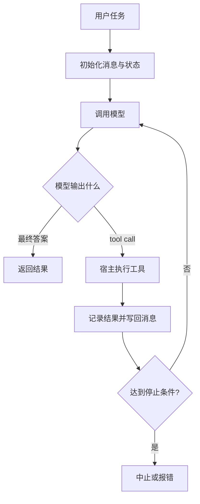
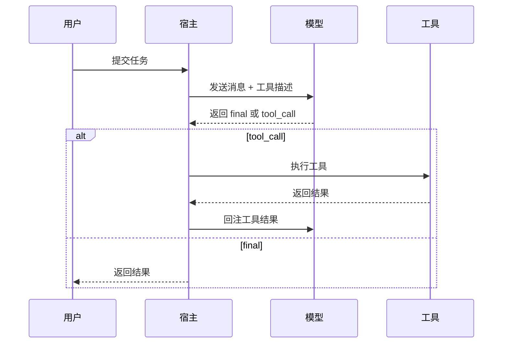
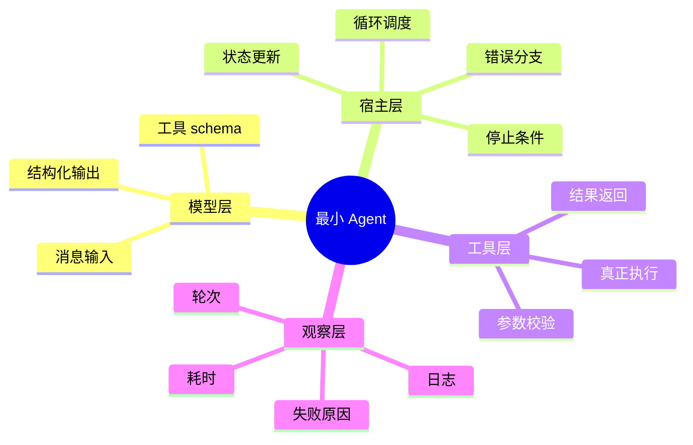

<KnowledgeMap current-module="tools" current-article="从零手写 Agent" />

# 从零手写 Agent：为什么这件事值得做

<ArticleHeader
  module="工具与框架"
  :tags="['实战']"
  reading-time="17 分钟"
  prerequisite="理解 Tool Use 和 Agent 基本闭环"
  summary="手写一个最小 Agent 的价值，不是为了重复造轮子，而是为了理解框架到底替你做了哪些事情、隐藏了哪些复杂度。"
/>

## 一个最小 Agent 至少包含什么

- 模型调用
- 工具描述
- 工具执行器
- 对话状态
- 错误处理
- 停止条件

<div class="key-insight">
  <div class="key-insight-label">核心洞察</div>
  <p class="key-insight-text">
    从零手写 Agent 的价值，不在于替代框架，而在于让你真正看见 Agent 是由哪些控制逻辑、上下文策略和工具机制拼出来的。
  </p>
</div>

## 先看一张运行时总图



这张图里最关键的部分其实不是模型，而是宿主对循环的控制权。

## 为什么这件事值得做

很多人一开始接触 Agent，就直接进入框架：

- 装一个库
- 写几个装饰器
- 注册几个工具
- 跑一个 demo

这样当然能很快得到结果，但也很容易留下一个问题：

你知道“怎么用”，却不知道“为什么这样工作”。

一旦系统出现下面这些问题，你就会明显感觉吃力：

- 为什么模型一直重复调用工具
- 为什么上下文越来越长，结果越来越差
- 为什么工具明明可用，但模型就是不用
- 为什么一个看起来简单的任务，框架跑起来却非常不稳定

从零手写一个最小 Agent 的价值，就在于它能帮你把这些问题拆回到底层结构。

框架当然能快速让你起步，但它往往把最关键的几层隐藏起来：

- 状态在什么时候更新
- 工具结果以什么格式写回
- 失败时是否重试
- 什么时候认为任务已经结束

而这些，恰恰是决定系统稳定性的核心逻辑。

## 手写 Agent 到底不是为了什么

先避免两个常见误解。

### 误解一：手写 Agent 是为了证明框架没用

不是。框架的价值非常大，它能帮你节省大量工程重复工作。

手写 Agent 的真正意义是：

- 看清框架帮你做了什么
- 看清框架隐藏了什么复杂度
- 知道什么时候该依赖框架，什么时候该自己接管关键逻辑

### 误解二：一个 Agent 只是“模型 + 工具”

这也不完整。一个真正能跑起来的 Agent，通常至少是：

`模型 + 状态 + 工具 + 控制逻辑 + 停止条件 + 错误恢复`

如果缺了后面几项，系统很容易在真实任务里失控。

## 再看一张时序图：谁在真正控制流程



这个时序图非常适合打破一个常见误解：

`Agent 不是模型自己在运行，而是宿主不断调度模型与工具形成的循环。`

## 最小 Agent 的基本结构

可以先把一个最小 Agent 理解成下面这条循环：

```text
接收任务
  -> 准备上下文
  -> 调用模型
  -> 判断是回答还是调用工具
  -> 执行工具并回写结果
  -> 再次调用模型
  -> 达到停止条件后输出结果
```

这里最关键的不是“模型会不会思考”，而是：

- 宿主如何组织上下文
- 宿主如何执行工具
- 宿主如何判断什么时候停

## 你会真正看见哪些关键部件

### 1. 模型调用层

这一层负责：

- 准备输入消息
- 调用 LLM
- 接收结构化输出

如果没有这一层，你根本无法把工具描述、历史上下文和系统约束正确放进去。

### 2. 工具描述层

模型并不会自动理解你的本地函数。你需要明确告诉它：

- 这个工具叫什么
- 这个工具做什么
- 它接受什么参数
- 在什么场景下应该调用

这一步其实就是把“外部能力”翻译成模型可理解的接口描述。

### 3. 工具执行层

即使模型发出了工具调用意图，真正执行动作的也不是模型，而是宿主程序。

这一步负责：

- 验证参数
- 执行真实函数
- 获取结果
- 把结果写回上下文

### 4. 状态管理层

如果没有状态管理，Agent 每一轮都会像失忆一样重新开始。

状态通常包括：

- 用户目标
- 历史消息
- 工具调用结果
- 当前阶段信息

### 5. 停止条件

这是很多入门实现最容易忽略的一层。

一个 Agent 如果没有清晰停止条件，常见结果就是：

- 一直继续调用模型
- 反复重复某个工具
- 在已经足够的信息上继续无意义推理

所以你必须显式定义：

- 什么时候认为任务已经完成
- 什么时候应该中止
- 什么时候应该报错而不是继续尝试

## 其实还有第六层：可观测性

一个 demo 可以没有可观测性，但一个稍微真实一点的 Agent 系统很快就会需要：

- 每轮输入输出记录
- 工具调用日志
- 失败原因记录
- 耗时和轮次统计

因为没有这些信息，你几乎无法判断系统到底在什么环节变差。

## 一个简化的最小实现

下面是一个非常简化的示例：

```python
def run_agent(user_task, llm, tools, max_steps=6):
    messages = [
        {"role": "system", "content": "你是一个可以调用工具完成任务的 Agent。"},
        {"role": "user", "content": user_task},
    ]

    for _ in range(max_steps):
        result = llm.chat(messages=messages, tools=tools)

        if result["type"] == "final":
            return result["content"]

        if result["type"] == "tool_call":
            tool_name = result["tool_name"]
            args = result["arguments"]
            tool_output = execute_tool(tool_name, args)

            messages.append({"role": "assistant", "content": str(result)})
            messages.append({"role": "tool", "content": str(tool_output)})
            continue

    return "任务未在限制步数内完成"
```

这段代码很粗糙，但已经能体现出最核心的 Agent 结构：

- 模型决定下一步动作
- 宿主执行真实工具
- 工具结果被回写到上下文
- 整个系统在循环中推进
- 宿主通过 `max_steps` 控制停止边界

## 如果把这段代码拆成模块，会更清楚



这样你会更直观地发现：框架平时“帮你很多”的地方，大多就在宿主层和观察层。

## 真实系统里最容易遇到的 5 个问题

### 问题一：工具描述不清

如果工具说明写得太模糊，模型就容易：

- 不知道该不该用
- 用错参数
- 在错误场景调用

### 问题二：上下文越滚越长

所有工具结果都直接原样塞回去，会很快占满上下文窗口。

这时你就会发现，Agent 不只是“会调用工具”就够了，还需要：

- 摘要能力
- 状态压缩
- 选择性保留历史

### 问题三：缺乏失败恢复

现实里的工具调用会失败，例如：

- 参数错误
- 网络失败
- 权限不足
- 返回内容为空

如果 Agent 没有恢复逻辑，就会卡在一次失败上。

### 问题四：停止条件不合理

太早停止，会让任务半途而废；太晚停止，又会浪费大量 token 和时间。

### 问题五：把所有逻辑都交给模型

模型适合做判断和语言层面的推理，但不适合承担全部流程控制。很多关键逻辑更应该由宿主代码明确实现。

### 问题六：缺乏状态摘要

如果每轮都把全部工具结果原样保留，上下文窗口很快会被历史信息吃满。  
所以一个稍微成熟一点的 Agent，通常都会引入：

- 历史压缩
- 中间状态摘要
- 已完成步骤记录

这也是为什么“从零手写 Agent”最终会自然连接到 `Context Engineering` 和 `Memory`。

## 一个更像工程系统的最小运行时

真正实用的最小 Agent，往往不是再多加一个花哨能力，而是补齐下面几个控制点：

1. `step budget`：最多跑几轮
2. `tool timeout`：工具多久算失败
3. `retry policy`：失败后是否重试
4. `state summary`：历史如何压缩
5. `validation hook`：输出前要不要验证

这些能力加起来，才让系统从“能跑”变成“可控”。

## 手写之后你会更理解框架的什么价值

当你自己写完一个最小 Agent，就会更清楚框架主要替你解决了哪些问题：

- 工具注册和结构化描述
- 消息状态管理
- 循环调度
- 错误恢复与重试
- 可观测性与日志
- 多 Agent 编排

这时你再回头用框架，心态就会变成：

`我是在借助框架提升工程效率，而不是把系统理解完全外包给框架`

LangChain 1.0 和 LangGraph 1.0 在 2025 年公开资料里，也把重点放在 core loop、middleware、durable state 和 long-running runtime 上。这恰好说明：成熟框架真正解决的是运行时控制与工程稳定性，而不只是“把模型接起来”。[LangChain and LangGraph Agent Frameworks Reach v1.0 Milestones](https://blog.langchain.com/langchain-langgraph-1dot0/) [Agents](https://docs.langchain.com/oss/javascript/langchain-agents)

## 什么时候该手写，什么时候该上框架

### 更适合先手写的情况

- 你正在学习 Agent 的内部结构
- 你需要完全理解关键控制逻辑
- 你的任务流程还很简单

### 更适合上框架的情况

- 你已经明确系统需求
- 需要更好的工程组织和可维护性
- 需要更多观测、编排和扩展能力

## 一个实用判断：你现在卡在哪一层

如果你当前主要卡在：

- “不知道 Agent 为什么这样跑”
- “分不清模型责任和宿主责任”
- “看不懂工具调用为什么失控”

那更适合先手写一个最小版本。

如果你当前主要卡在：

- “任务越来越复杂”
- “需要持久状态和恢复能力”
- “需要多 Agent 编排和观测”

那更适合引入框架。

## 一个实用建议

最好的方式通常不是二选一，而是：

1. 先手写一个最小 Agent
2. 用它理解工具、状态、上下文和停止条件
3. 再上框架，把重复工程交给框架处理
4. 保留对关键逻辑的可控权

这样你既不会只停留在 demo 层，也不会陷入“重复造轮子”的低效状态。

## 本节总结

- 手写 Agent 的价值是理解结构，而不是替代框架
- 一个最小 Agent 至少包含模型调用、工具描述、工具执行、状态管理和停止条件
- 真实问题往往出在上下文管理、失败恢复和流程控制，而不只是模型本身
- 先手写再用框架，通常比一开始只依赖框架更容易建立稳固理解

## 下一步

如果你已经理解了最小 Agent 的结构和宿主责任，下一步建议进入 [奖励函数设计](../06-eval-evolution/reward-function-design)，看看当系统开始迭代优化时，目标函数为什么会直接决定 Agent 的进化方向。
