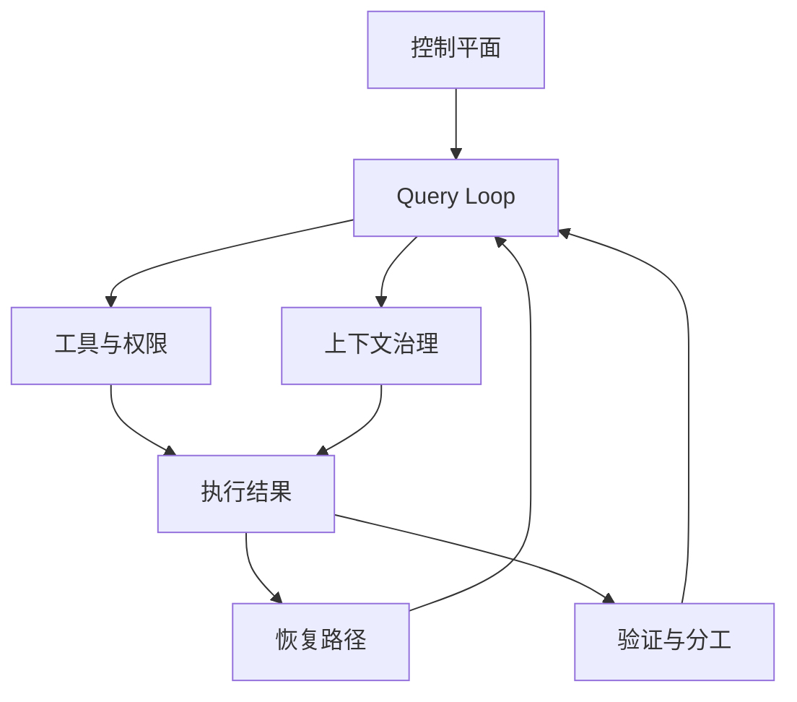
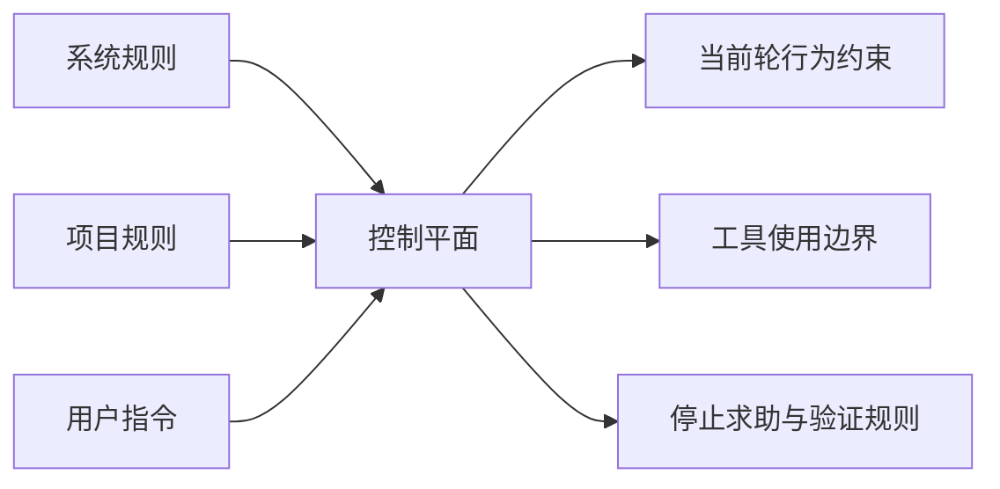
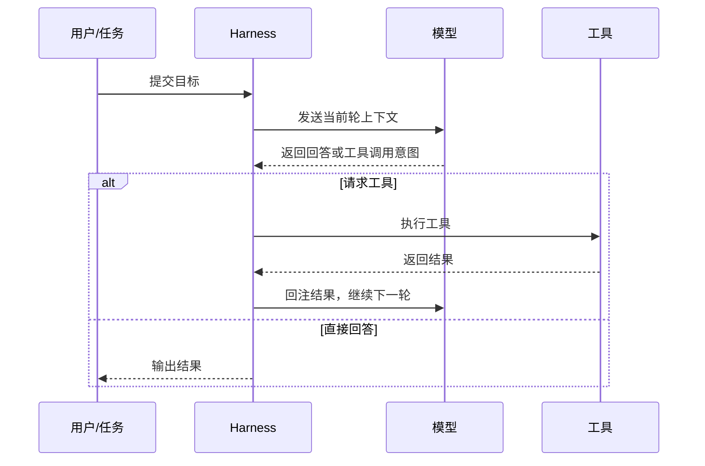
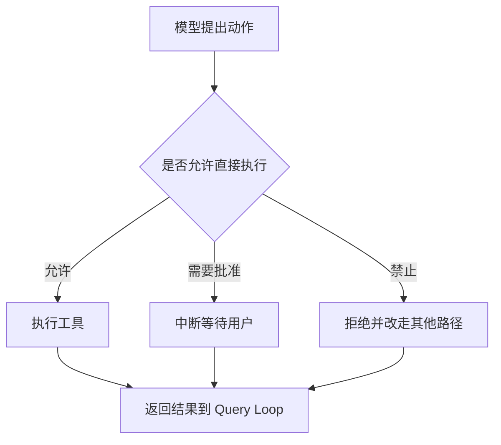
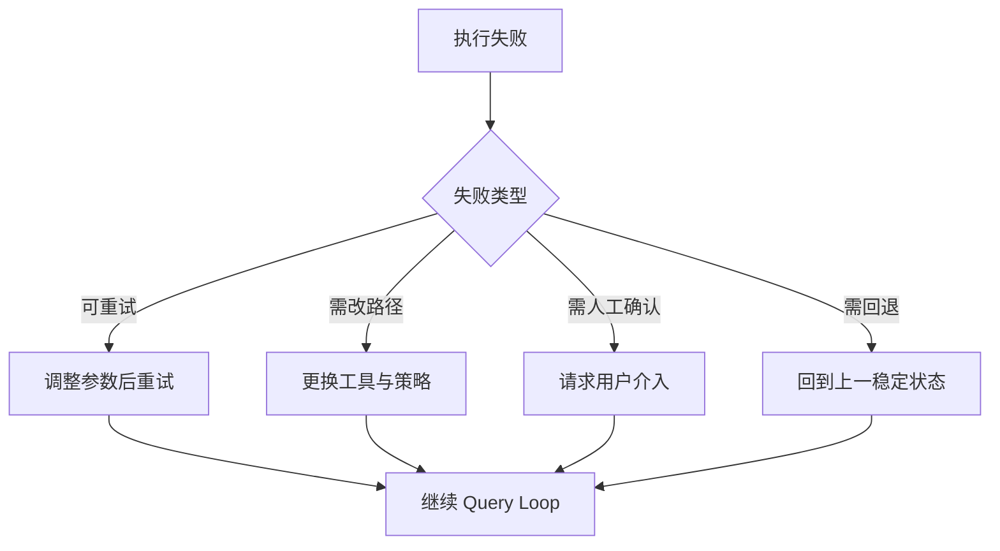
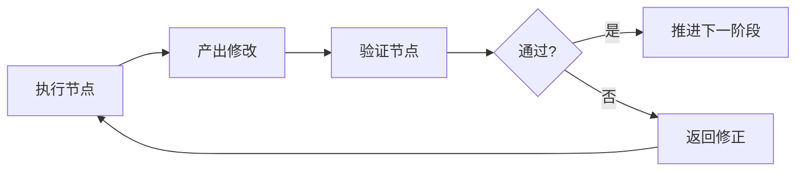

---
title: Harness 设计
description: Harness 不是包装层小技巧，而是控制平面、query loop、权限、恢复与验证共同组成的控制结构
module: tools
tags:
  - 工程
---

<KnowledgeMap current-module="tools" current-article="Harness 设计" />

# Harness 设计：不是外壳，而是 Agent 系统的控制结构

<ArticleHeader
  module="工具与框架"
  :tags="['工程']"
  reading-time="18 分钟"
  prerequisite="理解 Agent 基本闭环、工具调用、Context Engineering 与长任务问题"
  summary="Harness 更准确的含义，不是一个包住 Agent 的外壳，而是把不稳定模型约束进工程秩序里的整套控制结构。它涉及控制平面、query loop、工具权限、中断、上下文治理、恢复路径、验证分工和团队落地方式。"
/>

## 为什么要重讲 Harness

很多人第一次接触 `harness`，会把它理解成：

- 一个运行时外壳
- 一个更大的 prompt
- 一个会话续接层
- 一个帮 Agent 跑起来的脚手架

这些理解不是完全错，但都偏窄。

如果只这样理解，你会看不见 harness 真正关键的部分：

- 谁控制系统
- 任务一轮轮怎么推进
- 哪些动作允许发生
- 出错后如何恢复
- 上下文预算如何治理
- 验证与分工如何压住不稳定性

`Harness engineering` 更接近一种控制结构设计，而不是一个“附加层”。

  
核心洞察

  

    Harness 的重点，不是给模型再包一层，而是把一个天然不稳定的模型，放进有控制平面、权限边界、上下文治理、恢复路径和验证纪律的工程秩序里。
  

## Harness 到底是什么

结合 Claude Code 这类系统更准确的语境，一个实用定义是：

`Harness = 让 Agent 系统保持有界、可问责、可恢复的控制结构`

它通常至少涉及这几部分：

- 控制平面
- query loop
- 工具与权限
- 上下文治理
- 错误恢复
- 验证分工
- 团队落地规则

所以 Harness 不是“一个组件”，更像是一整套 runtime skeleton。

## 先看总图

这张图最关键的含义是：

`Harness 不是单点能力，而是把多个约束面编织成一套闭环。`

## 为什么 Harness Engineering 会出现

当模型只在聊天窗口里回答问题时，系统还比较单纯。  
但一旦模型接上：

- 终端
- 仓库
- 文件系统
- 浏览器
- 团队工作流

问题就变了。

这时系统的中心不再只是“模型会不会写代码”，而是：

`怎么防止一个会写代码的模型把工程系统带偏。`

这也正是 harness books 这类资料强调的中心：真正的重点不是模型能力，而是控制平面、主循环、权限、上下文治理、恢复路径和验证分工如何一起维持秩序。

## 第一层：Prompt 不是人格，而是控制平面

这是理解 harness 的第一步。

很多人把 prompt 当成“给模型一点任务说明”。  
但在 coding agent 系统里，prompt 往往承担的是更接近控制平面的角色：

- 定义角色边界
- 定义工作纪律
- 定义禁止事项
- 定义遇到异常时的处理方式
- 定义何时该问、何时该停、何时该验证

所以这里的 prompt，不是“模型性格设定”，而是控制规则的一部分。

## 一张控制平面图

你可以把控制平面理解成：  
不是告诉模型“你是谁”，而是告诉系统“这轮如何被允许运行”。

## 第二层：Query Loop 才是 Agent 系统的心跳

Harness 的第二个核心，不是静态规则，而是系统如何一轮一轮运转。

也就是常说的 `query loop`：

1. 读取当前上下文与状态
2. 调模型
3. 判断输出是什么
4. 如果要调工具，则执行工具
5. 把结果写回
6. 再进入下一轮

这个循环看起来简单，但真实系统的很多稳定性都靠它。

## 一张 Query Loop 时序图

这里最重要的一点是：

`系统真正的心跳不在模型里，而在 harness 驱动的 query loop 里。`

## 第三层：工具、权限与中断

很多教程在讲 Agent 时，会默认模型“会调用工具”。  
但真实系统里，模型并不能直接触碰世界。

在 coding agent 场景里，必须明确：

- 哪些工具可用
- 哪些命令需要批准
- 哪些动作必须中断等待确认
- 哪些执行策略要被 sandbox 限制

也就是说，工具不是“给模型一双手”，而是“在权限策略下借给它一双手”。

## 一张权限与中断图

这也是为什么 harness 不是“让模型自主”，而是“在边界内让模型行动”。

## 第四层：Context Governance

很多人把上下文问题理解成：

- 窗口不够大
- 历史太长
- 需要压缩一下

但在 harness 视角里，问题更像是：

`上下文预算如何被治理。`

这意味着你要决定：

- 哪些内容进入当前轮
- 哪些内容只保留为长期规则
- 哪些历史需要 compact
- 哪些信息应该写进项目规则文件
- 哪些中间产物必须外化到文件，而不是一直留在对话里

所以 context governance 不只是“省 token”，而是对系统注意力做预算分配。

## Harness 里的上下文不只是一段聊天记录

在 Claude Code 语境里，和上下文治理相关的常见部分包括：

- 当前用户任务
- 系统与开发者规则
- 项目规则文件，如 `CLAUDE.md`
- 工具返回结果
- compact 后的摘要
- 当前轮刚激活的 skill

所以 harness 不是简单“记住更多”，而是安排：

- 什么长期驻留
- 什么按需激活
- 什么只在当前轮出现

## 第五层：错误与恢复

真正成熟的 harness，不以“不会失败”为前提，而以“失败后还能继续工作”为目标。

常见失败包括：

- 工具报错
- 路径错误
- 命令超时
- 权限被拒
- 上下文偏航
- 子任务结论不可靠

Harness 需要给出恢复路径，而不是把失败理解成系统终点。

## 一张恢复路径图

这说明 harness 设计的重点之一，不是“避免所有错”，而是“把错误放进可恢复框架里”。

## 第六层：验证与分工

长任务系统之所以危险，不只是因为模型会犯错，还因为它会把错一路带下去。

因此很多 coding harness 会天然生长出：

- verification steps
- reviewer 角色
- test/build hooks
- 多 Agent 分工

本质上是在做一件事：

`用验证和分工来管理不稳定性。`

## 一张验证闭环图

所以多 Agent 在这里不是“功能炫技”，而是 harness 对不稳定模型的一种治理方式。

## 第七层：团队落地与本地治理

Harness 真正成熟的标志，不是你自己会用，而是团队可以稳定复用。

这时系统会开始关心：

- 团队规则放在哪里
- 本地项目如何定义自己的行为边界
- hooks 和 skills 如何形成局部治理
- 个人习惯如何被收束成团队规范

这也是为什么 harness 最后一定会走向：

- 项目级规则
- 路径级规则
- 可执行清单
- 团队使用约束

否则它只能算一个聪明工具，算不上可持续工作流。

## Harness 和“外壳”说法的差别

现在可以解释为什么我前一版写成“外壳”并不准确。

“外壳”这个词容易让人误以为：

- 它只是包住模型的一层
- 它主要负责会话续接
- 它更像一个技术封装件

但 harness engineering 的重点更接近：

- 权力如何分配
- 信任如何被约束
- 控制如何被实施
- 错误如何被治理

所以更准确的词是：

`控制结构`、`runtime skeleton`、`control regime`

而不只是“外壳”。

## Harness 和 Workflow、Framework、Skill 的区别

| 概念 | 主要解决什么 | 更像什么 |
| --- | --- | --- |
| Workflow | 固定步骤怎么排 | 流程骨架 |
| Framework | 开发抽象怎么搭 | 工程工具箱 |
| Skill | 某类任务怎么做 | 局部知识包 |
| Harness | 整套系统如何保持有界与可控 | 控制结构 |

所以：

- Workflow 讲顺序
- Skill 讲局部方法
- Framework 讲实现抽象
- Harness 讲秩序与治理

## 什么时候你真的在面对 Harness 问题

下面这些症状通常说明你遇到的不是“prompt 还不够好”，而是 harness 问题：

- 系统会反复跑偏
- 任务中断后无法平稳续接
- 工具动作缺乏清晰权限边界
- 上下文越滚越乱
- 错误后不会恢复，只会卡死
- 验证步骤经常被跳过
- 团队每个人都在各自驯化模型，没有共同纪律

## 设计 Harness 时最该先想的 6 个问题

1. 控制平面由哪些规则组成
2. query loop 的停止、重试和回注如何设计
3. 工具权限与中断点如何设置
4. 上下文预算如何治理
5. 错误发生后有哪些恢复路径
6. 验证与分工如何压住模型不稳定性

如果这 6 个问题没有答案，系统通常还没真正进入 harness 设计阶段。

## 本节总结

- Harness 更准确的含义不是“外壳”，而是 Agent 系统的控制结构
- 它至少涉及控制平面、query loop、权限与中断、上下文治理、恢复路径、验证分工和团队落地
- 它关心的不是模型能不能做事，而是系统如何在不稳定模型上维持秩序
- 当 Agent 进入真实工程环境时，harness 往往比单纯换更强模型更重要

## 下一步

- 继续阅读 [Agent Skills](./agent-skills)
- 或回到 [系统概念关系图](../04-multi-agent/system-relations) 对照理解 Harness 在整套体系里的层级

