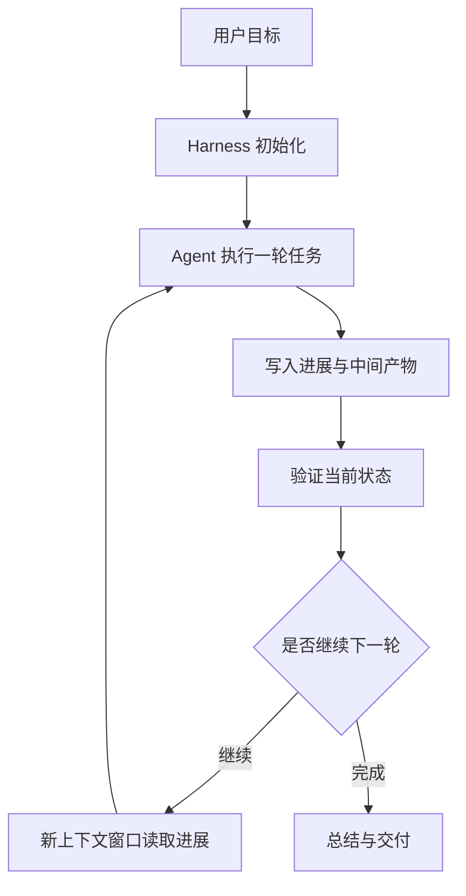
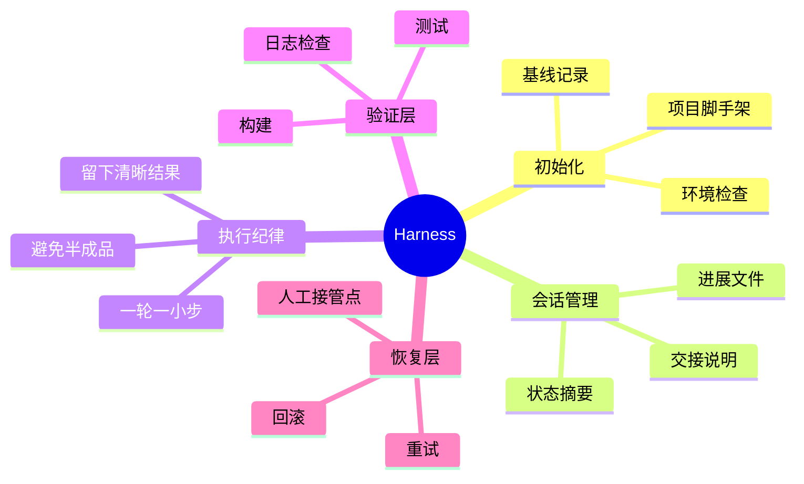
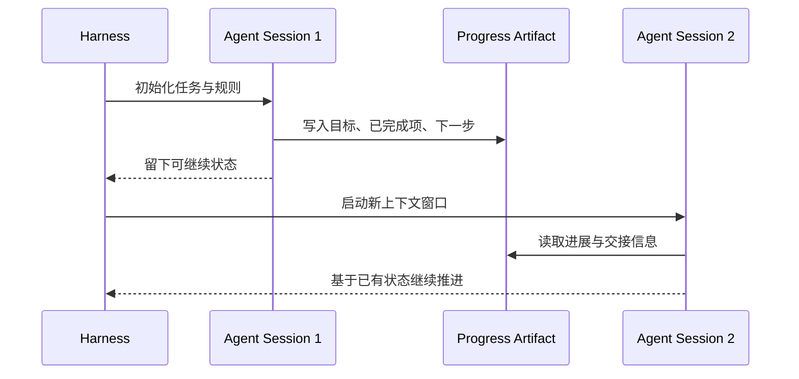

<KnowledgeMap current-module="tools" current-article="Harness 设计" />

# Harness 设计：让 Agent 能连续工作，而不是每轮重新开始

<ArticleHeader
  module="工具与框架"
  :tags="['工程']"
  reading-time="16 分钟"
  prerequisite="理解 Agent 基本闭环、Context Engineering 与工具调用"
  summary="Harness 不是另一个模型能力，而是包住 Agent 的运行时外壳。它负责环境准备、会话连续性、失败恢复、状态交接和执行纪律，决定系统能不能跨多个上下文窗口持续推进真实任务。"
/>

## 为什么现在必须理解 Harness

当 Agent 只做几轮问答时，很多问题还不明显。  
但一旦任务变成长任务，例如：

- 持续几个小时的编码任务
- 跨多个上下文窗口的项目推进
- 需要中途恢复、总结、继续的任务
- 多轮构建、测试、修复的工程流程

你就会发现一个事实：

`很多失败不是模型不够强，而是运行时外壳不够稳。`

也就是说，系统不是缺一个更聪明的大脑，而是缺一套能让这个大脑持续工作的工作纪律。

  
核心洞察

  

    Harness 的价值，不在于替代模型思考，而在于把 Agent 放进一个可持续推进、可交接、可恢复、可验证的运行时环境里。
  

## Harness 到底是什么

一个实用定义是：

`Harness = 包裹 Agent 的运行时控制层`

它通常负责：

- 初始化环境
- 规定工作节奏
- 保存和交接状态
- 约束每轮输出形式
- 处理失败和恢复
- 触发验证与收尾

所以 harness 不是“某一个 prompt”，也不是“某一个工具”，而是一套工作外壳。

## 先看一张总图

这张图说明了一件很重要的事：

`长任务不是一个超长对话，而是一系列被 harness 串起来的工作回合。`

## 为什么只靠 Compaction 不够

很多人第一次听到 long-running agent，会先想到：

- 上下文压缩
- 历史摘要
- 自动总结后接着跑

这些当然重要，但通常还不够。

原因在于，跨上下文窗口的问题不只是“记不记得前文”，还包括：

- 环境是否已经被正确初始化
- 当前代码状态是否干净
- 哪些子任务已经完成
- 哪些失败路径不该重复走
- 下一轮到底应该先做什么

也就是说，跨窗口连续性不只是一个“上下文压缩”问题，更是一个“工程状态交接”问题。

## 一个典型失败案例

假设你让一个 Agent 做下面这件事：

> 继续完善一个文档站，补充文章、调整侧边栏、构建验证并更新 README。

如果没有 harness，常见失败模式包括：

- 第一轮试图做太多事情，中途上下文耗尽
- 第二轮不知道上一轮改到哪里，重新扫描大量文件
- 第三轮看见页面“差不多了”，错误地宣布完成
- 某一轮把代码留在半成品状态，下一轮只能先救火

这类问题并不是模型不懂任务，而是系统没有给它留下清晰的“工作现场”。

## Harness 在解决哪几类问题

### 1. 会话连续性

任务跨多轮时，系统必须回答：

- 下一轮怎么知道上一轮做了什么
- 哪些结论应该留下
- 哪些临时噪声应该丢掉

### 2. 环境纪律

每一轮都应该尽量留下一个可继续工作的状态，而不是半残工程现场。

### 3. 任务节奏

Harness 往往会规定：

- 一轮应该推进到什么粒度
- 一轮结束前必须留下些什么
- 什么时候该总结、什么时候该验证

### 4. 失败恢复

真实任务里难免出现：

- 构建失败
- 工具超时
- 权限不足
- 任务中途偏航

Harness 的职责，就是让这些失败不至于把后续回合全部拖垮。

## 一个长任务 Harness 的典型结构

可以把它抽象成下面几层：

## Initializer 和 Worker 的两段式结构

一个很典型的 harness 设计，会把第一次运行和后续运行分开。

### Initializer

第一轮的目标通常不是“立刻把所有功能做完”，而是建立一个良好的起始环境，例如：

- 创建进展记录文件
- 建立项目基础结构
- 写清当前目标与阶段
- 留下初始基线和关键命令

### Worker / Coding Agent

后续每一轮则更强调：

- 做一小步可验证推进
- 更新进展记录
- 留下干净状态
- 为下一轮准备可读交接信息

这种设计非常像团队里的“开局搭脚手架 + 后续分阶段施工”。

## 一张时序图：多窗口任务如何交接

这里最关键的不是“保存历史对话”，而是“留下结构化进展产物”。

## 什么可以算作 Progress Artifact

Harness 里最重要的一个概念，就是给下一轮留下可读、可执行的中间产物。

典型的 progress artifact 可以是：

- 当前任务摘要文件
- 已完成步骤列表
- 待办清单
- 已验证结果
- 风险与阻塞说明
- Git 提交历史或阶段性变更说明

好的 artifact 通常具备三个特征：

- 信息密度高
- 面向下一轮可行动
- 明确区分事实、结论和下一步

## Harness 和 Prompt、Workflow、Framework 的区别

这是一个特别容易混淆的问题。

| 概念 | 更关注什么 | 典型职责 |
| --- | --- | --- |
| Prompt | 单轮指令 | 告诉模型这一轮怎么做 |
| Workflow | 固定流程 | 规定步骤顺序 |
| Framework | 开发抽象 | 帮你实现 Agent 运行时 |
| Harness | 运行纪律 | 让 Agent 跨轮持续推进真实任务 |

可以粗略理解成：

- prompt 解决“这轮怎么说”
- framework 解决“系统怎么搭”
- harness 解决“多轮怎么持续做成事”

## Harness 和 Multi-Agent 的关系

Harness 不等于多 Agent，但它们经常一起出现。

因为一旦系统变成：

- 长任务
- 多角色
- 多窗口
- 多阶段验证

就非常需要一个更强的外壳来管理：

- 谁在什么时候工作
- 每轮留下什么结果
- 失败后谁负责恢复

所以多 Agent 解决的是“如何分工”，harness 解决的是“如何让整套分工长期稳定运行”。

## Harness 和 Skill 的关系

这也是即将进入的另一个新知识点。

- `Skill` 更像是可复用的程序化知识包
- `Harness` 更像是让 Agent 稳定工作的运行纪律

Skill 负责“知道怎么做某类事”，Harness 负责“多轮任务怎么持续做下去”。

## 一个很实用的判断：什么时候你需要 Harness

下面这些信号通常说明你已经不该只靠 prompt 和对话了：

- 任务经常跨多个上下文窗口
- 系统经常重复做已经做过的事
- 后续回合读不懂前一回合留下的现场
- 任务经常在“差一点完成”时中断
- 构建、测试、清理这些工程动作需要被固定化

如果这些问题已经出现，通常就说明你需要的是 harness，而不是再补一句 prompt。

## 常见失败模式

### 失败一：一轮想做太多

这会导致中途耗尽上下文，留下大量半完成状态。

### 失败二：没有结构化交接

如果每轮只留下零散对话，没有清晰 artifact，下一轮就只能重新猜。

### 失败三：没有“干净状态”要求

如果每轮结束都可能留下未验证代码、残缺文件或混乱日志，系统会越来越难维护。

### 失败四：把 Harness 当成巨型 Prompt

Harness 当然会包含 prompt 规则，但它绝不只是“更长的提示词”。  
真正的 harness 还必须包含：

- 环境规则
- 状态工件
- 验证机制
- 交接格式

## 一种很实用的设计原则

如果你自己要设计 harness，可以先围绕这 4 个问题：

1. 新一轮启动时，Agent 最先该读什么
2. 一轮结束时，Agent 必须留下什么
3. 哪些验证必须在结束前跑完
4. 哪些状态绝不能留成半成品

只要这 4 个问题答得清楚，harness 通常就已经有雏形了。

## 本节总结

- Harness 是包裹 Agent 的运行时外壳，解决的是长任务、多轮、跨窗口连续性问题
- 它比 prompt 更宽，比 framework 更贴近任务运行纪律
- 好的 harness 会要求清晰进展记录、干净状态、分阶段推进和可恢复交接
- 当 Agent 开始跨会话持续工作时，harness 往往比再换一个模型更重要

## 下一步

- 继续阅读 [Agent Skills](./agent-skills)
- 或回到 [Orchestrator-Subagent](../04-multi-agent/orchestrator-subagent) 对照理解“分工结构”和“运行外壳”的差别
