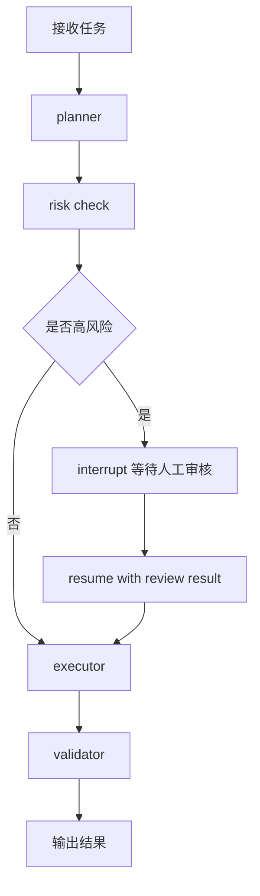
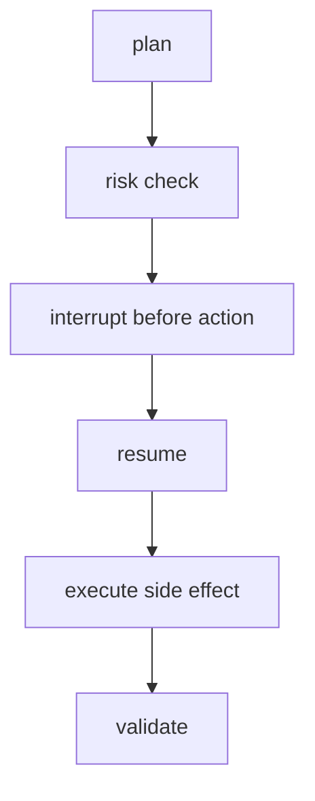
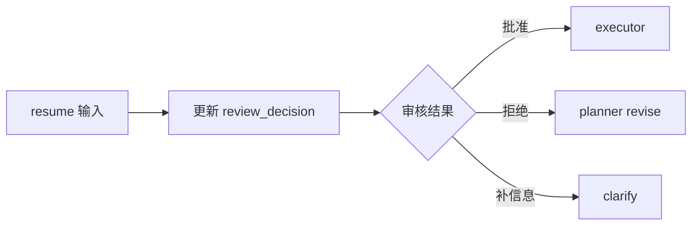

<KnowledgeMap current-module="tools" current-article="LangGraph Interrupt Resume 与 Human Review 实战" />

<ArticleHeader
  module="工具与框架"
  :tags="['工程', 'LangGraph', '实战']"
  reading-time="13 分钟"
  prerequisite="建议先读 LangGraph 原理 与 LangGraph 状态图设计实战"
  summary="很多人知道 LangGraph 支持 interrupt 和 resume，但真正难的是把人工审核、安全暂停、外部确认和副作用边界一起设计好。这一页专门讲一个可恢复工作流应该怎么拆。"
/>

# LangGraph Interrupt Resume 与 Human Review 实战

很多 Agent 工作流在 demo 阶段都很顺：

- 模型规划
- 调工具
- 产出结果

但一旦进入真实场景，很快就会出现这些需求：

- 高风险操作前要人工确认
- 某一步需要等用户补信息
- 外部系统返回慢，任务要先挂起
- 图跑到一半崩了，不能从头全跑

这时，普通的线性流程就不够了。  
你需要的不是“重试一次”，而是：

`让图在合适的位置停住，并且能带着现场继续回来`

这正是 `interrupt`、`resume` 和 `human review` 的工程价值。

## 先把三个概念分开

### interrupt

`interrupt` 的本质是：

`在图运行中的某个点主动暂停，并把当前状态交给外部处理`

### human review

`human review` 不是一个 API，而是一种业务场景：

`某些决策不能完全自动化，需要人介入确认或修改`

### resume

`resume` 的本质是：

`在保留线程上下文和状态的前提下，从中断点之后继续执行`

这三个概念通常连在一起出现，但不要混成一句模糊的话。

## 一个最常见的工作流

比如你在做一个“自动修改配置并发布”的 Agent：

1. 先分析需求
2. 生成修改计划
3. 识别高风险变更
4. 等人工批准
5. 执行修改
6. 做验证
7. 输出结果

这里最自然的做法不是把人工审批写在图外面，而是把它正式纳入图中。

## 一张最小流程图



这张图表达的核心是：

`人工审核不是图外的电话沟通，而是图内正式控制流的一部分`

## thread 为什么是第一前提

只要讲中断恢复，就必须先讲 `thread`。

你可以把 `thread` 理解成：

`一次持续工作流的主线身份`

围绕这个 thread，系统才能知道：

- 这是谁的任务
- 现在卡在哪一步
- 当前状态是什么
- 上次中断时留下了什么上下文

如果没有 thread，resume 就容易退化成：

`重新发一次请求，希望系统自己猜到之前发生过什么`

这在真实系统里几乎不可靠。

## checkpoint 不是附属能力，而是恢复基础

要想 resume，就必须有某种形式的 checkpoint。  
也就是：

`在关键步骤后，把足够恢复执行的状态保存下来`

这通常至少包括：

- 当前 `messages`
- 当前 `status`
- 当前 `current_step`
- 已有 `tool_results`
- 审核相关上下文

如果这些没有结构化保存，人工回来后你就只能重新跑。

## 一张恢复链路图


## 一个更合理的 state 设计

如果你的图涉及人工审核，state 里通常至少要把下面这些字段显式化：

```python
from typing import TypedDict, List, Optional


class ReviewState(TypedDict, total=False):
    messages: List[dict]
    current_step: str
    status: str
    plan: str
    risk_level: str
    review_required: bool
    review_comment: Optional[str]
    review_decision: Optional[str]
    tool_results: List[dict]
    final_answer: Optional[str]
```

这个结构的重点不是“字段越多越好”，而是要把人工审核真正需要的状态抽出来。

尤其要注意：

- `review_required` 用来决定是否中断
- `review_decision` 用来决定恢复后走哪条路
- `review_comment` 用来保存人类反馈，而不是把它混在普通对话里

## 为什么不要把审核结果只塞进 messages

当然可以把人工意见也写成一条消息。  
但如果完全只靠消息文本承载审核语义，后续会出现几个问题：

- 路由判断变得模糊
- 审核状态难以做结构化统计
- 不容易清晰区分批准、拒绝、要求重试

所以更稳的方式通常是：

- `messages` 保存语言上下文
- 独立字段保存审核结构化结果

## interrupt 最该放在哪

不是所有地方都适合 interrupt。  
最适合放中断点的位置通常有三类：

1. 高风险副作用之前
2. 需要人工补充关键信息之前
3. 长耗时外部动作等待期间

### 高风险副作用之前

例如：

- 删除资源
- 修改生产配置
- 批量写数据库
- 发出不可撤销指令

这类节点前 interrupt 的意义最大，因为一旦执行，后果就不是“重新 resume 一下”能解决的。

### 需要人工补充信息之前

例如：

- 用户需求不完整
- 缺少审批编号
- 缺少变更窗口信息

### 等待外部事件期间

例如：

- 等审批系统异步回调
- 等人工标注结果
- 等第三方系统状态变化

## 一条最重要的工程纪律

`interrupt 最好发生在副作用之前，而不是副作用之后`

原因很简单：

- 如果副作用已经发生，再去中断，恢复时很难判断是否应重放
- 如果中断发生在副作用之前，resume 时边界会清晰很多

这其实和幂等设计是同一个问题。

## 一张副作用边界图



这张图比“先执行再审计”更稳，因为恢复点落在真正危险动作之前。

## 一个最小节点设计示意

```python
def planner_node(state):
    return {
        "plan": "准备修改配置并发布",
        "current_step": "risk_check",
        "status": "planned",
    }


def risk_check_node(state):
    high_risk = "生产" in state.get("plan", "")
    return {
        "risk_level": "high" if high_risk else "low",
        "review_required": high_risk,
        "current_step": "review" if high_risk else "execute",
        "status": "waiting_review" if high_risk else "approved",
    }
```

这里的关键不是 API，而是建模方式：

- 风险判断写成独立节点
- 是否需要人工审核写成显式状态
- 后续路由由状态决定

## resume 后到底怎么继续

resume 之后，不是把整张图重新从头执行。  
更合理的方式是：

1. 读取 thread 对应的 checkpoint
2. 合并人工补充输入
3. 更新审核状态字段
4. 从设计好的恢复节点继续

所以 resume 不是“再来一遍”，而是：

`拿着旧现场和新输入，沿着原来的控制流继续往前走`

## 一张恢复后的路由图



这张图说明 human review 真正的价值不是“有人看一眼”，而是：

`人的反馈会改变图的后续路由`

## 一个更完整的伪代码

```python
def review_router(state):
    if state.get("review_required") and not state.get("review_decision"):
        return "interrupt"

    decision = state.get("review_decision")

    if decision == "approved":
        return "executor"
    if decision == "rejected":
        return "planner_revise"
    return "clarify"
```

这段伪代码抓住了审核路由的三种常见分支：

- 通过
- 驳回
- 要求补信息

## 人工审核真正难的不是暂停，而是恢复后的副作用一致性

很多人第一次做 interrupt，以为难点在暂停语法。  
其实真正麻烦的是：

`resume 之后，系统怎么避免重复做已经做过的事`

例如：

- 已经发过一次邮件，恢复后不能再发一次
- 已经改过一次配置，恢复后不能再写第二遍
- 已经调用过一次收费 API，恢复后不能重复扣费

这就要求你在设计节点时明确区分：

- 纯计算节点
- 副作用节点

并尽量做到：

- 中断前停在副作用之前
- 副作用节点具备幂等保护
- 执行结果能被结构化记录

## 一个常见坏设计

```python
def giant_node(state):
    plan()
    call_llm()
    execute_tool()
    send_message()
    return {"status": "done"}
```

这种节点看起来省事，但一旦中间想 interrupt，就会特别痛苦，因为你根本说不清：

- 现在停在了哪一步
- 哪些副作用已经发生
- 恢复后能不能安全重放

## 更好的拆法

把工作流拆成：

1. 规划节点
2. 风险检查节点
3. 审核等待节点
4. 执行节点
5. 校验节点

这种拆法的意义不是“图更好看”，而是每一步的恢复边界更清楚。

## Human Review 不是失败兜底，而是正式治理机制

很多团队会把人工审核只当成：

`模型不行了，再拉个人救火`

这会让系统长期处于半自动半手工的混乱状态。

更稳的做法是承认：

- 有些动作天然需要审批
- 有些风险天然不能全自动化
- 有些决策必须有人负责

那么 human review 就不是失败补丁，而是图里的正式节点类型。

## 它和 Harness 的关系

这一页讲的是 LangGraph 运行时层面如何处理中断和恢复。  
Harness 关注的则是更高一层的运行纪律，例如：

- 权限策略
- 交接规则
- 恢复策略
- 验证闭环

两者的关系可以理解成：

- LangGraph 解决“图怎么停、怎么续、怎么保状态”
- Harness 解决“什么时候该停、谁能继续、继续前后要做什么检查”

## 它和 Eval 的关系

一旦系统支持 interrupt 与 resume，就可以评估更真实的能力：

- 是否在正确时机请求人工审核
- 是否把审核上下文记录完整
- 是否在恢复后走了正确路径
- 是否避免了重复副作用

所以 human review 不是只影响运行时，也会直接影响评估设计。

## 本节总结

- `interrupt` 是主动暂停并交出当前状态
- `resume` 是带着 thread 和 checkpoint 继续执行，而不是从头重跑
- human review 应该被正式建模为图内控制流，而不是图外补丁
- 中断点最好落在高风险副作用之前
- 可恢复工作流的关键不在语法，而在状态设计和副作用边界

## 下一步

- 回到 [LangGraph 状态图设计实战](./langgraph-state-design)，把这一页和 schema、reducer、checkpoint 的设计原则对应起来
- 继续阅读 [Harness 设计](./harness-design)，理解运行时治理如何决定哪些节点该中断、哪些动作必须审批

## 参考来源

- LangGraph 官方文档 Persistence  
  https://docs.langchain.com/oss/javascript/langgraph/persistence
- LangGraph 官方文档 Thinking in LangGraph  
  https://docs.langchain.com/oss/javascript/langgraph/thinking-in-langgraph
- LangGraph 官方文档 Interrupts  
  https://docs.langchain.com/oss/python/langgraph/interrupts
- LangGraph 官方文档 Durable execution  
  https://docs.langchain.com/oss/python/langgraph/durable-execution
- LangGraph 官方文档 Human in the loop  
  https://docs.langchain.com/oss/python/langgraph/human-in-the-loop
