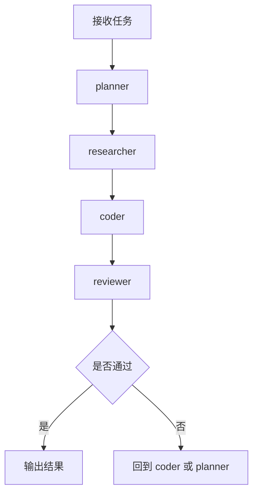
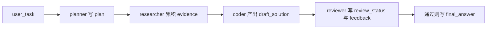
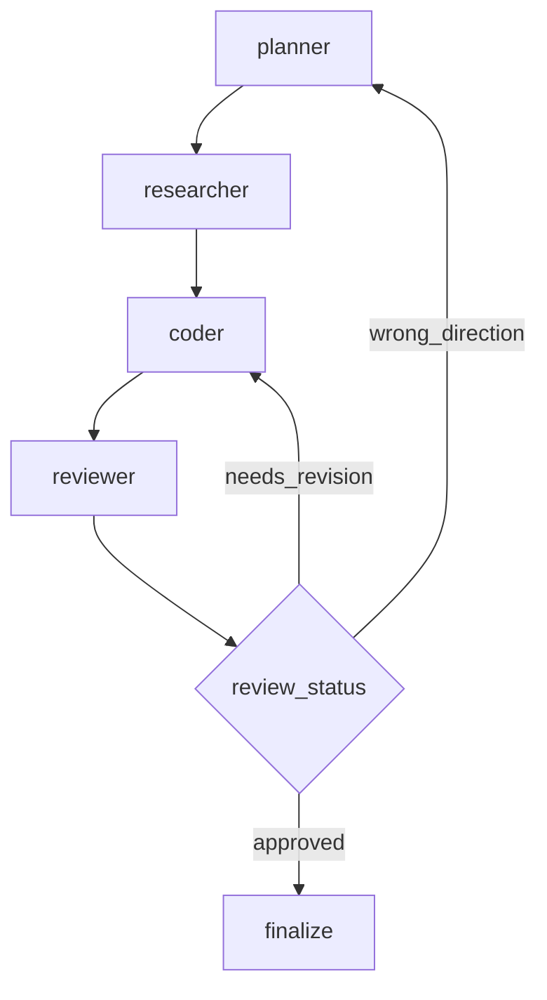
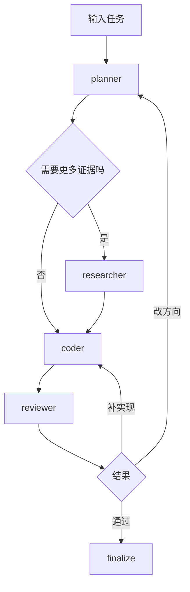

<KnowledgeMap current-module="tools" current-article="LangGraph 多角色协作图实战" />

<ArticleHeader
  module="工具与框架"
  :tags="['工程', 'LangGraph', '多角色']"
  reading-time="14 分钟"
  prerequisite="建议先读 LangGraph 原理 与 LangGraph 状态图设计实战"
  summary="很多人知道 LangGraph 适合多角色系统，但真正难的是角色怎么拆、状态怎么共享、评审怎么闭环。这一页用 planner、researcher、coder、reviewer 的协作图把多角色 Agent 系统真正落到工程结构。"
/>

# LangGraph 多角色协作图实战

讲 LangGraph 时，大家很容易停留在一句话：

`它适合 Multi-Agent`

但真正开始写系统时，问题立刻变具体了：

- 角色应该怎么拆
- 各角色之间共享哪些状态
- 谁负责决定下一步
- review 失败后回退到哪里
- 多角色协作到底是“多个模型”还是“多个节点”

这一页就是把这些问题真正落到图结构里。

## 先明确一个现实

多角色系统不是“角色越多越高级”。

更准确地说，只有当任务本身存在明显分工差异时，多角色图才真正有价值，例如：

- 规划和执行逻辑明显不同
- 研究和编码需要不同上下文
- 输出结果必须经过评审
- 一个角色不应该同时负责提出方案和给自己打分

如果这些边界不明显，多角色只会让系统更复杂。

## 一个最常见的四角色结构

在工程类任务里，一个很自然的拆法是：

1. `planner`
2. `researcher`
3. `coder`
4. `reviewer`

这四个角色刚好对应四种典型职责：

- planner: 拆任务，决定主路径
- researcher: 收集证据与上下文
- coder: 产出修改或实现
- reviewer: 做质量与风险把关

## 一张最小多角色图



这张图说明了一件关键事实：

`多角色图的重点不是角色名字，而是闭环结构`

## 为什么这比单一 Agent 更清晰

单一 Agent 往往会把这些事混在一起：

- 想怎么做
- 查资料
- 写代码
- 判断自己写得好不好

这会导致一个问题：

`同一个节点既负责行动，又负责审查自己`

而多角色图的好处是，你可以把这些职责显式拆开。

## 多角色图真正难的是 state

很多人以为多角色系统最大的难点是 prompt。  
其实真正先乱掉的往往是 state。

典型问题包括：

- planner 写的 plan 谁来读
- researcher 的证据怎么传给 coder
- reviewer 的意见是写进 messages 还是独立字段
- 回退时到底回到哪个角色，依据是什么

所以多角色图首先不是“角色设计”，而是“共享状态设计”。

## 一个更合理的 state 示例

```python
from typing import TypedDict, List, Optional


class CollaborationState(TypedDict, total=False):
    user_task: str
    messages: List[dict]
    plan: Optional[str]
    evidence: List[str]
    draft_solution: Optional[str]
    review_status: Optional[str]
    review_feedback: Optional[str]
    current_owner: Optional[str]
    final_answer: Optional[str]
```

这个结构里最重要的不是字段多少，而是职责边界清楚：

- `plan` 属于 planner 的主产物
- `evidence` 属于 researcher 的沉淀
- `draft_solution` 属于 coder 的产物
- `review_feedback` 属于 reviewer 的结构化反馈

## 一张状态流转图



这张图背后表达的是：

`不同角色不是抢同一块状态，而是在同一份大状态里写各自负责的字段`

## 角色拆分的一个实用原则

每个角色最好回答清楚三件事：

1. 我主要读取哪些字段
2. 我主要写回哪些字段
3. 我写完后通常该把控制权交给谁

如果这三件事说不清，往往说明：

- 角色定义太模糊
- 节点边界太乱
- 或者其实不需要拆这么多角色

## planner 应该做什么，不该做什么

planner 最适合负责：

- 解析任务目标
- 拆主步骤
- 决定先 research 还是先 code
- 在 review 失败后决定返工方向

但它通常不适合负责：

- 自己去写最终代码
- 自己执行所有工具
- 自己做质量评审

否则 planner 会重新膨胀成一个“什么都做”的大节点。

## researcher 的真正价值

researcher 不是为了显得系统更复杂，而是为了把“查找证据”和“做最终动作”拆开。

在代码任务、知识任务、分析任务里，这个角色特别自然，因为它负责的通常是：

- 查文档
- 查代码
- 查错误日志
- 查已有状态

它不直接给最终答案，而是把证据交给后续角色。

## coder 的职责边界

coder 最适合负责：

- 根据 `plan` 和 `evidence` 产出实现
- 形成 draft
- 给出候选修改方案

它不应该承担最终裁决权。  
因为一旦 coder 同时也是 reviewer，系统就很容易失去校验闭环。

## reviewer 为什么很关键

reviewer 的价值，不只是“再看一遍”，而是给系统引入：

- 质量校验
- 风险校验
- 约束校验
- 完成度校验

它最重要的产出通常不是一段自然语言评价，而是结构化结论，例如：

- `approved`
- `needs_revision`
- `blocked`

以及对应的反馈信息。

## 一张带回退路径的图



这张图特别重要，因为它说明：

`review 失败不一定只回 coder，也可能回 planner`

也就是说，多角色系统里的回退路径本身也是设计重点。

## 什么时候 reviewer 应该回 coder，什么时候回 planner

这是多角色图里非常典型的路由判断。

### 回 coder 的情况

- 方案方向是对的
- 只是实现质量不够
- 有明显 bug 或漏项

### 回 planner 的情况

- 任务拆解方向就错了
- 关键假设不成立
- 漏掉了重要子任务

所以 reviewer 最好不要只给一句模糊评价，而应尽量给出：

- 问题类型
- 建议回退目标

## 一个更工程化的 reviewer 返回值

```python
def reviewer_node(state):
    if "缺少测试验证" in state.get("draft_solution", ""):
        return {
            "review_status": "needs_revision",
            "review_feedback": "补充验证步骤和结果",
            "current_owner": "coder",
        }

    return {
        "review_status": "approved",
        "final_answer": state.get("draft_solution"),
        "current_owner": "done",
    }
```

这里最值得注意的是：

- reviewer 返回的是结构化结果
- 路由可以显式依赖这些字段

## 多角色系统到底是多个模型，还是一个模型扮演多个角色

这其实有三种常见做法：

1. 一个模型，不同节点不同提示词
2. 同一供应商不同模型，按角色分配
3. 不同供应商模型混用

在大多数工程场景里，第一种往往已经够用：

`重点是角色职责分离，不一定非要物理上多模型`

这点很重要，因为很多人会把 Multi-Agent 误解成“一定要很多模型并行跑”。

## LangGraph 为什么特别适合承载这种结构

因为多角色图天然需要：

- 明确状态共享
- 明确谁接谁
- 明确回退路径
- 明确中断与恢复位置

这些都和 LangGraph 的优势非常一致：

- 共享 state
- 条件边
- checkpoint
- interrupt / resume

也就是说，多角色协作并不是 LangGraph 的“附带玩法”，而是它非常自然的用武之地。

## 一张更完整的协作图



这张图把一个真实多角色系统的两个核心循环都画出来了：

- planner 与 coder 之间的方向循环
- coder 与 reviewer 之间的质量循环

## 多角色系统常见的坏设计

### 1. 角色名字很多，但职责没有边界

例如：

- architect
- planner
- analyst
- strategist

名字看起来很多，但都在做“拆任务”。  
这种拆法只会增加复杂度。

### 2. 所有角色都写 messages，不写结构化字段

这样到最后你会发现：

- plan 埋在消息里
- review 埋在消息里
- routing 也只能靠猜

### 3. reviewer 只会输出情绪化评价

例如：

- “感觉还行”
- “再改改”

这类反馈对路由几乎没有帮助。

### 4. 不设计回退路径

如果 review 不通过时没有明确 goto，图很容易要么卡死，要么退回错误节点。

## 一条很实用的设计纪律

`多角色图不是为了让角色互相聊天，而是为了让职责、状态和回退结构可解释`

这个判断特别重要。  
如果一个多角色系统只是让多个角色轮流生成长文本，但没有：

- 结构化 state
- 明确路由
- 明确回退

那它很可能只是“看起来很聪明”，工程上并不稳定。

## 它和 Harness 的关系

多角色图解决的是：

- 谁做什么
- 状态怎么传
- 路由怎么走

Harness 更关心的是：

- 谁能执行高风险动作
- 任务怎么交接
- 出错后怎么恢复
- 验证与治理规则是什么

也就是说：

- LangGraph 多角色图偏“协作结构”
- Harness 偏“运行纪律”

## 它和 Eval 的关系

多角色系统一旦上线，评估就不能只看最终答案。  
你还要看：

- planner 是否把任务拆对了
- researcher 是否找到了关键证据
- coder 是否真正利用了 evidence
- reviewer 是否能正确拦截问题

这意味着多角色图很适合做更细粒度的 trace-level eval。

## 本节总结

- 多角色图的价值不在角色数量，而在职责边界和闭环结构
- planner、researcher、coder、reviewer 是一种非常自然的工程拆法
- 共享 state 必须结构化，不要把 plan 和 review 都埋进 messages
- reviewer 的结构化反馈直接决定回退路径
- LangGraph 特别适合承载这种带回退、带分工、带共享状态的协作系统

## 下一步

- 回到 [LangGraph 原理](./langgraph-principles)，重新看“为什么图比链更适合多角色协作”
- 再读 [LangGraph Interrupt Resume 与 Human Review 实战](./langgraph-interrupt-resume)，理解多角色图和可恢复工作流如何结合

## 参考来源

- LangGraph 官方文档 Graph API overview  
  https://docs.langchain.com/oss/javascript/langgraph/graph-api
- LangGraph 官方文档 Thinking in LangGraph  
  https://docs.langchain.com/oss/javascript/langgraph/thinking-in-langgraph
- LangGraph 官方文档 Multi-agent systems  
  https://docs.langchain.com/oss/python/langgraph/multi-agent-systems
- Google Pregel 论文  
  https://research.google/pubs/pregel-a-system-for-large-scale-graph-processing/
