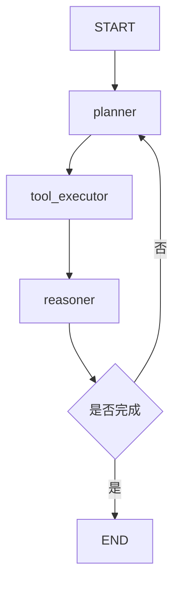
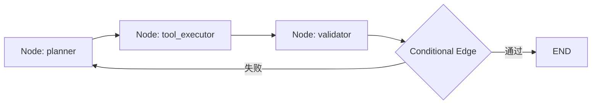
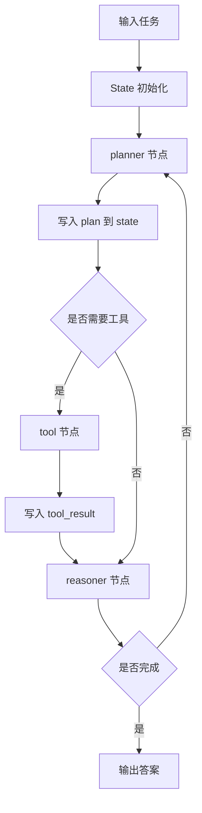
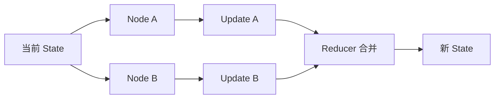
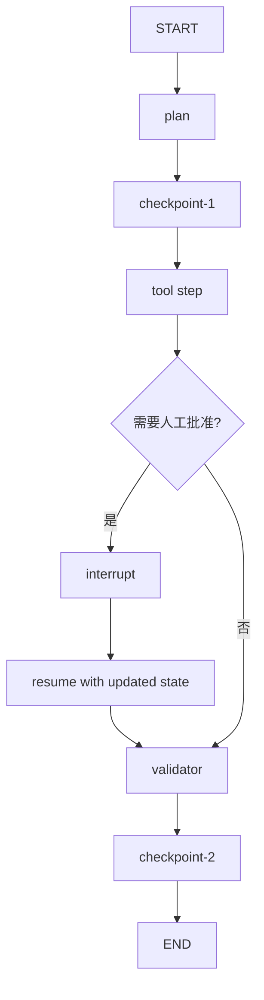
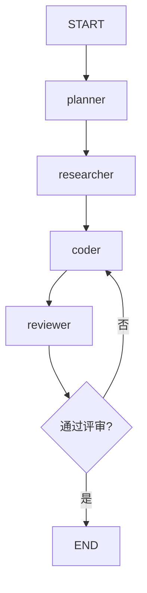

<KnowledgeMap current-module="tools" current-article="LangGraph 原理" />

# LangGraph 原理：为什么 Agent 适合用图来组织

<ArticleHeader
  module="工具与框架"
  :tags="['工程']"
  reading-time="18 分钟"
  prerequisite="理解 Agent loop、Tool Use、Harness 与基础流程编排"
  summary="LangGraph 的关键不是某个 API 名字，而是它把 Agent 系统建模成一个有共享状态的有向图：节点负责做事，边负责决定下一步，状态在整个图中持续流动。这种结构特别适合表达循环、分支、恢复和多角色协作。"
/>

## 为什么会有 LangGraph 这类框架

如果你只是做一个很短的任务链路，线性 workflow 往往已经够用：

```text
接收请求 -> 调模型 -> 调工具 -> 返回结果
```

但当系统开始出现下面这些需求时，线性链路就会变得吃力：

- 需要循环重试
- 需要条件分支
- 需要多轮状态积累
- 需要 human-in-the-loop
- 需要多 Agent 协作
- 需要长任务恢复

这时系统更像一张图，而不是一条链。

LangGraph 的价值，就在于它正面承认了这件事：

`真实 Agent 系统常常不是单线流程，而是带有分支、回路和状态流转的有向图。`

<div class="key-insight">
  <div class="key-insight-label">核心洞察</div>
  <p class="key-insight-text">
    LangGraph 最重要的不是“帮你调用模型”，而是提供一种更适合 Agent 的组织方式：共享状态 + 节点逻辑 + 边控制流 + 可循环的有向图。
  </p>
</div>

## 先看一张最小有向图



这张图几乎已经说明了 LangGraph 的核心：

- `节点` 做实际工作
- `边` 决定去哪
- `回路` 表示系统可以继续迭代
- `状态` 在整个过程里被持续更新

## 什么叫“图”，为什么还是有向图

图在这里可以简单理解为：

- 有一组节点
- 节点之间通过边连接

“有向”表示边有方向，例如：

- 从 `planner` 到 `tool_executor`
- 不代表一定能从 `tool_executor` 自动回到 `planner`

所以有向图强调的是：

`执行顺序不是随意跳转，而是沿着明确方向流动。`

这比普通函数调用更适合表达复杂系统，因为你可以把流程结构显式画出来。

## LangGraph 最核心的 4 个概念

### 1. State

这是整个图共享的数据结构。  
它记录系统在当前时刻知道什么、做到哪一步、下一步还需要什么。

### 2. Node

节点是执行单元，负责做一件具体事情，例如：

- 调 LLM
- 执行工具
- 解析结果
- 判断是否结束

### 3. Edge

边决定控制流，也就是下一步去哪个节点。

### 4. Compile / Runtime

定义好图之后，要把它编译成可运行对象，再由运行时去驱动执行。

## 先看 State：为什么它是 LangGraph 的中心

如果没有共享状态，图就只是“节点跳来跳去”。  
真正让图有意义的，是所有节点都围绕同一份状态工作。

你可以把 state 理解成：

- 当前用户目标
- 历史消息
- 工具结果
- 已完成步骤
- 错误信息
- 是否结束

一个简化示例：

```python
from typing import TypedDict, List

class AgentState(TypedDict):
    user_task: str
    messages: List[dict]
    tool_result: str
    done: bool
```

这不是为了炫技，而是为了让图里的每个节点都知道：

- 自己能读什么
- 自己该写什么

## 节点 Node 到底是什么

LangGraph 里的 node，本质上通常就是函数或可调用逻辑。

它的典型输入输出模式是：

- 输入：当前 state
- 输出：对 state 的更新

例如：

```python
def call_model(state):
    result = llm.invoke(state["messages"])
    return {"messages": state["messages"] + [result]}
```

所以一个节点不是“整个 Agent”，而是 Agent 系统中的一个局部动作。

## 边 Edge 到底是什么

边决定执行顺序。

最简单的是普通边：

```text
planner -> tool_executor
```

它表示 planner 做完以后，固定走到 tool_executor。

但 LangGraph 更重要的地方，是它很擅长表达条件边：

- 如果模型说要调用工具，就去工具节点
- 如果模型说已经完成，就去 END
- 如果校验失败，就去 retry 节点

## 一张节点和边的示意图



这里最值得注意的是：

`边不是装饰线，而是真正的控制流规则。`

## 条件边为什么特别重要

Agent 系统之所以比普通 workflow 难，就难在“不是每次都走同一条路径”。

真实系统里经常要根据 state 决定：

- 是否该继续
- 是否该换节点
- 是否该转人工
- 是否该重试

条件边正是把这种运行时判断显式化。

也就是说，LangGraph 并不是只在执行函数，而是在执行：

`基于当前状态的图上路由。`

## LangGraph 为什么特别适合 Agent

因为 Agent 系统天然就像下面这种循环：

```text
看当前状态
  -> 做一步决策
  -> 执行动作
  -> 更新状态
  -> 再决定下一步
```

这已经非常接近“带状态的有向图”了。

LangGraph 官方概念里也明确把核心抽象放在 shared state、nodes、edges、conditional routing 和 graph runtime 上，这正说明它的目标不是只做 prompt orchestration，而是做 stateful agent orchestration。[Graph API overview](https://docs.langchain.com/oss/javascript/langgraph/graph-api)

## 一张更完整的状态流转图



这张图比普通 agent loop 更清楚地说明了三件事：

- 状态在流动
- 节点在修改状态
- 边在看状态决定去哪

## StateGraph 和普通工作流的差别

LangGraph 常见的核心抽象是 `StateGraph`。  
它强调的不是“把一串步骤连起来”，而是：

`围绕一份共享状态来编排多个节点。`

这和传统 workflow engine 的差别在于：

- 普通工作流更强调固定顺序
- StateGraph 更强调状态驱动的流转

所以如果你的系统本质上是“根据运行中状态不断改变路径”，StateGraph 通常更自然。

## 进一步拆开：StateSchema、Reducer 和消息传递

如果只把 LangGraph 理解成“节点 + 边”，其实还差半层。  
它真正和普通流程图拉开差距的地方，是：

- `state` 不是随手塞进去的字典，而是显式 schema
- 节点返回的不是整个状态，而是 `update`
- update 如何落回 state，要靠每个字段自己的 `reducer`

这意味着 LangGraph 不是在“共享一个大对象然后大家随便改”，而是在做：

`节点产出增量更新 -> reducer 合并更新 -> 新状态驱动下一跳`

你可以把它理解成一种更工程化的状态机。

### 为什么 reducer 很关键

假设两个节点并行执行：

- 一个节点返回 `{"messages": ["tool result"]}`
- 另一个节点返回 `{"messages": ["validator result"]}`

如果没有 reducer，后写入的结果可能直接覆盖前一个。  
有 reducer 以后，你就可以定义：

- 哪些字段是覆盖
- 哪些字段是拼接
- 哪些字段是计数累加
- 哪些字段根本不该进入 checkpoint

这也是为什么 LangGraph 文档会专门强调 `ReducedValue`、`MessagesValue` 和 `UntrackedValue`。

## 一张“节点更新状态”的内部图



这张图说明了一件很关键的事：

`节点不是直接原地改状态，而是返回更新，再由运行时决定如何合并。`

### 一个 reducer 心智模型示例

```python
state = {
    "messages": ["user: 你好"],
    "retry_count": 0,
}

update_from_tool = {
    "messages": ["tool: 查到结果了"]
}

update_from_validator = {
    "retry_count": 1
}

# messages 字段的 reducer: 追加
# retry_count 字段的 reducer: 覆盖或累加
```

这会直接影响你怎么设计 state：

- `messages` 通常适合“追加型 reducer”
- `current_step` 通常适合“最后值覆盖”
- `temp_cache` 这类运行时对象，往往不适合持久化

## 节点不只是“函数”，还可以承担不同角色

在工程上，节点常见会分成几类，不建议混成一个万能节点：

### 1. LLM 节点

负责：

- 调模型
- 解析结构化输出
- 生成下一步意图

### 2. Action 节点

负责：

- 调工具
- 访问数据库
- 调内部 API
- 执行副作用动作

### 3. Router 节点

负责：

- 根据 state 决定走哪条边
- 判断是否结束
- 判断是否需要转人工

### 4. Guard / Validator 节点

负责：

- 校验结果质量
- 判断是否重试
- 做安全与合规检查

如果一个节点同时做这四类事，图看起来会“节点少”，但运行时语义会越来越糊。

## 条件边之外，还有更像“命令式路由”的写法

LangGraph 新版文档里一个值得注意的点，是它不只强调 conditional edges，也强调 `Command` 这种“更新状态 + 指定 goto”的方式。

这意味着某些节点可以在返回时同时表达：

- 我要写哪些状态
- 下一步该去哪

这在下面这种场景很有用：

- 当前节点本身最知道下一步
- 路由逻辑和当前输出紧密耦合
- 你不想再拆一个单独 router 节点

### 一个概念示例

```python
def planner_node(state):
    if state["retry_count"] > 2:
        return {
            "goto": "human_review",
            "update": {"status": "need_human"},
        }

    return {
        "goto": "tool_executor",
        "update": {"status": "call_tool"},
    }
```

这里表达的不是 LangGraph 精确 API，而是它背后的设计思想：

`图的路由既可以写在边上，也可以部分写在节点返回值里。`

## 为什么 LangGraph 会讲“super-step”

如果你只把图执行理解成“一个节点跑完再跑下一个节点”，会漏掉 LangGraph 更底层的运行方式。

LangGraph 的图执行思想受图计算系统启发，可以把运行看作一轮一轮的 `super-step`：

- 某个 step 里，一组节点可能并行活跃
- 它们各自产生 update
- 运行时在这个 step 结束时合并状态
- 再进入下一轮被激活的节点

对初学者来说，不需要把它学得很学术，但至少要知道：

`图运行不是简单的函数串行调用，而是带消息传递和步进语义的执行模型。`

这也是为什么 reducer、checkpoint 和恢复会变得重要。

## Checkpoint、Thread、Interrupt 是 LangGraph 工程价值的另一半

前面讲的节点和边，解释的是“怎么组织”。  
但 LangGraph 真正在生产环境里有吸引力，还因为它把下面这些能力做成了运行时一等公民：

- `checkpoint`
- `thread`
- `interrupt`
- `resume`
- `time travel`

### 1. Thread

可以把 thread 理解成一次图运行或一组连续交互的主线 ID。  
后续状态、历史和恢复点，都围绕它组织。

### 2. Checkpoint

checkpoint 是某一步执行后的状态快照。  
它不是为了“存日志好看”，而是为了：

- 故障恢复
- human-in-the-loop
- 调试回放
- 长任务恢复

### 3. Interrupt

interrupt 让图运行在某个点暂停，把控制权交给人或外部系统。

典型场景包括：

- 等待人工批准
- 等待用户补充信息
- 等待异步外部事件

### 4. Resume

resume 不是“从代码上一行继续跑”，而是从合适的 checkpoint 和状态重新进入图执行。

这点非常重要，因为它会反过来要求你的节点尽量：

- 可重放
- 幂等
- 副作用边界清晰

## 一张带 checkpoint 和人工中断的图



这张图对应的工程价值，不是“图画得更复杂”，而是：

`Agent 可以被暂停、检查、修改、恢复，而不是一次跑崩就全盘重来。`

## LangGraph 为什么特别适合 human-in-the-loop

很多系统嘴上说支持人工介入，实际上只是：

- 失败后手动重跑
- 或者把人工审批写在图外面

LangGraph 的强项是，它可以把人工介入本身视为图的一部分。  
也就是说：

- 图在某点中断
- 当前状态被保存
- 人拿到当前现场
- 人修改决定或输入额外信息
- 图继续推进

这样“人工”就不是系统外补丁，而是正式控制流节点。

## LangGraph 不只是 workflow，更像“可恢复的 Agent runtime”

这也是为什么它比很多“流程编排库”更贴近 Agent 场景。

因为 Agent 最大的问题通常不是：

- 会不会连 API

而是：

- 状态能不能稳定累积
- 长任务能不能中断恢复
- 人工能不能插进来
- 出错后能不能不用全量重跑

当你意识到这些问题时，就会发现 LangGraph 真正卖的不是“图”本身，而是：

`带状态、可恢复、可观察、可中断的运行时结构。`

## 为什么它比“单个 while 循环”更适合复杂系统

很多人一开始会问：

> 我自己写个 while 循环不就行了？

当然可以。  
问题不在于“能不能做”，而在于系统复杂后会不会失控。

一个简单 while loop 往往容易把这些东西混在一起：

- 节点逻辑
- 路由逻辑
- 状态更新
- 错误恢复
- 人工介入点

图式组织的好处是把这些东西拆开：

- 节点只负责做事
- 边只负责去哪
- 状态只负责记录系统现场

这会让系统更可观察，也更容易调试。

## 什么时候图真的比链更有价值

下面这些场景很适合图：

- 存在明显回路
- 有多种分支
- 需要多个角色节点协作
- 需要条件化中断或恢复
- 状态要在多轮里累积

如果你的流程永远都是固定顺序、永远不会分支，那图的收益就没那么高。

## 一个最小 LangGraph 风格示例

下面不是完整可运行项目，只是帮助你建立心智模型：

```python
from typing import TypedDict

class State(TypedDict):
    question: str
    answer: str
    done: bool

def planner(state: State):
    return {"done": False}

def answerer(state: State):
    return {"answer": "这是一个示意答案", "done": True}

def route(state: State):
    return "end" if state["done"] else "answerer"
```

这里对应的思想是：

- `planner` 是一个节点
- `answerer` 是另一个节点
- `route` 像条件边路由器
- state 是整个图共享的信息面板

## LangGraph 和 LangChain 是什么关系

一个很常见的误解是把它们当成完全不同方向的东西。

更准确的理解通常是：

- `LangChain` 更像更高层的模型、工具和 agent 抽象
- `LangGraph` 更像更低层的编排与运行时框架

官方资料也明确提到 LangChain agent 能建立在 LangGraph 之上，以利用 durable execution、persistence、human-in-the-loop 等能力。[LangChain overview](https://docs.langchain.com/oss/javascript/langchain/overview)

所以很多时候它们不是二选一，而是层级关系。

## LangGraph 和 Harness 的关系

这两个概念很容易混。

- `LangGraph` 是图式编排框架
- `Harness` 是长任务运行纪律与外壳

它们经常一起出现，但解决的问题不同：

- LangGraph 偏“结构组织”
- Harness 偏“运行纪律、交接、恢复”

你完全可以：

- 用 LangGraph 但没有好的 harness
- 有很强 harness，但底层不用 LangGraph

最成熟的系统通常会把两者结合起来。

## LangGraph 和 Multi-Agent 的关系

多 Agent 在 LangGraph 里通常很好表达，因为每个 agent 或子角色都可以被看作节点，或者是一组子图。

例如：

- planner 节点
- researcher 节点
- coder 节点
- reviewer 节点

再通过边控制它们的协作顺序和条件切换。

这也是为什么 LangGraph 特别适合：

- orchestration
- long-running agent
- multi-actor system

## 一张多角色有向图



这个结构如果用“纯链式 prompt”表达，会明显别扭；用图就自然很多。

## 工程上最该注意的几个点

### 1. 先设计 state，再设计节点

如果 state 混乱，图越大越难维护。

### 2. 节点尽量单一职责

不要让一个节点同时负责：

- 调模型
- 调工具
- 决定路由
- 写总结

### 3. 条件边要可解释

如果路由规则太隐蔽，系统会很难调试。

### 4. 明确结束条件

图里最危险的问题之一，就是不小心形成无意义循环。

### 5. 提前考虑观测与恢复

真实生产系统里，trace、checkpoint、resume 往往和图结构同样重要。

## 常见误解

### 误解一：LangGraph 只是把链换了个名字

不是。  
它真正强调的是 stateful graph，不是 linear chain。

### 误解二：节点越细越专业

节点过细会导致图非常碎，维护成本反而更高。

### 误解三：图一定比链高级

不一定。  
如果任务本来就线性，图可能只会增加复杂度。

### 误解四：有了图就自然稳定

图只是组织方式，稳定性还需要：

- harness
- observability
- retries
- evaluation

## 一个实用判断框架

如果你的系统已经出现下面任意几条，LangGraph 往往值得考虑：

1. 你已经不止一个 agent / 一个角色
2. 你需要条件分支和回路
3. 你需要共享状态在多步中流动
4. 你需要暂停、恢复、人工介入
5. 你希望把控制流显式画出来并调试

如果这些都没有，先用简单 loop 也完全合理。

## 本节总结

- LangGraph 的核心是用共享状态、节点、边和有向图来编排 Agent 系统
- 节点负责做事，边负责决定下一步，状态负责记录系统现场
- 它特别适合表达循环、分支、恢复、多角色协作和长任务
- 它不等于 harness，但常常与 harness 配合使用
- 图不是为了显得高级，而是为了在复杂系统中保持结构清晰

## 下一步

- 继续阅读 [Spring AI 框架原理](./spring-ai-framework)
- 或回到 [从零手写 Agent](./build-from-scratch) 对照理解“最小 loop”与“图式编排”的差别

## 参考来源

- LangGraph 官方文档 Graph API overview: [Graph API overview](https://docs.langchain.com/oss/javascript/langgraph/graph-api)
- LangGraph 官方文档 Persistence: [Persistence](https://docs.langchain.com/oss/javascript/langgraph/persistence)
- LangGraph 官方文档 Thinking in LangGraph: [Thinking in LangGraph](https://docs.langchain.com/oss/javascript/langgraph/thinking-in-langgraph)
- LangGraph 官方文档 Durable execution: [Durable execution](https://docs.langchain.com/oss/python/langgraph/durable-execution)
- LangChain 官方总览，关于 LangChain 与 LangGraph 的层级关系: [LangChain overview](https://docs.langchain.com/oss/javascript/langchain/overview)
- Google Pregel 论文，用于理解 super-step 与消息传递范式: [Pregel: A System for Large-Scale Graph Processing](https://research.google/pubs/pregel-a-system-for-large-scale-graph-processing/)
