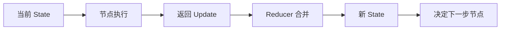
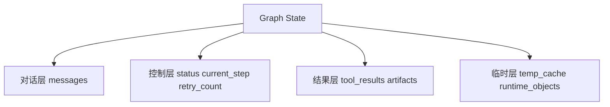
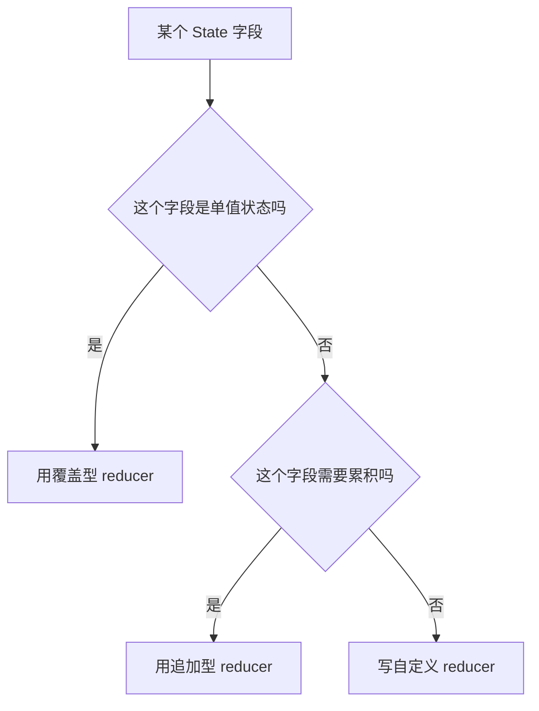
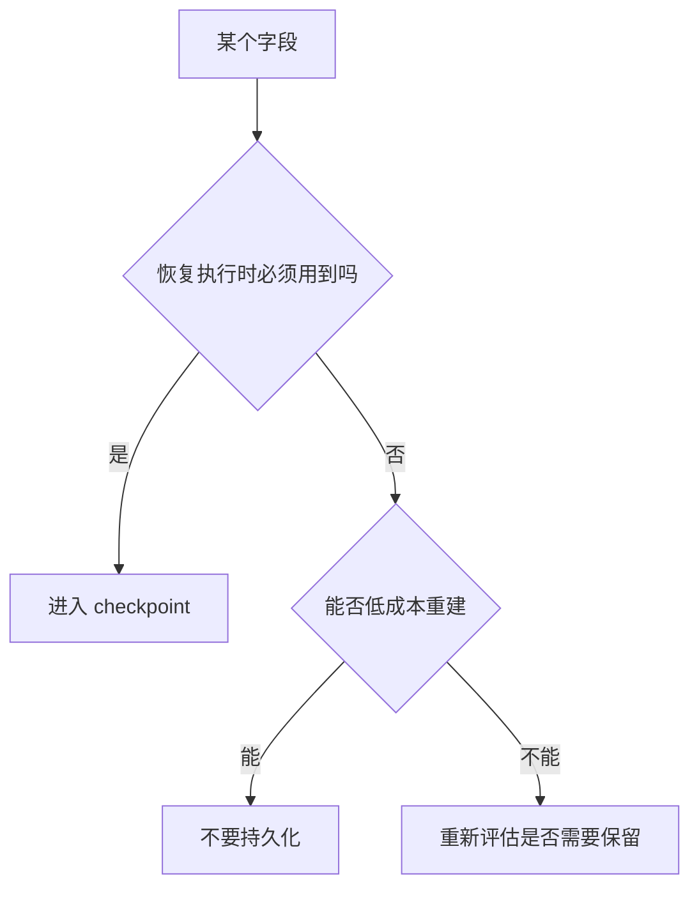

<KnowledgeMap current-module="tools" current-article="LangGraph 状态图设计实战" />

<ArticleHeader
  module="工具与框架"
  :tags="['工程', 'LangGraph', '实战']"
  reading-time="12 分钟"
  prerequisite="建议先读 LangGraph 原理"
  summary="很多人以为 LangGraph 的难点是节点和边，其实真正决定系统能不能长期维护的是 state 设计。本篇专门讲 schema、reducer、private state、messages、checkpoint 和中断恢复的工程取舍。"
/>

# LangGraph 状态图设计实战

很多人第一次接触 LangGraph，会把注意力放在：

- 怎么加节点
- 怎么连边
- 怎么画图

但项目一旦变复杂，真正先坏掉的往往不是边，而是 `state`。

常见症状包括：

- 什么都往 `messages` 里塞
- 一个大字典从头传到尾
- 并行节点互相覆盖结果
- checkpoint 太重，恢复很痛苦
- graph 能跑，但没有人敢改

所以这篇文章的重点不是“怎么把图搭起来”，而是：

`怎么把图设计成能长期维护的状态系统`

## 最重要的事实

LangGraph 的核心不是“把节点连成图”，而是：

`节点返回 update，运行时用 reducer 把 update 合回 state，再由 state 驱动下一步`

所以真正的工程问题变成了：

- state 里该有哪些字段
- 哪些字段允许覆盖
- 哪些字段应该累积
- 哪些字段根本不该持久化
- 哪些字段只在局部节点之间传递

## 一张状态驱动图



图的重点不是箭头，而是中间那句：

`节点返回的不是整个世界，而是增量更新`

## 先建立一个状态分层心智模型

在实际项目里，可以把 state 大致分成四层：

1. 对话层
2. 控制层
3. 结果层
4. 临时层

### 1. 对话层

典型字段：

- `messages`
- `conversation_summary`

它承载的是模型对当前任务上下文的理解现场。

### 2. 控制层

典型字段：

- `current_step`
- `status`
- `retry_count`
- `need_human_review`

它承载的是图现在处在哪个控制阶段。

### 3. 结果层

典型字段：

- `tool_results`
- `draft_answer`
- `validated_answer`
- `artifacts`

它承载的是系统已经产出的中间结果和最终结果。

### 4. 临时层

典型字段：

- `temp_cache`
- `raw_response`
- `runtime_handles`

这些字段通常不应该进 checkpoint。

## 一张状态分层图



## 为什么“全塞 messages”会出问题

初学者最常见的偷懒方式是：

> 反正 messages 已经能传上下文了，那工具结果、路由判断、重试计数、系统状态全塞进去吧。

短期确实能跑，长期会出现几个问题：

- 控制语义和对话语义混在一起
- 很难做结构化条件分支
- checkpoint 不容易精确恢复
- 评估时不知道系统到底为什么做出某个决策

所以 `messages` 应该承担的是：

`语言上下文`

而不是：

`所有系统状态`

## Reducer 决定了状态是否可维护

LangGraph 官方文档反复强调 reducer，不是因为它“高级”，而是因为它直接决定并行更新怎么合并。

最常见的三类 reducer 心智模型：

### 1. 覆盖型

适合：

- `status`
- `current_step`
- `selected_tool`

特点是：后写入的值覆盖旧值。

### 2. 追加型

适合：

- `messages`
- `steps`
- `tool_results`

特点是：每次新结果都累积进来。

### 3. 自定义聚合型

适合：

- 分数统计
- 并行子任务结果汇总
- 去重后的 artifact 列表

特点是：你要明确写出如何合并。

## 一张 reducer 选择图



## 一个更合理的 state 例子

```python
from typing import TypedDict, List, Optional


class AgentState(TypedDict, total=False):
    messages: List[dict]
    current_step: str
    retry_count: int
    tool_results: List[dict]
    selected_tool: Optional[str]
    final_answer: Optional[str]
```

这个 state 设计的关键不是“字段够不够多”，而是：

- `messages` 负责语言上下文
- `current_step` 负责控制流
- `tool_results` 负责结果累积
- `final_answer` 负责最终产出

## private state 和 input output schema 为什么重要

LangGraph 官方文档一个很有价值的点，是支持：

- 内部总 state
- 输入 schema
- 输出 schema
- private state

这能解决一个非常现实的问题：

`不是所有状态都应该暴露给整个图，更不是所有状态都应该成为外部输入输出`

### 一个典型设计

- `input schema`: 用户输入、任务目标
- `overall state`: 图内部运行全量状态
- `private state`: 某几个节点之间传递的内部变量
- `output schema`: 对外最终结果

## 为什么这件事在工程上很重要

如果没有状态分层，常见后果是：

- 任意节点都能改任意字段
- 图越来越像全局变量系统
- 某个节点的内部中间值，被无意暴露成系统契约

而 schema 分层的意义是：

`把状态的可见性和责任边界做出来`

## MessagesValue 适合什么，不适合什么

LangGraph 官方提供 `MessagesValue`，它很方便，但不要神化。

适合放进去的：

- user message
- assistant thought summary
- tool call result
- tool response

不太适合放进去的：

- retry counter
- routing flag
- checkpoint marker
- metrics
- runtime object

因为这些内容并不属于“消息对话语义”。

## Checkpoint 不是越多越好

很多人一看到 LangGraph 有 persistence，就会想把所有状态全存下来。  
这在短期很安心，但长期会导致：

- checkpoint 变重
- 恢复慢
- 无关字段污染回放
- 版本迁移困难

更合理的思路是：

`只把恢复执行所必需的状态持久化`

### 一般建议持久化的

- messages
- 控制流状态
- 关键中间结果
- 人工中断恢复需要的上下文

### 一般不建议持久化的

- 数据库连接
- 客户端句柄
- 临时缓存
- 可重新计算的大对象

## 一张 checkpoint 取舍图



## 中断恢复会反过来约束你的 state 设计

如果图支持：

- interrupt
- human review
- resume

那你的 state 设计就必须满足：

- 恢复后能判断现在处在哪一步
- 恢复后知道前面做过什么
- 恢复后能安全继续，不重复副作用

这通常意味着至少需要：

- 一个明确的 `status`
- 一个明确的 `current_step`
- 一份结构化的 `tool_results`

而不是只靠对话消息去“猜”。

## 一个常见坏设计

```python
state = {
    "messages": [...],
    "everything": {...}
}
```

这种设计的问题不是丑，而是责任边界完全不清楚。

节点会开始：

- 猜字段
- 偷写字段
- 依赖隐含约定

最后任何一个 reducer 的改动都可能让整图行为漂移。

## 一个更实用的节点设计原则

每个节点最好回答清楚三件事：

1. 我读取哪些 state 字段
2. 我写回哪些 state 字段
3. 我的输出应该覆盖、追加还是聚合

如果这三件事说不清，通常说明：

- 节点职责太混
- state 设计太乱
- 或者 edge/router 拆分不合理

## 状态图不只是“能跑起来”，还要能演化

LangGraph 官方文档还强调 graph migration。  
这背后的现实问题是：

- 你的 graph 不会永远不变
- state schema 也不会永远不变

所以设计时要尽量避免：

- 把临时实验字段写死成核心契约
- 让太多节点依赖同一个模糊字段
- checkpoint 强耦合到一版临时结构

工程上更稳的方式是：

- 字段名明确
- 字段职责单一
- schema 有层次
- reducer 行为可解释

## 这篇文章真正想让你带走什么

很多人以为 LangGraph 的核心能力是“图”。  
其实从工程角度看，它真正难也真正值钱的部分是：

`状态如何被安全地更新、保存、恢复和路由`

当你把这层想明白之后：

- 节点会更清晰
- 并行会更稳
- checkpoint 会更可用
- human-in-the-loop 会更自然

## 本节总结

- LangGraph 的核心不是连线，而是 state update 的组织方式
- state 最好分成对话层、控制层、结果层、临时层
- reducer 决定并行更新是否安全
- `messages` 适合语言上下文，不适合承载全部系统状态
- checkpoint 应只保存恢复执行真正需要的字段

## 下一步

- 先回到 [LangGraph 原理](./langgraph-principles)，把这篇和整体机制对起来
- 再读 [从零手写 Agent](./build-from-scratch)，对比“最小 loop”和“图式运行时”在状态管理上的差异

## 参考来源

- LangGraph 官方文档 Graph API overview  
  https://docs.langchain.com/oss/javascript/langgraph/graph-api
- LangGraph 官方文档 Use the graph API  
  https://docs.langchain.com/oss/javascript/langgraph/use-graph-api
- LangGraph 官方文档 Persistence  
  https://docs.langchain.com/oss/javascript/langgraph/persistence
- LangGraph 官方文档 Thinking in LangGraph  
  https://docs.langchain.com/oss/javascript/langgraph/thinking-in-langgraph
- Pregel: A System for Large-Scale Graph Processing  
  https://research.google/pubs/pregel-a-system-for-large-scale-graph-processing/
