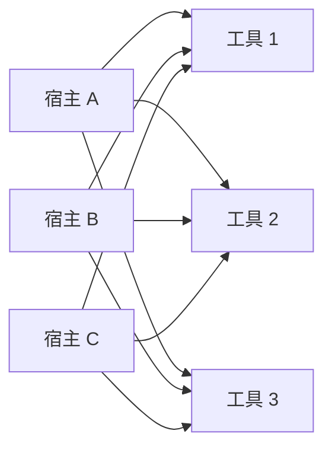
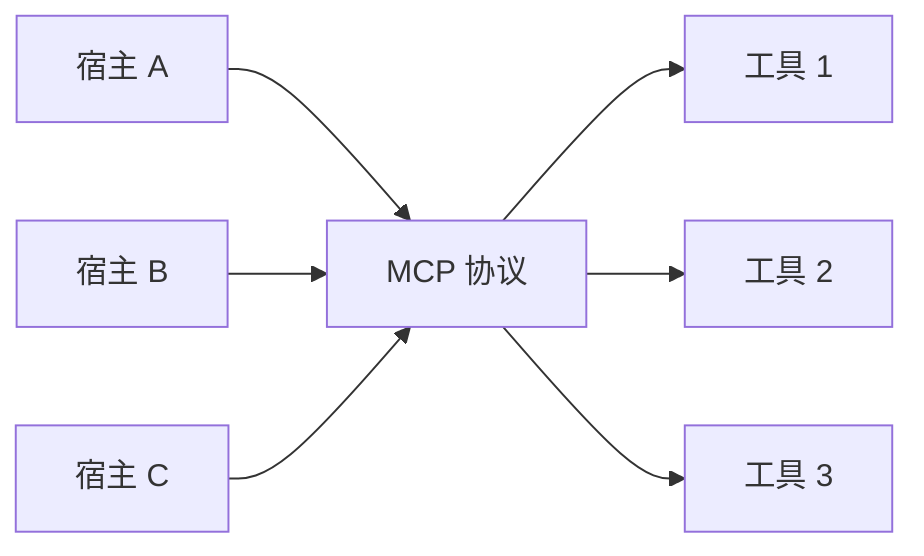
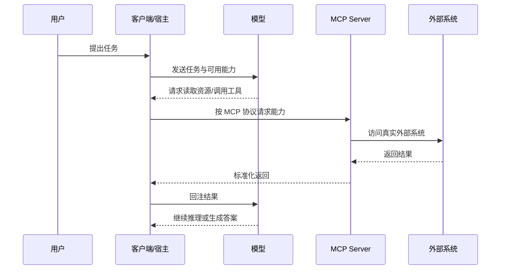
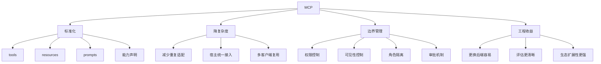

<KnowledgeMap current-module="tools" current-article="MCP 协议" />

# MCP 协议：AI 工具互联的新基础设施

<ArticleHeader
  module="工具与框架"
  :tags="['核心']"
  reading-time="17 分钟"
  prerequisite="理解 Tool Use 与基本工程接入问题"
  summary="MCP 的价值不只是多一个协议，而是把模型、宿主和外部能力之间的接入方式标准化，让工具、资源和提示能够用统一方式被发现和调用。"
/>

## 为什么需要 MCP

如果每个模型、每个宿主、每个工具都用自己的一套接法，系统很快就会陷入集成爆炸。MCP 试图解决的就是这种 M×N 的接入复杂度。

<div class="key-insight">
  <div class="key-insight-label">核心洞察</div>
  <p class="key-insight-text">
    MCP 的真正价值，不是又发明了一套接口，而是让 AI 系统与外部工具之间终于开始拥有统一的连接标准。
  </p>
</div>

如果把 2023 到 2024 年的很多 AI 工具接入方式回头看一遍，你会发现一个很典型的问题：

- 每个宿主有自己的插件机制
- 每个模型厂商有自己的函数调用格式
- 每个工具提供方又有自己的私有封装

最后的结果就是系统不是在“用能力”，而是在“重复做适配”。

## 先看清它解决的不是哪个小问题

在没有统一协议之前，AI 工具接入通常长这样：

- 一个模型提供一套函数调用格式
- 一个客户端提供另一套插件接口
- 一个工具服务再提供自己私有的 API 封装

结果就是：

- 每个宿主都要重复接工具
- 每个工具都要重复适配不同宿主
- 提示、资源、权限和调用方式缺乏统一语义

这会形成典型的 `M × N` 集成问题。

MCP 想解决的，不是“再加一个工具调用方式”，而是把以下几类能力放到一套统一语义下：

- 工具
- 资源
- 提示
- 服务器能力声明

## 一张图先看懂 M×N 集成问题



没有标准化时，宿主越多、工具越多，连接线就越爆炸。

而 MCP 想把它变成：



这就是它最核心的工程价值。

## 为什么光有 Tool Use 还不够

你可能会说，模型已经可以函数调用了，为什么还需要 MCP？

关键原因在于，函数调用只解决了一个窄问题：

`模型如何请求执行某个函数`

但真实系统还需要考虑：

- 外部能力怎样被发现
- 工具参数怎样被描述
- 资源怎样被读取
- 宿主怎样管理权限和上下文
- 一套能力怎样同时服务多个模型和客户端

这些问题，函数调用本身并不负责。

MCP 的价值在于把“可被 AI 使用的外部能力”抽象成标准化接口，而不是每个客户端各做各的。

Anthropic 在 2025 年关于工具设计和 context engineering 的文章里，反复强调 agent 系统真正难的是能力暴露、返回结构、评估和多角色协作，而不只是“让模型能发出函数调用”。MCP 正是在这条线上的基础设施化动作。[Writing effective tools for agents](https://www.anthropic.com/engineering/writing-tools-for-agents) [Effective context engineering for AI agents](https://www.anthropic.com/engineering/effective-context-engineering-for-ai-agents)

## 可以把 MCP 理解成什么

一个比较实用的理解方式是：

- `模型` 负责决定“我想调用什么能力”
- `宿主` 负责决定“要不要调用、怎么调用、如何展示结果”
- `MCP Server` 负责把外部能力标准化暴露出来

也就是说，MCP 更像是 AI 时代的能力接入层，而不是单纯的函数列表。

## 一个更完整的角色图



从这个角度看，MCP 更像“标准化桥梁”，而不是“替代宿主”。

## 一个最小心智模型

可以先记住下面这条链路：

```text
宿主 / 客户端
  <-> MCP Server
    -> tools
    -> resources
    -> prompts
  <-> 模型
```

这里每个角色分工不同：

- 客户端负责用户交互、上下文组织和实际调度
- 模型负责生成调用意图或使用结果
- MCP Server 负责以统一格式暴露外部能力

## MCP 下的三类典型能力

教程里最容易只盯着 `tools`，但 MCP 的价值恰恰在于它不只面向工具。

### 1. Tools

适合执行动作，例如：

- 搜索文档
- 执行命令
- 读取文件
- 调用浏览器

### 2. Resources

适合暴露可读取的内容，例如：

- 项目配置
- 文档资源
- 特定 URI 下的数据视图

### 3. Prompts

适合暴露可复用的提示模板或协作模板，例如：

- 摘要模板
- 调试模板
- 角色分工模板

这也是为什么 MCP 不是“function calling 的别名”，它更像统一能力目录。

## MCP 为什么对工程系统特别重要

一旦系统进入多 Agent 场景，不同角色往往都需要访问外部能力：

- 搜索文档
- 查询数据库
- 读取浏览器状态
- 操作文件系统
- 触发第三方服务

如果每个 Agent 都直接接一套私有 API，系统很快会失控：

- 接入方式不统一
- 权限边界不清晰
- 很难复用同一套能力
- 更难评估和替换底层实现

而使用 MCP 时，多个 Agent 或多个宿主可以围绕一套统一的服务定义接入能力，这会显著降低复杂度。

## 一个多 Agent 场景里的价值示例

假设你有 3 个角色：

- 规划 Agent
- 检索 Agent
- 执行 Agent

如果没有 MCP，这三个角色可能分别对接：

- 搜索服务
- 文件系统
- 浏览器服务
- 命令执行器

而且每个宿主、每个客户端、每种运行环境都可能重新做一遍适配。

如果这些能力通过 MCP 标准化暴露，那么：

- 检索 Agent 主要使用搜索类 tools/resources
- 执行 Agent 使用命令、文件、浏览器类 tools
- 规划 Agent 不需要关心每个工具的底层差异

整个系统的可复用性会高很多。

## MCP 带来的 4 个核心收益

### 收益一：统一发现和调用方式

当工具和资源通过统一协议暴露出来，客户端就更容易：

- 列出可用能力
- 理解参数结构
- 用一致方式调用和返回结果

### 收益二：降低重复集成成本

一个工具服务不需要为每个宿主重新造一套适配层。反过来，宿主也不需要为每个工具写一套完全不同的接法。

### 收益三：更容易做权限和边界管理

标准化之后，你可以更清楚地定义：

- 哪些工具可见
- 哪些资源可读
- 哪些调用需要确认
- 哪些能力只开放给特定角色

### 收益四：让 AI 系统更像真正的平台

一旦能力可以被标准化暴露，客户端、工具提供方和 Agent 框架之间就更容易形成生态，而不是一堆彼此绑定的私有连接。

## 一张脑图：MCP 的价值点



## 一个简化示例

假设你有一个“项目文档检索服务”，在没有 MCP 时，可能需要分别为：

- IDE 插件
- 命令行 Agent
- Web Agent

各写一套接入逻辑。

而在 MCP 方式下，这个服务可以作为一个标准化 Server 暴露能力，例如：

```text
tool: search_docs(query, top_k)
resource: project://readme
prompt: summarize_search_result
```

这样不同客户端只需要理解 MCP 协议本身，就能接入同一套能力。

## 什么时候上 MCP 是合理的

不是所有项目都要一开始就上 MCP。

更适合引入 MCP 的场景通常是：

- 能力来源越来越多
- 多个宿主或客户端都要复用同一组能力
- 需要把工具、资源、提示放进统一接入层
- 你希望后端实现可以独立演化，而不是和某个前端工具强耦合

而如果只是：

- 一个很短的小脚本
- 一个单宿主、单工具、临时实验
- 不打算复用能力

那直接写本地函数调用也完全合理。

## 它不是什么

为了避免把 MCP 理解过头，也要明确它不是什么：

- 它不是模型本身
- 它不是 Agent 框架本身
- 它不是自动让系统变聪明的魔法层
- 它不是对任何工具调用场景都必须上的重型方案

MCP 解决的是：

`能力接入的标准化问题`

它并不自动解决：

- 提示设计问题
- 任务规划问题
- 结果评估问题
- 工具本身质量问题

## 实战里最容易误解的地方

### 误解一：有了 MCP，模型就会自动更聪明

不会。MCP 只是让能力更容易被标准化接入，不会自动解决：

- 任务规划错误
- 提示设计不清
- 上下文组织混乱
- 工具返回不可用

### 误解二：MCP 会替代宿主控制

不会。宿主依然是流程控制中心。  
是否允许调用、何时调用、结果如何进入上下文，仍然应该由宿主主导。

## 什么时候你会明确感受到它的价值

下面几种场景里，MCP 的价值会特别明显：

- 你需要让同一组工具能力同时服务多个客户端
- 你有越来越多外部能力，需要统一接入语义
- 你想把工具、资源和提示一并做成可发现的能力层
- 你希望多 Agent 或多宿主之间复用同一套服务能力

如果只是一个非常短的小脚本，直接写本地函数调用也完全合理。并不是所有项目都必须一开始就上 MCP。

## 工程上最容易踩的坑

### 坑一：把 MCP 当成架构终点

引入 MCP 只是把能力接入标准化了，不代表系统架构已经合理。你仍然需要处理：

- 上下文如何组织
- 工具何时调用
- 结果如何验证

### 坑二：暴露太多能力给模型

如果你把几十个工具一次性全部暴露给客户端或模型，可能会带来：

- 工具选择噪声
- 权限风险
- 调用成本上升

标准化不等于无差别开放。

### 坑三：忽略宿主的责任

MCP 不是让模型直接拥有一切能力。真正掌控流程的，依然应该是宿主系统。

宿主要负责：

- 是否展示某项能力
- 是否允许这次调用
- 如何处理返回结果

### 坑四：以为标准化之后就不需要做工具设计

恰恰相反。  
标准化只是统一了接法，不代表你的工具描述、返回格式、权限边界已经合理。  
如果底层能力设计很差，换成 MCP 只是把差设计标准化了。

## 本节总结

- MCP 解决的是 AI 能力接入的标准化问题
- 它不只面向工具，还统一了资源和提示等能力形态
- 它的核心价值是降低集成复杂度、提升复用性和边界清晰度
- 它尤其适合多 Agent、多客户端和能力不断增长的系统

## 下一步

理解了 MCP 之后，下一步可以继续阅读 [Agent Skills](./agent-skills)，理解标准化接入层之上，流程知识和能力目录又是怎样被组织和复用的。
