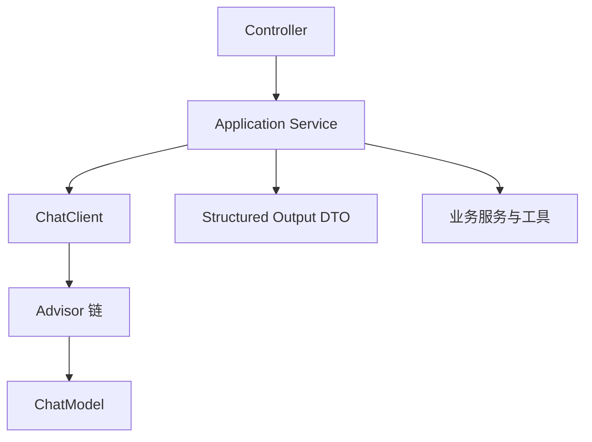
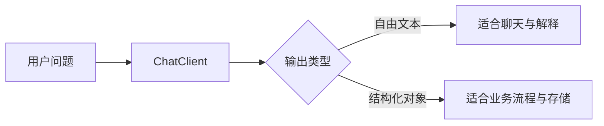
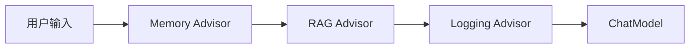
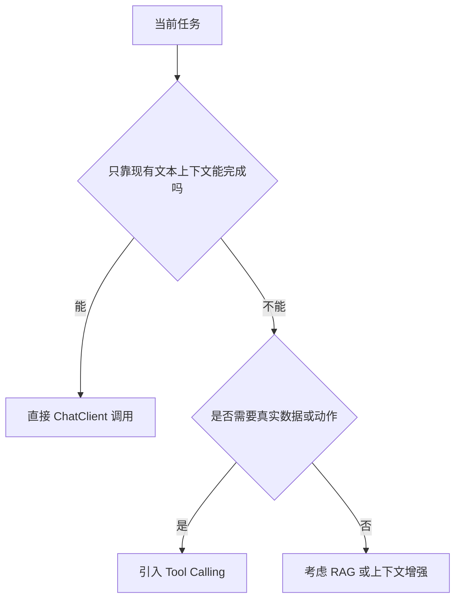
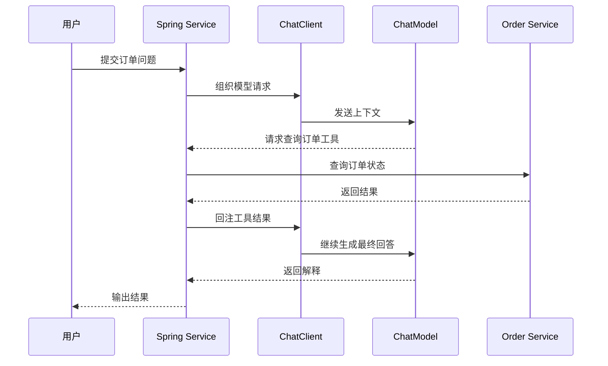

<KnowledgeMap current-module="tools" current-article="Spring AI ChatClient Advisor 与 Structured Output 实战" />

<ArticleHeader
  module="工具与框架"
  :tags="['工程', 'Spring AI', '实战']"
  reading-time="13 分钟"
  prerequisite="建议先读 Spring AI 框架原理"
  summary="这一页不再停留在框架定位，而是把 Spring AI 真正放进业务代码里：如何用 ChatClient 组织调用入口，如何安排 Advisor 顺序，如何做 Structured Output，什么时候再引入 Tool Calling。"
/>

# Spring AI ChatClient Advisor 与 Structured Output 实战

理解了 Spring AI 的定位之后，真正进入项目时，大家最常问的其实不是：

- 它属于哪一层框架

而是：

- 业务代码到底该怎么写
- `ChatClient` 应该放在哪一层
- `Advisor` 应该怎么组合
- 什么场景下应该返回文本，什么场景下应该返回结构化对象
- `Tool Calling` 该放在什么时候接进来

这一页就专门解决这些落地问题。

## 先给一个最小目标

假设你要做一个企业内部工单助手，它至少要完成三件事：

1. 阅读用户描述
2. 总结成结构化工单摘要
3. 必要时调用内部服务查询额外信息

这时最自然的分层通常不是“写一个巨大的 Agent 类”，而是：

- Web 层接请求
- Service 层组织业务
- `ChatClient` 作为 AI 调用入口
- `Advisor` 承担记忆、检索、日志等横切能力
- 结构化输出承接下游业务流程

## 一张最小分层图



这张图最重要的不是类名，而是职责分离：

- `ChatClient` 负责组织模型调用
- `Advisor` 负责横切增强
- Service 层负责决定业务流程

## ChatClient 放在哪最合理

在 Spring Boot 项目里，一个很稳的实践是：

`让 ChatClient 出现在应用服务层，而不是让 Controller 直接拼 prompt`

原因很简单：

- Controller 应该关注请求和响应
- Service 层才适合承接业务语义
- AI 调用通常会和权限、日志、DTO 映射、工具调用一起出现

如果把 prompt 组织直接写在 Controller 里，后面会越来越难维护。

## 一个更合理的最小骨架

```java
@Service
public class TicketAssistantService {

    private final ChatClient chatClient;

    public TicketAssistantService(ChatClient.Builder builder) {
        this.chatClient = builder.build();
    }

    public String summarize(String userInput) {
        return chatClient.prompt()
            .system("你是一个企业工单分析助手。")
            .user(userInput)
            .call()
            .content();
    }
}
```

这个例子虽然简单，但已经体现了一个重要方向：

`ChatClient 更适合作为业务服务中的 AI 能力入口`

## 为什么不要一开始就只返回字符串

很多 demo 都会写成：

```java
String result = chatClient.prompt()
    .user("请总结这段描述")
    .call()
    .content();
```

这在演示里没有问题。  
但真实系统里，你经常更需要的是：

- 分类结果
- 风险等级
- 优先级
- 标准化摘要
- 是否需要升级处理

这些结果最终往往要进入下游流程，所以“只返回一段文本”会越来越不够用。

## Structured Output 为什么是企业落地关键

因为业务系统不只是“看一段回答”，而更常常要：

- 存数据库
- 转工单
- 驱动审批流程
- 触发下游规则引擎

这时，结构化输出比自由文本更稳定。

## 一个 DTO 示例

```java
public record TicketSummary(
    String issueType,
    String priority,
    String summary,
    boolean needEscalation
) {}
```

一旦结果能稳定映射到这样的对象，系统边界会清楚很多：

- 模型负责生成语义结果
- Spring AI 负责组织调用与映射
- 业务系统负责消费结构化字段

## 一张文本输出和结构化输出对比图



## Advisor 最适合承接什么

Advisor 最适合承接那些：

- 在很多 AI 请求里反复出现
- 又不想每个 Service 方法都手写一遍

的逻辑。

最常见的几类包括：

- Memory 注入
- RAG 检索上下文注入
- Logging 与观测
- 安全规则补充
- 默认参数和共享上下文

所以你可以把 Advisor 理解成：

`AI 调用链里的可复用增强层`

## 为什么 Advisor 顺序不能乱放

假设你的链路里有三类增强：

1. 注入对话记忆
2. 检索知识库
3. 记录最终请求

如果顺序是：

1. Memory
2. RAG
3. Logging

那么日志里看到的是“最终增强后的完整请求”。

但如果顺序变成：

1. Logging
2. Memory
3. RAG

那你记录到的就不是模型最终真正收到的内容。

所以顺序不是小细节，而是直接影响：

- 观测结果
- 调试效率
- 行为可解释性

## 一张 Advisor 顺序图



这通常比把 `Logging` 放在最前面更接近“真实送模现场”。

## 一个更贴近真实业务的示意

```java
@Service
public class TicketAssistantService {

    private final ChatClient chatClient;

    public TicketAssistantService(ChatClient.Builder builder) {
        this.chatClient = builder.build();
    }

    public String answer(String conversationId, String question) {
        return chatClient.prompt()
            .advisors(advisor -> advisor.param("conversationId", conversationId))
            .system("你是一个企业支持助手，请优先依据内部知识库回答。")
            .user(question)
            .call()
            .content();
    }
}
```

这个例子最值得注意的不是 API 语法，而是：

- conversation id 这类上下文不应该每次手工拼到 prompt 文本里
- 这类信息更适合通过 advisor context 或显式参数传入

## 什么时候该上 Tool Calling

不是所有问题都需要工具调用。  
更稳的判断通常是：

### 不需要 Tool Calling 的情况

- 只是总结文本
- 只是改写和解释
- 只是做结构化抽取

### 需要 Tool Calling 的情况

- 要查真实订单状态
- 要访问库存或 CRM
- 要执行某个内部服务动作
- 要基于实时数据回答

也就是说，Tool Calling 的引入点通常是：

`模型需要现实世界的新信息或现实世界的动作能力`

## 一张判断图



## Tool Calling 在 Spring 生态里为什么很自然

因为对 Java 企业系统来说，很多“工具”本来就是已有能力：

- 一个 `@Service` 方法
- 一个仓储查询
- 一个内部 API 封装
- 一个消息发送能力

所以 Tool Calling 在 Spring AI 里往往不是“为 AI 重新造一个世界”，而是：

`把现有业务能力重新包装成模型可调用入口`

## 一个典型场景

比如用户问：

```text
订单 2025001 为什么还没发货？
```

这个问题只靠 LLM 瞎猜没有意义。  
更合理的流程是：

1. 模型判断需要查询订单系统
2. Spring 应用调用订单服务
3. 返回订单状态结果
4. 模型再组织成人类可读解释

## 一张真实链路图



## 结构化输出和 Tool Calling 经常一起出现

这是很多人到实战时才发现的事情。

因为很多业务流不是“查一下然后回答就结束”，而是：

1. 先获取真实数据
2. 再让模型归纳
3. 最终输出结构化结果

例如：

- 查询订单后输出一个 `OrderSummary`
- 查询日志后输出一个 `IncidentReport`
- 查询知识库后输出一个 `TicketSummary`

所以更完整的链路常常是：

`Tool Calling 负责拿到现实数据，Structured Output 负责让结果进入业务流程`

## 一个更完整的服务示意

```java
@Service
public class IncidentAssistantService {

    private final ChatClient chatClient;

    public IncidentAssistantService(ChatClient.Builder builder) {
        this.chatClient = builder.build();
    }

    public IncidentSummary summarize(String logText) {
        return chatClient.prompt()
            .system("你是一个故障分析助手，请输出结构化结论。")
            .user(logText)
            .call()
            .entity(IncidentSummary.class);
    }
}
```

这个方向的意义在于：

- 输出对象化
- 下游代码更可控
- 更适合审计和测试

## Logging 和 Observability 该怎么看

很多团队在接入 AI 时，先写出答案就算完成。  
真正上线后，最痛苦的问题才出现：

- 这次到底发给模型了什么
- 哪个 Advisor 注入了哪些上下文
- 为什么这次 token 特别高
- 为什么这个工单分类突然漂移了

所以 Logging 和 Observability 不是“后续再补”的装饰，而是从一开始就该考虑的基础能力。

特别是在 Advisor 链存在时，你最好能回答：

- 请求进链路前长什么样
- 经过 Memory 之后变成什么
- 经过 RAG 之后又多了什么
- 最终送模版本是什么

## 一个实用的落地顺序

如果你准备把 Spring AI 真正接进业务，通常可以按这个顺序推进：

1. 先用 `ChatClient` 完成最小文本调用
2. 再把共性逻辑收进 `Advisor`
3. 然后把关键结果改成 `Structured Output`
4. 最后在确有需要时接入 `Tool Calling`

这个顺序的好处是：

- 复杂度逐层增加
- 每层都容易验证
- 不会一上来就把系统做成“巨型 AI 黑盒”

## 常见误区

### 1. 把所有逻辑都塞进一个 prompt

这样短期能跑，长期会让：

- 可维护性下降
- 可观测性变差
- 复用性很差

### 2. 把 ChatClient 直接散落在 Controller 里

会导致业务语义、HTTP 语义和 AI 调用细节耦合在一起。

### 3. 过早引入 Tool Calling

很多任务其实只需要结构化抽取，不需要工具。

### 4. 一直只返回字符串

会让下游业务流程越来越依赖脆弱的文本解析。

### 5. 忽视 Advisor 顺序

最后调试时会发现日志看到的不是模型真正看到的内容。

## 这篇文章真正想让你带走什么

Spring AI 真正适合企业落地的原因，不只是它能调模型，而是它让你可以沿着比较工程化的方式逐步搭建：

- `ChatClient` 做调用入口
- `Advisor` 做横切增强
- `Structured Output` 做业务承接
- `Tool Calling` 做真实世界连接

这样系统不会一开始就过度 agent 化，但也不会停留在 demo 水平。

## 本节总结

- `ChatClient` 最适合作为应用服务层的 AI 调用入口
- `Advisor` 适合承接 Memory、RAG、Logging 等可复用增强
- `Structured Output` 是企业业务落地的重要桥梁
- `Tool Calling` 应在确实需要真实数据或动作时引入
- 最稳的接入路径通常是 文本调用 -> Advisor -> 结构化输出 -> 工具调用

## 下一步

- 回到 [Spring AI 框架原理](./spring-ai-framework)，把这篇与整体分层对应起来
- 再对照 [LangGraph 原理](./langgraph-principles)，理解“企业集成层”和“图式编排层”分别解决什么问题

## 参考来源

- Spring AI 官方文档 Chat Client API  
  https://docs.spring.io/spring-ai/reference/2.0/api/chatclient.html
- Spring AI 官方文档 Advisors API  
  https://docs.spring.io/spring-ai/reference/1.0/api/advisors.html
- Spring AI 官方文档 Structured Output Converter  
  https://docs.spring.io/spring-ai/reference/1.0/api/structured-output-converter.html
- Spring AI 官方文档 Tools and Function Calling  
  https://docs.spring.io/spring-ai/reference/1.0/api/tools.html
- Spring AI 官方文档 Observability  
  https://docs.spring.io/spring-ai/reference/1.0/observability/
