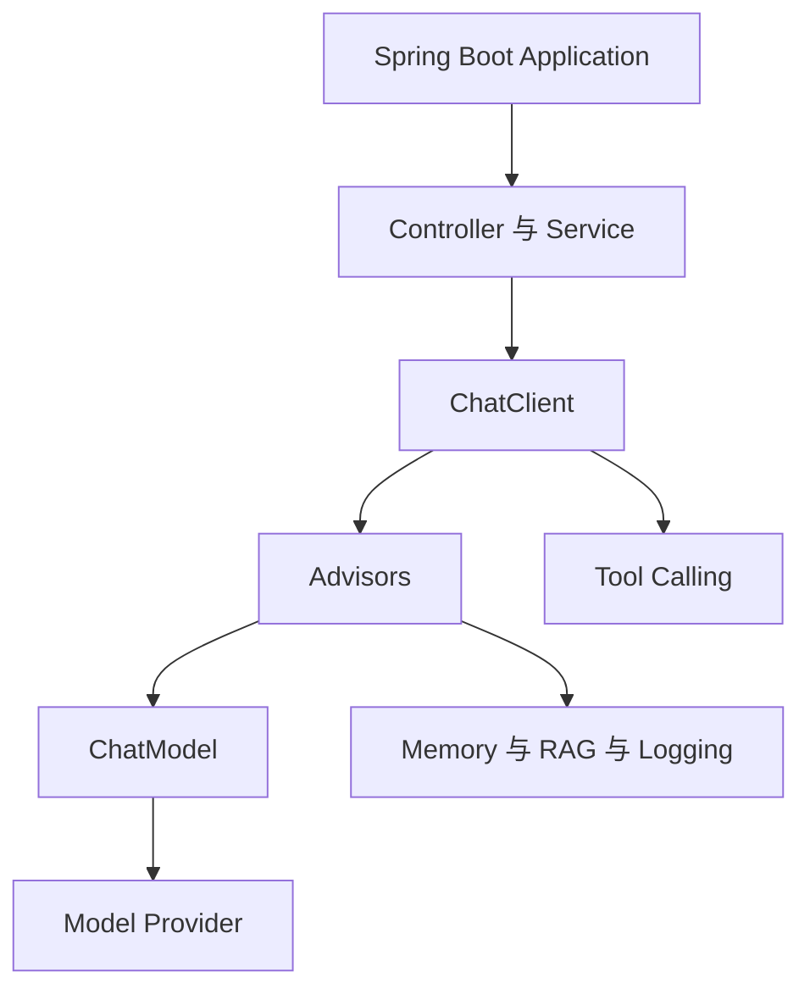
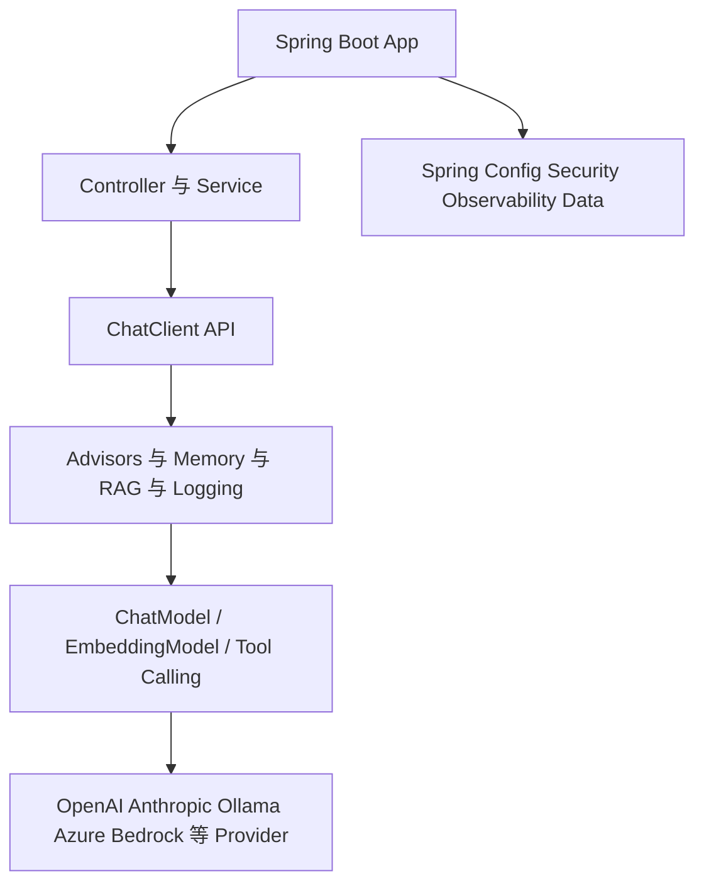
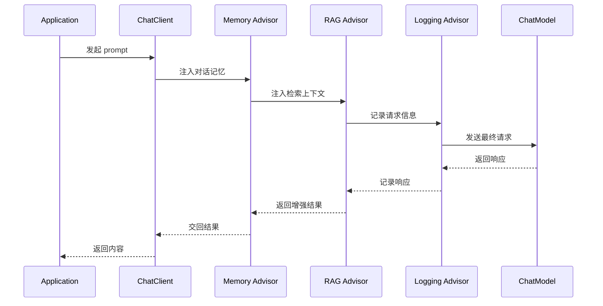
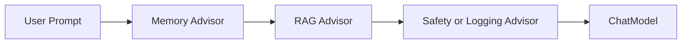
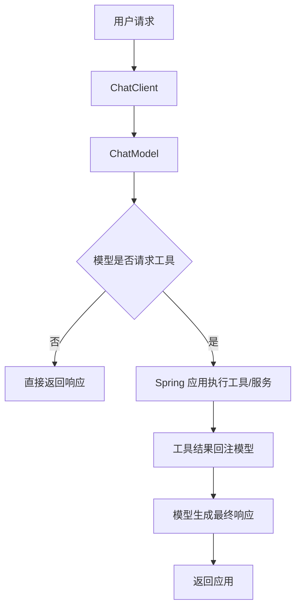
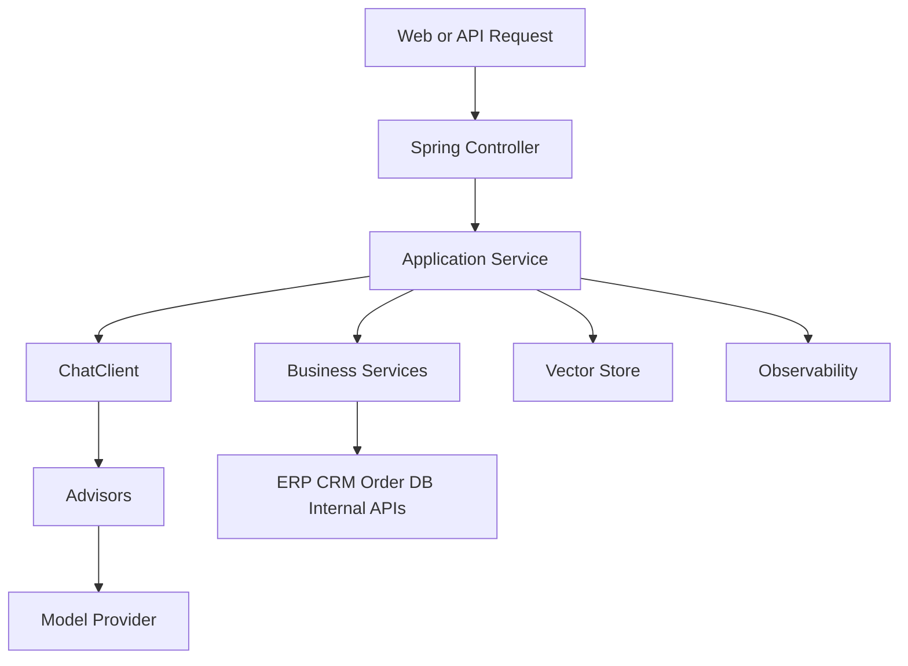

---
title: Spring AI 框架原理
description: 从 ChatModel、ChatClient、Advisors、Tool Calling 到 RAG，理解 Spring AI 在 Java 生态中的定位
module: tools
tags:
  - 工程
---

<KnowledgeMap current-module="tools" current-article="Spring AI 框架原理" />

# Spring AI 框架原理：Java 生态里的 AI 集成层怎么设计

<ArticleHeader
  module="工具与框架"
  :tags="['工程']"
  reading-time="18 分钟"
  prerequisite="理解 Tool Use、RAG、Memory 与基础 Spring Boot 开发"
  summary="Spring AI 的重点不是发明一种全新 Agent 理论，而是把模型调用、Prompt、Tool Calling、RAG、Memory、Observability 和 Spring Boot 应用栈整合成一套一致的 Java 开发体验。"
/>

## 为什么要单独讲 Spring AI

很多 AI 工程教程几乎默认以 Python 生态为中心：

- LangChain
- LangGraph
- 各种 notebook demo

但真实企业系统里，有非常多核心业务是跑在 Java / Spring 上的。  
这就带来一个现实问题：

`企业不只是想“玩模型”，而是想把模型能力接进现有 Spring 应用体系。`

Spring AI 的价值，就在于它不是单纯再造一个聊天 demo 库，而是尽量沿着 Spring 一贯的设计风格，把 AI 能力整合进现有应用工程体系。

<div class="key-insight">
  <div class="key-insight-label">核心洞察</div>
  <p class="key-insight-text">
    Spring AI 的核心价值，不在于提供最花哨的 Agent 编排，而在于把模型调用、提示词、工具、RAG、记忆和观测能力，纳入 Spring Boot 熟悉的依赖注入、自动配置和应用分层体系中。
  </p>
</div>

## Spring AI 解决的不是同一个层级问题

如果把常见框架放在一起看：

- LangGraph 更偏图式编排和 agent runtime
- LangChain 更偏模型、工具、agent 抽象
- Spring AI 更偏企业应用集成层

这意味着 Spring AI 最自然的场景通常是：

- 你已经有 Spring Boot 应用
- 你想接入多模型能力
- 你想把 RAG、Tool Calling、Memory 纳入现有服务
- 你想复用 Spring 的配置、Bean、Observability、MVC、Security 体系

所以它不是“Java 版 LangGraph”，而是另一种重点不同的框架。

## 先看一张分层图



这张图里最重要的是看出：

- `ChatModel` 更靠近模型接口层
- `ChatClient` 更靠近开发体验层
- `Advisors` 更像可插拔拦截与增强链
- `Tool Calling`、`RAG`、`Memory` 则像能力模块

## Spring AI 的核心抽象可以怎么记

如果你第一次接触 Spring AI，先抓住下面几层：

### 1. ChatModel

这是模型调用的核心抽象。  
它把不同模型供应商统一到相对一致的 Java 接口上。

### 2. ChatClient

这是更贴近日常使用的 fluent API，负责让你更方便地构造 prompt、挂载 advisors、调用模型。

### 3. Advisors

这是 Spring AI 很有辨识度的一层。  
它允许你在模型请求前后插入增强逻辑，例如：

- 注入记忆
- 做 RAG
- 记录日志
- 改写 prompt

### 4. Tool Calling

让模型请求执行外部动作，再把结果带回模型流程。

### 5. Memory / RAG / Observability

这些能力不是孤立外挂，而是可以通过 advisor 和 Spring 生态方式被整合进调用链。

## 再往下拆一层：Spring AI 的真正分层

如果你只记“它有 ChatClient 和 Advisor”，还不够工程化。  
更完整的理解方式是把 Spring AI 看成四层：

### 第 1 层：Provider Abstraction

也就是对模型厂商的抽象，包括：

- Chat Model
- Embedding Model
- Image Model
- Audio / Speech 等能力

这一层的目标是：

`尽量让业务代码依赖 Spring AI 抽象，而不是被某个模型厂商 SDK 锁死。`

### 第 2 层：Application API

也就是 `ChatClient` 这类更顺手的调用入口。  
它面向的是应用开发者，而不是底层 provider 细节。

### 第 3 层：Cross-cutting AI Patterns

也就是 `Advisors`、Memory、RAG、Logging、Observability 这些横切能力。

### 第 4 层：Spring Integration

也就是：

- 自动配置
- Bean 管理
- 配置中心
- 安全体系
- Web 层 / Service 层 / Data 层集成

这四层加在一起，才是 Spring AI 的完整定位。

## 一张更完整的 Spring AI 分层图



这张图特别能说明 Spring AI 的边界：

- 它上面连的是业务系统
- 它下面连的是模型和向量库
- 它旁边连的是整个 Spring 工程体系

## Provider 抽象为什么重要

很多团队一开始会低估这个问题，以为：

> 反正先接 OpenAI，后面再说。

但工程里很快就会出现下面这些变化：

- 某条业务要切到本地模型
- 某些请求要换成 Anthropic
- 某些嵌入模型和聊天模型来自不同供应商
- 某些环境只能走企业云提供商

如果应用层代码直接耦合到底层 SDK，这种切换会很痛。  
Spring AI 的价值之一，就是把“厂商切换成本”压到更低层。

## ChatClient 不只是“语法更顺手”

很多人第一次看 `ChatClient`，会误以为它只是一个 fluent builder。

其实它的重要性在于：

- 统一 prompt 组织方式
- 统一 advisors 挂载入口
- 统一 metadata 注入方式
- 统一 call / stream 风格
- 让应用层代码和模型底层协议脱钩

也就是说，`ChatClient` 实际上是：

`业务层进入 AI 调用链的标准入口。`

## Advisors 最像什么：AI 语义下的责任链

你可以把 Advisors 理解成“AI 调用链里的 Filter / Interceptor / Middleware”。

但它比普通 HTTP 拦截器多了一层语义，因为它处理的是：

- Prompt
- Message 列表
- 检索上下文
- 记忆注入
- 模型返回
- 共享 advisor context

Spring AI 官方文档也明确强调了：

- advisor 可以修改 request / response
- advisor 有执行顺序
- advisor 可以共享 context map
- advisor 可以参与 observability

这使得它非常适合承接“经常重复出现的 AI 模式”。

## ChatModel 到底在抽象什么

很多 AI 应用一开始都会踩到同一个坑：

- 各家模型调用方式不同
- 返回结构不同
- 参数命名不同
- 流式输出接口也不同

`ChatModel` 这一层的意义，就是给应用代码一个更统一的依赖点。  
这样你在 service 层写业务时，不必到处和底层厂商 API 细节强耦合。

一个概念化示意：

```java
Prompt prompt = new Prompt("请总结这段日志");
ChatResponse response = chatModel.call(prompt);
```

重点不在这行代码本身，而在于：

`业务代码依赖的是 Spring AI 抽象，而不是某一家模型 SDK 的细节。`

## ChatClient 为什么又存在

如果 `ChatModel` 是底层统一接口，`ChatClient` 更像是上层开发体验入口。

它通常更适合日常业务代码，因为它更方便做：

- prompt 构造
- system / user message 组织
- advisor 挂载
- 默认参数复用
- 流式或非流式调用

你可以把它理解成：

- `ChatModel` 偏基础能力抽象
- `ChatClient` 偏“好用的应用 API”

## Advisors 是 Spring AI 里特别值得理解的一层

这是很多 Java 工程师一看到就会觉得“很 Spring”的设计。

它的思路很像拦截器 / 责任链：

- 请求进入模型前，可以先经过多个 advisor
- 每个 advisor 都能读取、修改、增强请求
- 调用完成后，还能继续处理响应

Spring AI 官方文档里也把 advisors 描述成可拦截、修改和增强 AI 交互的链式机制，用来封装 recurring patterns、转换请求/响应、共享上下文和参与 observability。[Advisors API](https://docs.spring.io/spring-ai/reference/1.0/api/advisors.html)

## 一张 Advisor 调用链图



这张图非常重要，因为它说明：

`Spring AI 不是把所有功能都塞进一个 Agent 类，而是用链式增强去组织调用过程。`

## 这和普通 Filter / Interceptor 有什么像

非常像，但又不是一模一样。

相似点在于：

- 都是链式处理
- 都强调横切能力复用
- 都适合把共性逻辑抽出去

不同点在于：

- Advisors 面向的是 AI 请求与响应语义
- 它们处理的不只是 HTTP，而是 prompt、model response、上下文增强、记忆注入、RAG 等 AI 特有对象

## Advisor 顺序为什么值得单独理解

很多团队刚开始用 advisor 时，容易把它当成几个插件并列挂上去。

但顺序会直接影响结果。

例如：

1. 先注入 Memory
2. 再做 RAG
3. 再做 Logging
4. 最后发给模型

和下面这个顺序：

1. 先 Logging
2. 再 RAG
3. 再 Memory

得到的观测结果、上下文内容，甚至最终答案都可能不一样。

所以 Spring AI 的 advisor 不是“有就行”，而是需要明确：

- 谁先读请求
- 谁先改请求
- 谁依赖前一个 advisor 的输出
- 谁负责记录最终送进模型的内容

## 一张 Advisor 顺序影响图



如果你把 RAG 放在 Memory 前面，或者把 Logging 提前到“增强前”，看到的就是另一套请求现场。

## Spring AI 的 Tool Calling 本质上还是“宿主执行”

这一点和其他生态没有本质区别。  
真正重要的是，Spring AI 让工具暴露更容易贴合既有企业系统。

在 Java / Spring 体系里，工具往往天然对应：

- 一个 Service 方法
- 一个 Bean
- 一个对外 API 封装
- 一个数据库或消息系统操作

这和“为了 agent 特地再造一套工具层”不完全一样。

所以很多企业项目里，Spring AI 的 Tool Calling 更像：

`把已有业务能力用 AI 可调用的方式重新暴露出来。`

## Spring AI 怎么理解 Tool Calling

Spring AI 里 Tool Calling 的核心目的和其他生态一样：

- 模型自己不直接执行外部动作
- 模型只表达“我想调用这个工具”
- 宿主应用真正执行工具
- 再把结果回给模型

但在 Spring 生态里，它往往更自然地和这些东西连接起来：

- Bean
- 配置类
- 服务层
- 现有业务系统接口

这就意味着 Java 团队可以把已有企业服务能力更顺畅地暴露给模型。

## 一张 Tool Calling 流程图



这和我们前面讲的 Tool Use 原理是一致的，只不过这里强调的是：

`在 Spring AI 里，工具调用会更自然地嵌进 Java 服务化体系。`

### 一个更贴近企业系统的例子

```java
@Service
public class OrderService {

    public String queryOrderStatus(String orderId) {
        return "订单 " + orderId + " 当前状态: 已发货";
    }
}
```

从 AI 系统角度看，这不是“普通业务方法”，而是潜在可暴露给模型的工具能力。  
这也是为什么 Spring AI 很适合把传统业务系统慢慢升级成“AI 可调用系统”。

## Spring AI 中的 RAG 为什么也很自然

RAG 在 Spring AI 里的一个重要特点是：

它不是一定要你自己搭一个独立“AI 系统外壳”，而是可以被组织成：

- 检索组件
- advisor
- vector store 接入
- chat memory 结合

例如一个 `QuestionAnswerAdvisor`，本质上就是在模型调用前，根据用户问题先去检索相关上下文，再把结果注入 prompt。

这正体现了 Spring 风格：

- 把能力模块化
- 把增强点插到链上
- 把配置和注入交给框架

## Spring AI 里的结构化输出为什么重要

企业系统往往不满足于“生成一段文本”，而更需要：

- 返回结构化字段
- 映射成 DTO / POJO
- 进入下游业务流程

这也是 Spring AI 官方强调 Structured Output 的原因。  
因为真正进业务系统的结果，很多时候不是一段聊天文本，而是：

- 分类结果
- 风险等级
- 工单摘要
- 提取后的实体
- 后续流程需要的字段对象

### 一个概念示例

```java
public record TicketSummary(
    String issueType,
    String priority,
    String summary
) {}
```

如果模型结果最终能映射到这类对象，系统和 AI 的边界会清晰很多：

- LLM 负责生成
- Spring AI 负责对接与转换
- 业务系统负责消费结构化结果

## Spring AI 为什么特别强调 Observability

AI 系统上线后，最麻烦的问题之一是：

- 你不知道 prompt 到底长什么样
- 你不知道 advisor 改了什么
- 你不知道 RAG 注入了哪些材料
- 你不知道某次调用为什么贵、为什么慢

Spring AI 的优势之一，是它天然愿意把这类问题纳入 Spring 常见的可观测性体系，而不是把 AI 调用做成黑盒。

所以它非常适合企业场景下的这些要求：

- 链路追踪
- 指标采集
- 统一日志
- 故障定位
- 审计需求

## Spring AI 和 MCP 是什么关系

这一块你之后在企业场景里会越来越常遇到。

可以先用一个简单边界来理解：

- `Spring AI` 解决的是应用内部 AI 集成问题
- `MCP` 解决的是能力以标准协议暴露给宿主或 agent 的问题

它们并不冲突。

很常见的组合方式是：

- Spring AI 负责模型、RAG、Memory、Tool Calling、Observability
- 某些能力再通过 MCP 形式对外暴露

也就是说，Spring AI 偏“应用集成层”，MCP 偏“能力接入协议层”。

## 一张 Spring AI 与企业系统集成图



这张图可以帮助你抓住 Spring AI 的核心位置：

`它不是孤立的 Agent 沙盒，而是企业应用内部的一段 AI 中间层。`

## Spring AI 为什么对企业系统友好

这不是一句“Spring 很流行”就能概括的。

更具体地说，它对企业系统友好的原因包括：

- 容易接入现有 Spring Boot 项目
- 能复用配置中心、依赖注入、环境变量体系
- 容易挂接 observability、metrics、logging
- 容易把已有服务、数据库、API 封装成工具
- 团队已有 Java/Spring 经验时，学习成本更平滑

所以它的真正优势不是“最前沿的 agent 花活”，而是：

`让 AI 能力进入既有企业应用架构。`

## Spring AI 和 LangGraph 的差别

把它们放在一起比较时，很容易出现误区。

### LangGraph 更偏

- 图式编排
- 状态驱动路由
- 长任务 agent runtime
- 多节点循环与恢复

### Spring AI 更偏

- 应用集成
- 模型抽象
- 顾问链增强
- 与 Spring 生态能力整合

这意味着：

- 如果你要做复杂 agent runtime，LangGraph 这种图框架通常更直接
- 如果你要把模型、工具、RAG、记忆接进 Java 企业应用，Spring AI 通常更自然

## Spring AI 和 LangChain 的差别

如果粗略对比：

- LangChain 更偏 AI-first 的跨模型/跨工具开发抽象
- Spring AI 更偏 Spring-first 的企业应用集成抽象

所以一个 Python 工程师看 LangChain，可能会觉得它很自然；  
一个 Java/Spring 工程师看 Spring AI，也会觉得它“像自己熟悉的世界”。

## 一个最小示例：应用层怎么长

下面这段代码只是概念示例：

```java
String content = chatClient.prompt()
    .system("你是一个日志分析助手")
    .user("请总结这段错误日志")
    .call()
    .content();
```

如果再加上 advisors，思路会更像：

```java
String content = chatClient.prompt()
    .advisors(advisor -> advisor.param("conversationId", "demo-001"))
    .user("请结合知识库回答这个问题")
    .call()
    .content();
```

这背后真正体现的是：

- 上层代码很像普通业务服务调用
- 底层能力通过模型抽象和 advisor 链被整合起来

## Spring AI 在 Agent 时代的合理位置

我不建议把 Spring AI 理解成“万能 agent 框架”。

更合理的定位通常是：

- 它是 Java 生态中的 AI 集成基座
- 它能承接模型、工具、RAG、记忆、观测
- 如果需要更复杂的 agent runtime，可能还要搭配更强的编排结构

也就是说，它很适合做：

- 企业应用里的 AI 入口层
- 服务层 AI 能力封装
- Java 系统的模型接入标准层

## 常见误解

### 误解一：Spring AI 就是 Java 版 LangChain

不准确。  
两者确实都做抽象，但侧重点不同。

### 误解二：Spring AI 主要价值只是换模型更方便

这只是第一层价值。  
更大的价值在于它把 AI 能力纳入整个 Spring 应用体系。

### 误解三：有了 Spring AI 就不需要理解 Agent 原理

也不对。  
框架能帮你集成，但不能替你决定：

- 什么时候该用工具
- 什么时候该用 graph
- 什么时候要引入 harness

### 误解四：企业用 Java 就一定该用 Spring AI

也未必。  
如果团队的 AI runtime 已经强依赖 Python 生态，Spring AI 也许不是主轴，而是边缘接入层。

## 一个实用判断框架

下面这些场景特别适合考虑 Spring AI：

1. 你已经有成熟 Spring Boot 应用
2. 你要把模型调用接进现有业务服务
3. 你需要 Memory、RAG、Tool Calling 与 observability 一起进入工程体系
4. 团队主要语言和运维体系是 Java

如果你的核心任务是复杂 agent 编排、长任务 runtime、图式状态流转，Spring AI 可能不是唯一主角。

## 本节总结

- Spring AI 的核心价值是把 AI 能力整合进 Spring 应用工程体系
- `ChatModel` 提供模型接口抽象，`ChatClient` 提供更顺手的应用 API
- `Advisors` 是其非常关键的链式增强机制，可承接记忆、RAG、日志等能力
- 它很适合 Java 企业应用场景，但不等于万能 agent runtime 框架
- 理解它的正确方式，不是把它和所有 Python 框架逐项对位，而是先看它所处层级

## 下一步

- 回到 [LangGraph 原理](./langgraph-principles)，比较“图式编排”和“企业集成层”的差别
- 或继续阅读 [Harness 设计](./harness-design)，理解当系统进入长任务后，运行时外壳又会提出什么新要求

## 参考来源

- Spring AI 官方总览: [Spring AI Introduction](https://docs.spring.io/spring-ai/reference/1.0/index.html)
- Spring AI 官方文档 Chat Client API: [Chat Client API](https://docs.spring.io/spring-ai/reference/2.0/api/chatclient.html)
- Spring AI 官方文档 Advisors API: [Advisors API](https://docs.spring.io/spring-ai/reference/1.0/api/advisors.html)
- Spring AI 官方文档 RAG: [Retrieval Augmented Generation](https://docs.spring.io/spring-ai/reference/2.0/api/retrieval-augmented-generation.html)
- Spring AI 官方文档 Tool Calling: [Tools and Function Calling](https://docs.spring.io/spring-ai/reference/1.0/api/tools.html)
- Spring AI 官方文档 Concepts: [AI Concepts](https://docs.spring.io/spring-ai/reference/1.0/concepts.html)


