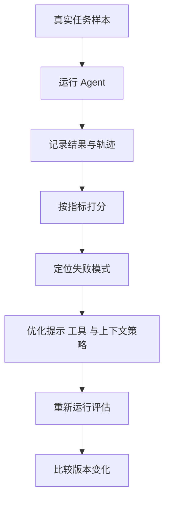
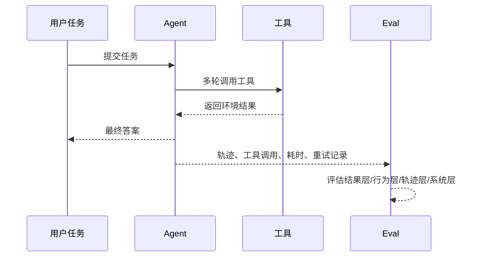
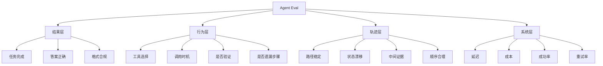

---
title: Agentic Eval 设计
description: 面对不确定性系统，怎样设计真正有用的评估方式
module: eval
tags:
  - 核心
---

<KnowledgeMap current-module="eval" current-article="Agentic Eval 设计" />

# 不能度量的 Agent，不能稳定进化

<ArticleHeader
  module="评估与进化"
  :tags="['核心']"
  reading-time="17 分钟"
  prerequisite="理解 Agent 系统的基本工作方式"
  summary="Agent 评估的难点在于它既有不确定输出，又有多步骤轨迹和工具调用行为，所以真正有效的 Eval 不能只看最终答案。"
/>

## 为什么传统测试不够

传统软件通常强调确定性输入输出，但 Agent 系统还需要评估推理轨迹是否合理、工具调用是否恰当，以及最终结果是否完成任务。

<div class="key-insight">
  <div class="key-insight-label">核心洞察</div>
  <p class="key-insight-text">
    Agent 的评估不能只看最后一句回答，而要同时评价步骤、行为和结果，这才接近真实系统质量。
  </p>
</div>

## 先看一张评估闭环图



如果一套 Eval 不能进入这个闭环，它就更像一次性演示，而不是系统迭代基础设施。

## 为什么 Agent 评估会更难

一个普通函数通常是：

```text
输入 -> 处理 -> 输出
```

而一个 Agent 更像是：

```text
目标 -> 多步推理 -> 工具调用 -> 状态变化 -> 最终结果
```

这意味着你至少可能同时面对 4 类不确定性：

- 输出内容不完全稳定
- 中间步骤可能变化
- 工具调用结果依赖外部环境
- 同一个目标可能存在多条合理路径

所以如果你只看最终回答是否“像是对的”，往往会错过很多真实问题。

## 为什么 Agent Eval 和传统 QA 最大不同

传统 QA 更像在问：

- 输出是不是对
- 边界值有没有覆盖

而 Agent Eval 还要问：

- 它是不是以合理方式得到这个结果
- 这个结果是否靠了偶然路径
- 成本、稳定性和可复现性是否足够

这就意味着 Agent Eval 往往天然更接近“系统评估”，而不只是“答案比对”。

## 一个最常见的误区

很多团队在做 Agent Eval 时，会直接沿用传统 QA 思路：

- 给一个问题
- 看最终答案对不对
- 打一个分

这种做法当然有价值，但它经常不够。因为 Agent 失败不一定表现为“答案完全错”，还可能表现为：

- 工具调用次数过多
- 检索了不该检索的内容
- 明明能直接回答，却走了很长的链路
- 结果看起来能用，但过程成本过高

换句话说，Agent 评估不仅要看 `答得对不对`，还要看：

- 是不是合理地完成了任务
- 成本是否可接受
- 过程是否稳定

## 一个时序图：为什么只看最终答案不够



如果你只保留最后一句输出，后面大部分系统质量信号就都丢掉了。

## 应该从哪几个层次评估

一个更实用的做法，是把评估拆成多个层次。

### 第一层：结果层

最基础的问题仍然是：

- 任务完成了吗
- 最终答案是否正确
- 输出是否满足格式和约束要求

这层最容易理解，但也最容易掩盖中间问题。

### 第二层：行为层

这里要看的是 Agent 的动作是否合理，例如：

- 是否选择了合适的工具
- 是否在合适时机做了检索
- 是否遗漏了必要步骤
- 是否在错误路径上反复重试

行为层的好处是能帮你发现“结果偶尔对，但过程很差”的系统。

### 第三层：轨迹层

轨迹层关注的是完整执行路径，例如：

- 第一步为什么这么做
- 工具调用顺序是否合理
- 中间状态有没有明显漂移
- 最终输出是否能从轨迹中得到支撑

这层特别适合分析复杂任务和多 Agent 系统。

### 第四层：系统层

这层看的是更工程化的指标：

- 延迟
- 成本
- 成功率
- 重试率
- 工具故障恢复能力

如果前面三层更偏质量判断，这一层更偏系统运行质量。

## 一张脑图：四层评估到底在看什么



## 一个可落地的评估框架

你可以把一套 Agent Eval 简化成下面 4 个问题：

1. `结果对吗`
2. `过程合理吗`
3. `成本可接受吗`
4. `多次运行是否稳定`

这 4 个问题合在一起，通常比单独一个“最终答案准确率”更接近真实系统质量。

## 评估对象不只是模型

这点很重要。  
很多人一说 Eval，第一反应是“测模型好不好”。但在真实 Agent 系统里，你评估的其实常常是整条链路：

- prompt / system 规则
- 上下文工程
- 工具描述与参数设计
- 工具本身质量
- 重试和停止策略
- 轨迹记录方式

也就是说，Agent Eval 评估的是一个运行时系统，而不是单个模型 API。

## 数据集应该怎么设计

Agent Eval 的另一个难点，是测试数据集不能只像传统问答那样设计。

更好的做法通常是按任务类型来分层：

- 简单事实型任务
- 需要检索的知识型任务
- 需要工具调用的执行型任务
- 需要多步骤决策的复杂任务
- 容易失败的边界场景

这样你才知道：

- 是哪类任务最脆弱
- 系统对哪种复杂度开始失控
- 优化之后到底改善了什么

## 一个实用建议：先做小而真的任务集

很多团队刚做 Eval 时，容易有两个极端：

- 样本太少，只能看热闹
- 样本太大，但质量参差不齐，很难分析

更合理的方式通常是先做一小批高价值样本：

- 高频真实任务
- 容易失败的边界任务
- 业务上后果较重的关键任务

这样即使数据集不大，也能更早暴露关键问题。

## 不要只做“平均分”

平均分是非常容易误导人的指标。

举个例子：

- 简单任务全都很好
- 复杂任务大量失败

最后平均下来也许还不错，但这并不代表系统真的可靠。

更好的做法是按任务分桶，例如：

- 检索任务通过率
- 工具调用任务通过率
- 多轮任务通过率
- 长任务中断率

这样才能看出系统真正的强弱项。

Anthropic 在 2025 年关于 eval 和 harness 的工程文章里也强调，Agent 评估要尽量贴近真实任务，关注基础设施噪声、长任务表现和可复现失败模式，而不是只看一次性总分。[Demystifying evals for AI agents](https://www.anthropic.com/engineering/demystifying-evals-for-ai-agents) [Effective harnesses for long-running agents](https://www.anthropic.com/engineering/effective-harnesses-for-long-running-agents)

## 一个简单示例

假设你在评估一个代码修改型 Agent，可以把指标拆成：

| 层次 | 关注点 | 示例指标 |
| --- | --- | --- |
| 结果层 | 最终是否修好 | 构建是否通过、目标测试是否通过 |
| 行为层 | 工具调用是否合理 | 是否读了关键文件、是否执行了验证 |
| 轨迹层 | 执行路径是否稳定 | 是否无意义重复搜索、是否出现路径漂移 |
| 系统层 | 成本和稳定性 | 平均耗时、平均轮次、失败重试率 |

这时你就不会只盯着“最后 build 过了没有”，而是能看到整个任务链条的质量。

## 一个更接近落地的评分表

如果你在做一个代码 Agent，可以采用类似下面的思路：

| 维度 | 问题 | 示例评分 |
| --- | --- | --- |
| 任务结果 | 最终修复了吗 | `pass/fail` |
| 约束遵守 | 是否改了禁止文件 | `pass/fail` |
| 行为质量 | 是否读取了关键上下文 | `0-2` |
| 轨迹质量 | 是否出现无意义重复调用 | `0-2` |
| 系统成本 | 轮次和耗时是否过高 | `0-2` |

这样设计的好处是：你既能保留硬约束，也能保留可比较的软指标。

## 什么叫“有用的评估”

一个真正有用的 Eval，不是单纯打分，而是能支持下面这些动作：

- 找到失败模式
- 指导下一轮优化
- 比较不同版本效果
- 防止系统回归

如果一套评估只能告诉你“这次好像差不多”，那它很难支撑真正的系统迭代。

OpenAI 在 2025 年关于 AgentKit 和 eval 平台的资料里，也把 dataset、trace grading、自动优化和版本比较放在同一条链路里，本质上就是把 Eval 当作持续优化基础设施，而不是验收表单。[Introducing AgentKit](https://openai.com/index/introducing-agentkit/) [Agents SDK](https://www.openai.com/agent-platform/)

## 常见失败模式

### 失败一：只测最终答案

这样会遗漏过程问题，尤其在多步任务里非常危险。

### 失败二：任务集过于简单

如果测试样本全是容易题，系统上线后很容易在真实复杂场景中暴露问题。

### 失败三：没有稳定的基线

没有基线，你就很难判断这次优化到底是真的变好了，还是只是随机波动。

### 失败四：评估和真实目标脱节

如果你评估的只是“回答像不像”，但真实目标是“任务有没有完成”，这套评估就会越来越偏。

### 失败五：评估样本和线上环境脱节

例如：

- 线下没有模拟真实工具失败
- 线下没有考虑长任务中断
- 线下环境比线上干净太多

这会让你在线下看起来“效果不错”，上线后却不断暴露新问题。

## 设计 Eval 时最值得优先做的事

- 先定义任务成功标准
- 再拆结果、行为、轨迹和系统层指标
- 按任务类型建立测试集，而不是只做一个平均分
- 对关键失败模式单独保留回归样本

你不一定一开始就拥有完美评估体系，但至少要从“可持续迭代”这个目标出发来搭。

## Eval 最终服务的是决策

一套好的 Eval，最终应该能回答这些问题：

- 这次改动到底有没有变好
- 好在哪里，坏在哪里
- 是结果改善了，还是只是成本上升
- 哪些失败样本应该优先进入下一轮优化

如果它回答不了这些问题，那它很可能还只是“统计输出”，而不是“工程工具”。

## 一个最小评估记录示例

```json
{
  "task_id": "fix-deploy-config",
  "task_success": true,
  "build_passed": true,
  "tool_calls": 6,
  "unnecessary_searches": 1,
  "total_runtime_sec": 42,
  "notes": "结果正确，但搜索轮次偏多"
}
```

这样的记录虽然简单，却已经能支撑后续比较和回归分析。

## 本节总结

- Agent Eval 不能只看最终答案，还要看行为、轨迹和系统表现
- 更有价值的评估体系，要能帮助你定位失败模式并指导优化
- 数据集设计应该按任务类型分层，而不是只追求一个平均分
- 一个好的评估体系，最终服务的是持续迭代，而不是一次性展示

## 下一步

继续阅读 [奖励函数设计](./reward-function-design)，你会看到在更可执行、更可优化的任务里，系统如何把目标进一步转化成可学习或可搜索的信号。

