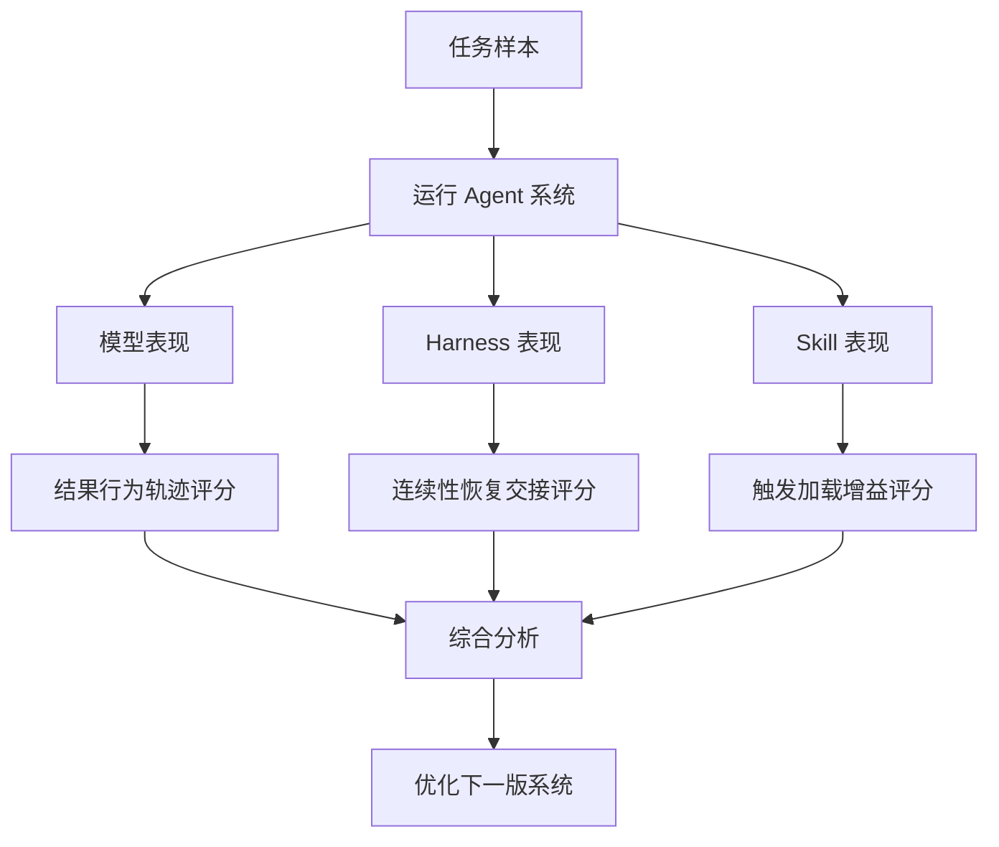
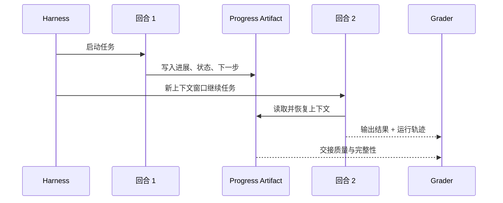
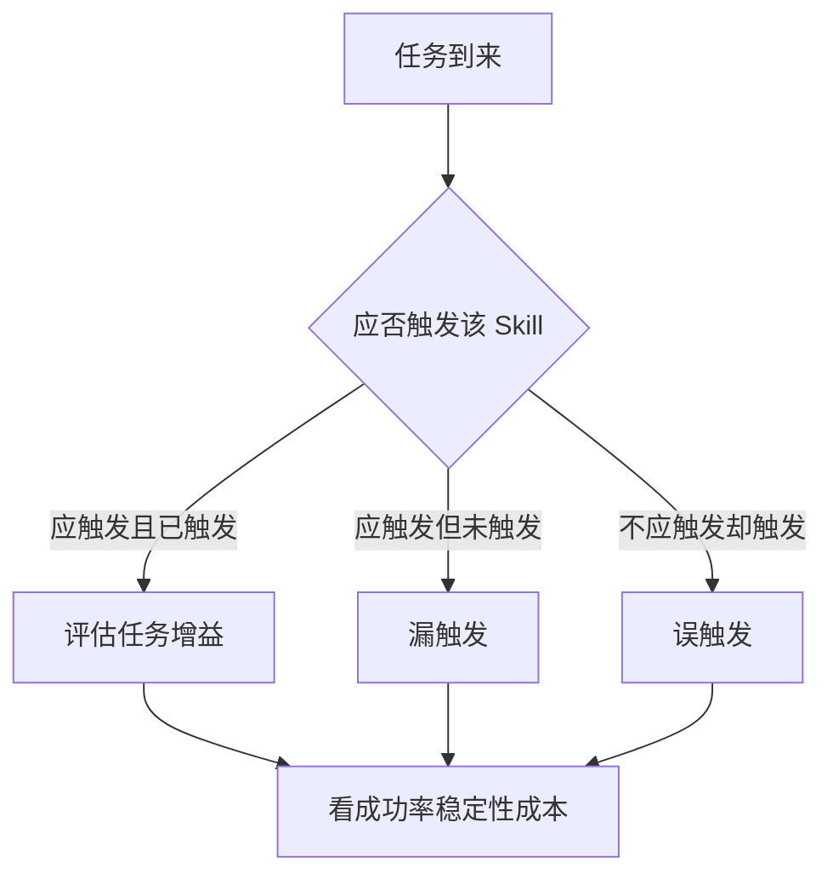

---
title: Harness 与 Skill 的评估体系
description: 当系统开始依赖 harness 和 skills 时，应该如何评估连续性、触发准确率与真实增益
module: eval
tags:
  - 工程
---

<KnowledgeMap current-module="eval" current-article="Harness 与 Skill 的评估体系" />

# Harness 与 Skill 的评估体系：别只评模型，要评整个运行外壳

<ArticleHeader
  module="评估与进化"
  :tags="['工程']"
  reading-time="16 分钟"
  prerequisite="理解 Agentic Eval、Harness 设计与 Agent Skills"
  summary="当系统开始依赖 harness 提供连续性、skill 提供流程知识时，评估对象就不再只是模型输出，而是要同时评估运行外壳、触发策略、知识增益和长期稳定性。"
/>

## 为什么要单独评估 Harness 和 Skill

很多团队一开始做 Agent Eval，只会测：

- 最终答案对不对
- 任务成没成功
- 成本高不高

这当然重要，但当系统开始依赖：

- `Harness` 来维持长任务连续性
- `Skill` 来提供流程知识和模板

你就会发现，仅看最终答案已经不够了。

因为系统现在多了两层新变量：

- 是不是 harness 让系统更稳定
- 是不是 skill 真在帮忙，而不是制造噪声

<div class="key-insight">
  <div class="key-insight-label">核心洞察</div>
  <p class="key-insight-text">
    当 Agent 变成“模型 + 工具 + harness + skills”的系统时，评估对象也必须从单次输出升级为整套运行结构。
  </p>
</div>

## 先分清三个评估对象

一个非常有用的起点，是先把评估对象拆开。

### 1. 模型能力

看模型是否具备足够的理解、推理和工具使用能力。

### 2. Agent Harness

看运行时外壳是否能支撑长任务、多轮切换、失败恢复和状态交接。

### 3. Skills

看 skill 是否被正确触发、正确加载，并且真的提升了任务表现。

很多“系统变差了”的问题，不是模型退化，而是 harness 或 skill 层出了问题。

## 一张总图：评估链路怎么拆



这张图的核心意思是：

`评估已经不是单维打分，而是多层归因。`

## Harness 该评什么

Harness 解决的是长任务运行纪律，所以它的评估重点不应只看最终答案，而应更关注：

- 多轮后是否还能持续推进
- 中途换上下文窗口后能否恢复
- 是否留下清晰 progress artifact
- 每轮结束是否保持干净状态
- 失败后是否能重新进入正确路径

## Harness 的四类关键指标

### 1. 连续性指标

例如：

- 新一轮是否能正确读懂前一轮交接
- 跨窗口后是否重复做旧工作
- 长任务是否会中途“失忆”

### 2. 交接质量指标

例如：

- progress file 是否完整
- 是否清楚记录已完成项 / 下一步
- 是否区分事实、结论、风险

### 3. 干净状态指标

例如：

- 任务回合结束时是否留下半成品
- 是否在退出前完成必要构建或测试
- 是否存在明显未收尾的副作用

### 4. 恢复能力指标

例如：

- 构建失败后是否能重新定位
- 工具报错后是否能正确重试
- 是否会在错误路径上无限循环

## 一张 Harness 时序图：它到底在评什么



如果第二轮根本无法有效接上第一轮，那么 harness 即使“形式存在”，也没有真正工作。

## Skill 该评什么

Skill 的目标不是“存在”，而是“带来稳定增益”。

所以 skill 的评估重点通常包括：

- 该触发时有没有触发
- 不该触发时会不会误触发
- 触发后是否真的提升任务质量
- skill 的加载成本是否过高
- 多个 skills 会不会冲突

## Skill 的五类关键指标

### 1. 触发准确率

问的是：

- 当前任务该用 skill 吗
- 系统有没有选对 skill

### 2. 误触发率

问的是：

- 本来不该加载某个 skill，却被错误加载了吗
- 是否导致上下文噪声和行为偏航

### 3. 使用后增益

问的是：

- 加载该 skill 后，任务成功率是否提升
- 输出是否更稳定
- 是否更少忘记流程约束

### 4. 成本与上下文开销

问的是：

- 该 skill 是否太大
- 是否经常加载大量不必要内容
- 是否导致 token 和延迟明显上升

### 5. 维护健康度

问的是：

- skill 是否过期
- skill 引用的模板、脚本和资源是否还有效
- 是否与当前工作流或规则冲突

## 一个 Skill 评估图



这张图说明了一个关键事实：

`Skill 的评估不只是“内容写得好不好”，而是“触发逻辑 + 使用结果”一起评。`

## Capability Eval 和 Regression Eval 在这里怎么用

这是非常实用的一组区分。

### Capability Eval

更像在问：

- 新的 harness 是否让长任务能力更强
- 新的 skill 是否让某类流程任务更容易完成

这类评估更关注“能力有没有提升”。

### Regression Eval

更像在问：

- 加了新 harness 后，旧任务有没有被破坏
- skill 更新之后，以前稳定的任务是不是开始误触发

这类评估更关注“原来能做好的事情有没有回退”。

如果只有 capability eval，没有 regression eval，系统很容易边加新能力边破坏旧能力。

## 一个简单的评估表

| 评估对象 | 关注问题 | 示例指标 |
| --- | --- | --- |
| Harness | 是否能跨多轮稳定推进 | 交接成功率、重复劳动率、恢复成功率 |
| Skill | 是否正确触发并带来增益 | 触发准确率、误触发率、使用后成功率 |
| 全系统 | 最终是否更可用 | 总任务成功率、平均成本、回归率 |

## 真实任务里怎么采样

如果你要给 harness 和 skill 建一个最小评估集，建议至少包含下面几类任务。

### Harness 任务集

- 会跨多个上下文窗口的长任务
- 中途故意注入构建失败的任务
- 需要多轮逐步推进的任务
- 需要清理和交接的任务

### Skill 任务集

- 明显应该触发 skill 的任务
- 边界模糊、容易误触发的任务
- 多个 skills 可能同时相关的任务
- 不应触发任何 skill 的普通任务

这样你才能看清：

- skill 是不是真的帮忙
- harness 是不是真的稳住长任务

## 一个很实用的对照实验

评估 harness 或 skill，最有价值的做法之一是做对照组：

1. 不开 harness / skill 跑一遍
2. 开启 harness / skill 再跑一遍
3. 比较结果、稳定性和成本差异

如果没有对照组，你很容易把“模型本身变好”误判成“harness 或 skill 有功”。

## 常见失败模式

### 失败一：只看最终任务成功率

这样会忽略：

- harness 是否减少重复劳动
- skill 是否频繁误触发
- 系统是否只是靠更高成本换来成功

### 失败二：不区分能力提升和回归保护

没有 capability / regression 分层，系统优化会越来越不可控。

### 失败三：样本全是理想任务

如果没有边界任务、长任务和容易误触发的任务，评估结果会过于乐观。

### 失败四：把 Harness 当成 Prompt 评估

Harness 不是只看“模型说得像不像”，而是要看：

- 交接是否清晰
- 状态是否可继续
- 多轮后是否仍可控

### 失败五：把 Skill 当成内容评审

Skill 再漂亮，如果触发不准、加载过重、没有任务增益，依然是低价值 skill。

## 一个最小评估记录示例

```json
{
  "task_id": "long-running-docs-update-01",
  "task_success": true,
  "windows_used": 3,
  "handoff_success": true,
  "duplicate_work_detected": false,
  "skill_triggered": ["readme-update-skill"],
  "skill_trigger_correct": true,
  "skill_helpful": true,
  "total_runtime_sec": 310,
  "notes": "第三轮顺利续接上一轮，无明显重复搜索"
}
```

这种记录的价值在于：它把 harness 和 skill 的表现从“感觉”变成了可比较对象。

## 和前面文章的关系

- [Harness 设计](../05-tools-frameworks/harness-design) 解释系统为什么需要运行时外壳
- [Agent Skills](../05-tools-frameworks/agent-skills) 解释为什么流程知识要被打包复用
- [Agentic Eval 设计](./agentic-eval-design) 解释多层评估框架

这一篇做的，是把三者真正接到一起。

## 本节总结

- 当系统引入 harness 和 skills 后，评估对象必须从模型扩展到整套运行结构
- Harness 更应该评连续性、交接质量、干净状态和恢复能力
- Skill 更应该评触发准确率、误触发率、真实增益和上下文开销
- 最有价值的评估方法，通常是 capability eval、regression eval 和对照实验结合

## 下一步

- 继续阅读 [奖励函数设计](./reward-function-design)
- 或回到 [Tool / MCP / Skill / Harness / Workflow / Agent 关系图](../04-multi-agent/system-relations)


