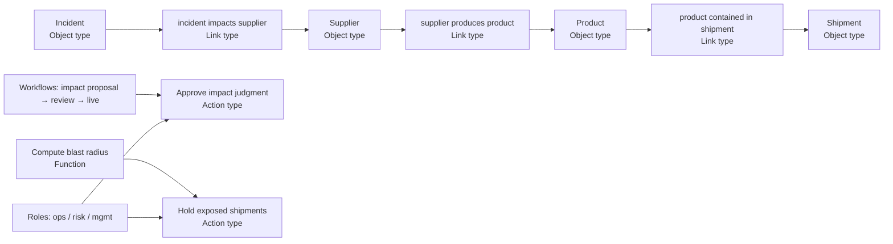

<KnowledgeMap current-module="ontology" current-article="Palantir Foundry：语义六件套" />

<ArticleHeader
  module="本体论与知识表示"
  :tags="['进阶', '建模', '案例']"
  reading-time="15 分钟"
  prerequisite="已读 why-ontology-for-agents 和边界篇"
  summary='把 Foundry Ontology 的六件套（Object types、Link types、Action types、Functions、Roles、Workflows/Approvals）当成一个整体来理解，才能看懂它为什么不是一个「数据 catalog」也不是 BI 层，而是业务动作层。'
/>

  
核心洞察

  

    Foundry 的 Ontology 不是"给数据加标签"，而是"给组织加操作系统"：语义定义 + 动作入口 + 业务逻辑 + 权限 + 审批流程 五件事在同一层被定义，应用层（Object Explorer / Quiver / Workshop / Object Views 才能都在同一套世界模型上运作。
  

## Foundry Ontology 的官方定位（用自己的话讲）

Foundry 文档把 Ontology 定义为：**组织的数字孪生与操作层。** 它位于数据集和模型之上，把真实世界对象（设备、订单、客户、工厂、产品、金融交易、事故、风险……）映射成 Object types / properties / links，再加上 Action types、Functions、Workflow、Approvals、Roles 和 Object Views，让分析、决策与操作在同一套语义上统一。

它和"数据 catalog"的本质差别：catalog 告诉你"这个字段叫什么"；Ontology 告诉你"用这个对象能做什么、谁能做、做完之后要走什么审批"。

## 六件套总览

| 构件 | 它回答什么 | 典型形式 |
| --- | --- | --- |
| Object types | 世界里有什么实体/事件 | Schema：id + typed properties + shared properties + security + backing data sources |
| Link types | 它们之间有什么关系 | 方向性、基数、对象级安全、衍生 vs 存数 |
| Action types | 怎么改世界 | 提交形态、必填项、副作用、审批链、回填系统 |
| Functions | 业务逻辑怎么跑（任意复杂度 | 代码逻辑，可引用 Object/Object set、返回结构化结果、可被 Action/Workshop 调用 |
| Roles / Security | 谁能看、谁能改 | 本体级和资源级权限，与组织角色映射 |
| Workflows / Ontology Edit Approvals | 改世界/改本体的流程怎么走 | 提案、审批、执行、回填、可追溯 |

下面逐个讲。

## 1. Object types：不只是"表"

Object type 是真实实体或事件的 schema：
- **主键**（唯一身份）
- **Properties**（属性）+ 类型（string、int、datetime、enum、boolean、geopoint……
- **Shared properties**：跨类型复用统一建模，集中管理 metadata（显示名、单位、脱敏）
- **Backing datasources**：属性来源于哪些底层数据集/管道（不是简单一张表一个 Object
- **Object Views / Explorer / Search**：应用层天然能在这套 schema 上工作、搜、看、分析

一个最容易被忽略点：**同一个 Object type 可以由多个 dataset 拼接属性，但对外呈现一个语义上的对象视图。** 这非常关键：业务团队不需要关心你背后有几张表、哪张是 CRM 哪张是 ERP，他们只看到 Customer。

## 2. Link types：关系就是关系

Link type 是两个 Object type 之间关系的 schema：方向、基数（一对一/一对多/多对多）、属性、安全、衍生/存储。

几个实战经验：
- 命名要动作化，不要模糊的"相关"：`Incident impacts Supplier`、`Shipment contains Product`、`WorkItem ownedBy Owner`；
- 避免"万能"关系：`related_to` 基本等于后续代码全 if/else 猜；
- 区分"事实级关系"和"判断级关系"——后者应该走审批（后面第 6 条）。

Foundry 对链接也支持安全：你能看到某类对象，不等于你能看到它所有链接对象。

## 3. Action types：动作层（最被低估的一块）

Action type 是"一次提交能做什么"：
- 输入表单（必填/校验
- 对对象、属性、链接做的一组变更；
- 副作用（通知、回调外部系统、重跑 pipeline、生成工单）；
- 审批链与执行权限；
- 回填外部系统；
- 谁能执行、谁在什么条件下能执行。

这一步，**才让 Ontology 从"读层语义"升级到"写层语义。** 没有 Action，Ontology 只是更花哨的数据 schema。

一个经典错误：把"改状态"写成 API 接口散落在各个应用，每个应用各自写校验、各自做权限、各自做审批。结果就是 10 个应用 = 10 套动作权限 = 不一致。Foundry 的哲学是：**写动作进入本体，应用只调用动作。**

## 4. Functions：业务逻辑本体化

Functions 是写代码的业务逻辑，接受 Object/objects set 入参，读属性，返回结构化输出。它们能被：
- Action types 调用（提交前后校验、提交后计算、衍生值、条件分支）；
- Workshop 与 Object Views 展示（仪表盘、规则面板、推荐下一步）；
- Quiver 分析（复杂衍生指标、图查询、场景推演）；
- 搜索/筛选/标签页的动态条件。

为什么这很关键：**很多业务逻辑不是"属性"，也不是"动作"，而是"基于属性的可复计算。** 如果不把 Functions 放在本体层，每个应用会各自实现一遍，口径偏差就来了。

## 5. Roles：权限本身就是本体

Foundry 的角色是 Ontology 的中心权限模型，可以挂在 Ontology 级别或单独资源级（Object type / Link type / Action type）。

这和"应用层鉴权"最大区别是：**应用不决定你能看什么，本体决定。** 无论你用 Object Explorer、Quiver 还是 Workshop，同一套权限自动生效。

几条经验：
- "谁能看"与"谁能写谁能审"要拆三条不同的权限位；
- 不要把 Object 的属性当权限用（比如"只有 Owner 字段等于你才能看"——这是 Gate，不是 Role，容易被绕开；
- 对"判断级关系的审批权限，与"事实级写入权限"应分开。

## 6. Workflows & Ontology Edit Approvals：改世界/改本体都要流程

Foundry 支持 Workflows 以及对 Ontology 自身改动的审批。

这背后有一个很重要的设计判断：**改本体（例如新增一个属性、修改一个 Action 的参数）本身也是一次高风险变更。** 所以它要像代码 PR 一样走 review + approval，而不是某个管理员随手改。

同理，写真实世界状态（提交 Action）也要有审批链，而且审批链要和调用方解耦。

## 6 件套合起来是什么样

用一个供应链场景举例：

- 语义层保证"我们讨论的是同一批对象和关系；
- 审批层保证"impact 是判断，必须走 proposal+review；
- 动作层保证"扣货动作只有 risk role 可以走、且要有前置条件；
- 函数层把 blast radius 的复杂计算收敛成一个一致口径。

## 本节总结
- Foundry Ontology = 语义层（Object/Link）+ 动作层（Action）+ 业务逻辑层（Function）+ 权限层（Roles）+ 流程层（Workflow/Approvals）六件套；
- 它的价值不在某一个构件，而在六件事被统一管理；
- 应用层不再各自造语义、动作、权限、审批，降低"系统间口径漂移。

## 下一步
对比一下没有 Foundry 这么重的商业栈时，[cruxible 如何用 YAML 写出一份可执行本体](./cruxible-yaml-ontology)。
