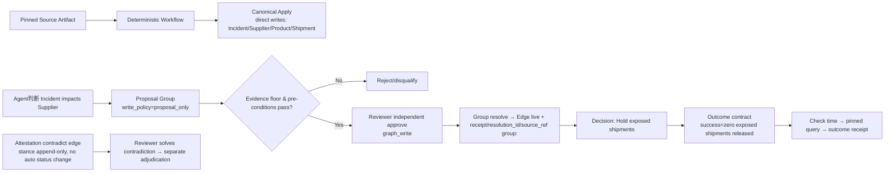

<KnowledgeMap current-module="ontology" current-article="受治理的写入：direct / proposal_only / 角色 / 审批组 / 证据与 Attestation" />

<ArticleHeader
  module="本体论与知识表示"
  :tags="['进阶', '建模', '治理']"
  reading-time="14 分钟"
  prerequisite="已读 Foundry 六件套和 Cruxible YAML 两篇"
  summary='把写入分成 direct / proposal_only / mint_only 三类，叠加上角色权限（读、治理写、图写、Admin）、审批组（candidate groups + reviewer identity）、证据与 Attestation（只追加的观察）、Outcome 合约（真实世界成功测量），才能让 Agent 的状态可信、可追责、可纠错。'
/>

<div class="key-insight">
  <div class="key-insight-label">核心洞察</div>
  <p class="key-insight-text">
    很多团队做本体只关心"数据进来能不能查到"，完全不做写治理。结果是上线半年后，图里有一半边不知道是谁写的、为什么写、根据什么写、写完矛盾怎么办、真实世界打脸又怎么纠。可信状态不是查得到，而是**每条边都知道它怎么进来、谁批准、根据什么证据、后续观察有没有质疑、结果有没有兑现**。
  </p>
</div>

## 写治理的四根独立轴

写治理至少有四根独立维度，不要混成一根权限轴：

| 维度 | 你决定的事情 | 典型机制 |
| --- | --- | --- |
| **Write Policy** | 这条状态能不能直接写进 live | direct / proposal_only / mint_only（Crux） 或 Action + Approval（Foundry） |
| **Role / Tier** | 调用者有哪个等级的写口授权 | Foundry Roles；Crux 的 read_only/governed_write/graph_write/admin + write_tier |
| **Review & Identity** | 审批人是谁、必须独立、不能自审 | Reviewer != proposer；review rationale；review receipt |
| **Evidence / Outcome** | 写作根据什么证据、真实结果怎么验 | Evidence refs / Source artifacts / Attestations / Outcome contracts |

下面用 Cruxible + Foundry 双视角讲。

## 1. Write Policy：direct 还是 proposal_only

这是最重要、也最容易被忽略的一条轴。**它和权限无关，是治理形态问题。**

Cruxible 明确给出三种写策略：

- **direct**：确定性事实，写了就 live（如锁定源文件解析的结构化输出、ERPs 同步）；
- **proposal_only**：判断性/解释性状态，必须 proposal → review → group resolve 才 live（如"Incident 影响 Supplier"、"交易可疑"、"患者有风险"）；
- **mint_only**（仅 entity types）：只允许内部身份源写，用于 Auth-managed identity（`Actor` 等）。

对应 Foundry 侧：
- 确定性事实可以通过 backing datasets / pipeline canonical apply 更新；
- 判断性变更应该通过 Ontology 的 Action types + approval workflows 或通过 Ontology Edit Approvals 走 proposal。

### 经验法则：什么时候 proposal_only

满足以下任意一条，就应该 proposal_only：
1. 这条边/属性本质是"判断"而非"确定性解析"；
2. 判断错误会直接触发高风险动作（扣货、冻结、封禁、合规处罚）；
3. 你希望有 review 的 audit trail；
4. Agent 会给出这段判断，你不想让它直接改 live state；
5. 两个来源经常冲突，需要人裁决。

### 反过来 direct 的条件
- 来自锁定源（pinned source artifacts + deterministic parser）；
- 结果可重复复现；
- 人不需要额外解读语义。

## 2. 角色与 Tier：权限等级是"调用口"不是"业务身份"

Cruxible 的 4 档权限是机械且累积的：`read_only ⊂ governed_write ⊂ graph_write ⊂ admin`。

| 档位 | 能做什么 |
| --- | --- |
| read_only | 查询、收据、痕迹、inspect、snapshot list |
| governed_write | 提案、工作流 run/test/propose、feedback 记录、outcome/decision/snapshot 非破坏性操作 |
| graph_write | entity/relationship 直接写、canonical workflow apply、group resolve、trust precedent |
| admin | config reload、lock、clone/backup/restore、state pull-apply |

注意一个**关键分割线**：`governed_write` 可以**提案**任何东西，但**不能 commit 任何东西**。这个设计就是给 Agent 的——让它能提出判断，但不直接落 live。

### write_tier：某些类型的 direct write 权限可以"下放"

```yaml
entity_types:
  StateNote:
    write_tier: governed_write
relationships:
  - state_note_about_work_item: StateNote -> WorkItem
    write_tier: governed_write
```

但请注意：**review adjudication（feedback accept/correct/reject）永远要求 graph_write，不管 write_tier 多低。** 因为"裁决"是把非 live 变成 live，这个动作本身需要更高的授权边界。

### 对应 Foundry Roles
Foundry 的 Roles 是本体级和资源级两条：
- Ontology 层面的角色（对整本体）
- Object/Link/Action/Function 的角色
- 可以与组织角色映射

核心设计原则相同：**读角色、提案角色、审批角色、Admin 角色分开。**

## 3. 审批组（Candidate Groups）与"独立评审人"

Crucible 的 proposal_only 写入会进入 `candidate group`：
- 每个 group 有 `members`（候选边集合）、`evidence`、`analysis_state`、`thesis signature`、`review_priority`、`pending_version`；
- 签名 bucket：每一类 thesis（relationship_type + canonical thesis_facts 的 SHA-256）作为 precedent 单元——同一类判断会积累 trust；
- `pending_version` 是并发控制：reviewer 批准时必须带 `--expected-pending-version`，否则"review 期间变更"就失败；
- 解决有两条轨道：reviewer 手动 approve/reject，或者 **earned auto-resolve**（信任积累后第一次永远走 review，不可第一次 auto）。

### 独立评审人
Procedures 接受和 Group resolution 都可以要求 reviewer != proposer。这点非常重要：
- 如果没有 reviewer/proposer 分离，agent 自己提、自己审（或同一个人做两件事），等于 proposal_only 没有治理价值。

Foundry Action 的审批链也经常加类似规则：提交人不能是最终审批人、某些动作必须风险官签字。

## 4. 证据（Evidence）：写之前拿什么撑

证据两种主流形式：
- **Source evidence**（原文定位）：source artifact + chunk_id 或 heading_path + block_selector（Crux）
- **Evidence refs**（从 workflow step / receipt 来）

Crux 对证据的处理很有启发：
- 它**不把整个源文档复制到图里**，而是把源文档注册成 `source artifact`，然后 proposal 里只引用 locator；
- 这保证证据可读、可追溯，同时避免"同一段原文复制 100 次在 100 条边里"；
- Proposal 可以被要求 `require_evidence_on_support`：没有证据就 disqualify auto-resolve，或者 mutation guard 直接拒绝。

## 5. Attestations（只追加观察）：不悄悄推翻

很多系统对"后来发现之前判断错了"处理就是直接覆盖旧边。结果 6 个月后没人知道当时为什么写、谁批准、后来谁推翻。

Crux 的 Attestation 是：
- 对某条 claim 追加一条 `stance = support/contradict/unsure` 的观察记录；
- **不自动改变 claim 的 live 状态**；
- reviewer 之后解决矛盾，再通过 review 决定 claim 的命运。

这意味着：旧 claim、新观察、review 裁决、结果测量各自留痕，不会"沉默覆盖"。Foundry 侧对应的是 Audit + 审批记录 + 版本可追溯。

## 6. Outcome Contracts：真实世界成功也要本体化

写治理的最后一公里是"你写进 live 的决策，在现实中是否真成功"。

Crucible 做法：
- 在 decision 变成 live **之前**，先声明成功定义（outcome profile + 测量方式 + pinned query/检查时点 + measurement 窗口）；
- 检查时间到了，pinned query（用同样的 revision 语义）去跑，写入 outcome；
- outcome 与 decision/run receipt 关联，审计链完整。

这件事让本体从"怎么写状态"延伸到"写完状态是否真有效"——对接的是 eval（06 模块）和持续演化（08 模块）。

## 7. 一个最小完整链路（串联 1-6）



**这就是"可信一条边"的完整生命周期**。

## 本节总结
- 写治理 = Write Policy + Role/Tier + Review & Identity + Evidence + Attestation + Outcome 六条独立轴；
- 判断性关系应当 proposal_only，确定性关系才 direct；
- 提案权限与审批权限必须分离；
- 观察（Attestation）与裁决（Review）要分开，不要沉默覆盖；
- 真实世界成功也本体化（Outcome Contracts），不让决策永远自洽。

## 下一步
最后进入本体论模块的落地篇：[Ontology 如何接入 Memory / Multi-Agent / Eval：跨模块集成](./ontology-integration)。
