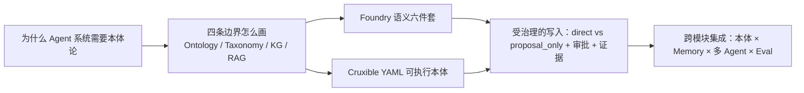

<KnowledgeMap current-module="ontology" current-article="本体论与知识表示" />

<ArticleHeader
  module="本体论与知识表示"
  :tags="['模块总览', '进阶', '建模']"
  reading-time="5 分钟"
  prerequisite="建议先读 Memory 体系、多 Agent 系统、LangGraph 状态设计与 Harness 设计四篇"
  summary='本模块把西方哲学传统中的 ontology 概念，落到 Agent 工程中的实体消歧、关系建模、语义对齐、动作权限与审批流程的实际问题上。本体论在这里不是 wiki 文档，而是一份 runtime 会读取并强制执行的语义契约。'
/>

# 本体论与知识表示

当 Agent 系统开始处理真实世界中的复杂实体和关系时，"概念到底是什么"不再是一个哲学游戏，而是直接影响推理稳定性、记忆质量、多 Agent 协作一致性和评估可信度的工程问题。

本模块**结合两个成熟参照物**来讲：
- **Palantir Foundry**：把本体论做组织级数字孪生与操作层的商业标杆（Object types、Link types、Action types、Functions、Roles、Workflows/Approvals 六件套）。
- **Cruxible**：一个开源的"受治理状态引擎"，用 YAML 把实体/关系/命名查询/门禁/审批/结果合约/快照一起写进 config，并用运行时在写入口强制执行。

两条路径都指向同一个核心结论：**本体论的真正价值不在读，而在写。**

## 模块定位

这个模块连接你已有的 Memory 与多 Agent 知识，回答更底层的六个问题：

1. 世界上有什么**实体**？它们如何被唯一标识？
2. 实体之间有什么**关系**？方向性、基数、关系属性分别是什么？
3. 如何**修改**这个世界（动作层）？哪些动作必须走审批？
4. **业务逻辑与查询口径**在哪里统一收敛（函数层 + named queries）？
5. 谁能看、谁能写、谁能审（权限层）？
6. 写完后怎么知道**真实世界成功**，又怎么纠正错误（证据、Attestations、Outcome Contracts、快照）？

## 适合谁读

- 开始在 Agent 中处理真实业务实体和关系的工程师
- 想把哲学中的 ontology 与工程中的知识建模打通的读者
- 计划引入知识图谱或状态运行时到 Agent 架构中的架构师
- 对"可信状态"、"可追溯决策"、"强监管场景落地"有需求的团队

## 进入前建议

- 已读 [Memory 体系](../03-memory/)
- 已读 [多 Agent 系统](../04-multi-agent/)
- 已读 [LangGraph 状态图设计实战](../05-tools-frameworks/langgraph-state-design/)
- 已读 [Harness 设计](../05-tools-frameworks/harness-design/)

## 本模块学习顺序（推荐）

## 本模块文章

| 文章 | 类型 | 解决的问题 | 状态 |
| --- | --- | --- | --- |
| [为什么 Agent 系统需要本体论](./why-ontology-for-agents) | 总览破题 | 本体论解决的不是知识库有没有东西，而是"我们说的是不是同一个东西/是不是同一次写操作/什么叫真实成功"。四个典型症状、最小可行本体起步清单。 | ✅ 已发布 |
| [Ontology vs Taxonomy vs Knowledge Graph vs RAG：四条边界](./ontology-vs-taxonomy-kg) | 核心理论 | 四层怎么分、怎么组合使用、常见失败模式（用分类做关系、用图做治理、用向量替判断）。 | ✅ 已发布 |
| [Palantir Foundry 语义六件套：Object / Link / Action / Function / Roles / Workflow](./foundry-object-link-action-function) | 标杆案例 | 如何把本体做成"组织操作系统"：语义层 + 动作层 + 业务逻辑层 + 权限层 + 审批流程层统一。 | ✅ 已发布 |
| [Cruxible：用 YAML 写一份可执行本体论](./cruxible-yaml-ontology) | 工程实现 | entity/relationship/named_query/mutation_guards + feedback/outcome/workflows/procedures/snapshots 全部进 config，运行时读它就执行。 | ✅ 已发布 |
| [受治理的写入：direct / proposal_only / 角色 / 审批组 / 证据与 Attestation](./governed-writes-and-approvals) | 治理机制 | 写入的 4 条独立轴（Policy/Role/Review/Evidence）、判断性关系必须 proposal_only、独立评审人、attestation 不沉默覆盖、outcome contract 把成功本体化。 | ✅ 已发布 |
| [跨模块集成：Ontology × Memory × Multi-Agent × Eval](./ontology-integration) | 落地集成 | 把本体作为三个模块的共同底座：语义写入、实体消歧、Blackboard 类型化、评估口径绑定到 named query + outcome。 | ✅ 已发布 |
| （待写）Hypergraph 在企业级多 Agent 架构中的应用 | 进阶 | 高阶关系、带属性多向关系、如何与治理机制衔接。 | 📝 待写 |

## 学完后去哪里

如果你关心 Agent 如何"自己长出新能力"，可以进入 [自进化 Skills 与 Agent 自我改进](../08-self-evolving-skills/)；如果你关心强监管场景下的数据合规与质量，则继续看 [数据治理](../09-data-governance/)；想回到工程主流程把本体写进评估闭环，可继续读 [Harness 与 Skill 的评估体系](../06-eval-evolution/harness-skill-evaluation) 与 [Agentic Eval 设计](../06-eval-evolution/agentic-eval-design)。
