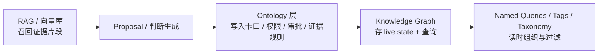

<KnowledgeMap current-module="ontology" current-article="Ontology vs Taxonomy vs Knowledge Graph vs RAG：四条边界怎么画" />

<ArticleHeader
  module="本体论与知识表示"
  :tags="['进阶', '建模']"
  reading-time="11 分钟"
  prerequisite="已读为什么 Agent 系统需要本体论"
  summary='Taxonomy 管分类、Knowledge Graph 管连接、RAG 管召回、Ontology 管世界的运行规则（写规则、权限、审批）。四层可以叠加，但不要用某一层硬做另一层的事。'
/>

  
核心洞察

  

    一个典型失败模式是：用标签分类树（Taxonomy）去表达关系，再把关系写进字符串里，用向量召回（RAG）去"理解语义，最后在业务动作上再用散落在各处的权限 if/else 去审批。结果是每次加一个新关系，全链路都要改。
  

## 四条能力，四层问题

| 层级 | 你解决的问题 | 典型输出 | 是否执行动作与治理 |
| --- | --- | --- | --- |
| **Taxonomy** | 这个东西属于哪一类？便于找人、过滤、分组 | 标签、目录树、层级分类 | 否 |
| **Knowledge Graph (属性图)** | A 和 B 有什么关系？能不能连通？ | 节点、边、属性 | 半（约束有，但通常不负责动作与审批 |
| **RAG / 向量库** | 哪些文档片段可能相关？把原文片段召回给上下文 | 文本 chunk、embedding、索引 | 否 |
| **Ontology（可执行本体）** | 世界有什么、关系是什么、谁能做什么、改了怎么算合规、做完什么是真实世界成功 | Object/Link/Action/Function/Roles/Workflows/Approvals/Outcomes | **是** |

你会看到，这四层之间是"叠加关系"——不是谁替代谁。

## 1. Taxonomy：只管"属于哪里，不管"是谁与谁之间是什么关系

### 它擅长
- 把 Work Item 按 ProductArea 分组；
- 把 Vulnerability 按严重性打标签；
- 把 Incident 按业务域过滤。

Cruxible 把这类"组织信息"叫 Tags，它的设计哲学是：**绝大多数信息都应该是 tag。** 因为 tag 不增加摩擦——它只改变阅读时看到什么，不会在写时拦你。

### 它不擅长
- "Work Item 必须挂到 Owner 才能关闭"——这是 Gate（规则，不是 Tag。
- "Incident 影响 Supplier"这类判断性边必须要证据 + 审批——这是 Ontology 的写策略。
- "谁审批谁不审批"——这是 Role/Tier/Write Policy。

**一句话判断**：如果你只用来组织，不强制规则，用 Taxonomy / Tags 就够了。

## 2. Knowledge Graph：只管连接，不管"这条边怎么进来的"

### 它擅长
- 从 Incident → Supplier → Product → Shipment 的 blast radius 分析；
- 依赖图、血缘图、归属图；
- 把多源数据连接起来后做路径查询、邻居查询、子图过滤。

Foundry 的 Link types 和 Cruxible 的 named traversals / graph queries 都在这一层价值最大：查询。

### 它不擅长
- 这条边怎么写进来、要不要审、谁有权写、写完矛盾怎么办——这是写治理；
- 边代表的"业务动作为什么动作不能做；
- 做完动作后是否真实成功——这是 outcome。

很多团队把知识图谱做到最后会发现：**图很全，但图里一半边没 provenance。** 你不知道哪条是 pipeline 的事实、哪条是 Agent 拍脑袋写的、哪条是审批过的人审过的。这个问题根本不在图存储，而在写治理机制（Ontology 层）。

**一句话判断**：如果你只需要"谁连谁，不需要"这条边的写入规则与治理，就用知识图谱。

## 3. RAG / 向量库：只管"可能相关的文本片段"，不管"事实是否成立"

### 它擅长
- 从 10 万份政策文档里召回和"供应商合规"相关的段落；
- 给 Agent 喂上下文原文；
- 辅助 proposal 的证据检索。

Cruxible 自己就把 Source Artifacts 做 source artifact registration，并在 proposal 里引用 `source_evidence: source_artifact_id + chunk_id` / `heading_path + block_selector`。向量 + 检索是提供证据的好方式，但**不负责证据被接受为事实**。

### 它不擅长
- "证据到事实之间是否成立"——这是 review / approval 的判断；
- "两个 Agent 对同一个词的定义是否一致"——这是实体/关系的本体约束；
- "A 影响 B 这条边真不真、权不权威"——这是 attestation + feedback。

**一个典型误区**：很多团队误以为"RAG 召回相关了 = 语义一致 = 事实成立了"。实际上这三步是三件完全不同的事。

## 4. Ontology（可执行本体）：把"世界怎么运行"写进运行时

Foundry 的 Ontology 同时定义：
- Object/Link（世界长什么样）
- Action types / Functions（动作与业务逻辑）
- Roles / Security（谁能看、谁能做）
- Ontology Edit Approvals（改本体自身也要审）
- Workflows（改世界的流程）

Cruxible 的 Ontology config 同时定义：
- entity_types / relationships / named_queries / enums / contracts
- mutation_guards / write_policy / write_tier
- feedback_profiles / outcome_profiles / decision_policies
- providers / workflows / artifacts / tests
- gates / quality_checks / snapshots

注意最后几项：**连测试、快照、质量检查、门禁、结果合约全部进 config。** 这是"可执行本体"与"概念 Ontology 文档"的本质差别。

## 5. 推荐的组合方式

对真实 Agent 系统，一条很稳的组合是：

- **证据**：RAG 召回原文
- **判断**：Agent/人提出判断（Proposal）
- **治理**：Ontology 卡口决定这判断能不能 live
- **连接**：Knowledge Graph 承载 live state
- **组织**：Tags/Taxonomy 在查询时分组和过滤

再叠 Cruxible 的 Gates / Flags / Tags 角色分工：

| Cruxible 角色 | 作用时 | 是否拦截 | 推荐占比 |
| --- | --- | --- | --- |
| Tags | 读时 | 否 | 大多数 |
| Gates | 写时 | 是（只用于真实风险） | 极少数 |
| Flags | 维护时 | 否，仅报出 | 中间层 |

## 本节总结
- Taxonomy 管分类组织、Knowledge Graph 管连接与查询、RAG 管证据召回、Ontology 管动作与治理与审批；
- 四层应叠加使用，不要某一层硬做另一层；
- 本体论不是替代图谱/向量，而是在写入口和权限入口的运行时语义契约。

## 下一步
下两篇分别看 [Palantir Foundry 的语义六件套](./foundry-object-link-action-function) 与 [Cruxible 的 YAML 可执行本体论](./cruxible-yaml-ontology)。
