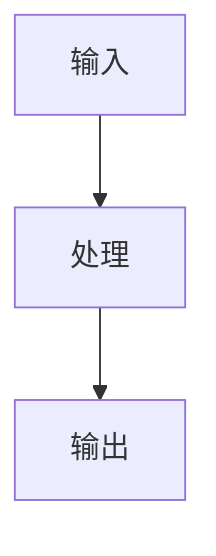
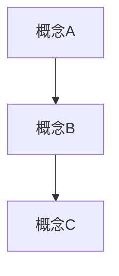

# AI Agent 全栈知识体系 · 产品文档

> 版本：v1.0  
> 目标：构建一个专业、系统、用心的 AI Agent 全栈知识网站  
> 参考标杆：pdai.tech（知识体系深度）+ VitePress 官方文档（工程质量）  
> 技术栈：VitePress + Vue 3 + TypeScript

---

## 目录

1. [项目概述](#1-项目概述)
2. [技术选型](#2-技术选型)
3. [快速启动](#3-快速启动)
4. [目录结构](#4-目录结构)
5. [VitePress 配置](#5-vitepress-配置)
6. [导航与侧边栏配置](#6-导航与侧边栏配置)
7. [主题定制](#7-主题定制)
8. [文章结构规范](#8-文章结构规范)
9. [完整内容大纲（52 篇）](#9-完整内容大纲52-篇)
10. [首页设计规范](#10-首页设计规范)
11. [组件规范](#11-组件规范)
12. [写作规范](#12-写作规范)
13. [部署方案](#13-部署方案)

---

## 1. 项目概述

### 1.1 定位

**AI Agent 全栈知识体系**——面向有一定工程基础的开发者，系统讲透从 LLM 原理到 Agent 工程实践的完整知识链路。

核心差异化：
- 从**第一性原理**出发，不堆砌工具文档
- 每个概念讲透原理后，用**真实代码和案例**回归实战
- **知识体系感**：每篇文章开头展示全局知识图谱，读者始终知道自己在哪
- 作者有 Claude Code、Cursor、Trae 重度使用经验 + 自建 Agent 经验，内容有真实感

### 1.2 目标读者

- 有 Python/JS 基础、想系统学习 AI 工程的开发者
- 已经在用 AI 工具（Cursor、Copilot）但想理解底层原理的工程师
- 想自己搭 Agent 系统的独立开发者

### 1.3 核心指标

- 文章总数：52 篇（分 7 个模块）
- 每篇字数：3000-6000 字
- 代码示例：每篇至少 1 个可运行示例
- 架构图：每篇至少 1 张原创图解

---

## 2. 技术选型

| 项目 | 选型 | 理由 |
|------|------|------|
| 框架 | VitePress 1.x | 与你现有站点一致，Markdown 优先，构建快 |
| 语言 | TypeScript | 配置文件类型安全 |
| 代码高亮 | Shiki（内置） | 支持所有语言，主题丰富 |
| 数学公式 | markdown-it-mathjax3 | 原理篇需要少量公式 |
| 搜索 | VitePress 内置本地搜索 | 无需额外服务，离线可用 |
| 评论 | giscus | 基于 GitHub Discussions，无数据库 |
| 图表 | Mermaid（VitePress 插件） | 流程图、架构图 |
| 部署 | GitHub Pages / Vercel | 零成本，自动 CI/CD |
| 域名 | csqread.top/ai-guide（现有） | 保持一致 |

---

## 3. 快速启动

```bash
# 克隆或初始化项目
mkdir ai-agent-guide && cd ai-agent-guide

# 初始化 package.json
npm init -y

# 安装依赖
npm install -D vitepress
npm install -D markdown-it-mathjax3
npm install -D vitepress-plugin-mermaid

# 初始化 VitePress
npx vitepress init

# 本地开发
npm run docs:dev

# 构建
npm run docs:build

# 预览构建产物
npm run docs:preview
```

### package.json scripts

```json
{
  "scripts": {
    "docs:dev": "vitepress dev docs",
    "docs:build": "vitepress build docs",
    "docs:preview": "vitepress serve docs",
    "docs:lint": "markdownlint docs/**/*.md"
  },
  "devDependencies": {
    "vitepress": "^1.6.4",
    "markdown-it-mathjax3": "^4.3.2",
    "vitepress-plugin-mermaid": "^2.0.17"
  }
}
```

---

## 4. 目录结构

```
ai-agent-guide/
├── docs/                          # VitePress 文档根目录
│   ├── .vitepress/
│   │   ├── config.ts              # 主配置文件（核心）
│   │   ├── theme/
│   │   │   ├── index.ts           # 主题入口
│   │   │   ├── custom.css         # 全局样式覆盖
│   │   │   └── components/
│   │   │       ├── KnowledgeMap.vue   # 知识体系全局图组件
│   │   │       ├── ArticleHeader.vue  # 文章头部（显示模块位置）
│   │   │       └── CodeDemo.vue       # 可运行代码演示组件
│   │   └── cache/                 # 构建缓存（gitignore）
│   │
│   ├── public/
│   │   ├── logo.svg
│   │   ├── favicon.ico
│   │   └── images/
│   │       ├── knowledge-map.svg      # 全局知识体系图
│   │       └── og-image.png           # 社交分享图
│   │
│   ├── index.md                   # 首页
│   ├── guide.md                   # 学习指南（如何使用本站）
│   │
│   ├── 00-preface/                # 序章
│   │   ├── index.md               # 模块概述
│   │   ├── paradigm-shift.md      # 第三次范式转移
│   │   ├── ai-native-mindset.md   # AI 原生开发者思维
│   │   └── how-to-use.md          # 学习路径指南
│   │
│   ├── 01-llm-foundations/        # 语言模型基础
│   │   ├── index.md
│   │   ├── what-is-llm.md
│   │   ├── transformer-intuition.md
│   │   ├── next-token-prediction.md
│   │   ├── context-window.md
│   │   ├── lost-in-the-middle.md
│   │   ├── kv-cache.md
│   │   ├── sampling-strategies.md
│   │   └── hallucination.md
│   │
│   ├── 02-agent-core/             # Agent 核心机制
│   │   ├── index.md
│   │   ├── what-is-agent.md
│   │   ├── tool-use.md
│   │   ├── tool-design-principles.md
│   │   ├── chain-of-thought.md
│   │   ├── react-pattern.md
│   │   ├── plan-and-execute.md
│   │   ├── context-engineering.md
│   │   ├── context-sources.md
│   │   ├── dynamic-context.md
│   │   ├── structured-context.md
│   │   ├── system-prompt-design.md
│   │   └── agentic-loop-failures.md
│   │
│   ├── 03-memory/                 # Memory 体系
│   │   ├── index.md
│   │   ├── four-memory-types.md
│   │   ├── in-context-memory.md
│   │   ├── external-memory.md
│   │   ├── episodic-memory.md
│   │   ├── semantic-memory.md
│   │   ├── rag-fundamentals.md
│   │   ├── chunking-strategies.md
│   │   ├── retrieval-methods.md
│   │   └── codebase-rag.md
│   │
│   ├── 04-multi-agent/            # 多 Agent 系统
│   │   ├── index.md
│   │   ├── single-agent-limits.md
│   │   ├── orchestrator-subagent.md
│   │   ├── agent-communication.md
│   │   ├── task-decomposition.md
│   │   ├── real-world-case.md
│   │   ├── mcp-protocol.md
│   │   ├── mcp-capability-model.md
│   │   └── mcp-integration.md
│   │
│   ├── 05-tools-frameworks/       # 工具与框架
│   │   ├── index.md
│   │   ├── cursor-vs-claude-code.md
│   │   ├── cursorrules-deep-dive.md
│   │   ├── claude-code-internals.md
│   │   ├── framework-selection.md
│   │   ├── langgraph.md
│   │   ├── autogen.md
│   │   └── build-from-scratch.md
│   │
│   └── 06-eval-evolution/         # 评估与进化
│       ├── index.md
│       ├── agentic-eval-design.md
│       ├── harness-skills.md
│       ├── llm-as-judge.md
│       ├── agentic-rl.md
│       └── reward-function-design.md
│
├── .github/
│   └── workflows/
│       └── deploy.yml             # GitHub Actions 自动部署
│
├── .gitignore
├── package.json
└── README.md
```

---

## 5. VitePress 配置

> 文件路径：`docs/.vitepress/config.ts`

```typescript
import { defineConfig } from 'vitepress'
import { withMermaid } from 'vitepress-plugin-mermaid'
import mathjax3 from 'markdown-it-mathjax3'

export default withMermaid(
  defineConfig({
    // ==================== 基础配置 ====================
    lang: 'zh-CN',
    title: 'AI Agent 全栈知识体系',
    description: '从第一性原理到工程实战，系统掌握 AI Agent 开发',
    
    // 文档根目录
    srcDir: '.',
    
    // 构建输出
    outDir: '../dist',
    
    // 最后更新时间
    lastUpdated: true,
    
    // 清理 URL（去掉 .html 后缀）
    cleanUrls: true,
    
    // ==================== Head 配置 ====================
    head: [
      ['link', { rel: 'icon', href: '/favicon.ico' }],
      ['meta', { name: 'theme-color', content: '#1a1a2e' }],
      ['meta', { property: 'og:type', content: 'website' }],
      ['meta', { property: 'og:title', content: 'AI Agent 全栈知识体系' }],
      ['meta', { property: 'og:description', content: '从第一性原理到工程实战，系统掌握 AI Agent 开发' }],
      ['meta', { property: 'og:image', content: 'https://csqread.top/ai-guide/og-image.png' }],
      // 代码字体
      ['link', { rel: 'preconnect', href: 'https://fonts.googleapis.com' }],
      ['link', { 
        rel: 'stylesheet', 
        href: 'https://fonts.googleapis.com/css2?family=JetBrains+Mono:wght@400;500&display=swap' 
      }],
    ],
    
    // ==================== Markdown 配置 ====================
    markdown: {
      // 代码高亮主题
      theme: {
        light: 'github-light',
        dark: 'github-dark',
      },
      // 行号显示
      lineNumbers: true,
      // 数学公式
      config: (md) => {
        md.use(mathjax3)
      },
      // 锚点配置
      anchor: {
        permalink: true,
        permalinkBefore: true,
        permalinkSymbol: '#',
      },
    },
    
    // ==================== Mermaid 配置 ====================
    mermaid: {
      theme: 'default',
      themeVariables: {
        primaryColor: '#4f6ef7',
        primaryTextColor: '#1a1a2e',
        primaryBorderColor: '#4f6ef7',
        lineColor: '#6b7280',
        secondaryColor: '#f3f4f6',
        tertiaryColor: '#fff',
      },
    },
    
    // ==================== 主题配置 ====================
    themeConfig: {
      logo: '/logo.svg',
      siteTitle: 'AI Agent Guide',
      
      // 外链
      socialLinks: [
        { icon: 'github', link: 'https://github.com/xiaoqianbaobao/ai-guide' },
      ],
      
      // 编辑链接
      editLink: {
        pattern: 'https://github.com/xiaoqianbaobao/ai-guide/edit/main/docs/:path',
        text: '在 GitHub 上编辑此页',
      },
      
      // 最后更新文字
      lastUpdatedText: '最后更新',
      
      // 文章前后导航文字
      docFooter: {
        prev: '上一篇',
        next: '下一篇',
      },
      
      // 大纲配置（显示 h2 和 h3）
      outline: {
        level: [2, 3],
        label: '本文目录',
      },
      
      // 本地搜索
      search: {
        provider: 'local',
        options: {
          locales: {
            root: {
              translations: {
                button: {
                  buttonText: '搜索文章',
                  buttonAriaLabel: '搜索文章',
                },
                modal: {
                  noResultsText: '没有找到相关结果',
                  resetButtonTitle: '清除搜索',
                  footer: {
                    selectText: '选择',
                    navigateText: '切换',
                    closeText: '关闭',
                  },
                },
              },
            },
          },
        },
      },
      
      // ========== 顶部导航 ==========
      nav: [
        { text: '学习指南', link: '/guide' },
        {
          text: '模型基础',
          items: [
            { text: '语言模型基础', link: '/01-llm-foundations/' },
          ],
        },
        {
          text: 'Agent',
          items: [
            { text: 'Agent 核心机制', link: '/02-agent-core/' },
            { text: 'Memory 体系', link: '/03-memory/' },
            { text: '多 Agent 系统', link: '/04-multi-agent/' },
          ],
        },
        {
          text: '工程实践',
          items: [
            { text: '工具与框架', link: '/05-tools-frameworks/' },
            { text: '评估与进化', link: '/06-eval-evolution/' },
          ],
        },
        { text: '序章', link: '/00-preface/' },
      ],
      
      // ========== 侧边栏（见第 6 节完整配置）==========
      sidebar: buildSidebar(),
      
      // 页脚
      footer: {
        message: '基于 MIT 协议开源',
        copyright: 'Copyright © 2025 AI Agent Guide Contributors',
      },
    },
  })
)

// 侧边栏构建函数（从第 6 节独立出来方便维护）
function buildSidebar() {
  return {
    '/00-preface/': sidebarPreface(),
    '/01-llm-foundations/': sidebarLLM(),
    '/02-agent-core/': sidebarAgentCore(),
    '/03-memory/': sidebarMemory(),
    '/04-multi-agent/': sidebarMultiAgent(),
    '/05-tools-frameworks/': sidebarTools(),
    '/06-eval-evolution/': sidebarEval(),
  }
}
```

---

## 6. 导航与侧边栏配置

> 将以下函数追加到 `config.ts` 底部

```typescript
// ==================== 序章 ====================
function sidebarPreface() {
  return [
    {
      text: '序章：范式转移',
      collapsed: false,
      items: [
        { text: '模块概述', link: '/00-preface/' },
        { text: '第三次范式转移', link: '/00-preface/paradigm-shift' },
        { text: 'AI 原生开发者思维', link: '/00-preface/ai-native-mindset' },
        { text: '学习路径指南', link: '/00-preface/how-to-use' },
      ],
    },
  ]
}

// ==================== 语言模型基础 ====================
function sidebarLLM() {
  return [
    {
      text: '语言模型基础',
      collapsed: false,
      items: [
        { text: '模块概述', link: '/01-llm-foundations/' },
        { text: 'LLM 到底是什么', link: '/01-llm-foundations/what-is-llm' },
        { text: 'Transformer 直觉理解', link: '/01-llm-foundations/transformer-intuition' },
        { text: 'Next Token Prediction', link: '/01-llm-foundations/next-token-prediction' },
        { text: '上下文窗口', link: '/01-llm-foundations/context-window' },
        { text: 'Lost in the Middle', link: '/01-llm-foundations/lost-in-the-middle' },
        { text: 'KV Cache 原理', link: '/01-llm-foundations/kv-cache' },
        { text: '采样策略', link: '/01-llm-foundations/sampling-strategies' },
        { text: '幻觉的本质', link: '/01-llm-foundations/hallucination' },
      ],
    },
  ]
}

// ==================== Agent 核心机制 ====================
function sidebarAgentCore() {
  return [
    {
      text: 'Agent 核心机制',
      collapsed: false,
      items: [
        { text: '模块概述', link: '/02-agent-core/' },
      ],
    },
    {
      text: 'Agent 基础',
      collapsed: false,
      items: [
        { text: 'Agent 的本质', link: '/02-agent-core/what-is-agent' },
        { text: 'Tool Use 完整机制', link: '/02-agent-core/tool-use' },
        { text: '工具设计三原则', link: '/02-agent-core/tool-design-principles' },
      ],
    },
    {
      text: '推理范式',
      collapsed: false,
      items: [
        { text: 'Chain-of-Thought', link: '/02-agent-core/chain-of-thought' },
        { text: 'ReAct 范式', link: '/02-agent-core/react-pattern' },
        { text: 'Plan-and-Execute', link: '/02-agent-core/plan-and-execute' },
      ],
    },
    {
      text: 'Context Engineering',
      collapsed: false,
      items: [
        { text: 'Context Engineering 概论', link: '/02-agent-core/context-engineering' },
        { text: '上下文的四个来源', link: '/02-agent-core/context-sources' },
        { text: '动态上下文管理', link: '/02-agent-core/dynamic-context' },
        { text: '结构化上下文', link: '/02-agent-core/structured-context' },
        { text: 'System Prompt 设计', link: '/02-agent-core/system-prompt-design' },
        { text: 'Agentic Loop 故障模式', link: '/02-agent-core/agentic-loop-failures' },
      ],
    },
  ]
}

// ==================== Memory 体系 ====================
function sidebarMemory() {
  return [
    {
      text: 'Memory 体系',
      collapsed: false,
      items: [
        { text: '模块概述', link: '/03-memory/' },
      ],
    },
    {
      text: '四种记忆形态',
      collapsed: false,
      items: [
        { text: 'Memory 的四种形态', link: '/03-memory/four-memory-types' },
        { text: 'In-context Memory', link: '/03-memory/in-context-memory' },
        { text: 'External Memory', link: '/03-memory/external-memory' },
        { text: 'Episodic Memory', link: '/03-memory/episodic-memory' },
        { text: 'Semantic Memory', link: '/03-memory/semantic-memory' },
      ],
    },
    {
      text: 'RAG 工程',
      collapsed: false,
      items: [
        { text: 'RAG 原理', link: '/03-memory/rag-fundamentals' },
        { text: 'Chunk 策略', link: '/03-memory/chunking-strategies' },
        { text: '检索方法对比', link: '/03-memory/retrieval-methods' },
        { text: '代码库 RAG 实战', link: '/03-memory/codebase-rag' },
      ],
    },
  ]
}

// ==================== 多 Agent 系统 ====================
function sidebarMultiAgent() {
  return [
    {
      text: '多 Agent 系统',
      collapsed: false,
      items: [
        { text: '模块概述', link: '/04-multi-agent/' },
      ],
    },
    {
      text: '架构设计',
      collapsed: false,
      items: [
        { text: '单 Agent 的边界', link: '/04-multi-agent/single-agent-limits' },
        { text: 'Orchestrator-Subagent', link: '/04-multi-agent/orchestrator-subagent' },
        { text: 'Agent 间通信', link: '/04-multi-agent/agent-communication' },
        { text: '任务分解决策', link: '/04-multi-agent/task-decomposition' },
        { text: '真实系统案例', link: '/04-multi-agent/real-world-case' },
      ],
    },
    {
      text: 'MCP 协议',
      collapsed: false,
      items: [
        { text: 'MCP 是什么', link: '/04-multi-agent/mcp-protocol' },
        { text: '三层能力模型', link: '/04-multi-agent/mcp-capability-model' },
        { text: 'MCP 接入实战', link: '/04-multi-agent/mcp-integration' },
      ],
    },
  ]
}

// ==================== 工具与框架 ====================
function sidebarTools() {
  return [
    {
      text: '工具与框架',
      collapsed: false,
      items: [
        { text: '模块概述', link: '/05-tools-frameworks/' },
      ],
    },
    {
      text: '开发工具',
      collapsed: false,
      items: [
        { text: 'Cursor vs Claude Code vs Trae', link: '/05-tools-frameworks/cursor-vs-claude-code' },
        { text: '.cursorrules 深度解析', link: '/05-tools-frameworks/cursorrules-deep-dive' },
        { text: 'Claude Code 工作原理', link: '/05-tools-frameworks/claude-code-internals' },
      ],
    },
    {
      text: 'Agent 框架',
      collapsed: false,
      items: [
        { text: '框架选型逻辑', link: '/05-tools-frameworks/framework-selection' },
        { text: 'LangGraph', link: '/05-tools-frameworks/langgraph' },
        { text: 'AutoGen', link: '/05-tools-frameworks/autogen' },
        { text: '从零手写 Agent', link: '/05-tools-frameworks/build-from-scratch' },
      ],
    },
  ]
}

// ==================== 评估与进化 ====================
function sidebarEval() {
  return [
    {
      text: '评估与进化',
      collapsed: false,
      items: [
        { text: '模块概述', link: '/06-eval-evolution/' },
        { text: 'Agentic Eval 设计', link: '/06-eval-evolution/agentic-eval-design' },
        { text: 'Harness Skills', link: '/06-eval-evolution/harness-skills' },
        { text: 'LLM-as-Judge', link: '/06-eval-evolution/llm-as-judge' },
        { text: 'Agentic RL 入门', link: '/06-eval-evolution/agentic-rl' },
        { text: '奖励函数设计', link: '/06-eval-evolution/reward-function-design' },
      ],
    },
  ]
}
```

---

## 7. 主题定制

### 7.1 主题入口

> 文件路径：`docs/.vitepress/theme/index.ts`

```typescript
import DefaultTheme from 'vitepress/theme'
import './custom.css'
import KnowledgeMap from './components/KnowledgeMap.vue'
import ArticleHeader from './components/ArticleHeader.vue'

export default {
  ...DefaultTheme,
  enhanceApp({ app }) {
    // 注册全局组件
    app.component('KnowledgeMap', KnowledgeMap)
    app.component('ArticleHeader', ArticleHeader)
  },
}
```

### 7.2 全局样式

> 文件路径：`docs/.vitepress/theme/custom.css`

```css
/* ==================== 字体 ==================== */
:root {
  --vp-font-family-base: 'PingFang SC', 'Microsoft YaHei', 'Helvetica Neue', sans-serif;
  --vp-font-family-mono: 'JetBrains Mono', 'Fira Code', 'Cascadia Code', monospace;
}

/* ==================== 颜色系统 ==================== */
:root {
  /* 品牌主色：深蓝紫 */
  --vp-c-brand-1: #4f6ef7;
  --vp-c-brand-2: #3a56d4;
  --vp-c-brand-3: #2640b3;
  --vp-c-brand-soft: rgba(79, 110, 247, 0.12);

  /* 代码块 */
  --vp-code-block-bg: #f8f9fc;
  --vp-code-font-size: 13.5px;
  --vp-code-line-height: 1.6;
}

.dark {
  --vp-code-block-bg: #161b2e;
}

/* ==================== 排版 ==================== */

/* 正文行高和字号 */
.vp-doc p {
  line-height: 1.85;
  font-size: 15px;
  color: var(--vp-c-text-1);
}

/* 段落间距 */
.vp-doc p + p {
  margin-top: 1.2em;
}

/* 标题样式 */
.vp-doc h1 {
  font-size: 2em;
  font-weight: 700;
  letter-spacing: -0.02em;
  margin-bottom: 0.5em;
}

.vp-doc h2 {
  font-size: 1.4em;
  font-weight: 600;
  border-top: 1px solid var(--vp-c-divider);
  padding-top: 1.5em;
  margin-top: 2.5em;
}

.vp-doc h3 {
  font-size: 1.15em;
  font-weight: 600;
}

/* ==================== 代码块 ==================== */

/* 代码块圆角和内边距 */
.vp-doc div[class*='language-'] {
  border-radius: 10px;
  margin: 1.5em 0;
  box-shadow: 0 2px 8px rgba(0, 0, 0, 0.06);
}

/* 行内代码 */
.vp-doc code:not([class]) {
  background: var(--vp-c-brand-soft);
  color: var(--vp-c-brand-1);
  padding: 0.15em 0.45em;
  border-radius: 4px;
  font-size: 0.875em;
  font-family: var(--vp-font-family-mono);
}

/* ==================== 提示块 ==================== */

/* 自定义提示块样式 */
.vp-doc .tip,
.vp-doc .info,
.vp-doc .warning,
.vp-doc .danger {
  border-radius: 8px;
  border-left-width: 4px;
}

/* ==================== 表格 ==================== */
.vp-doc table {
  display: table;
  width: 100%;
  border-collapse: collapse;
  margin: 1.5em 0;
}

.vp-doc th {
  background: var(--vp-c-bg-soft);
  font-weight: 600;
  font-size: 13px;
  text-transform: uppercase;
  letter-spacing: 0.04em;
  padding: 10px 16px;
}

.vp-doc td {
  padding: 10px 16px;
  font-size: 14px;
  border-bottom: 1px solid var(--vp-c-divider);
}

.vp-doc tr:last-child td {
  border-bottom: none;
}

/* ==================== 知识图谱组件 ==================== */
.knowledge-map {
  background: var(--vp-c-bg-soft);
  border: 1px solid var(--vp-c-divider);
  border-radius: 12px;
  padding: 20px 24px;
  margin: 0 0 2.5em;
}

.knowledge-map-title {
  font-size: 12px;
  font-weight: 600;
  text-transform: uppercase;
  letter-spacing: 0.08em;
  color: var(--vp-c-text-3);
  margin-bottom: 12px;
}

.knowledge-map-items {
  display: flex;
  flex-wrap: wrap;
  gap: 8px;
  align-items: center;
}

.knowledge-map-item {
  padding: 4px 12px;
  border-radius: 20px;
  font-size: 13px;
  font-weight: 500;
  text-decoration: none;
  transition: opacity 0.15s;
}

.knowledge-map-item:hover {
  opacity: 0.8;
}

.knowledge-map-item.current {
  background: var(--vp-c-brand-1);
  color: #fff;
}

.knowledge-map-item.other {
  background: var(--vp-c-bg-mute);
  color: var(--vp-c-text-2);
}

.knowledge-map-sep {
  color: var(--vp-c-text-3);
  font-size: 12px;
}

/* ==================== 文章头部信息 ==================== */
.article-meta {
  display: flex;
  gap: 16px;
  align-items: center;
  flex-wrap: wrap;
  margin-bottom: 2em;
  padding-bottom: 1.5em;
  border-bottom: 1px solid var(--vp-c-divider);
}

.article-tag {
  display: inline-flex;
  align-items: center;
  gap: 4px;
  padding: 3px 10px;
  border-radius: 6px;
  font-size: 12px;
  font-weight: 500;
}

.article-tag.principle { background: #eff6ff; color: #1d4ed8; }
.article-tag.engineering { background: #f0fdf4; color: #15803d; }
.article-tag.practice { background: #fff7ed; color: #c2410c; }
.article-tag.core { background: #fdf4ff; color: #7e22ce; }

.dark .article-tag.principle { background: #1e3a5f; color: #93c5fd; }
.dark .article-tag.engineering { background: #14532d; color: #86efac; }
.dark .article-tag.practice { background: #431407; color: #fdba74; }
.dark .article-tag.core { background: #3b0764; color: #d8b4fe; }

/* ==================== 一句话精华 ==================== */
.key-insight {
  background: linear-gradient(135deg, var(--vp-c-brand-soft), transparent);
  border: 1px solid var(--vp-c-brand-1);
  border-radius: 10px;
  padding: 20px 24px;
  margin: 2.5em 0;
}

.key-insight-label {
  font-size: 11px;
  font-weight: 700;
  text-transform: uppercase;
  letter-spacing: 0.1em;
  color: var(--vp-c-brand-1);
  margin-bottom: 8px;
}

.key-insight-text {
  font-size: 16px;
  font-weight: 500;
  line-height: 1.6;
  color: var(--vp-c-text-1);
  margin: 0;
}

/* ==================== 侧边栏 ==================== */
.VPSidebarItem.level-0 .text {
  font-weight: 600;
  font-size: 13px;
  text-transform: uppercase;
  letter-spacing: 0.04em;
}

/* ==================== 首页 ==================== */
.VPHero .name {
  background: linear-gradient(120deg, #4f6ef7, #a855f7);
  -webkit-background-clip: text;
  -webkit-text-fill-color: transparent;
}
```

### 7.3 KnowledgeMap 组件

> 文件路径：`docs/.vitepress/theme/components/KnowledgeMap.vue`

```vue
<template>
  <div class="knowledge-map">
    <div class="knowledge-map-title">📍 你现在在这里</div>
    <div class="knowledge-map-items">
      <template v-for="(module, idx) in modules" :key="module.id">
        <a
          :href="module.link"
          :class="['knowledge-map-item', module.id === currentModule ? 'current' : 'other']"
        >
          {{ module.name }}
        </a>
        <span v-if="idx < modules.length - 1" class="knowledge-map-sep">→</span>
      </template>
    </div>
    <div v-if="currentArticle" style="margin-top: 10px; font-size: 13px; color: var(--vp-c-text-3)">
      当前：{{ currentArticle }}
    </div>
  </div>
</template>

<script setup lang="ts">
interface Module {
  id: string
  name: string
  link: string
}

const props = defineProps<{
  currentModule: string
  currentArticle?: string
}>()

const modules: Module[] = [
  { id: 'preface', name: '序章', link: '/00-preface/' },
  { id: 'llm', name: '语言模型基础', link: '/01-llm-foundations/' },
  { id: 'agent', name: 'Agent 核心', link: '/02-agent-core/' },
  { id: 'memory', name: 'Memory 体系', link: '/03-memory/' },
  { id: 'multi-agent', name: '多 Agent', link: '/04-multi-agent/' },
  { id: 'tools', name: '工具与框架', link: '/05-tools-frameworks/' },
  { id: 'eval', name: '评估与进化', link: '/06-eval-evolution/' },
]
</script>
```

---

## 8. 文章结构规范

每篇文章必须遵循以下结构，这是保证知识体系感的核心设计。

### 8.1 Frontmatter 模板

```yaml
---
title: 文章标题
description: 一句话描述（用于 SEO 和预览）
outline: deep
date: 2025-01-01
tags:
  - 原理  # 原理 / 工程 / 实战 / 核心
module: llm  # preface / llm / agent / memory / multi-agent / tools / eval
---
```

### 8.2 文章骨架模板

```markdown
---
title: 文章标题
description: 一句话描述
module: llm
tags: [原理]
---

<!-- 1. 知识体系定位组件 -->
<KnowledgeMap currentModule="llm" currentArticle="文章标题" />

# 文章标题

<!-- 2. 文章元信息 -->
<div class="article-meta">
  <span class="article-tag principle">原理</span>
  <span style="font-size: 13px; color: var(--vp-c-text-3)">预计阅读：15 分钟</span>
  <span style="font-size: 13px; color: var(--vp-c-text-3)">前置知识：LLM 基础</span>
</div>

## 你是否想过这个问题

<!-- 3. 反直觉的开场问题，3-5 行 -->
用一个让读者皱眉思考的问题开场...

## 核心概念

<!-- 4. 原理讲解，分 h3 小节 -->

### 小节标题

内容...

## 图解：XXX 的工作机制

<!-- 5. 架构图（Mermaid 或自制 SVG） -->



## 实战：用代码验证这个原理

<!-- 6. 可运行代码示例 -->

```python
# 代码注释要详细
import anthropic

client = anthropic.Anthropic()
# ...
```

**运行结果：**
```
预期输出...
```

**原理对照：** 这段代码验证了 XXX，因为...

## 延伸阅读

- 📄 [论文标题](链接) — 一句话说明为什么值得读
- 🔧 [GitHub 项目](链接) — 一句话说明
- 📖 [官方文档](链接) — 一句话说明

<!-- 7. 一句话精华 -->
<div class="key-insight">
  <div class="key-insight-label">💡 核心洞察</div>
  <p class="key-insight-text">
    用一句话重新表达本文最核心的洞察，适合截图收藏。
  </p>
</div>
```

---

## 9. 完整内容大纲（52 篇）

> 以下为每篇文章的写作大纲。用 Claude 写文章时，将对应大纲粘贴进去，并附上写作规范（见第 12 节）。

---

### 序章（3 篇）

---

#### `00-preface/paradigm-shift.md`
**标题：** 你正在经历的，是软件开发的第三次范式转移  
**标签：** 核心  
**字数目标：** 3500 字  

**大纲：**
1. 开场问题：你上一次真正手写 for 循环是什么时候？
2. 第一次范式转移：机器语言 → 高级语言（人适应机器）
3. 第二次范式转移：命令式 → 声明式（SQL、React、Dockerfile 类比）
4. 第三次范式转移：确定性程序 → 意图驱动系统
5. 为什么这次本质不同：概率性计算单元的出现
6. 大多数人还在用旧范式驱动新工具：三种 prompt 方式的对比实验
7. 实战：用 Claude Code 完成同一任务，感受范式差异
8. 一句话收尾

---

#### `00-preface/ai-native-mindset.md`
**标题：** AI 原生开发者与传统开发者的认知差异  
**标签：** 核心  
**字数目标：** 3000 字  

**大纲：**
1. 开场：同样的工具，为什么有人效率 10x，有人几乎没变化
2. 差异一：粒度认知——描述"意图"而非"步骤"
3. 差异二：上下文意识——知道 AI 在"看"什么
4. 差异三：验证思维——输出不确定，验证要系统化
5. 差异四：工具编排——把 AI 当协作者而非工具
6. 实战：重构同一个需求描述，展示认知差异
7. 一句话收尾

---

#### `00-preface/how-to-use.md`
**标题：** 学习路径指南：如何用好这套知识体系  
**标签：** 指南  
**字数目标：** 2000 字  

**大纲：**
1. 本站的知识地图（全局图解）
2. 三种学习路径：
   - 路径 A：快速上手路径（工具 → 实战 → 补原理）
   - 路径 B：系统学习路径（原理 → 框架 → 实战）
   - 路径 C：专项提升路径（直接跳到感兴趣的模块）
3. 每篇文章的阅读建议
4. 如何配合代码实践

---

### 语言模型基础（8 篇）

---

#### `01-llm-foundations/what-is-llm.md`
**标题：** LLM 不是数据库，也不是搜索引擎——它到底是什么  
**标签：** 原理  
**字数目标：** 4000 字  

**大纲：**
1. 开场问题：为什么 LLM 既能写代码又能写诗？数据库能吗？
2. 三种错误的比喻：数据库（存储检索）、搜索引擎（匹配排序）、计算器（确定性计算）
3. 正确的理解：压缩后的人类知识结构
4. 统计语言模型 → Neural LM → Transformer 的进化逻辑（直觉层面）
5. LLM 的三个核心特性：上下文敏感、概率性输出、涌现能力
6. LLM 能做什么、不能做什么的判断框架
7. 实战：通过 API 参数对比理解 LLM 的工作方式
8. 一句话：LLM 是用预测下一个词来编码对世界的理解

---

#### `01-llm-foundations/transformer-intuition.md`
**标题：** Transformer 架构的直觉理解：注意力机制为什么有效  
**标签：** 原理  
**字数目标：** 5000 字  

**大纲：**
1. 开场：为什么序列处理需要"注意力"？RNN 的问题是什么？
2. 自注意力的直觉：每个词"看"所有其他词，并决定关注哪些
3. Q/K/V 矩阵的直觉解释（不用数学，用图书馆类比）
4. 多头注意力：从多个角度同时理解关系
5. 层归一化和残差连接：让深层网络稳定训练
6. FFN 层的作用：存储和变换知识
7. 位置编码：如何告诉模型词的顺序
8. 图解：完整的一次前向传播
9. 实战：用可视化工具观察注意力权重
10. 一句话收尾

---

#### `01-llm-foundations/next-token-prediction.md`
**标题：** Next Token Prediction：压缩即理解  
**标签：** 原理  
**字数目标：** 3500 字  

**大纲：**
1. 开场：如果只教会模型"预测下一个词"，它能学会什么？
2. 预训练的本质：在海量文本上做 next token prediction
3. 涌现能力的解释：为什么预测任务会产生理解能力
4. Scaling Law：规模带来的质变
5. Instruction Tuning 做了什么：从预测到遵循指令
6. RLHF 做了什么：从遵循指令到符合人类偏好
7. 为什么预测能力上限决定了模型的能力上限
8. 实战：对比 base model 和 instruct model 的输出差异
9. 一句话：理解是压缩的副产品

---

#### `01-llm-foundations/context-window.md`
**标题：** 上下文窗口：AI 系统的第一性原理  
**标签：** 核心  
**字数目标：** 4500 字  

**大纲：**
1. 开场：128K 的上下文窗口，为什么你用了 10% 就开始出错？
2. 上下文窗口不是"内存"，是"工作台"——比喻的精确性
3. Token 的概念：字符、词、子词的区别，中英文差异
4. 上下文的组成：system prompt + 历史对话 + 当前输入
5. 上下文如何影响输出：实验验证
6. 上下文窗口的成本：计算复杂度是 O(n²) 的含义
7. 设计启示：上下文不是越多越好，而是越精准越好
8. 实战：测量不同上下文长度对输出质量的影响
9. 一句话：上下文是模型的全部现实

---

#### `01-llm-foundations/lost-in-the-middle.md`
**标题：** Lost in the Middle：长上下文的信息损耗问题  
**标签：** 原理  
**字数目标：** 3500 字  

**大纲：**
1. 开场问题：为什么把所有文档塞进 128K 窗口，模型却找不到关键信息？
2. Lost in the Middle 论文核心发现：模型对上下文头部和尾部的关注显著高于中间
3. 原理解释：为什么 Attention 机制会导致这个问题
4. 量化影响：位置不同，准确率差距有多大
5. 工程应对策略：
   - 关键信息放首位或末位
   - 分块检索代替全文塞入
   - 摘要压缩中间内容
6. 实战：构造实验验证 Lost in the Middle 效应
7. 一句话：上下文的位置和内容同等重要

---

#### `01-llm-foundations/kv-cache.md`
**标题：** KV Cache：Token 经济学与推理优化  
**标签：** 工程  
**字数目标：** 4000 字  

**大纲：**
1. 开场：为什么 API 的输入 token 和输出 token 价格不一样？
2. 推理的计算过程：每次生成都在计算什么
3. KV Cache 的原理：缓存注意力计算结果
4. Prefill vs Decode：两个阶段的性能特征
5. Cache 命中的条件：为什么 system prompt 越稳定越省钱
6. Anthropic Prompt Caching 特性解析
7. 工程启示：如何设计 prompt 来最大化 cache 命中率
8. 实战：使用 Prompt Caching API，对比成本差异
9. 一句话：理解 KV Cache 是控制 API 成本的关键

---

#### `01-llm-foundations/sampling-strategies.md`
**标题：** Temperature、Top-P、Top-K：随机性是 Feature，不是 Bug  
**标签：** 原理  
**字数目标：** 3500 字  

**大纲：**
1. 开场：为什么同样的问题，每次 LLM 的回答都不完全一样？
2. 从概率分布到生成文本：softmax 的作用
3. Temperature：控制分布的"尖锐度"
   - Temperature=0：贪心解码，确定性但容易平庸
   - Temperature=1：按原始概率采样
   - Temperature>1：更随机，适合创意任务
4. Top-K：只从概率最高的 K 个 token 中采样
5. Top-P（Nucleus Sampling）：累积概率阈值采样，更自适应
6. 三者组合使用的最佳实践
7. 什么任务用什么参数：编码 vs 创意 vs 推理
8. 实战：通过参数实验观察输出差异
9. 一句话：随机性是模型创造力的来源，也是可控性的代价

---

#### `01-llm-foundations/hallucination.md`
**标题：** 幻觉的本质：从概率分布看 LLM 的"不确定性"  
**标签：** 原理  
**字数目标：** 4000 字  

**大纲：**
1. 开场：LLM 为什么会"编造"根本不存在的论文、API、人物？
2. 幻觉不是"bug"，是概率模型的必然结果
3. 三类幻觉：事实错误、逻辑错误、指令遵循失败
4. 幻觉的发生机制：
   - 训练数据覆盖不足
   - 上下文不足以约束输出
   - 模型对自己的不确定性"不自知"
5. 为什么置信度高的回答未必正确（calibration 问题）
6. 减少幻觉的工程策略：
   - 提供准确的上下文（RAG）
   - 要求引用来源
   - 验证性问题
7. 实战：设计检测幻觉的测试集
8. 一句话：幻觉是模型在没有足够约束时"合理外推"的结果

---

### Agent 核心机制（12 篇）

---

#### `02-agent-core/what-is-agent.md`
**标题：** Agent 的本质：一个持续循环的感知-推理-行动系统  
**标签：** 原理  
**字数目标：** 4000 字  

**大纲：**
1. 开场：Chatbot 和 Agent 的本质区别是什么？
2. Agent 的定义：感知环境 + 推理 + 采取行动的闭环系统
3. 感知-推理-行动循环（OODA Loop 类比）
4. LLM 在 Agent 中的角色：推理引擎，而非 Agent 本身
5. Agent 的四个核心能力：工具调用、记忆、规划、行动
6. Agent vs Workflow：什么时候用哪个
7. Agent 的失控风险和安全边界
8. 实战：分析 Cursor/Claude Code 的 Agent 架构
9. 一句话：Agent 是把 LLM 的推理能力包裹在一个持续循环里

---

#### `02-agent-core/tool-use.md`
**标题：** Tool Use 完整机制：结构化输出 + 外部执行 + 结果回注  
**标签：** 核心  
**字数目标：** 5000 字  

**大纲：**
1. 开场：LLM 如何"调用"一个函数？它不能直接执行代码
2. Tool Use 的完整流程图解：
   - LLM 输出结构化的工具调用请求（JSON）
   - 宿主程序解析并执行
   - 执行结果回注到上下文
   - LLM 基于结果继续推理
3. Function Calling 的 API 规范（以 Anthropic/OpenAI 为例）
4. 并行工具调用 vs 串行：适用场景
5. 工具调用的错误处理：失败了怎么办
6. 实战：手写一个完整的 Tool Use 循环
   ```python
   # 完整代码示例：让 Claude 查天气并总结
   ```
7. 一句话：Tool Use 让 LLM 从语言生成器变成行动执行者

---

#### `02-agent-core/tool-design-principles.md`
**标题：** 工具设计三原则：原子性、幂等性、描述即文档  
**标签：** 工程  
**字数目标：** 4000 字  

**大纲：**
1. 开场：为什么 LLM 会误用你设计的工具？
2. 原则一：原子性
   - 一个工具只做一件事
   - 反例：一个"数据库操作"工具 vs 分开的 read/write 工具
3. 原则二：幂等性
   - 相同输入多次调用结果相同
   - 为什么幂等性对 Agent 特别重要（重试场景）
4. 原则三：描述即文档
   - LLM 通过描述理解工具用途
   - 好描述 vs 差描述的对比
   - 参数命名和类型说明的最佳实践
5. 额外建议：工具粒度、错误信息设计
6. 实战：重构一套糟糕的工具设计
7. 一句话：你设计工具时的每个决定，都在影响 LLM 的推理质量

---

#### `02-agent-core/chain-of-thought.md`
**标题：** Chain-of-Thought：为什么"让它想一想"会更准  
**标签：** 原理  
**字数目标：** 3500 字  

**大纲：**
1. 开场：为什么 "step by step" 这几个词能让准确率提升 30%？
2. CoT 的发现：Wei et al. 2022 论文核心发现
3. 为什么中间步骤有效：从计算角度解释
4. 三种 CoT 变体：
   - Zero-shot CoT："Let's think step by step"
   - Few-shot CoT：提供推理示例
   - Self-consistency：多次采样取最优
5. CoT 的局限：规模依赖、方向错误的 CoT 更糟
6. Extended Thinking（Claude 3.7+）：内置 CoT
7. 实战：对比有无 CoT 的推理准确率
8. 一句话：中间步骤不是废话，是模型的工作内存

---

#### `02-agent-core/react-pattern.md`
**标题：** ReAct 范式：Reasoning + Acting 的优雅循环  
**标签：** 核心  
**字数目标：** 4500 字  

**大纲：**
1. 开场：如果让 LLM 自己决定什么时候查工具、什么时候直接回答？
2. ReAct 论文的核心思想：交错推理和行动
3. ReAct 的完整循环：
   - Thought（推理当前状态，决定下一步）
   - Action（选择工具，构造参数）
   - Observation（工具返回结果）
   - 循环直到完成
4. ReAct vs 纯推理（CoT）vs 纯行动：优劣对比
5. ReAct 的失败模式：推理漂移、工具滥用、无限循环
6. 实战：用原生 API 实现一个 ReAct Agent
   ```python
   # 完整 ReAct 实现，约 100 行
   ```
7. 一句话：ReAct 的优雅在于把"思考"和"做事"放在同一个循环里

---

#### `02-agent-core/plan-and-execute.md`
**标题：** Plan-and-Execute：什么时候需要先规划再行动  
**标签：** 原理  
**字数目标：** 4000 字  

**大纲：**
1. 开场：为什么有些复杂任务，ReAct 会在中途"忘记"原来的目标？
2. ReAct 的局限：单步决策，缺乏全局视角
3. Plan-and-Execute 的核心思想：先生成计划，再逐步执行
4. 两阶段设计：
   - Planner（高层规划：分解任务，生成步骤列表）
   - Executor（低层执行：逐步完成每个步骤）
5. 适用场景：长任务、多步骤、需要全局协调的复杂任务
6. 动态重规划：执行过程中发现偏差时如何重新规划
7. 与 ReAct 的结合使用
8. 实战：实现一个能写完整项目的 Plan-and-Execute Agent
9. 一句话：复杂任务需要先建地图，再开车

---

#### `02-agent-core/context-engineering.md`
**标题：** Context Engineering：比 Prompt 工程更深的那一层  
**标签：** 核心  
**字数目标：** 4500 字  

**大纲：**
1. 开场：当所有人都在讨论 Prompt Engineering，真正的工程问题在哪里？
2. Prompt Engineering vs Context Engineering：操作粒度的本质差异
3. Context Engineering 的定义：设计、管理、优化整个上下文空间的工程实践
4. 为什么上下文比 prompt 更重要：影响模型行为的是全部输入，不只是最后一句话
5. Context 的四个维度：
   - 什么信息进入上下文
   - 信息的结构和格式
   - 信息的位置
   - 信息的数量和密度
6. Context Engineering 的核心挑战：有限窗口下的信息取舍
7. 实战：分析一个真实 Agent 的上下文策略
8. 一句话：Prompt 是你说的话，Context 是整个对话的现场

---

#### `02-agent-core/context-sources.md`
**标题：** 上下文的四个来源：输入、记忆、工具结果、系统指令  
**标签：** 原理  
**字数目标：** 4000 字  

**大纲：**
1. 系统指令（System Prompt）：持久的行为约束层
2. 用户输入：当前的任务和上下文
3. 记忆注入：从外部存储检索的历史信息
4. 工具调用结果：实时获取的环境信息
5. 四个来源的优先级和冲突处理
6. 如何设计每个来源的内容策略
7. 实战：设计一个多来源上下文的 Agent
8. 一句话：上下文是模型感知世界的唯一窗口，设计上下文就是设计现实

---

#### `02-agent-core/dynamic-context.md`
**标题：** 动态上下文管理：截断、摘要、召回的决策逻辑  
**标签：** 工程  
**字数目标：** 4500 字  

**大纲：**
1. 开场：当对话越来越长，上下文窗口快满了怎么办？
2. 三种基本策略：
   - 截断（Truncation）：丢掉最早的内容——简单但有损
   - 摘要（Summarization）：压缩历史——需要额外 LLM 调用
   - 召回（Retrieval）：只注入相关内容——需要外部存储
3. 策略选型决策树：根据任务类型选择
4. 滑动窗口：保留最近 N 轮对话
5. 层次化记忆：工作记忆 + 长期记忆的结合
6. 上下文窗口使用率监控
7. 实战：实现一个自动管理上下文的对话系统
8. 一句话：管理上下文是在有限资源下做最优决策

---

#### `02-agent-core/structured-context.md`
**标题：** 结构化上下文：XML 标签与角色分离的工程实践  
**标签：** 工程  
**字数目标：** 3500 字  

**大纲：**
1. 开场：为什么 Anthropic 在文档里推荐用 XML 标签？
2. 结构化上下文的核心价值：让模型清楚地知道每段内容的角色
3. XML 标签的最佳实践：
   ```xml
   <system>...</system>
   <context>...</context>
   <task>...</task>
   <examples>...</examples>
   ```
4. 角色分离：用标签区分不同信息来源
5. Markdown 结构 vs XML 结构：场景对比
6. 避免注入攻击：结构化如何增强安全性
7. 实战：重构一个混乱的 prompt 为结构化版本，对比输出质量
8. 一句话：结构化上下文让模型知道"谁说了什么，这段话是什么"

---

#### `02-agent-core/system-prompt-design.md`
**标题：** System Prompt 设计：从 Cursor、Claude Code 拆解真实案例  
**标签：** 实战  
**字数目标：** 5000 字  

**大纲：**
1. System Prompt 的本质：持久的行为宪法
2. 好的 System Prompt 的六个要素：
   - 角色定义
   - 能力边界
   - 行为规范
   - 输出格式
   - 错误处理
   - 安全约束
3. 拆解 Cursor 的 System Prompt（公开泄露版本分析）
4. 拆解 Claude Code 的工作方式
5. 常见设计错误：
   - 过于冗长导致 Lost in the Middle
   - 指令冲突
   - 缺乏边界条件处理
6. 迭代优化的方法论：A/B 测试 System Prompt
7. 实战：为一个 Coding Agent 从零设计 System Prompt
8. 一句话：System Prompt 是你给 AI 写的"工作说明书"

---

#### `02-agent-core/agentic-loop-failures.md`
**标题：** Agentic Loop 的故障模式与容错设计  
**标签：** 工程  
**字数目标：** 4000 字  

**大纲：**
1. 开场：为什么 Agent 有时候会陷入死循环或者越跑越偏？
2. 六种常见故障模式：
   - 无限循环（任务永不完成）
   - 推理漂移（忘记原始目标）
   - 工具滥用（对同一工具反复调用）
   - 错误传播（一步出错全部崩溃）
   - 过度置信（不验证工具返回值）
   - 资源耗尽（上下文溢出）
3. 容错设计策略：
   - 最大步骤数限制
   - 检查点机制
   - 错误分级处理
   - 人工介入钩子
4. 监控和可观测性：如何知道 Agent 出了什么问题
5. 实战：给 ReAct Agent 加上完整的容错机制
6. 一句话：健壮的 Agent 不是不会出错，而是出错后能优雅恢复

---

### Memory 体系（9 篇）

---

#### `03-memory/four-memory-types.md`
**标题：** Agent 为什么会失忆——Memory 的四种形态  
**标签：** 原理  
**字数目标：** 4000 字  

**大纲：**
1. 开场：为什么你和 Claude 聊了两个小时，它突然不记得你半小时前说的话了？
2. LLM 本质上是无状态的：每次调用都是全新开始
3. Memory 的四种形态（Cognitive Architecture 视角）：
   - In-context Memory（工作记忆）
   - External Memory（外部存储）
   - Episodic Memory（情节记忆）
   - Semantic Memory（语义记忆）
4. 四种记忆的特性对比表
5. 不同任务选择不同记忆策略的决策框架
6. 实战：分析一个实际 Agent 的记忆设计
7. 一句话：Agent 的记忆设计是系统架构，不是 prompt 技巧

---

#### `03-memory/in-context-memory.md`
**标题：** In-context Memory：最快但最贵，窗口即上限  
**标签：** 原理  
**字数目标：** 3500 字  

**大纲：**
1. 什么是 In-context Memory：直接放在上下文窗口里的信息
2. 优点：零延迟、强关联性、不需要额外存储
3. 缺点：成本高、窗口有限、不能跨会话持久化
4. 适用场景：单次长对话、临时状态追踪
5. 最大化利用上下文的技巧：信息压缩、关键词高亮、结构化存储
6. 实战：对比不同信息密度的上下文效果
7. 一句话：In-context Memory 是最直接的记忆，但它消耗的是最昂贵的资源

---

#### `03-memory/external-memory.md`
**标题：** External Memory：向量数据库不是万能的，召回是核心  
**标签：** 工程  
**字数目标：** 5000 字  

**大纲：**
1. 开场：为什么给 Agent 接了向量数据库，它还是"记不住"？
2. External Memory 的架构：存储 + 检索 + 注入
3. 向量数据库的工作原理（直觉层面）
4. 召回质量才是关键：存进去容易，找出来准才难
5. 召回的三个挑战：
   - 语义相似不等于内容相关
   - 查询和存储的表达不一致
   - 召回结果的排序和截断
6. 主流向量数据库对比：Pinecone、Weaviate、Chroma、pgvector
7. 实战：为 Agent 搭建一个带外部记忆的对话系统
8. 一句话：External Memory 解决了存储问题，但召回才是真正的工程挑战

---

#### `03-memory/episodic-memory.md`
**标题：** Episodic Memory：让 Agent 记住"做过什么"  
**标签：** 原理  
**字数目标：** 4000 字  

**大纲：**
1. Episodic Memory 的定义：记录"在什么时候、做了什么、结果如何"
2. 与 Semantic Memory 的区别：过程 vs 知识
3. 为什么 Coding Agent 特别需要 Episodic Memory：避免重复踩坑
4. Episode 的数据结构设计：
   - 时间戳
   - 任务描述
   - 执行步骤
   - 结果和反思
5. 如何从 Episodes 中提炼 Semantic Memory
6. 实战：给 Agent 实现一个简单的 Episode 记录系统
7. 一句话：Episodic Memory 是让 Agent 从经验中学习的基础

---

#### `03-memory/semantic-memory.md`
**标题：** Semantic Memory：知识的结构化沉淀  
**标签：** 原理  
**字数目标：** 3500 字  

**大纲：**
1. Semantic Memory 的定义：结构化的、关于世界的事实性知识
2. 如何构建 Agent 的 Semantic Memory：
   - 从训练数据（LLM 本身）
   - 从外部知识库注入
   - 从经验自动提炼
3. 知识图谱 vs 向量数据库：不同的组织方式
4. 知识更新问题：如何保持 Semantic Memory 的时效性
5. 实战：为特定领域的 Agent 构建专业知识库
6. 一句话：Semantic Memory 是 Agent 的专业知识储备

---

#### `03-memory/rag-fundamentals.md`
**标题：** RAG 不是搜索——Embedding 的几何直觉  
**标签：** 原理  
**字数目标：** 5000 字  

**大纲：**
1. 开场：为什么不直接用关键词搜索，而要用向量？
2. Embedding 的直觉：把语义映射到几何空间
3. 相似度计算：余弦相似度的几何意义
4. Embedding 模型的工作原理（不讲数学，讲直觉）
5. RAG 的完整流程：
   - 文档解析和预处理
   - 向量化和索引构建
   - 查询向量化和检索
   - 上下文构建和注入
6. RAG vs Fine-tuning：什么时候用哪个
7. 实战：用 Python 从零实现一个简单 RAG
8. 一句话：RAG 是给 LLM 实时补充知识的工程方案

---

#### `03-memory/chunking-strategies.md`
**标题：** Chunk 策略：为什么分割方式决定召回质量  
**标签：** 工程  
**字数目标：** 4500 字  

**大纲：**
1. 开场：为什么用同样的文档，有人的 RAG 准确率高得多？
2. Chunk 策略对召回质量的影响：实验数据
3. 四种分割策略：
   - 固定大小分割：简单但语义割裂
   - 句子/段落分割：更自然但长度不均
   - 语义分割：按意思分，最准确但最复杂
   - 层次化分割：父子 chunk，兼顾粒度和完整性
4. Chunk 大小的选择：太小失去上下文，太大召回不准
5. Overlap（重叠）的作用：避免关键信息恰好在边界
6. 元数据的重要性：chunk 要携带来源信息
7. 实战：对比不同 chunk 策略对同一查询的召回效果
8. 一句话：Chunking 是 RAG 中最容易被忽视、影响最大的环节

---

#### `03-memory/retrieval-methods.md`
**标题：** 稀疏检索 vs 稠密检索 vs 混合：场景选型指南  
**标签：** 工程  
**字数目标：** 4500 字  

**大纲：**
1. 稀疏检索（BM25/TF-IDF）：关键词匹配，精确但不懂语义
2. 稠密检索（向量搜索）：语义理解，但可能错过精确词汇
3. 混合检索（Hybrid Search）：两者结合，互补优势
4. Re-ranking：召回只是第一步，排序才是核心
5. 查询改写（Query Rewriting）：让检索更准确
6. HyDE（Hypothetical Document Embeddings）：先生成假设答案再检索
7. 选型决策矩阵：根据数据类型和查询模式选择
8. 实战：实现混合检索系统
9. 一句话：没有最好的检索方法，只有最适合场景的

---

#### `03-memory/codebase-rag.md`
**标题：** 给代码库做 RAG：让 Agent 真正读懂你的项目  
**标签：** 实战  
**字数目标：** 5500 字  

**大纲：**
1. 开场：为什么 Cursor 理解你的代码，但手写的 Agent 不行？
2. 代码库 RAG 的特殊性：代码有结构，不是普通文本
3. 代码索引策略：
   - 按文件分割 vs 按函数/类分割
   - 保留语法结构的分割
   - AST（抽象语法树）辅助分割
4. 代码语义向量化：代码 Embedding 模型的选择
5. 依赖关系处理：import 关系图的构建和利用
6. 多语言支持：Python、TypeScript、Rust 的差异
7. 实战：为一个真实 GitHub 项目搭建完整的代码 RAG
   ```python
   # 完整实现，约 200 行
   ```
8. 一句话：代码库 RAG 的难点不是检索，而是理解代码的结构关系

---

### 多 Agent 系统（8 篇）

---

#### `04-multi-agent/single-agent-limits.md`
**标题：** 单 Agent 的三个硬约束：上下文、推理深度、并行能力  
**标签：** 原理  
**字数目标：** 4000 字  

**大纲：**
1. 开场：一个再强的 LLM，单独跑也有做不到的事
2. 硬约束一：上下文长度上限（无法处理超长任务）
3. 硬约束二：推理深度（单次推理无法完成需要迭代优化的任务）
4. 硬约束三：并行能力（本质上是串行的）
5. 从这三个约束推导出多 Agent 的必要性
6. 多 Agent 的代价：通信开销、协调复杂性、错误传播
7. 决策框架：什么情况下值得引入多 Agent
8. 实战：将一个超长的单 Agent 任务拆分为多 Agent 协作
9. 一句话：多 Agent 是对单 Agent 物理约束的工程补偿

---

#### `04-multi-agent/orchestrator-subagent.md`
**标题：** Orchestrator-Subagent 模式：指挥官与执行者  
**标签：** 核心  
**字数目标：** 5000 字  

**大纲：**
1. Orchestrator 的职责：任务分解、分配、结果聚合
2. Subagent 的职责：专注执行特定类型的任务
3. 任务分配策略：
   - 基于 Agent 能力的静态分配
   - 基于运行时状态的动态分配
4. 结果聚合：如何整合多个 Subagent 的输出
5. 失败处理：Subagent 失败时 Orchestrator 的策略
6. 模式变体：
   - 层次化 Orchestrator（Orchestrator of Orchestrators）
   - 扁平化协作（Peer-to-Peer）
7. 实战：实现一个完整的 Orchestrator-Subagent 系统
8. 一句话：Orchestrator 是大脑，Subagent 是手脚——分工让复杂任务成为可能

---

#### `04-multi-agent/agent-communication.md`
**标题：** Agent 间通信：传递意图而非数据  
**标签：** 工程  
**字数目标：** 4000 字  

**大纲：**
1. 开场：两个 Agent 之间传的不是"结果"，是"带上下文的意图"
2. 通信模式：
   - 直接调用（同步）
   - 消息队列（异步）
   - 共享状态（黑板模式）
3. 消息设计：什么信息应该放在 Agent 间消息里
4. 任务描述的粒度：太细变成数据传递，太粗 Subagent 不知道怎么做
5. 结果格式标准化：让 Orchestrator 能解析所有 Subagent 的输出
6. 通信的安全性：防止 Prompt Injection 在 Agent 间传播
7. 实战：设计 Agent 间通信协议
8. 一句话：Agent 通信的本质是"在有限带宽下传递足够的上下文"

---

#### `04-multi-agent/task-decomposition.md`
**标题：** 任务分解的架构决策：什么时候拆，怎么拆  
**标签：** 原理  
**字数目标：** 4000 字  

**大纲：**
1. 开场：并不是所有任务都应该被拆分
2. 可拆分的任务特征：
   - 可并行的子任务
   - 专业知识不重叠的子任务
   - 超过单 Agent 上下文限制的任务
3. 不适合拆分的任务：
   - 高度依赖上下文连贯性
   - 子任务之间强耦合
4. 拆分粒度的选择：功能维度、时间维度、数据维度
5. 依赖关系图：如何规划并行和串行
6. 动态 vs 静态分解
7. 实战：分析一个复杂软件开发任务的分解方案
8. 一句话：好的任务分解让并行成为可能，坏的分解制造了更多协调成本

---

#### `04-multi-agent/real-world-case.md`
**标题：** 真实多 Agent 系统拆解：一个 Coding 系统的完整设计  
**标签：** 实战  
**字数目标：** 6000 字  

**大纲：**
1. 需求描述：一个能自动实现 GitHub Issue 的多 Agent 系统
2. 系统架构设计：
   - Issue Analyzer Agent（理解需求）
   - Code Writer Agent（实现代码）
   - Code Reviewer Agent（审查代码）
   - Test Writer Agent（编写测试）
   - Orchestrator（协调以上所有）
3. 每个 Agent 的 System Prompt 设计
4. 通信协议设计
5. 错误处理和重试策略
6. 完整代码实现（约 400 行）
7. 实际运行效果和踩坑记录
8. 一句话：多 Agent 系统的真实复杂度不在于架构，而在于细节的处理

---

#### `04-multi-agent/mcp-protocol.md`
**标题：** MCP 协议：AI 工具互联的新基础设施  
**标签：** 核心  
**字数目标：** 4500 字  

**大纲：**
1. 开场：为什么每个 AI 应用都要重新实现一套工具集成？
2. M×N 问题：N 个模型 × M 个工具的集成爆炸
3. MCP 的核心思想：标准化 AI 与工具之间的接口
4. MCP 的架构：Client、Server、Host、Transport
5. MCP 解决了什么：统一的发现、调用、结果处理接口
6. MCP vs Function Calling：不是替代，是标准化层
7. MCP 生态现状：哪些工具已经有了 MCP Server
8. 实战：理解一个真实 MCP Server 的实现
9. 一句话：MCP 是 AI 工具互联的 USB 接口标准

---

#### `04-multi-agent/mcp-capability-model.md`
**标题：** MCP 三层能力模型：Resources、Tools、Prompts  
**标签：** 原理  
**字数目标：** 4000 字  

**大纲：**
1. Resources：结构化数据提供（文件、数据库、API 响应）
2. Tools：可调用的操作（创建、修改、查询）
3. Prompts：预定义的提示模板
4. 三层能力的设计哲学：只读 vs 可执行 vs 预配置
5. 如何决定把功能实现为 Resource 还是 Tool
6. Sampling 能力：MCP Server 可以请求 LLM 推理
7. 实战：设计一个完整的 MCP Server 能力模型
8. 一句话：三层能力模型让 MCP Server 可以表达"提供什么"、"能做什么"、"如何开始"

---

#### `04-multi-agent/mcp-integration.md`
**标题：** 从零接入 MCP Server：完整实战  
**标签：** 实战  
**字数目标：** 5000 字  

**大纲：**
1. 环境准备：安装 MCP SDK
2. 实现一个简单的 MCP Server（文件系统操作）
3. 在 Claude Desktop 中配置和测试
4. 在代码中使用 MCP Client 调用 Server
5. 调试 MCP 连接问题
6. 进阶：实现一个带 Resources 和 Tools 的完整 Server
7. 常见踩坑和解决方案
8. 实战代码（完整实现，约 300 行）
9. 一句话：MCP 接入的学习曲线不高，关键是理解 Client-Server 的通信模型

---

### 工具与框架（7 篇）

---

#### `05-tools-frameworks/cursor-vs-claude-code.md`
**标题：** Cursor vs Claude Code vs Trae：我全用过，说点真话  
**标签：** 实战  
**字数目标：** 5000 字  

**大纲：**
1. 前言：我的使用背景（重度用户，每天都在用）
2. 三者的底层架构差异（不是功能对比，是设计哲学对比）
3. Cursor：
   - 优势：上下文管理精细，IDE 集成深，Rules 系统强大
   - 不足：本地模型限制，大型项目上下文管理有上限
4. Claude Code：
   - 优势：原生 Claude，CLI 友好，适合自动化和 CI
   - 不足：无 GUI，学习曲线
5. Trae：
   - 优势：轻量，中文优化，对国内用户友好
   - 不足：功能相对简单
6. 场景推荐：什么时候用哪个
7. 我的实际工作流：三者组合使用
8. 一句话：没有最好的工具，只有最适合当前任务的工具

---

#### `05-tools-frameworks/cursorrules-deep-dive.md`
**标题：** .cursorrules 深度解析：为什么大多数人写错了  
**标签：** 实战  
**字数目标：** 4500 字  

**大纲：**
1. 开场：为什么我见过的 .cursorrules 90% 都没发挥出应有的效果
2. .cursorrules 的本质：注入 Cursor 的 System Prompt
3. 常见错误一：写太多——Lost in the Middle 效应
4. 常见错误二：写太模糊——"写好代码"不是规范
5. 常见错误三：不区分角色——技术规范和行为规范混在一起
6. 高效 .cursorrules 的结构：
   - 项目上下文（简洁）
   - 技术栈约定（具体）
   - 代码风格规范（可验证）
   - 禁止清单（明确）
7. 实战：分析几个真实优秀的 .cursorrules
8. 提供一个通用模板
9. 一句话：.cursorrules 的每一行都在消耗你的上下文预算，要用得值

---

#### `05-tools-frameworks/claude-code-internals.md`
**标题：** Claude Code 工作原理：它是怎么选择上下文的  
**标签：** 原理  
**字数目标：** 4500 字  

**大纲：**
1. 开场：当你在 Claude Code 里问一个问题，它"看到"了什么？
2. Claude Code 的上下文构建策略
3. 文件选择机制：它是怎么知道相关文件有哪些的
4. CLAUDE.md 文件的作用和设计
5. 对话历史管理
6. 工具调用顺序和决策
7. 与 Cursor 的上下文策略对比
8. 启示：如何配合 Claude Code 的机制，提升它的效果
9. 实战：通过 --verbose 模式观察 Claude Code 的实际行为
10. 一句话：理解工具的上下文策略，才能更好地引导它

---

#### `05-tools-frameworks/framework-selection.md`
**标题：** LangChain vs LlamaIndex vs 原生 API：框架选型逻辑  
**标签：** 工程  
**字数目标：** 4500 字  

**大纲：**
1. 开场：框架的价值是降低复杂度，代价是增加抽象层
2. LangChain：
   - 适合：快速原型、大量集成需求
   - 不适合：需要精细控制上下文、高性能场景
3. LlamaIndex：
   - 适合：RAG 为核心的应用
   - 不适合：工具调用密集的 Agent
4. 原生 API（Anthropic/OpenAI SDK）：
   - 适合：生产环境、需要完全控制
   - 不适合：快速实验
5. 决策矩阵：根据项目阶段和需求选择
6. 框架的隐藏成本：版本升级、调试困难、性能损耗
7. 实战：用三种方式实现同一个 Agent，对比代码复杂度
8. 一句话：框架是脚手架，不是地基——生产代码要知道脚手架下面是什么

---

#### `05-tools-frameworks/langgraph.md`
**标题：** LangGraph：用图结构表达 Agent 工作流  
**标签：** 框架  
**字数目标：** 5000 字  

**大纲：**
1. LangGraph 的核心思想：把 Agent 工作流建模为有向图
2. 核心概念：
   - Node（节点）：执行单元
   - Edge（边）：控制流
   - State（状态）：在节点间传递的数据
3. 为什么图结构适合 Agent：可以表达条件分支、循环、并行
4. 构建一个基础的 LangGraph Agent
5. 条件边：动态决定下一步执行哪个节点
6. 人工介入（Human-in-the-Loop）的实现
7. 持久化：保存和恢复 Agent 状态
8. 实战：用 LangGraph 实现一个带审批流程的 Agent
9. 一句话：LangGraph 让复杂的 Agent 控制流变得可视化和可维护

---

#### `05-tools-frameworks/autogen.md`
**标题：** AutoGen：多 Agent 协作框架的设计哲学  
**标签：** 框架  
**字数目标：** 4500 字  

**大纲：**
1. AutoGen 的核心思想：把 Agent 协作建模为对话
2. 核心概念：
   - ConversableAgent：所有 Agent 的基类
   - UserProxyAgent：代表人类的 Agent
   - AssistantAgent：AI Agent
3. 对话驱动协作的优雅之处
4. GroupChat：多 Agent 群聊模式
5. 代码执行：AutoGen 的 CodeExecution 安全沙箱
6. 与 LangGraph 的对比：对话式 vs 图式
7. 实战：用 AutoGen 实现一个多 Agent 代码审查系统
8. 一句话：AutoGen 把多 Agent 协作简化为对话，让工作流更接近自然语言

---

#### `05-tools-frameworks/build-from-scratch.md`
**标题：** 不用框架，手写一个 Coding Agent：原生 API 实现  
**标签：** 实战  
**字数目标：** 6000 字  

**大纲：**
1. 为什么要从零手写：理解底层才能真正驾驭框架
2. 设计一个能写代码、跑代码、看报错、改代码的 Agent
3. 核心组件实现：
   - Tool 定义（write_file、run_code、read_file、bash）
   - ReAct 推理循环
   - 错误处理和重试
4. 完整代码实现（约 300 行）：
   ```python
   # 完整实现，有详细注释
   class CodingAgent:
       def __init__(self, model="claude-opus-4-5"):
           ...
       
       def run(self, task: str) -> str:
           ...
   ```
5. 功能演示：让 Agent 完成一个真实的编程任务
6. 与框架版本的对比：多了什么，少了什么
7. 一句话：手写 Agent 的价值不在于生产使用，而在于真正理解 Agent 在做什么

---

### 评估与进化（5 篇）

---

#### `06-eval-evolution/agentic-eval-design.md`
**标题：** 不能度量的 Agent 不能进化——Agentic Eval 的设计  
**标签：** 核心  
**字数目标：** 5000 字  

**大纲：**
1. 开场：为什么传统软件测试对 Agent 几乎失效？
2. Agentic 评估的三个难点：
   - 非确定性输出（相同输入，不同输出）
   - 过程正确但结果错误（或反之）
   - 评估本身需要理解语义
3. Eval 的三个层次：
   - 单步准确率（每个工具调用是否合理）
   - 轨迹合理性（整个推理过程是否合理）
   - 最终结果（任务是否完成）
4. 评估数据集的构建：
   - Golden Set 的设计
   - 难度分级
   - 覆盖边界情况
5. 自动化评估 vs 人工评估的权衡
6. 实战：为一个 Coding Agent 设计完整的 Eval Suite
7. 一句话：没有度量就没有改进——为 Agent 建立评估体系是工程化的起点

---

#### `06-eval-evolution/harness-skills.md`
**标题：** Harness Skills：把能力拆成可测试的最小单元  
**标签：** 原理  
**字数目标：** 4000 字  

**大纲：**
1. Harness Skills 框架的核心思想：能力是可以分解和测量的
2. Skill 的定义：一个最小的、可独立测试的能力单元
3. 为什么要分解到最小单元：定位问题、独立优化
4. Skill 的四个维度：
   - 输入格式理解
   - 推理正确性
   - 工具使用准确性
   - 输出格式遵循
5. Skill 评估的标准化
6. 从 Skill 评估结果推断改进方向
7. 实战：为 Coding Agent 拆解出 10 个核心 Skill 并编写测试
8. 一句话：把能力拆成 Skill，是从"Agent 不太行"到"第 3 个 Skill 有问题"的关键一步

---

#### `06-eval-evolution/llm-as-judge.md`
**标题：** LLM-as-Judge：用模型评估模型的正确姿势与陷阱  
**标签：** 工程  
**字数目标：** 4500 字  

**大纲：**
1. 开场：为什么需要 LLM 来评估 LLM 的输出？
2. LLM-as-Judge 的适用场景：有评估标准但难以自动化的任务
3. 设计有效的评估 Prompt：
   - 明确评估维度
   - 提供评分标准（Rubric）
   - 要求给出理由
4. 常见陷阱：
   - 位置偏差（先给出的答案倾向于更高分）
   - 长度偏差（更长的回答倾向于更高分）
   - 自我偏好（用 Claude 评估 Claude 的输出）
5. 对抗偏差的技术：
   - 随机化答案顺序
   - 多次评估取平均
   - 使用多个不同的 Judge 模型
6. LLM-as-Judge vs 人工评估的一致性验证
7. 实战：实现一个带 Rubric 的 LLM Judge 系统
8. 一句话：LLM-as-Judge 是强大的工具，但必须知道它的偏见在哪里

---

#### `06-eval-evolution/agentic-rl.md`
**标题：** Agentic RL 入门：SFT 的天花板与 GRPO 的突破  
**标签：** 原理  
**字数目标：** 5000 字  

**大纲：**
1. 开场：为什么在海量数据上训练的模型，还是会犯简单的推理错误？
2. SFT（监督微调）的本质和局限：模仿人类，但不理解
3. RLHF 的思路：从人类偏好中学习
4. 为什么 Agentic 任务特别适合 RL：
   - 有明确的成功/失败信号
   - 可以通过执行环境提供反馈
5. GRPO（Group Relative Policy Optimization）：
   - 原理：同一问题生成多个答案，用组内相对好坏作为奖励信号
   - 优势：不需要独立的 Critic 模型
   - 为什么适合 Agentic 任务
6. DeepSeek-R1 的启示：推理能力可以通过 RL 涌现
7. 实战路径：从 SFT 到 RL 的完整训练流程
8. 一句话：RL 让 Agent 从模仿者变成探索者

---

#### `06-eval-evolution/reward-function-design.md`
**标题：** 奖励函数设计：Coding 任务的 Reward 怎么定义  
**标签：** 实战  
**字数目标：** 4500 字  

**大纲：**
1. 奖励函数是 RL 训练的核心：Reward Hacking 的风险
2. Coding 任务的天然优势：有客观的执行结果
3. 多维度奖励设计：
   - 功能正确性（测试通过率）
   - 代码质量（复杂度、可读性）
   - 效率（时间复杂度）
   - 过程合理性（推理轨迹）
4. 奖励稀疏问题和密集奖励设计
5. Reward Shaping：中间步骤的奖励
6. 避免 Reward Hacking 的策略
7. 实战：为一个 Coding Agent 实现完整的奖励函数
8. 一句话：奖励函数定义了 Agent 的目标，设计不当会让它学会"投机取巧"

---

## 10. 首页设计规范

> 文件路径：`docs/index.md`

```markdown
---
layout: home

hero:
  name: "AI Agent"
  text: "全栈知识体系"
  tagline: 从第一性原理到工程实战，系统掌握 AI Agent 开发
  image:
    src: /logo.svg
    alt: AI Agent Guide
  actions:
    - theme: brand
      text: 开始阅读
      link: /00-preface/paradigm-shift
    - theme: alt
      text: 学习路径
      link: /guide

features:
  - icon: 🧠
    title: 原理优先
    details: 从 Transformer、上下文窗口等基础原理出发，建立稳固的认知框架，而不是堆砌工具文档。

  - icon: ⚙️
    title: 工程深度
    details: Tool Use、Context Engineering、Memory 体系、多 Agent 架构——每个概念都讲到工程实现层面。

  - icon: 🔧
    title: 实战回归
    details: 每篇文章都有可运行的代码示例，来自真实项目的踩坑经验，Cursor/Claude Code 的重度用户视角。

  - icon: 📐
    title: 体系完整
    details: 52 篇文章，7 个模块，从序章到评估与进化，覆盖 AI Agent 开发的完整知识链路。

  - icon: 🗺️
    title: 知识定位
    details: 每篇文章开头显示你在整体知识体系中的位置，让学习路径始终清晰。

  - icon: 🔄
    title: 持续更新
    details: AI 领域快速演进，本站随前沿研究和实践持续更新，不是一次性整理。
---
```

---

## 11. 组件规范

### 11.1 模块首页模板

每个模块的 `index.md` 应包含：

```markdown
# 模块名称

## 这个模块讲什么

一段话描述本模块的核心主题和价值。

## 学完你会掌握

- 具体能力点 1
- 具体能力点 2
- 具体能力点 3

## 前置知识

在学习本模块之前，建议你已经了解：
- 前置知识 1
- 前置知识 2

## 本模块文章

| 文章 | 类型 | 简介 |
|------|------|------|
| [文章标题](./文件名) | 原理 | 一句话简介 |

## 模块知识图谱

<!-- 用 Mermaid 绘制本模块的知识关系图 -->


```

### 11.2 提示块使用规范

```markdown
::: tip 💡 关键概念
重要概念的强调说明
:::

::: info 📖 延伸阅读
推荐读者深入了解的相关资料
:::

::: warning ⚠️ 常见误区
开发者容易踩坑的地方
:::

::: danger 🚫 反模式
明确不应该这样做，并解释原因
:::
```

---

## 12. 写作规范

### 12.1 在本地用 Claude 写文章时的 Prompt 模板

```
你是一位拥有深厚 AI 工程经验的技术作家。请根据以下大纲，为《AI Agent 全栈知识体系》网站写一篇完整的文章。

写作要求：
1. 面向读者：有 Python/JS 基础的开发者，不是 AI 初学者
2. 风格：技术严谨但不枯燥，有自己的观点和立场，不做"正确废话"
3. 结构：严格按照本文档第 8 节的文章骨架模板
4. 代码：所有代码必须可运行，有详细注释，使用 Python（除非特别说明）
5. 原理与实战的比例：6:4，原理要讲透，实战要真实
6. 不要用"总的来说"、"综上所述"、"值得注意的是"等废话过渡句
7. 每段不超过 5 行，大量留白，照顾网页阅读体验
8. 代码示例使用 Anthropic SDK（claude-opus-4-5 模型）

文章大纲如下：
[粘贴对应文章的大纲]
```

### 12.2 排版规范

- **段落**：每段不超过 5 行，一个段落只讲一件事
- **代码**：必须指定语言，必须有注释，超过 20 行要分段加注释
- **标题**：h2 和 h3，不用 h4，标题要能独立表达意思
- **强调**：`**粗体**` 只用于真正关键的概念，每段最多 2 处
- **列表**：有序列表用于步骤，无序列表用于并列特性
- **表格**：对比类内容必须用表格

### 12.3 禁止使用的表达

- "随着 AI 的快速发展..."
- "不难发现..."
- "值得注意的是..."
- "综上所述..."
- "总的来说..."
- "本文将介绍..."

---

## 13. 部署方案

### 13.1 GitHub Actions 自动部署

> 文件路径：`.github/workflows/deploy.yml`

```yaml
name: Deploy AI Agent Guide

on:
  push:
    branches: [main]
  workflow_dispatch:

permissions:
  contents: read
  pages: write
  id-token: write

concurrency:
  group: pages
  cancel-in-progress: false

jobs:
  build:
    runs-on: ubuntu-latest
    steps:
      - name: Checkout
        uses: actions/checkout@v4
        with:
          fetch-depth: 0

      - name: Setup Node.js
        uses: actions/setup-node@v4
        with:
          node-version: 20
          cache: npm

      - name: Install dependencies
        run: npm ci

      - name: Build VitePress site
        run: npm run docs:build

      - name: Upload artifact
        uses: actions/upload-pages-artifact@v3
        with:
          path: dist

  deploy:
    environment:
      name: github-pages
      url: ${{ steps.deployment.outputs.page_url }}
    needs: build
    runs-on: ubuntu-latest
    steps:
      - name: Deploy to GitHub Pages
        id: deployment
        uses: actions/deploy-pages@v4
```

### 13.2 .gitignore

```gitignore
node_modules/
dist/
docs/.vitepress/cache/
.DS_Store
*.local
```

### 13.3 本地开发流程

```bash
# 1. 克隆仓库
git clone https://github.com/xiaoqianbaobao/ai-guide.git
cd ai-guide

# 2. 安装依赖
npm install

# 3. 启动开发服务器
npm run docs:dev
# 访问 http://localhost:5173

# 4. 新建文章（以 what-is-llm.md 为例）
touch docs/01-llm-foundations/what-is-llm.md
# 填写 frontmatter 和内容

# 5. 提交
git add .
git commit -m "feat: 添加《LLM 到底是什么》"
git push

# 6. GitHub Actions 自动构建部署
```

---

## 附录：内容优先级排序

建议按以下顺序写作，优先完成高优先级文章，形成可发布的最小知识体系：

### P0（第一阶段，搭骨架）
1. `00-preface/paradigm-shift.md`（已有草稿）
2. `01-llm-foundations/what-is-llm.md`
3. `01-llm-foundations/context-window.md`
4. `02-agent-core/what-is-agent.md`
5. `02-agent-core/tool-use.md`
6. `02-agent-core/context-engineering.md`

### P1（第二阶段，填核心）
7. `03-memory/four-memory-types.md`
8. `03-memory/rag-fundamentals.md`
9. `04-multi-agent/orchestrator-subagent.md`
10. `04-multi-agent/mcp-protocol.md`
11. `05-tools-frameworks/cursor-vs-claude-code.md`
12. `06-eval-evolution/agentic-eval-design.md`

### P2（第三阶段，补完整）
> 剩余 40 篇，按模块顺序依次完成

---

*文档版本：v1.0 | 最后更新：2025*