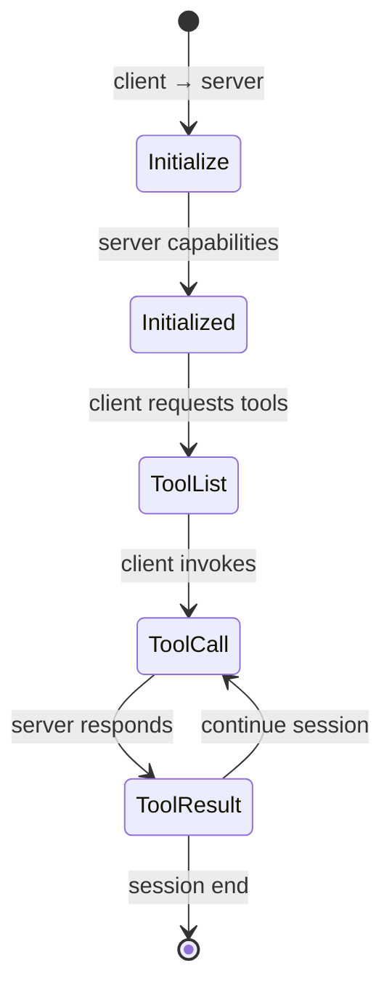
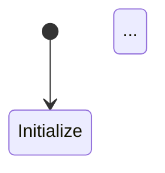

我来为你输出一版完整优化的产品方案，重点强化 **Agent 章节的深度技术拆解**，并采用 **Claude 风格的纸黄色学术美学** 设计。

---

# CogniStack 产品方案文档（v2.0）

**版本**：v2.0  
**日期**：2026-03-22  
**核心理念**：认知技术栈 —— 从原理到架构的完整智能体系  
**视觉风格**：Claude 式学术纸黄 + 工程蓝强调色  

---

## 1. 品牌与视觉系统

### 1.1 设计哲学
> **"像阅读顶级学术论文一样学习工程，像调试生产系统一样理解原理"**

Claude 的纸黄色背景创造了一种**专注、温和、学术**的阅读体验，我们在此基础上加入**工程精度**：

| 元素 | Claude 风格 | CogniStack 进化 |
|------|-------------|-----------------|
| **背景** | 暖纸黄 `#FAF9F6` | 分场景：纸黄阅读模式 / 暗黑工程模式 |
| **文字** | 深灰 `#1F1F1F` | 代码用工程蓝强调，概念用深灰 |
| **强调色** | 橙红 `#D97757` | 智能绿 `#059669`（Agent）/ 推理蓝 `#3B82F6`（工程） |
| **排版** | 衬线体（Serif） | 正文用 Inter（高可读性），标题用 JetBrains Mono（技术感） |
| **留白** | 大量呼吸感 | 代码块紧凑，概念解释宽松 |

### 1.2 色彩系统

```css
/* CogniStack 设计令牌 */
:root {
  /* 纸黄阅读模式（默认） */
  --cs-paper-bg: #FAF9F6;           /* 暖纸白背景 */
  --cs-paper-alt: #F5F4F0;          /* 卡片/代码块背景 */
  --cs-paper-border: #E8E6E1;       /* 分隔线 */
  
  /* 文字层级 */
  --cs-text-primary: #1C1917;       /* 主文字：深岩灰 */
  --cs-text-secondary: #57534E;     /* 次级：暖灰 */
  --cs-text-tertiary: #A8A29E;      /* 辅助：浅灰 */
  
  /* 智能语义色 */
  --cs-agent-green: #059669;        /* Agent：行动/决策 */
  --cs-infer-blue: #3B82F6;         /* 推理：计算/流程 */
  --cs-memory-amber: #D97706;       /* 记忆：存储/检索 */
  --cs-perception-purple: #8B5CF6;  /* 感知：输入/多模态 */
  
  /* 工程功能色 */
  --cs-success: #10B981;
  --cs-warning: #F59E0B;
  --cs-error: #EF4444;
  --cs-info: #06B6D4;
  
  /* 字体栈 */
  --cs-font-body: 'Inter', 'Noto Sans SC', system-ui, sans-serif;
  --cs-font-mono: 'JetBrains Mono', 'Fira Code', monospace;
  --cs-font-display: 'JetBrains Mono', monospace; /* 标题用等宽增加技术感 */
  
  /* 间距系统（8px 基准） */
  --cs-space-1: 0.25rem;   /* 4px */
  --cs-space-2: 0.5rem;    /* 8px */
  --cs-space-3: 0.75rem;   /* 12px */
  --cs-space-4: 1rem;      /* 16px */
  --cs-space-5: 1.5rem;    /* 24px */
  --cs-space-6: 2rem;      /* 32px */
  --cs-space-8: 3rem;      /* 48px */
  --cs-space-10: 4rem;     /* 64px */
  
  /* 阴影（纸质感，柔和） */
  --cs-shadow-sm: 0 1px 2px 0 rgba(28, 25, 23, 0.05);
  --cs-shadow-md: 0 4px 6px -1px rgba(28, 25, 23, 0.08);
  --cs-shadow-lg: 0 10px 15px -3px rgba(28, 25, 23, 0.08);
  
  /* 圆角（克制） */
  --cs-radius-sm: 4px;
  --cs-radius-md: 6px;
  --cs-radius-lg: 8px;
}

/* 暗黑工程模式（手动切换/系统跟随） */
.dark {
  --cs-paper-bg: #0C0A09;           /* 深岩黑 */
  --cs-paper-alt: #1C1917;          /* 卡片背景 */
  --cs-paper-border: #292524;
  
  --cs-text-primary: #FAF9F6;
  --cs-text-secondary: #A8A29E;
  --cs-text-tertiary: #57534E;
  
  /* 语义色保持但调整亮度 */
  --cs-agent-green: #34D399;
  --cs-infer-blue: #60A5FA;
  --cs-memory-amber: #FBBF24;
  --cs-perception-purple: #A78BFA;
}
```

### 1.3 页面布局架构

```
┌─────────────────────────────────────────────────────────────────┐
│  🧭 顶部导航（悬浮，玻璃态）                                       │
│  Logo + 章节导航 + 搜索 + 主题切换 + GitHub                        │
├─────────────────────────────────────────────────────────────────┤
│  ┌──────────────┐  ┌─────────────────────────────────────────┐  │
│  │              │  │                                         │  │
│  │  📑 侧边栏    │  │     📖 内容区（纸黄背景）               │  │
│  │  章节树       │  │                                         │  │
│  │  + 进度指示    │  │   ┌─────────────────────────────────┐   │  │
│  │              │  │   │  🍞 面包屑 + 阅读时间估算         │   │  │
│  │  可折叠       │  │   └─────────────────────────────────┘   │  │
│  │  深度指示     │  │                                         │  │
│  │  （原理/实践） │  │   ┌─────────────────────────────────┐   │  │
│  │              │  │   │  📝 正文区                        │   │  │
│  │              │  │   │  - 概念卡片（悬浮注释）             │   │  │
│  │              │  │   │  - 代码块（工程黑背景）            │   │  │
│  │              │  │   │  - 交互演示（嵌入组件）             │   │  │
│  │              │  │   │  - 深度折叠（原理详解）             │   │  │
│  │              │  │   └─────────────────────────────────┘   │  │
│  │              │  │                                         │  │
│  │              │  │   ┌─────────────────────────────────┐   │  │
│  │              │  │   │  🔗 页脚：上一篇/下一篇 + 编辑      │   │  │
│  │              │  │   └─────────────────────────────────┘   │  │
│  │              │  │                                         │  │
│  └──────────────┘  └─────────────────────────────────────────┘  │
├─────────────────────────────────────────────────────────────────┤
│  💬 评论区（Giscus，折叠默认）                                    │
└─────────────────────────────────────────────────────────────────┘
```

---

## 2. 内容架构（Agent 章节深度展开）

### 2.1 Agent 章节总览

```
📁 agent/                          # Agent：智能体系统
├── index.md                        # 章节导论：为什么 Agent 是新一代架构
├── 📁 01-architecture/             # 基础架构（原理层）
│   ├── index.md
│   ├── 01-cognitive-architecture.md    # 认知架构：从感知到行动
│   ├── 02-react-paradigm.md            # ReAct：推理与行动交织
│   ├── 03-tool-calling-deep-dive.md    # 工具调用：MCP 协议详解 ⭐
│   ├── 04-memory-systems.md            # 记忆系统：向量、图谱、缓存
│   ├── 05-planning-algorithms.md       # 规划算法：从 CoT 到 Tree of Thoughts
│   └── 06-multi-agent-orchestration.md # 多智能体编排：共识与竞争
├── 📁 02-frameworks/             # 开发框架（实现层）
│   ├── index.md
│   ├── 01-langchain-core.md            # LangChain 核心抽象
│   ├── 02-langgraph-state-machines.md  # LangGraph：状态机与持久化 ⭐
│   ├── 03-llamaindex-rag.md            # LlamaIndex：RAG 增强型 Agent
│   ├── 04-autogen-conversation.md      # AutoGen：对话编程模型
│   ├── 05-crewai-role-playing.md     # CrewAI：角色扮演与协作
│   └── 06-dify-vs-code.md            # 低代码 vs 纯代码：选型决策矩阵
├── 📁 03-engineering/              # 工程实践（生产层）⭐ 你的强项
│   ├── index.md
│   ├── 01-intent-classification.md     # 意图识别：从分类到语义匹配
│   ├── 02-slot-filling-robustness.md   # 槽位填充：容错与多轮澄清
│   ├── 03-task-decomposition.md        # 任务分解：Hierarchical Planning
│   ├── 04-human-in-the-loop.md         # 人机协同：审批流与异常接管
│   ├── 05-agent-evaluation-framework.md # Agent 评估：成功率、效率、满意度
│   ├── 06-observability-tracing.md     # 可观测性：LangSmith / Phoenix
│   ├── 07-cost-optimization.md         # 成本控制：Token 预算与模型路由
│   └── 08-security-sandboxing.md       # 安全沙箱：工具权限与输入过滤
└── 📁 04-cases/                    # 垂直案例（实战层）
    ├── index.md
    ├── 01-code-review-agent.md         # 代码评审 Agent（你正在做的）
    ├── 02-data-analysis-agent.md       # 数据分析：SQL 生成与可视化
    ├── 03-customer-service-agent.md    # 智能客服：工单处理与情感分析
    └── 04-devops-agent.md              # 研发效能：需求→测试→发布
```

### 2.2 核心文章深度设计：以《MCP 协议详解》为例

这篇文章将展示 **CogniStack 的内容深度标准**：

---

#### 文章结构：MCP 协议详解 —— 工具调用的通用语言

**【概览卡片】（悬浮顶部）**
> MCP（Model Context Protocol）是 Anthropic 2024 年开源的**工具调用标准协议**，旨在让 LLM 与外部工具以**统一、安全、可扩展**的方式交互。本文从协议设计哲学、消息格式、传输层、安全模型到生产实践，完整拆解 MCP 的实现原理。

---

**【正文层级】**

##### 1. 设计哲学：为什么需要 MCP？

**问题背景**（折叠展开）
- Function Calling 的碎片化：OpenAI、Google、开源模型各自格式不同
- 工具描述的模糊性：自然语言描述 vs 严格 Schema 验证
- 上下文窗口的污染：工具返回结果的无节制注入

**MCP 的三层抽象**
```
┌─────────────────────────────────────┐
│  Layer 3: Application               │  ← 业务逻辑（你的 Agent）
│  "调用天气 API 获取北京明天温度"      │
├─────────────────────────────────────┤
│  Layer 2: Protocol                  │  ← MCP 标准层
│  JSON-RPC 消息格式、Capability 协商   │
├─────────────────────────────────────┤
│  Layer 1: Transport                 │  ← 传输层（stdio/sse）
│  进程间通信 vs 网络流                │
└─────────────────────────────────────┘
```

**设计原则卡片**（侧边注释样式）
- **Capability Negotiation**：运行时协商工具集，非硬编码
- **Bidirectional Communication**：Server 可主动推送（如进度更新）
- **Resource vs Tool 区分**：只读资源 vs 副作用工具

---

##### 2. 协议消息格式深度解析

**消息类型状态机**（交互式 Mermaid 图）



**核心消息 Schema**（带类型高亮）

```typescript
// Initialize 请求：能力协商
interface InitializeRequest {
  jsonrpc: "2.0";
  id: number;
  method: "initialize";
  params: {
    protocolVersion: "2024-11-05";
    capabilities: ClientCapabilities;
    clientInfo: { name: string; version: string };
  };
}

// Tool 定义：严格 JSON Schema
interface Tool {
  name: "fetch_weather";
  description: "获取指定城市天气";
  inputSchema: {
    type: "object";
    properties: {
      city: { type: "string"; description: "城市名，如 Beijing" };
      date: { type: "string"; format: "date" };
    };
    required: ["city"];
  };
}

// Tool 调用与结果
interface CallToolResult {
  content: Array<
    { type: "text"; text: string } |      // 文本结果
    { type: "image"; data: string; mimeType: string } |  // 图片
    { type: "resource"; resource: Resource }  // 嵌套资源
  >;
  isError?: boolean;  // 错误标记，非 HTTP 状态码
}
```

**关键设计决策解析**（深度折叠区）

<details>
<summary>🔍 为什么用 JSON-RPC 2.0 而非 REST 或 gRPC？</summary>

**对比分析**

| 方案 | 优势 | MCP 不选的原因 |
|------|------|---------------|
| REST | 简单、调试友好 | 无标准双向流，Server Push 需 SSE 额外实现 |
| gRPC | 高性能、强类型 | 二进制协议，调试困难，需 Protobuf 编译 |
| **JSON-RPC 2.0** | 文本可读、支持 Batch、已有生态 | **选中**：平衡可读性与功能，LLM 可直接生成/解析 |

**MCP 的扩展**：在 JSON-RPC 之上增加：
- `notifications/` 前缀：单向通知（如进度更新）
- `resources/` 前缀：资源订阅（非工具调用）

</details>

---

##### 3. 传输层实现：stdio vs SSE

**两种传输模式对比**

| 模式 | 适用场景 | 实现细节 | 性能特征 |
|------|---------|---------|---------|
| **stdio** | 本地工具（Python/Node CLI） | 子进程 spawn，stdin/stdout 通信 | 低延迟（<1ms），受限于单机 |
| **SSE** | 远程服务（微架构） | HTTP Server-Sent Events + POST 返回 | 网络延迟，可跨机器，需心跳保活 |

**stdio 实现代码**（生产级，带错误处理）

```python
# server.py - MCP stdio 服务端
import asyncio
import sys
from mcp.server import Server
from mcp.types import TextContent, Tool

app = Server("weather-server")

@app.list_tools()
async def list_tools() -> list[Tool]:
    return [Tool(
        name="get_weather",
        description="获取天气",
        inputSchema={"type": "object", "properties": {
            "city": {"type": "string"}
        }, "required": ["city"]}
    )]

@app.call_tool()
async def call_tool(name: str, arguments: dict) -> list[TextContent]:
    if name != "get_weather":
        raise ValueError(f"Unknown tool: {name}")
    
    # 实际调用外部 API
    weather = await fetch_weather_api(arguments["city"])
    return [TextContent(type="text", text=weather)]

# 关键：stdio 传输绑定
async def main():
    from mcp.server.stdio import stdio_server
    
    async with stdio_server() as (read_stream, write_stream):
        await app.run(
            read_stream,
            write_stream,
            app.create_initialization_options()
        )

if __name__ == "__main__":
    asyncio.run(main())
```

**SSE 架构图**（C4 风格）

```
┌─────────────┐      HTTP/SSE       ┌─────────────┐
│   Client    │ ◄─────────────────► │ MCP Server  │
│  (Agent)    │    (Server Push)      │  (Remote)   │
└─────────────┘                       └─────────────┘
       │                                     │
       │ POST /message                       │ 调用
       ▼                                     ▼
┌─────────────┐                       ┌─────────────┐
│  SSE Stream │                       │  Tools/     │
│  (read)     │                       │  Resources  │
└─────────────┘                       └─────────────┘
```

---

##### 4. 安全模型：Capability-Based Security

**核心机制**

```
Client Request                    Server Evaluation
─────────────────────────────────────────────────────────
{
  "method": "tools/call",
  "params": {
    "name": "delete_database",    ← Server 检查：此 Client
    "arguments": {...}                是否在 Capability 列表中？
  }
}                                   
                                     Capability 列表：
                                     - 只读工具：允许
                                     - 危险工具：拒绝 + 审计日志
```

**生产安全 checklist**
- [ ] 工具分级：ReadOnly / Idempotent / Destructive
- [ ] 输入验证：JSON Schema 严格校验 + 额外业务规则
- [ ] 速率限制：Token 桶算法，按工具类型限流
- [ ] 审计日志：完整调用链记录（谁、何时、什么参数、结果）
- [ ] 超时控制：防止长耗时工具阻塞上下文

---

##### 5. 与 LangChain/LangGraph 集成

**架构定位**

```
┌─────────────────────────────────────────┐
│           Your Agent Application        │
│         (LangChain/LangGraph)           │
├─────────────────────────────────────────┤
│  LangChain MCP Adapter                  │  ← 本文实现
│  - 将 MCP Tool 转为 LangChain Tool      │
│  - 处理异步调用 + 结果解析               │
├─────────────────────────────────────────┤
│  MCP Client (stdio/SSE transport)       │
├─────────────────────────────────────────┤
│  MCP Server (weather/git/calendar...)   │
└─────────────────────────────────────────┘
```

**集成代码**

```python
from langchain_mcp_adapters.tools import load_mcp_tools
from mcp import ClientSession, StdioServerParameters
from langchain.agents import create_openai_functions_agent

# 启动 MCP Server
server_params = StdioServerParameters(
    command="python",
    args=["weather_server.py"],
    env=None
)

# 会话管理
async with ClientSession(server_params) as session:
    await session.initialize()
    
    # 加载工具（自动发现）
    tools = await load_mcp_tools(session)
    
    # 接入 LangChain Agent
    agent = create_openai_functions_agent(
        llm=ChatOpenAI(),
        tools=tools,
        prompt=prompt
    )
    
    # 执行：自动处理 Tool Calling 循环
    result = await agent.ainvoke({"input": "北京明天需要带伞吗？"})
```

---

**【延伸阅读】**
- [MCP 官方规范](https://spec.modelcontextprotocol.io/)
- [Anthropic 宣布博客](https://www.anthropic.com/news/model-context-protocol)
- 对比阅读：Google A2A 协议、OpenAI Functions

**【实践挑战】**
> 尝试用 MCP 封装你团队内部的一个 API（如代码评审服务），并接入 LangGraph 实现一个 **Self-Review Agent**。

---

## 3. 前端交互组件设计

### 3.1 纸黄主题布局组件

```vue
<!-- CogniStack 主题布局 -->
<template>
  <div class="cognistack-layout" :class="{ 'dark': isDark }">
    <!-- 顶部导航：悬浮玻璃态 -->
    <header class="cs-nav">
      <div class="cs-nav-brand">
        <span class="cs-logo">◉</span>
        <span class="cs-title">CogniStack</span>
      </div>
      
      <nav class="cs-nav-links">
        <a v-for="chapter in chapters" 
           :key="chapter.path"
           :href="chapter.path"
           :class="{ active: isActive(chapter.path) }">
          {{ chapter.title }}
        </a>
      </nav>
      
      <div class="cs-nav-actions">
        <button class="cs-icon-btn" @click="toggleSearch" title="搜索">
          <SearchIcon />
        </button>
        <button class="cs-icon-btn" @click="toggleTheme" title="切换主题">
          <SunIcon v-if="isDark" />
          <MoonIcon v-else />
        </button>
        <a href="https://github.com/xxx/cognistack" class="cs-icon-btn">
          <GitHubIcon />
        </a>
      </div>
    </header>

    <!-- 主体：侧边栏 + 内容 -->
    <div class="cs-main">
      <!-- 侧边栏：章节导航 -->
      <aside class="cs-sidebar" :class="{ collapsed: sidebarCollapsed }">
        <div class="cs-sidebar-header">
          <span class="cs-chapter-indicator">{{ currentChapter }}</span>
          <button class="cs-collapse-btn" @click="toggleSidebar">
            <ChevronIcon />
          </button>
        </div>
        
        <div class="cs-toc">
          <div v-for="section in toc" :key="section.id" class="cs-toc-section">
            <div class="cs-toc-title" @click="toggleSection(section)">
              <span class="cs-toc-icon">{{ section.icon }}</span>
              {{ section.title }}
            </div>
            <ul v-show="section.expanded" class="cs-toc-list">
              <li v-for="item in section.items" 
                  :key="item.link"
                  :class="{ active: isActive(item.link), 
                           'depth-2': item.depth === 2,
                           'depth-3': item.depth === 3 }">
                <a :href="item.link">
                  <span v-if="item.type" class="cs-badge" :class="item.type">
                    {{ typeLabel(item.type) }}
                  </span>
                  {{ item.text }}
                </a>
              </li>
            </ul>
          </div>
        </div>
        
        <!-- 阅读进度 -->
        <div class="cs-reading-progress">
          <div class="progress-bar" :style="{ width: readProgress + '%' }"></div>
          <span class="progress-text">{{ readProgress }}% 已读</span>
        </div>
      </aside>

      <!-- 内容区：纸黄背景 -->
      <main class="cs-content" ref="contentRef">
        <!-- 面包屑 -->
        <nav class="cs-breadcrumb">
          <span v-for="(crumb, idx) in breadcrumbs" :key="idx">
            <a v-if="idx < breadcrumbs.length - 1" :href="crumb.link">{{ crumb.text }}</a>
            <span v-else class="current">{{ crumb.text }}</span>
            <span v-if="idx < breadcrumbs.length - 1" class="separator">/</span>
          </span>
          <span class="cs-read-time">⏱ {{ readTime }} min read</span>
        </nav>

        <!-- 文章头 -->
        <header class="cs-article-header">
          <h1>{{ frontmatter.title }}</h1>
          <p class="cs-lead">{{ frontmatter.description }}</p>
          
          <div class="cs-meta">
            <span class="cs-date">{{ formatDate(frontmatter.date) }}</span>
            <span class="cs-author">{{ frontmatter.author }}</span>
            <div class="cs-tags">
              <span v-for="tag in frontmatter.tags" :key="tag" class="cs-tag">
                {{ tag }}
              </span>
            </div>
          </div>
        </header>

        <!-- 动态内容插槽 -->
        <div class="cs-article-body">
          <slot />
        </div>

        <!-- 页面导航 -->
        <footer class="cs-page-nav">
          <a v-if="prevPage" :href="prevPage.link" class="cs-nav-prev">
            <span class="label">← 上一篇</span>
            <span class="title">{{ prevPage.text }}</span>
          </a>
          <div v-else></div>
          
          <a v-if="nextPage" :href="nextPage.link" class="cs-nav-next">
            <span class="label">下一篇 →</span>
            <span class="title">{{ nextPage.text }}</span>
          </a>
        </footer>

        <!-- 评论区 -->
        <div class="cs-comments">
          <Giscus v-if="commentsEnabled" 
                  repo="xxx/cognistack"
                  category="General"
                  mapping="pathname" />
        </div>
      </main>

      <!-- 右侧悬浮：大纲 + 工具 -->
      <aside class="cs-right-rail">
        <div class="cs-outline" v-if="headers.length">
          <div class="rail-title">本页大纲</div>
          <ul>
            <li v-for="h in headers" 
                :key="h.anchor"
                :class="{ active: activeHeader === h.anchor, 
                         'h2': h.level === 2,
                         'h3': h.level === 3 }">
              <a :href="'#' + h.anchor" @click="scrollTo(h.anchor)">
                {{ h.text }}
              </a>
            </li>
          </ul>
        </div>
        
        <div class="cs-tools">
          <div class="rail-title">工具</div>
          <button @click="copyLink">复制链接</button>
          <button @click="toggleHighlight">高亮重点</button>
          <button @click="openInChatGPT">在 ChatGPT 中打开</button>
        </div>
      </aside>
    </div>
  </div>
</template>

<style scoped>
/* 纸黄主题核心样式 */
.cognistack-layout {
  --bg: var(--cs-paper-bg);
  --text: var(--cs-text-primary);
  --text-secondary: var(--cs-text-secondary);
  
  background: var(--bg);
  color: var(--text);
  font-family: var(--cs-font-body);
  line-height: 1.7;
  min-height: 100vh;
}

/* 顶部导航：玻璃悬浮 */
.cs-nav {
  position: fixed;
  top: 0;
  left: 0;
  right: 0;
  height: 64px;
  background: rgba(250, 249, 246, 0.85);
  backdrop-filter: blur(12px);
  border-bottom: 1px solid var(--cs-paper-border);
  display: flex;
  align-items: center;
  padding: 0 2rem;
  z-index: 100;
  transition: all 0.3s ease;
}

.dark .cs-nav {
  background: rgba(12, 10, 9, 0.85);
  border-color: var(--cs-paper-border);
}

.cs-nav-brand {
  display: flex;
  align-items: center;
  gap: 0.75rem;
  font-family: var(--cs-font-display);
  font-weight: 600;
  font-size: 1.25rem;
  color: var(--cs-text-primary);
}

.cs-logo {
  color: var(--cs-agent-green);
  font-size: 1.5rem;
}

/* 内容区：纸黄质感 */
.cs-content {
  max-width: 780px;  /* 最优阅读宽度 */
  margin: 0 auto;
  padding: 6rem 2rem 4rem;
  background: var(--cs-paper-bg);
  position: relative;
}

/* 文章正文：学术排版 */
.cs-article-body {
  font-size: 1.0625rem;  /* 17px，比默认 16px 稍大 */
  line-height: 1.8;
  color: var(--cs-text-primary);
}

/* 标题层级 */
.cs-article-body :deep(h2) {
  font-family: var(--cs-font-display);
  font-size: 1.75rem;
  font-weight: 600;
  margin-top: 3rem;
  margin-bottom: 1.25rem;
  padding-bottom: 0.5rem;
  border-bottom: 2px solid var(--cs-agent-green);
  color: var(--cs-text-primary);
}

.cs-article-body :deep(h3) {
  font-family: var(--cs-font-display);
  font-size: 1.375rem;
  font-weight: 600;
  margin-top: 2.5rem;
  margin-bottom: 1rem;
  color: var(--cs-text-secondary);
}

/* 段落与间距 */
.cs-article-body :deep(p) {
  margin-bottom: 1.5rem;
  text-align: justify;
  hyphens: auto;
}

/* 引用块：侧边强调 */
.cs-article-body :deep(blockquote) {
  margin: 2rem 0;
  padding: 1.5rem 1.5rem 1.5rem 2rem;
  background: var(--cs-paper-alt);
  border-left: 4px solid var(--cs-infer-blue);
  border-radius: 0 var(--cs-radius-md) var(--cs-radius-md) 0;
  font-style: italic;
  color: var(--cs-text-secondary);
}

/* 代码块：工程黑背景（与纸黄形成对比） */
.cs-article-body :deep(pre) {
  background: #1C1917;  /* 深岩黑 */
  border-radius: var(--cs-radius-lg);
  padding: 1.5rem;
  margin: 2rem 0;
  overflow-x: auto;
  font-family: var(--cs-font-mono);
  font-size: 0.875rem;
  line-height: 1.6;
  box-shadow: var(--cs-shadow-lg);
}

.cs-article-body :deep(code) {
  font-family: var(--cs-font-mono);
  font-size: 0.9em;
  background: var(--cs-paper-alt);
  padding: 0.2em 0.4em;
  border-radius: var(--cs-radius-sm);
  color: var(--cs-agent-green);
}

.cs-article-body :deep(pre code) {
  background: transparent;
  padding: 0;
  color: #E7E5E4;  /* 暖白文字 */
}

/* 表格：学术风格 */
.cs-article-body :deep(table) {
  width: 100%;
  margin: 2rem 0;
  border-collapse: collapse;
  font-size: 0.9375rem;
}

.cs-article-body :deep(th) {
  background: var(--cs-paper-alt);
  padding: 0.75rem 1rem;
  text-align: left;
  font-weight: 600;
  border-bottom: 2px solid var(--cs-paper-border);
  font-family: var(--cs-font-display);
}

.cs-article-body :deep(td) {
  padding: 0.75rem 1rem;
  border-bottom: 1px solid var(--cs-paper-border);
}

/* 详情折叠：渐进披露 */
.cs-article-body :deep(details) {
  margin: 1.5rem 0;
  border: 1px solid var(--cs-paper-border);
  border-radius: var(--cs-radius-md);
  background: var(--cs-paper-alt);
  overflow: hidden;
}

.cs-article-body :deep(summary) {
  padding: 1rem 1.25rem;
  cursor: pointer;
  font-weight: 500;
  color: var(--cs-infer-blue);
  user-select: none;
  display: flex;
  align-items: center;
  gap: 0.5rem;
}

.cs-article-body :deep(details[open] summary) {
  border-bottom: 1px solid var(--cs-paper-border);
}

.cs-article-body :deep(details > *) {
  padding: 1.25rem;
}

/* 概念卡片：悬浮注释 */
.cs-concept-card {
  position: relative;
  display: inline-block;
  border-bottom: 1px dashed var(--cs-infer-blue);
  cursor: help;
  color: var(--cs-infer-blue);
}

.cs-concept-tooltip {
  position: absolute;
  bottom: 100%;
  left: 50%;
  transform: translateX(-50%);
  width: 320px;
  padding: 1rem;
  background: white;
  border: 1px solid var(--cs-paper-border);
  border-radius: var(--cs-radius-md);
  box-shadow: var(--cs-shadow-lg);
  font-size: 0.875rem;
  line-height: 1.6;
  opacity: 0;
  visibility: hidden;
  transition: all 0.2s ease;
  z-index: 50;
}

.cs-concept-card:hover .cs-concept-tooltip {
  opacity: 1;
  visibility: visible;
  bottom: calc(100% + 8px);
}

/* 右侧边栏：大纲 */
.cs-right-rail {
  position: fixed;
  right: 2rem;
  top: 100px;
  width: 240px;
  display: none;  /* 移动端隐藏 */
}

@media (min-width: 1280px) {
  .cs-right-rail {
    display: block;
  }
}

.rail-title {
  font-size: 0.75rem;
  text-transform: uppercase;
  letter-spacing: 0.05em;
  color: var(--cs-text-tertiary);
  margin-bottom: 0.75rem;
  font-weight: 600;
}

.cs-outline ul {
  list-style: none;
  padding: 0;
  margin: 0;
  border-left: 2px solid var(--cs-paper-border);
}

.cs-outline li {
  padding: 0.375rem 0 0.375rem 1rem;
  font-size: 0.875rem;
}

.cs-outline li.active {
  border-left-color: var(--cs-agent-green);
  color: var(--cs-agent-green);
}

.cs-outline li.h3 {
  padding-left: 1.5rem;
  font-size: 0.8125rem;
}

/* 徽章系统 */
.cs-badge {
  display: inline-block;
  padding: 0.125rem 0.5rem;
  border-radius: 9999px;
  font-size: 0.75rem;
  font-weight: 500;
  margin-right: 0.5rem;
}

.cs-badge.principle { background: #DBEAFE; color: #1E40AF; }      /* 原理：蓝 */
.cs-badge.practice { background: #D1FAE5; color: #065F46; }       /* 实践：绿 */
.cs-badge.warning { background: #FEF3C7; color: #92400E; }        /* 注意：黄 */
.cs-badge.advanced { background: #E9D5FF; color: #6B21A8; }        /* 进阶：紫 */

/* 深色模式覆盖 */
.dark .cs-concept-tooltip {
  background: var(--cs-paper-alt);
  border-color: var(--cs-paper-border);
}

.dark .cs-badge.principle { background: #1E3A8A; color: #BFDBFE; }
.dark .cs-badge.practice { background: #064E3B; color: #6EE7B7; }
</style>
```

### 3.2 交互式 MCP 演示组件

```vue
<!-- 交互式 MCP 消息流演示 -->
<template>
  <div class="mcp-simulator">
    <div class="simulator-header">
      <span class="status-dot" :class="{ active: isConnected }"></span>
      <span class="status-text">{{ isConnected ? '已连接' : '未连接' }}</span>
      <span class="transport-badge">{{ transport }}</span>
    </div>

    <div class="message-flow" ref="flowRef">
      <div v-for="(msg, idx) in messages" 
           :key="idx"
           class="message"
           :class="[msg.direction, msg.type]">
        
        <div class="message-header">
          <span class="direction-icon">
            {{ msg.direction === 'client' ? '→' : '←' }}
          </span>
          <span class="msg-type">{{ msg.type }}</span>
          <span class="timestamp">{{ msg.time }}</span>
        </div>

        <div class="message-body" @click="toggleExpand(idx)">
          <pre :class="{ expanded: expanded[idx] }">{{ formatJSON(msg.payload) }}</pre>
          <span v-if="!expanded[idx]" class="expand-hint">点击展开</span>
        </div>

        <!-- 可视化解析 -->
        <div v-if="expanded[idx]" class="message-analysis">
          <div v-for="(field, key) in msg.payload" :key="key" class="field-row">
            <span class="field-key">{{ key }}:</span>
            <span class="field-value" :class="getValueType(field)">
              {{ formatValue(field) }}
            </span>
            <span v-if="key === 'method'" class="field-desc">
              {{ getMethodDesc(field) }}
            </span>
          </div>
        </div>
      </div>
    </div>

    <div class="simulator-controls">
      <button @click="simulateHandshake">模拟握手</button>
      <button @click="simulateToolCall">模拟工具调用</button>
      <button @click="simulateError">模拟错误</button>
      <button @click="clear">清空</button>
    </div>
  </div>
</template>

<script setup>
import { ref, nextTick } from 'vue'

const isConnected = ref(false)
const transport = ref('stdio')
const messages = ref([])
const expanded = ref({})
const flowRef = ref(null)

const addMessage = (direction, type, payload) => {
  messages.value.push({
    direction,
    type,
    payload,
    time: new Date().toLocaleTimeString()
  })
  nextTick(() => {
    flowRef.value.scrollTop = flowRef.value.scrollHeight
  })
}

const simulateHandshake = () => {
  isConnected.value = true
  addMessage('client', 'initialize', {
    jsonrpc: "2.0",
    id: 0,
    method: "initialize",
    params: {
      protocolVersion: "2024-11-05",
      capabilities: { roots: { listChanged: true } },
      clientInfo: { name: "CogniStack-Client", version: "1.0.0" }
    }
  })
  
  setTimeout(() => {
    addMessage('server', 'initialize_result', {
      jsonrpc: "2.0",
      id: 0,
      result: {
        protocolVersion: "2024-11-05",
        capabilities: { tools: { listChanged: true } },
        serverInfo: { name: "weather-server", version: "0.2.1" }
      }
    })
  }, 800)
}

const simulateToolCall = () => {
  addMessage('client', 'tools/call', {
    jsonrpc: "2.0",
    id: 1,
    method: "tools/call",
    params: {
      name: "get_weather",
      arguments: { city: "Beijing", date: "2026-03-23" }
    }
  })
  
  setTimeout(() => {
    addMessage('server', 'tools/call_result', {
      jsonrpc: "2.0",
      id: 1,
      result: {
        content: [{
          type: "text",
          text: "北京明天多云，气温 8-15°C，不需要带伞"
        }]
      }
    })
  }, 1200)
}

const simulateError = () => {
  addMessage('client', 'tools/call', {
    jsonrpc: "2.0",
    id: 2,
    method: "tools/call",
    params: { name: "unknown_tool", arguments: {} }
  })
  
  setTimeout(() => {
    addMessage('server', 'error', {
      jsonrpc: "2.0",
      id: 2,
      error: {
        code: -32602,
        message: "Tool not found: unknown_tool"
      }
    })
  }, 600)
}

const toggleExpand = (idx) => {
  expanded.value[idx] = !expanded.value[idx]
}

const formatJSON = (obj) => JSON.stringify(obj, null, 2)

const getValueType = (val) => {
  if (typeof val === 'string') return 'type-string'
  if (typeof val === 'number') return 'type-number'
  if (typeof val === 'boolean') return 'type-bool'
  if (Array.isArray(val)) return 'type-array'
  if (typeof val === 'object') return 'type-object'
  return ''
}

const formatValue = (val) => {
  if (typeof val === 'object') return JSON.stringify(val)
  return String(val)
}

const getMethodDesc = (method) => {
  const descs = {
    'initialize': '协议握手，交换能力',
    'tools/list': '获取可用工具列表',
    'tools/call': '调用指定工具',
    'resources/list': '获取资源列表'
  }
  return descs[method] || '自定义方法'
}

const clear = () => {
  messages.value = []
  expanded.value = {}
  isConnected.value = false
}
</script>

<style scoped>
.mcp-simulator {
  border: 1px solid var(--cs-paper-border);
  border-radius: var(--cs-radius-lg);
  background: #1C1917;  /* 工程黑背景 */
  color: #E7E5E4;
  font-family: var(--cs-font-mono);
  margin: 2rem 0;
  overflow: hidden;
}

.simulator-header {
  display: flex;
  align-items: center;
  gap: 0.75rem;
  padding: 0.75rem 1rem;
  background: #292524;
  border-bottom: 1px solid #44403C;
}

.status-dot {
  width: 8px;
  height: 8px;
  border-radius: 50%;
  background: #EF4444;
}

.status-dot.active {
  background: #10B981;
  box-shadow: 0 0 8px #10B981;
}

.transport-badge {
  margin-left: auto;
  font-size: 0.75rem;
  padding: 0.25rem 0.5rem;
  background: #44403C;
  border-radius: var(--cs-radius-sm);
  text-transform: uppercase;
}

.message-flow {
  height: 400px;
  overflow-y: auto;
  padding: 1rem;
  display: flex;
  flex-direction: column;
  gap: 1rem;
}

.message {
  border-radius: var(--cs-radius-md);
  overflow: hidden;
  animation: slideIn 0.3s ease;
}

@keyframes slideIn {
  from { opacity: 0; transform: translateY(10px); }
  to { opacity: 1; transform: translateY(0); }
}

.message.client {
  border-left: 3px solid var(--cs-infer-blue);
}

.message.server {
  border-left: 3px solid var(--cs-agent-green);
}

.message.error {
  border-left-color: var(--cs-error);
}

.message-header {
  display: flex;
  align-items: center;
  gap: 0.5rem;
  padding: 0.5rem 0.75rem;
  background: #292524;
  font-size: 0.8125rem;
}

.direction-icon {
  font-weight: bold;
  color: var(--cs-text-tertiary);
}

.msg-type {
  font-weight: 600;
  color: #FAF9F6;
}

.timestamp {
  margin-left: auto;
  color: var(--cs-text-tertiary);
  font-size: 0.75rem;
}

.message-body {
  padding: 0.75rem;
  cursor: pointer;
  position: relative;
}

.message-body pre {
  margin: 0;
  font-size: 0.8125rem;
  line-height: 1.5;
  white-space: pre-wrap;
  word-break: break-word;
  max-height: 120px;
  overflow: hidden;
  transition: max-height 0.3s ease;
}

.message-body pre.expanded {
  max-height: none;
}

.expand-hint {
  position: absolute;
  bottom: 0.5rem;
  right: 0.75rem;
  font-size: 0.75rem;
  color: var(--cs-text-tertiary);
  background: linear-gradient(transparent, #1C1917 50%);
  padding: 1rem 0 0 2rem;
}

.message-analysis {
  padding: 0.75rem;
  background: #0C0A09;
  border-top: 1px solid #292524;
  font-size: 0.8125rem;
}

.field-row {
  display: flex;
  gap: 0.5rem;
  padding: 0.25rem 0;
  flex-wrap: wrap;
}

.field-key {
  color: #A8A29E;
  font-weight: 500;
}

.field-value {
  color: #FAF9F6;
}

.field-value.type-string { color: #A5F3FC; }
.field-value.type-number { color: #FDBA74; }
.field-value.type-bool { color: #F9A8D4; }

.field-desc {
  margin-left: auto;
  color: var(--cs-text-tertiary);
  font-style: italic;
}

.simulator-controls {
  display: flex;
  gap: 0.5rem;
  padding: 0.75rem;
  background: #292524;
  border-top: 1px solid #44403C;
}

.simulator-controls button {
  padding: 0.5rem 1rem;
  background: #44403C;
  border: none;
  border-radius: var(--cs-radius-sm);
  color: #FAF9F6;
  font-size: 0.8125rem;
  cursor: pointer;
  transition: background 0.2s;
}

.simulator-controls button:hover {
  background: #57534E;
}
</style>
```

---

## 4. 技术实现要点

### 4.1 VitePress 主题配置

```typescript
// docs/.vitepress/theme/index.ts
import type { Theme } from 'vitepress'
import DefaultTheme from 'vitepress/theme'
import { h } from 'vue'
import CogniLayout from './components/CogniLayout.vue'
import MCPSimulator from './components/MCPSimulator.vue'
import AgentFlow from './components/AgentFlow.vue'
import ConceptCard from './components/ConceptCard.vue'

// 纸黄主题样式
import './styles/cognistack.css'

export default {
  extends: DefaultTheme,
  Layout: CogniLayout,  // 完全自定义布局
  
  enhanceApp({ app, router }) {
    // 注册交互组件
    app.component('MCPSimulator', MCPSimulator)
    app.component('AgentFlow', AgentFlow)
    app.component('ConceptCard', ConceptCard)
    
    // 路由滚动行为优化
    router.options.scrollBehavior = (to, from, savedPosition) => {
      if (savedPosition) {
        return savedPosition
      }
      if (to.hash) {
        return { el: to.hash, behavior: 'smooth', offset: 80 }
      }
      return { top: 0, behavior: 'smooth' }
    }
  }
} satisfies Theme
```

### 4.2 Markdown 扩展

```typescript
// docs/.vitepress/config.ts
import { defineConfig } from 'vitepress'
import { generateSidebar } from './theme/utils/sidebar'

export default defineConfig({
  title: 'CogniStack',
  titleTemplate: ':title | 认知技术栈',
  description: '从认知原理到工程架构，系统掌握 AI 全栈能力',
  
  // 纸黄主题默认配置
  appearance: {
    initialValue: 'light',  // 默认纸黄模式
    options: ['light', 'dark', 'system']
  },
  
  markdown: {
    theme: {
      light: 'github-light',
      dark: 'github-dark'
    },
    config: (md) => {
      // 自定义容器：原理、实践、警告
      md.use(require('markdown-it-container'), 'principle', {
        render: (tokens, idx) => {
          const info = tokens[idx].info.trim()
          return tokens[idx].nesting === 1 
            ? `<div class="principle-box"><div class="box-header">🧠 核心原理</div>\n`
            : `</div>\n`
        }
      })
      
      md.use(require('markdown-it-container'), 'practice', {
        render: (tokens, idx) => {
          return tokens[idx].nesting === 1 
            ? `<div class="practice-box"><div class="box-header">🔧 工程实践</div>\n`
            : `</div>\n`
        }
      })
      
      // 概念悬浮卡片
      md.inline.ruler.after('text', 'concept', (state) => {
        const regex = /\[\[(.*?)\|(.*?)\]\]/g  // [[概念名|解释文本]]
        // 实现省略...
      })
    }
  },
  
  themeConfig: {
    logo: '/logo.svg',
    siteTitle: 'CogniStack',
    
    nav: [
      { text: '基础', link: '/guide/' },
      { text: '模型', link: '/models/' },
      { text: '工程', link: '/engineering/' },
      { 
        text: 'Agent',
        activeMatch: '/agent/',
        items: [
          { text: '架构原理', link: '/agent/architecture/' },
          { text: '开发框架', link: '/agent/frameworks/' },
          { text: '工程实践', link: '/agent/engineering/' },
          { text: '垂直案例', link: '/agent/cases/' }
        ]
      },
      { text: '应用', link: '/application/' }
    ],
    
    sidebar: generateSidebar(),
    
    // 搜索配置
    algolia: {
      appId: '...',
      apiKey: '...',
      indexName: 'cognistack',
      placeholder: '搜索认知栈...',
      translations: {
        button: {
          buttonText: '搜索',
          buttonAriaLabel: '搜索文档'
        }
      }
    },
    
    // 社交链接
    socialLinks: [
      { icon: 'github', link: 'https://github.com/xxx/cognistack' },
      { icon: 'twitter', link: 'https://twitter.com/cognistack' },
      { icon: 'discord', link: 'https://discord.gg/cognistack' }
    ],
    
    // 编辑链接
    editLink: {
      pattern: 'https://github.com/xxx/cognistack/edit/main/docs/:path',
      text: '在 GitHub 上改进此页'
    },
    
    // 页脚
    footer: {
      message: '基于 MIT 协议开源，欢迎贡献',
      copyright: '© 2026 CogniStack Contributors'
    },
    
    // 文章元数据
    lastUpdated: {
      text: '最后更新',
      formatOptions: { dateStyle: 'short', timeStyle: 'short' }
    },
    
    docFooter: {
      prev: '上一篇',
      next: '下一篇'
    },
    
    // 大纲显示层级
    outline: {
      level: [2, 3],
      label: '本页导航'
    }
  },
  
  // 构建优化
  vite: {
    build: {
      chunkSizeWarningLimit: 1000,
      rollupOptions: {
        output: {
          manualChunks: {
            'mermaid': ['mermaid'],
            'vue-vendor': ['vue', 'vue-router']
          }
        }
      }
    },
    optimizeDeps: {
      include: ['mermaid', 'katex']
    }
  },
  
  // 构建钩子
  async buildEnd(siteConfig) {
    await generateRSS(siteConfig)
    await generateSitemap(siteConfig)
  }
})
```

---

## 5. 内容生产标准

### 5.1 文章模板（以 Agent 章节为例）

```markdown
---
title: 'MCP 协议详解：工具调用的通用语言'
description: '从协议设计哲学到生产实践，完整拆解 Model Context Protocol 的实现原理与工程落地'
author: 'xxx'
date: 2026-03-22
category: agent
tags: ['MCP', 'Agent', 'Tool Calling', 'LangChain', '协议设计']
level: 'advanced'  # beginner / intermediate / advanced
readingTime: 25
prerequisites: ['LLM 基础', 'Function Calling 概念', 'JSON-RPC 了解']
---

# MCP 协议详解：工具调用的通用语言

::: principle
MCP（Model Context Protocol）是 Anthropic 2024 年开源的**工具调用标准协议**，旨在解决 LLM 与外部工具交互的碎片化问题。本文从协议设计哲学、消息格式、传输层、安全模型到生产实践，完整拆解 MCP 的实现原理。
:::

[[MCP|Model Context Protocol，模型上下文协议，Anthropic 提出的工具调用标准]]

## 1. 设计哲学：为什么需要 MCP？

[[工具调用|Tool Calling，LLM 调用外部函数/API 的能力]]

### 1.1 问题背景

- Function Calling 的碎片化...
- 工具描述的模糊性...

### 1.2 MCP 的三层抽象

<AgentFlow :steps="mcpLayers" interactive />

## 2. 协议消息格式深度解析

::: practice
**关键设计决策**：MCP 选择 JSON-RPC 2.0 而非 REST/gRPC，平衡了可读性与功能完整性。
:::

### 2.1 消息类型状态机



### 2.2 核心消息 Schema

```typescript
// Initialize 请求：能力协商
interface InitializeRequest {
  ...
}
```

<details>
<summary>🔍 为什么用 JSON-RPC 2.0 而非 REST 或 gRPC？</summary>

[[JSON-RPC|远程过程调用协议，使用 JSON 作为数据格式的轻量级 RPC 规范]]

对比分析表格...

</details>

## 3. 传输层实现：stdio vs SSE

<MCPSimulator transport="stdio" />

## 4. 安全模型：Capability-Based Security

## 5. 与 LangChain/LangGraph 集成

```python
from langchain_mcp_adapters.tools import load_mcp_tools
...
```

## 延伸阅读

- [MCP 官方规范](...)
- [Anthropic 宣布博客](...)

## 实践挑战

> 尝试用 MCP 封装你团队内部的一个 API，并接入 LangGraph 实现一个 **Self-Review Agent**。

---

**讨论区**

<Giscus />
```

---

## 6. 里程碑计划

| 阶段 | 周期 | 核心交付 | 成功标准 |
|------|------|---------|---------|
| **MVP** | Week 1-2 | 纸黄主题 + 5 篇 Agent 基础文章 | 站点可访问，视觉风格确立 |
| **深度内容** | Week 3-6 | MCP、LangGraph、记忆系统 3 篇深度长文 | 每篇含 2+ 交互组件，平均阅读时长 > 10min |
| **工程实践** | Week 7-10 | 可观测性、成本控制、安全沙箱章节 | 引入你的支付结算经验，建立差异化 |
| **社区建设** | Week 11-12 | 评论活跃、首批贡献者、Discord 社群 | 自然流量 PV > 1000/月 |

---